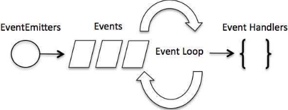

&emsp;&emsp;`Node.js`是单进程单线程应用程序，但是因为`V8`引擎提供的异步执行回调接口，通过这些接口可以处理大量的并发，所以性能非常高。`Node.js`基本上所有的事件机制都是用设计模式中观察者模式实现。<!--more-->

### 事件驱动程序

&emsp;&emsp;`Node.js`使用事件驱动模型，这个模型非常高效且可扩展性非常强，因为`webserver`一直接受请求而不等待任何读写操作(这也被称之为`非阻塞式I/O`或者`事件驱动I/O`)。在事件驱动模型中，会生成一个主循环来监听事件，当检测到事件时触发回调函数：



&emsp;&emsp;有些类似于观察者模式，事件相当于一个主题(`Subject`)，而所有注册到这个事件上的处理函数相当于观察者(`Observer`)。`Node.js`有多个内置的事件，我们可以通过引入`events`模块，并通过实例化`EventEmitter`类来绑定和监听事件：

``` javascript
var events = require('events'); /* 引入events模块 */
var eventEmitter = new events.EventEmitter(); /* 创建eventEmitter对象 */
```

以下程序绑定事件处理程序：

``` javascript
eventEmitter.on('eventName', eventHandler); /* 绑定事件以及事件的处理程序 */
```

我们可以通过程序触发事件：

``` javascript
eventEmitter.emit('eventName'); /* 触发事件 */
```

创建`main.js`文件：

``` javascript
var events = require('events'); /* 引入events模块 */
var eventEmitter = new events.EventEmitter(); /* 创建eventEmitter对象 */
​
var connectHandler = function connected() { /* 创建事件处理程序 */
    console.log('连接成功。');
    eventEmitter.emit('data_received'); /* 触发data_received事件 */
}
​
/* 绑定connection事件处理程序 */
eventEmitter.on('connection', connectHandler);

/* 使用匿名函数绑定data_received事件 */
eventEmitter.on('data_received', function(){
    console.log('数据接收成功。');
});
​
eventEmitter.emit('connection'); /* 触发connection事件 */
console.log("程序执行完毕。");
```

执行结果：

``` javascript
连接成功。
数据接收成功。
程序执行完毕。
```

### Node应用程序是如何工作的？

&emsp;&emsp;在`Node.js`应用程序中，执行异步操作的函数将回调函数作为最后一个参数，回调函数接收错误对象作为第一个参数。
&emsp;&emsp;创建`input.txt`：

``` javascript
菜鸟教程官网地址：www.runoob.com
```

创建`main.js`文件：

``` javascript
var fs = require("fs");
​
fs.readFile('input.txt', function(err, data) {
    if (err) {
        console.log(err.stack);
        return;
    }

    console.log(data.toString());
});
​
console.log("程序执行完毕");
```

执行结果：

``` javascript
程序执行完毕
菜鸟教程官网地址：www.runoob.com
```

`fs.readFile`是异步函数，用于读取文件，如果在读取文件过程中发生错误，错误`err`对象就会输出错误信息。如果没有发生错误，`readFile`跳过`err`对象的输出，文件内容就通过回调函数输出。