&emsp;&emsp;`Matplotlib`是`Python`的一个绘图库，它包含了大量的工具，你可以使用这些工具创建各种图形，包括简单的散点图、正弦曲线、甚至是三维图形。`Python`科学计算社区经常使用它完成数据可视化的工作。<!--more-->

### 画一个简单的图形

&emsp;&emsp;首先要画一条在`[0, 2pi]`上的正弦曲线：

``` python
import matplotlib.pyplot as plt
import numpy as np

x = np.linspace(0, 2 * np.pi, 50)
plt.plot(x, np.sin(x))  # 如果没有第一个参数x，图形的x坐标默认为数组的索引
plt.show()  # 显示图形
```

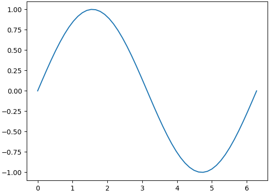

### 在一张图上绘制两个数据集

&emsp;&emsp;大多数时候读者可能更想在一张图上绘制多个数据集，用`Matplotlib`也可以轻松实现这一点：

``` python
import matplotlib.pyplot as plt
import numpy as np

x = np.linspace(0, 2 * np.pi, 50)
plt.plot(x, np.sin(x), x, np.sin(2 * x))
plt.show()
```

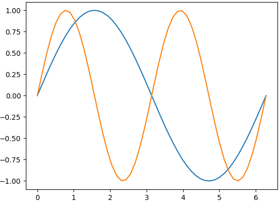

### 自定义图形的外观

&emsp;&emsp;当在同一个图形上展示多个数据集时，通过改变线条的外观来区分不同的数据集变得非常必要：

``` python
import matplotlib.pyplot as plt
import numpy as np

x = np.linspace(0, 2 * np.pi, 50)
plt.plot(x, np.sin(x), 'r-o', x, np.cos(x), 'g--')
plt.show()
```

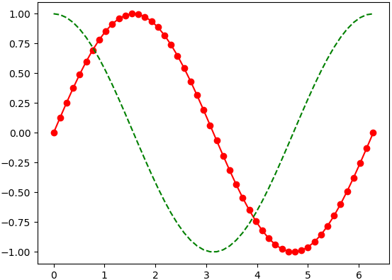

上述代码展示了两种不同的曲线样式，即`r-o`和`g--`。字母`r`和`g`代表线条的颜色，后面的符号代表线和点标记的类型。例如`-o`代表包含实心点标记的实线，`--`代表虚线。
&emsp;&emsp;基本颜色格式命令如下：

命令 | 说明 | 命令 | 说明
----|------|------|-----
`b` | 蓝色 | `g`  | 绿色
`r` | 红色 | `c`  | 青色
`m` | 品红 | `y`  | 黄色
`k` | 黑色 | `w`  | 白色

基本线型格式命令如下：

命令 | 说明 | 命令 | 说明
----|------|------|-----
`-` | 实线 | `--` | 虚线
`:` | 点线

基本绘制标记格式命令如下：

命令 | 说明  | 命令 | 说明
----|-------|------|-----
`.` | 点     | `o` | 圆圈
`s` | 正方形 | `*` | 星形
`+` | 加号   | `x` | 叉号

### 使用子图

&emsp;&emsp;使用子图可以在一个窗口绘制多张图：

``` python
import matplotlib.pyplot as plt
import numpy as np

x = np.linspace(0, 2 * np.pi, 50)
plt.subplot(2, 1, 1)  # (行,列,活跃区)
plt.plot(x, np.sin(x), 'r')
plt.subplot(2, 1, 2)
plt.plot(x, np.cos(x), 'g')
plt.show()
```

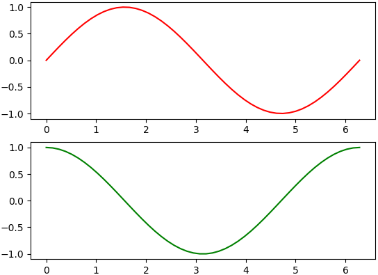

&emsp;&emsp;使用子图只需要一个额外的步骤，就可以像前面的例子一样绘制数据集，即在调用`plot`函数之前需要先调用`subplot`函数。该函数的第一个参数代表子图的总行数，第二个参数代表子图的总列数，第三个参数代表活跃区域。活跃区域代表当前子图所在绘图区域，绘图区域是按从左至右，从上至下的顺序编号。例如在`4 * 4`的方格上，活跃区域`6`在方格上的坐标为`(2, 2)`。

### 简单的散点图

&emsp;&emsp;散点图是一堆离散点的集合，用`Matplotlib`画散点图也同样非常简单：

``` python
import matplotlib.pyplot as plt
import numpy as np

x = np.linspace(0, 2 * np.pi, 50)
y = np.sin(x)
plt.scatter(x, y)
plt.show()
```

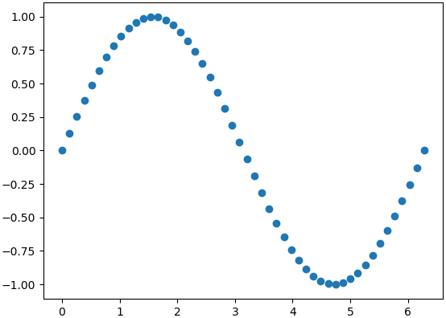

你只需要调用`scatter`函数并传入两个分别代表`x`坐标和`y`坐标的数组。

### 彩色映射散点图

&emsp;&emsp;另一种你可能用到的图形是彩色映射散点图。这里我们会根据数据的大小给每个点赋予不同的颜色和大小，并在图中添加一个颜色栏：

``` python
import matplotlib.pyplot as plt
import numpy as np

x = np.random.rand(1000)
y = np.random.rand(1000)
size = np.random.rand(1000) * 50
colour = np.random.rand(1000)
plt.scatter(x, y, size, colour)
plt.colorbar()
plt.show()
```

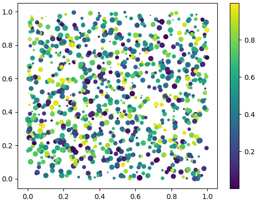

上面的代码大量地用到了`np.random.rand(1000)`，原因是绘图的数据都是随机产生的。同前面一样用到了`scatter`函数，但是这次传入了另外的两个参数，分别为所绘点的大小和颜色。通过这种方式使得图上点的大小和颜色根据数据的大小产生变化。最后用`colorbar`函数添加了一个颜色栏。

### 直方图

&emsp;&emsp;直方图是另一种常见的图形，也可以通过几行代码创建出来：

``` python
import matplotlib.pyplot as plt
import numpy as np

x = np.random.randn(1000)
plt.hist(x, 50)
plt.show()
```

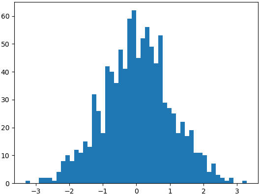

直方图是`Matplotlib`中最简单的图形之一，你只需要给`hist`函数传入一个包含数据的数组，第二个参数代表数据容器的个数。数据容器代表不同的值的间隔，并用来包含我们的数据。数据容器越多，图形上的数据条就越多。

### 标题、标签和图例

&emsp;&emsp;当需要快速创建图形时，你可能不需要为图形添加标签。但是当构建需要展示的图形时，你就需要添加标题、标签和图例：

``` python
import matplotlib.pyplot as plt
import numpy as np

x = np.linspace(0, 2 * np.pi, 50)
plt.plot(x, np.sin(x), 'r-x', label='Sin(x)')
plt.plot(x, np.cos(x), 'g-^', label='Cos(x)')
plt.legend()  # 展示图例
plt.xlabel('Rads')  # 给x轴添加标签
plt.ylabel('Amplitude')  # 给y轴添加标签
plt.title('Sin and Cos Waves')  # 添加图形标题
plt.show()
```

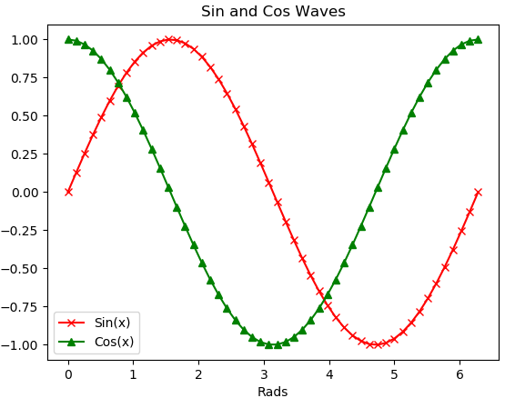

为了给图形添加图例，我们需要在`plot`函数中添加命名参数`label`，并赋予该参数相应的标签，然后调用`legend`函数就会在图形中添加图例。接下来只需要调用函数`title`、`xlabel`和`ylabel`就可以为图形添加标题和标签。

### 显示图片

&emsp;&emsp;显示图片的代码如下：

``` python
import matplotlib.pyplot as plt

plt.imshow(img)  # img是图片
```

`imshow`函数格式为：

``` python
matplotlib.pyplot.imshow(X, cmap=None)
```

参数`X`是要绘制的图像或数组，`cmap`是颜色图谱(`colormap`)，默认绘制为`RGB`颜色空间。其它可选的颜色图谱如下：

颜色图谱   | 描述       | 颜色图谱   | 描述
----------|------------|-----------|------
`autumn`  | 红-橙-黄    | `bone`    | 黑-白，x线
`cool`    | 青-洋红     | `copper`  | 黑-铜
`flag`    | 红-白-蓝-黑 | `gray`    | 黑-白
`hot`     | 黑-红-黄-白 | `hsv`     | hsv颜色空间
`inferno` | 黑-红-黄    | `jet`     | 蓝-青-黄-红
`magma`   | 黑-红-白    | `pink`    | 黑-粉-白
`plasma`  | 绿-红-黄    | `spring`  | 洋红-黄
`summer`  | 绿-黄       | `viridis` | 蓝-绿-黄
`winter`  | 蓝-绿

用的比较多的是`gray`、`jet`：

``` python
plt.imshow(image, plt.cm.gray)
plt.imshow(img, cmap=plt.cm.jet)
```

实际应用如下：

``` python
import matplotlib.pyplot as plt
from skimage import data

img = data.astronaut()
plt.imshow(img)
plt.show()
```

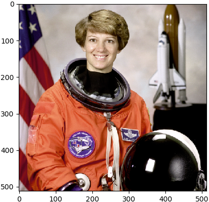

&emsp;&emsp;`matplotlib`可以设置多个`figure`窗口，设置`figure`的标题，隐藏坐标尺，甚至可以使用`subplot`在一个`figure`中显示多张图片：

``` python
from skimage import data
import matplotlib.pyplot as plt

img = data.astronaut()
# 创建一个名为astronaut的窗口，并设置大小
plt.figure(num='astronaut', figsize=(8, 8))

plt.subplot(2, 2, 1)  # 将窗口分为两行两列四个子图，则可显示四幅图片
plt.title('origin image')  # 第一幅图片标题
plt.imshow(img)  # 绘制第一幅图片

plt.subplot(2, 2, 2)  # 第二个子图
plt.title('R channel')  # 第二幅图片标题
plt.imshow(img[:, :, 0], plt.cm.gray)  # 绘制第二幅图片，且为灰度图
plt.axis('off')  # 不显示坐标尺寸

plt.subplot(2, 2, 3)  # 第三个子图
plt.title('G channel')  # 第三幅图片标题
plt.imshow(img[:, :, 1], plt.cm.gray)  # 绘制第三幅图片，且为灰度图
plt.axis('off')  # 不显示坐标尺寸

plt.subplot(2, 2, 4)  # 第四个子图
plt.title('B channel')  # 第四幅图片标题
plt.imshow(img[:, :, 2], plt.cm.gray)  # 绘制第四幅图片，且为灰度图
plt.axis('off')  # 不显示坐标尺寸

plt.show()  # 显示窗口
```

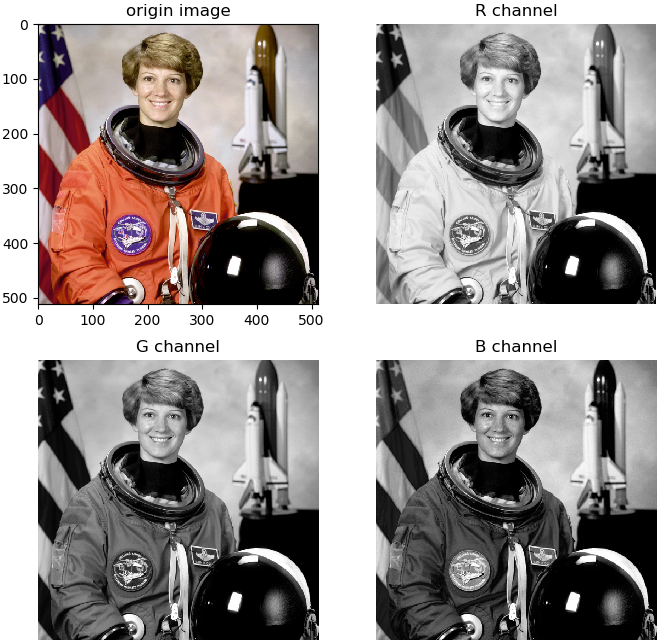

&emsp;&emsp;在图片绘制过程中，我们用`matplotlib.pyplot`模块下的`figure`函数来创建显示窗口：

``` python
matplotlib.pyplot.figure(num=None, figsize=None, dpi=None, facecolor=None, edgecolor=None)
```

- `num`：整型或字符型都可以。如果设置为整型，则该整型数字表示窗口的序号；如果设置为字符型，则该字符串表示窗口的名称。用该参数来命名窗口，如果两个窗口序号或名称相同，则后一个窗口会覆盖前一个窗口。
- `figsize`：设置窗口大小，`tuple`类型，如`figsize = (8, 8)`。
- `dpi`：整型数字，表示窗口的分辨率。
- `facecolor`：窗口的背景颜色。
- `edgecolor`：窗口的边框颜色。

&emsp;&emsp;用`figure`函数创建的窗口，只能显示一幅图片，如果想要显示多幅图片，则需要将这个窗口再划分为几个子图，在每个子图中显示不同的图片。我们可以使用`subplot`函数来划分子图。

### 调整名字和间隔

&emsp;&emsp;使用`import`导入模块`matplotlib.pyplot`，并简写成`plt`；使用`import`导入模块`numpy`，并简写成`np`：

``` python
import matplotlib.pyplot as plt
import numpy as np
```

使用`np.linspace`定义`x`的范围是`(-3, 3)`，个数是`50`。仿真一维数据组`(x, y1)`表示`曲线1`，仿真一维数据组`(x, y2)`表示`曲线2`：

``` python
x = np.linspace(-3, 3, 50)
y1 = 2 * x + 1
y2 = x ** 2
```

使用`plt.figure`定义一个图像窗口，使用`plt.plot`画`(x, y2)`曲线；使用`plt.plot`画`(x, y1)`曲线，颜色属性(`color`)为红色，宽度(`linewidth`)为`1.0`，类型(`linestyle`)为虚线：

``` python
plt.figure()
plt.plot(x, y2)
plt.plot(x, y1, color='red', linewidth=1.0, linestyle='--')
```

使用`plt.xlim`设置`x`坐标轴范围为`(-1, 2)`，使用`plt.ylim`设置`y`坐标轴范围为`(-2, 3)`。使用`plt.xlabel`设置`x`坐标轴名称为`I am x`，使用`plt.ylabel`设置`y`坐标轴名称为`I am y`：

``` python
plt.xlim((-1, 2))
plt.ylim((-2, 3))
plt.xlabel('I am x')
plt.ylabel('I am y')
plt.show()
```

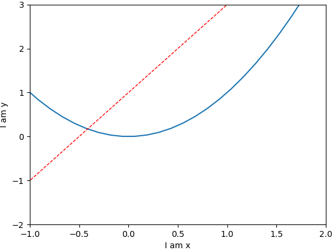

使用`plt.xticks`设置`x`轴刻度，范围是`(-1, 2)`，个数是`5`：

``` python
new_ticks = np.linspace(-1, 2, 5)
print(new_ticks)
plt.xticks(new_ticks)
```

使用`plt.yticks`设置`y`轴刻度以及名称：刻度为`[-2, -1.8, -1, 1.22, 3]`，对应刻度的名称为`['really bad','bad','normal','good','really good']`：

``` python
plt.yticks(
    [-2, -1.8, -1, 1.22, 3],
    [r'$really\ bad$', r'$bad$', r'$normal$', r'$good$', r'$really\ good$'])
plt.show()
```

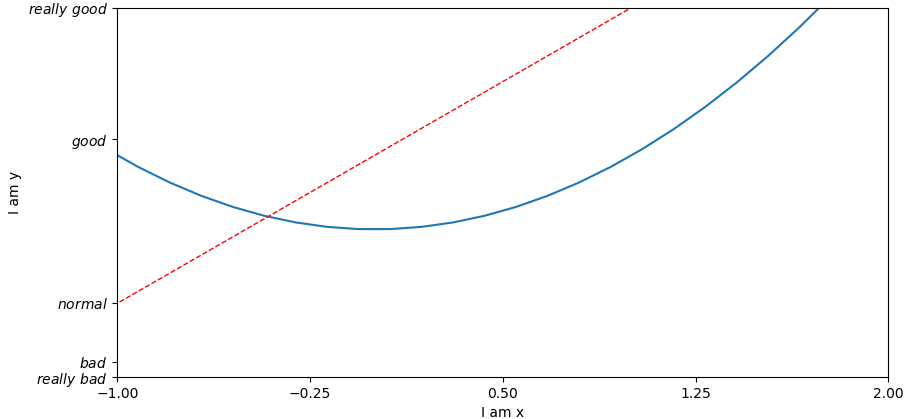

设置坐标轴的范围还可以使用`axis`函数：

``` python
import numpy as np
import matplotlib.pyplot as plt

x = np.arange(-101, 101, 1)
plt.plot(x, x ** 2)
plt.axis([-100, 100, 0, 10000])  # 设置x轴的最小值、最大值和y轴的最小值、最大值
plt.show()
```

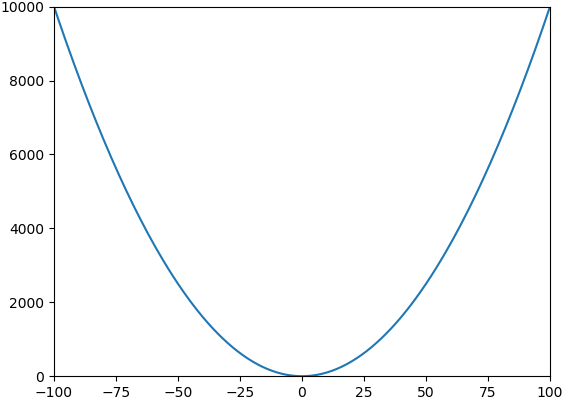

### matplotlib.pyplot.triplot

&emsp;&emsp;Draw a unstructured triangular grid as lines and/or markers.

``` python
matplotlib.pyplot.triplot(*args, **kwargs)
```

The triangulation to plot can be specified in one of two ways; either:

``` python
triplot(triangulation, ...)
```

where triangulation is a `matplotlib.tri.Triangulation` object, or

``` python
triplot(x, y, ...)
triplot(x, y, triangles, ...)
triplot(x, y, triangles=triangles, ...)
triplot(x, y, mask=mask, ...)
triplot(x, y, triangles, mask=mask, ...)
```

in which case a `Triangulation` object will be created. The remaining args and kwargs are the same as for `plot()`.
&emsp;&emsp;Return a list of 2 `Line2D` containing respectively: the lines plotted for triangles edges; the markers plotted for triangles nodes.

``` python
from matplotlib import pyplot as plt
import matplotlib.tri as tri
import numpy as np

rand_data = np.random.randn(50, 2)
triangulation = tri.Triangulation(rand_data[:, 0], rand_data[:, 1])
plt.triplot(triangulation)
plt.show()
```


### 绘制三维数据

&emsp;&emsp;代码如下：

``` python
import numpy as np
import matplotlib.pyplot as plt
from mpl_toolkits.mplot3d import Axes3D

fig = plt.figure()
ax = fig.gca(projection='3d')
th = np.linspace(-4 * np.pi, 4 * np.pi, 100)
z = np.linspace(-2, 2, 100)
r = z ** 2 + 1
x = r * np.sin(th)
y = r * np.cos(th)
ax.plot(x, y, z, label='hello')
ax.legend()
# 限制坐标轴的范围
ax.set_xlim3d(x.min(), x.max())
ax.set_ylim3d(y.min(), y.max())
ax.set_zlim3d(z.min(), z.max())
plt.show()
```

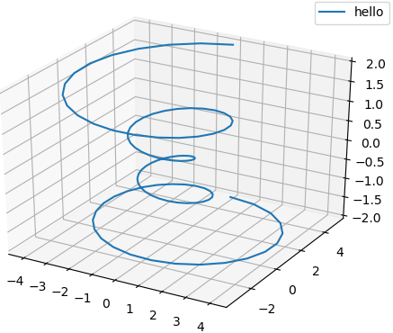

### 清除图像

&emsp;&emsp;`Matplotlib`提供了以下功能：

``` python
cla()  # Clear axis
clf()  # Clear figure
close()  # Close a figure window
```

### 动态图

&emsp;&emsp;代码如下：

``` python
import matplotlib.pyplot as plt
import numpy as np

plt.axis([0, 50, 0, 1])
plt.ion()  # 动态图的交互模式打开，此时show不再暂停

for i in range(50):
    y = np.random.random()
    plt.scatter(i, y)
    plt.pause(0.01)  # pause以秒为单位
    plt.autoscale()
    plt.show()

plt.pause(1)
```

### 没有GUI时使用matplotlib绘图

&emsp;&emsp;在`import matplotlib.pyplot as plt`语句之前添加如下语句：

``` python
import matplotlib as mpl
mpl.use('Agg')
```

在`plt.draw`或者`plt.show`之后添加生成图片的代码：

``` python
plt.savefig("picture_name.jpg")
```

### add_subplot函数

&emsp;&emsp;代码如下：

``` python
import matplotlib.pyplot as plt
import numpy as np

x = np.linspace(0, 2 * np.pi, 50)
fig = plt.figure()
ax = fig.add_subplot(223)
ax.plot(x, np.sin(x))
ax.set_title("OutPut")
plt.show()
```

`223`的意思是将画布分割成`2`行`2`列，图像画在从左到右从上到下的第`3`块：

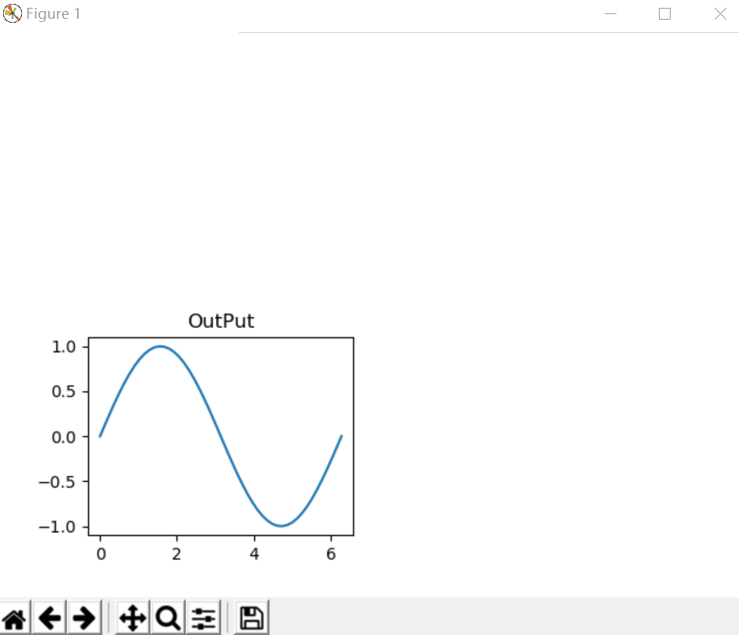

如果其中有数字不是个位数，需要使用逗号进行隔开，例如`ax = fig.add_subplot(3, 4, 10)`。

### rcParams函数

&emsp;&emsp;函数的主要作用为指定图片像素：

``` python
import matplotlib
import matplotlib.pyplot as plt

# 默认的像素为[6.0, 4.0]，分辨率为100，则图片尺寸为“600*400”。如果指定“dpi = 200”，
# 则图片尺寸为“1200 * 800”；指定“dpi = 300”，则图片尺寸为“1800 * 1200”
plt.rcParams['savefig.dpi'] = 300  # 图片像素
plt.rcParams['figure.dpi'] = 300  # 分辨率
myfont = matplotlib.font_manager.FontProperties(fname=r'c:\windows\fonts\simsun.ttc')
plt.plot((1, 2, 3), (4, 3, -1))
plt.xlabel(u'横坐标', fontproperties=myfont)
plt.ylabel(u'纵坐标', fontproperties=myfont)
plt.savefig('plot123_2.png', dpi=300)  # 指定分辨率保存
```

### Polygon函数

&emsp;&emsp;绘制多边形的代码如下：

``` python
import matplotlib
import matplotlib.pyplot as plt

def main():
    fig = plt.figure()
    ax = fig.add_subplot(111)
    # 5点(0.1,0.1), (0.1,0.6), (0.7,0.8), (0.6,0.4), (0.6,0.1)を通る多角形を描画
    poly = plt.Polygon(((0.1, 0.1), (0.1, 0.6), (0.7, 0.8),
                        (0.6, 0.4), (0.6, 0.1)), fc="#770000")
    ax.add_patch(poly)
    plt.show()

if __name__ == '__main__':
    main()
```

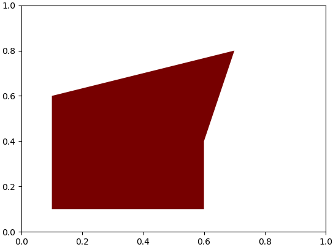

### PatchCollection函数

&emsp;&emsp;绘制图形的代码如下：

``` python
import pylab as plt
from matplotlib.patches import Circle
from matplotlib.collections import PatchCollection

fig, ax = plt.subplots()
patches = []
circle = Circle((0.5, 0.5), 0.3, ec="none")
patches.append(circle)
collection = PatchCollection(patches, alpha=0.3)
ax.add_collection(collection)
plt.axis('equal')
plt.show()
```

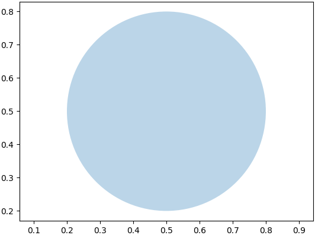

### heatmap的绘制

&emsp;&emsp;代码如下：

``` python
import numpy as np
import matplotlib
import matplotlib.pyplot as plt

vegetables = ["cucumber", "tomato", "lettuce",
              "asparagus", "potato", "wheat", "barley"]
farmers = ["Farmer Joe", "Upland Bros.", "Smith Gardening",
           "Agrifun", "Organiculture", "BioGoods Ltd.", "Cornylee Corp."]

harvest = np.array(
    [[0.8, 2.4, 2.5, 3.9, 0.0, 4.0, 0.0],
     [2.4, 0.0, 4.0, 1.0, 2.7, 0.0, 0.0],
     [1.1, 2.4, 0.8, 4.3, 1.9, 4.4, 0.0],
     [0.6, 0.0, 0.3, 0.0, 3.1, 0.0, 0.0],
     [0.7, 1.7, 0.6, 2.6, 2.2, 6.2, 0.0],
     [1.3, 1.2, 0.0, 0.0, 0.0, 3.2, 5.1],
     [0.1, 2.0, 0.0, 1.4, 0.0, 1.9, 6.3]]
)

fig, ax = plt.subplots()
im = ax.imshow(harvest)

# We want to show all ticks
ax.set_xticks(np.arange(len(farmers)))
ax.set_yticks(np.arange(len(vegetables)))
# label them with the respective list entries
ax.set_xticklabels(farmers)
ax.set_yticklabels(vegetables)
# Rotate the tick labels and set their alignment
plt.setp(ax.get_xticklabels(), rotation=45, ha="right", rotation_mode="anchor")

# Loop over data dimensions and create text annotations
for i in range(len(vegetables)):
    for j in range(len(farmers)):
        text = ax.text(j, i, harvest[i, j], ha="center", va="center", color="w")

ax.set_title("Harvest of local farmers (in tons/year)")
fig.tight_layout()
plt.show()
```

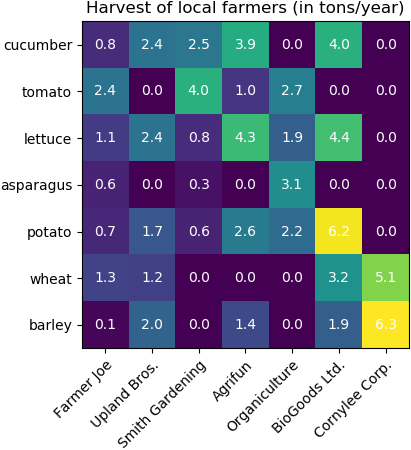

### LinearLocator

&emsp;&emsp;使用示例如下：

``` python
from mpl_toolkits.mplot3d import Axes3D
from matplotlib import cm  # 里面有很多颜色映射表
from matplotlib.ticker import LinearLocator, FormatStrFormatter
import matplotlib.pyplot as plt
import numpy as np

fig = plt.figure()
ax = fig.gca(projection='3d')
X = np.arange(-5, 5, 0.25)
Y = np.arange(-5, 5, 0.25)
X, Y = np.meshgrid(X, Y)  # 创建“X-Y”平面表格
R = np.sqrt(X ** 2 + Y ** 2)  # 计算每个点的高度
Z = np.cos(R)

surf = ax.plot_surface(
    X, Y, Z, rstride=1, cstride=1, cmap=cm.coolwarm,
    linewidth=0, antialiased=False
)

ax.set_zlim(-1.01, 1.01)
# 设置z轴的坐标为线性的，且有10个坐标标记
ax.zaxis.set_major_locator(LinearLocator(10))
# 设置了z轴坐标的显示格式
ax.zaxis.set_major_formatter(FormatStrFormatter('%.02f'))
fig.colorbar(surf, shrink=.5, aspect=5)  # 设置颜色带的大小
plt.show()
```

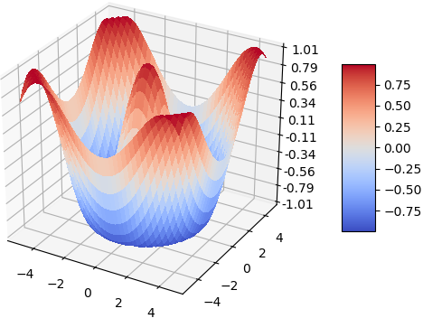

### 显示灰度图

&emsp;&emsp;代码如下：

``` python
import cv2
import matplotlib.pyplot as plt

img = cv2.imread('lena.jpg', 0)
plt.imshow(img, cmap='gray')  # 灰度图显示，cmap(color map)设置为gray
plt.show()
```

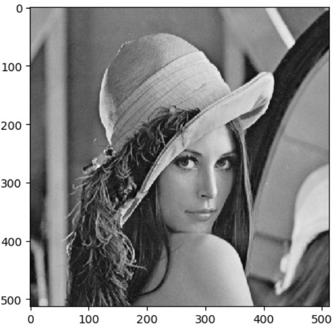

### 显示彩色图

&emsp;&emsp;`OpenCV`中的图像是以`BGR`的通道顺序存储的，但`Matplotlib`是以`RGB`模式显示的，所以直接在`Matplotlib`中显示`OpenCV`图像会出现问题，因此需要转换一下：

``` python
import cv2
import matplotlib.pyplot as plt

img = cv2.imread('lena.jpg')
 # 或使用“img2 = cv2.cvtColor(img, cv2.COLOR_BGR2RGB)”
img2 = img[:, :, ::-1]
# 显示不正确的图
plt.subplot(121)
plt.imshow(img)
# 显示正确的图
plt.subplot(122)
plt.xticks([]), plt.yticks([])  # 隐藏x和y轴
plt.imshow(img2)
plt.show()
```

`img[:, :, 0]`表示图片的蓝色通道，熟悉`Python`的同学应该知道，对一个字符串`s`进行翻转用的是`s[::-1]`。同样的原理，`img[:, :, ::-1]`就表示`BGR`通道翻转，变成`RGB`：

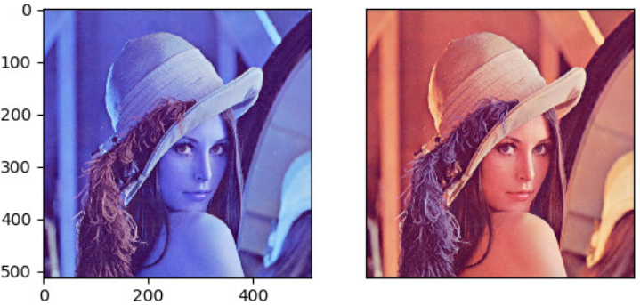

### 等高线图

&emsp;&emsp;数据集即坐标点`(x, y)`和对应的高度值，共有`256`个坐标点。高度值使用一个`height function f(x, y)`生成。`x`、`y`分别是在区间`[-3, 3]`中均匀分布的`256`个值，并用`meshgrid`在二维平面中将`x`和`y`一一对应起来，编织成栅格：

``` python
import matplotlib.pyplot as plt
import numpy as np

def f(x, y):  # the height function
    return (1 - x / 2 + x ** 5 + y ** 3) * np.exp(-x ** 2 - y ** 2)

n = 256
x = np.linspace(-3, 3, n)
y = np.linspace(-3, 3, n)
X, Y = np.meshgrid(x, y)
```

接下来进行颜色填充，使用函数`plt.contourf`把颜色加进去，位置参数分别为`X`、`Y`和`f(X, Y)`，透明度为`0.75`，并将`f(X, Y)`的值对应到`color map`的暖色组中寻找对应颜色：

``` python
# use plt.contourf to filling contours. X, Y and value for (X,Y) point
plt.contourf(X, Y, f(X, Y), 8, alpha=.75, cmap=plt.cm.hot)
```

接下来进行等高线绘制，使用`plt.contour`函数划线，位置参数为`X`、`Y`和`f(X, Y)`，颜色为黑色，线条宽度为`0.5`，等高线的密集程度为`8`：

``` python
# use plt.contour to add contour lines
C = plt.contour(X, Y, f(X, Y), 8, colors='black', linewidth=.5)
```

接下来添加高度数字，`inline`控制是否将`Label`画在线里面，`fontsize`设置字体大小为`10`：

``` python
plt.clabel(C, inline=True, fontsize=10)
plt.xticks(())
plt.yticks(())
plt.show()
```

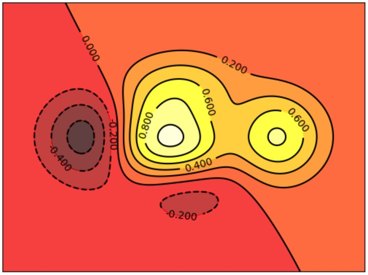

### Bar柱状图

&emsp;&emsp;使用的函数是`plt.bar`，参数为`X`和`Y`，`X`为`0`到`11`的整数，`Y`是相应的均匀分布的随机数据：

``` python
import matplotlib.pyplot as plt
import numpy as np

n = 12
X = np.arange(n)
Y1 = (1 - X / float(n)) * np.random.uniform(0.5, 1.0, n)
Y2 = (1 - X / float(n)) * np.random.uniform(0.5, 1.0, n)

plt.bar(X, +Y1)
plt.bar(X, -Y2)

plt.xlim(-.5, n)
plt.xticks(())
plt.ylim(-1.25, 1.25)
plt.yticks(())

plt.show()
```

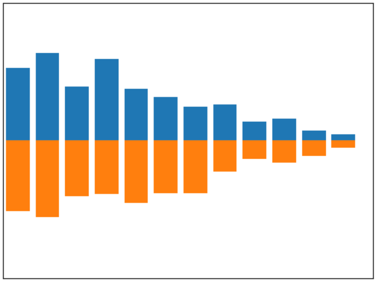

我们使用`facecolor`设置主体颜色，用`edgecolor`设置边框颜色：

``` python
plt.bar(X, +Y1, facecolor='#9999ff', edgecolor='white')
plt.bar(X, -Y2, facecolor='#ff9999', edgecolor='white')
```

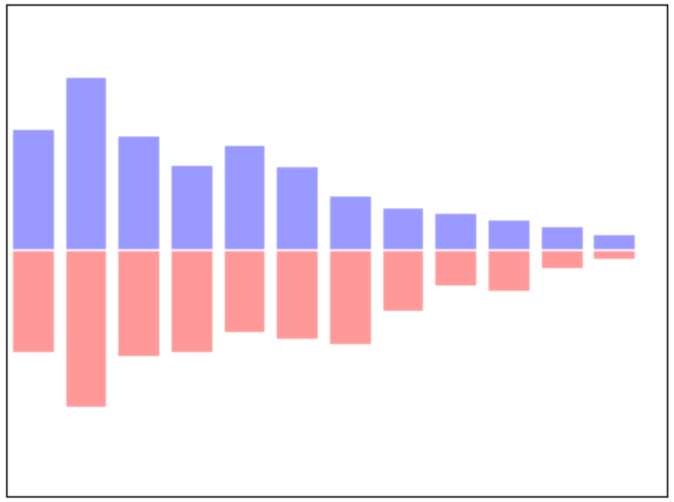

接下来使用函数`plt.text`分别在柱体上方和下方加上数值，用`%.2f`保留两位小数，横向居中对齐(`ha='center'`)，纵向底部(顶部)对齐(`va='bottom'`和`va='top'`)：

``` python
for x, y in zip(X, Y1):
    # ha: horizontal alignment; va: vertical alignment
    plt.text(x + 0.4, y + 0.05, '%.2f' % y, ha='center', va='bottom')

for x, y in zip(X, Y2):
    # ha: horizontal alignment; va: vertical alignment
    plt.text(x + 0.4, -y - 0.05, '%.2f' % y, ha='center', va='top')
```

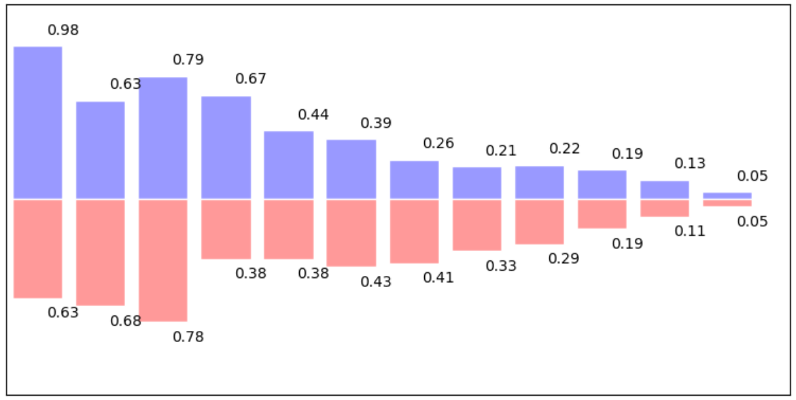

### 横向柱状图

&emsp;&emsp;代码如下：

``` python
import numpy as np
import matplotlib.pyplot as plt

people = ('Tom', 'Dick', 'Harry', 'Slim', 'Jim')
y_pos = np.arange(len(people))
performance = 3 + 10 * np.random.rand(len(people))
error = np.random.rand(len(people))
plt.barh(y_pos, performance, xerr=error, align='center', alpha=0.4)
plt.yticks(y_pos, people)
plt.xlabel('Performance')
plt.title('How fast do you want to go today?')
plt.show()
```

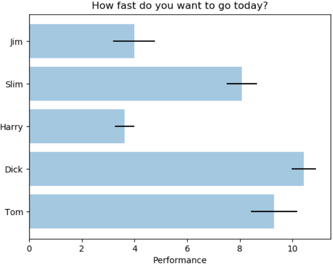

`barh`的主要功能是做一个横向条形图，横向条的矩形大小为`[left, left + width, bottom, bottom + height]`，函数原型如下：

``` python
barh(bottom, width, height=0.8, left=0, **kwargs)
```

参数`bottom`是`Bars`的垂直位置的底部边缘，`width`是`Bars`的长度。可选参数`kwargs`如下：

- `height`：`bars`的高度。
- `left`：`bars`左边缘`x`轴坐标值。
- `color`：`bars`颜色。
- `edgecolor`：`bars`边缘颜色。
- `linewidth`：`bar`边缘宽度，`None`表示默认宽度，`0`表示不绘制边缘。
- `xerr`：若不为`None`，将在`bar`图上生成`errobars`。
- `yerr`：若不为`None`，将在`bar`图上生成`errobars`。
- `ecolor`：指定`errorbar`颜色。
- `capsize`：指定`errorbar`的顶部长度。