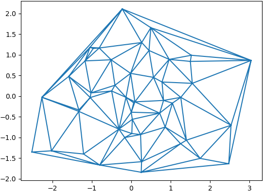

### 简单图形

&emsp;&emsp;画一条在`[0, 2pi]`上的正弦曲线：<!--more-->

``` python
import matplotlib.pyplot as plt
import numpy as np

x = np.linspace(0, 2 * np.pi, 50)
plt.plot(x, np.sin(x))  # 如果没有第一个参数x，图形的x坐标默认为数组的索引
plt.show()  # 显示图形
```


### 绘制多个数据集

&emsp;&emsp;大多数时候需要在一张图上绘制多个数据集：

``` python
import matplotlib.pyplot as plt
import numpy as np

x = np.linspace(0, 2 * np.pi, 50)
plt.plot(x, np.sin(x), x, np.sin(2 * x))
plt.show()
```


### 自定义图形外观

&emsp;&emsp;可以自定义图形的外观：

``` python
import matplotlib.pyplot as plt
import numpy as np

x = np.linspace(0, 2 * np.pi, 50)
plt.plot(x, np.sin(x), 'r-o', x, np.cos(x), 'g--')
plt.show()
```


&emsp;&emsp;基本颜色格式命令如下：

命令 | 说明 | 命令 | 说明 | 命令 | 说明 | 命令 | 说明
----|------|------|------|-----|------|------|----
`b` | 蓝色 | `g`  | 绿色  | `r` | 红色 | `c`  | 青色
`m` | 品红 | `y`  | 黄色  | `k` | 黑色 | `w`  | 白色

&emsp;&emsp;基本线型格式命令如下：

命令 | 说明 | 命令 | 说明 | 命令 | 说明
----|------|------|-----|------|-----
`-` | 实线 | `--` | 虚线 | `:`  | 点线

&emsp;&emsp;基本绘制标记格式命令如下：

命令 | 说明  | 命令 | 说明  | 命令 | 说明   | 命令 | 说明
----|-------|------|-------|-----|--------|-----|-----
`.` | 点     | `o` | 圆圈   | `s` | 正方形 | `*` | 星形
`+` | 加号   | `x` | 叉号

### 使用子图

&emsp;&emsp;使用子图可以在一个窗口绘制多张图：

``` python
import matplotlib.pyplot as plt
import numpy as np

x = np.linspace(0, 2 * np.pi, 50)
plt.subplot(2, 1, 1)  # (行, 列, 活跃区)
plt.plot(x, np.sin(x), 'r')
plt.subplot(2, 1, 2)
plt.plot(x, np.cos(x), 'g')
plt.show()
```


### 简单的散点图

&emsp;&emsp;散点图是一堆离散点的集合：

``` python
import matplotlib.pyplot as plt
import numpy as np

x = np.linspace(0, 2 * np.pi, 50)
y = np.sin(x)
plt.scatter(x, y)
plt.show()
```


### 彩色映射散点图

&emsp;&emsp;代码实例：

``` python
import matplotlib.pyplot as plt
import numpy as np

x = np.random.rand(1000)
y = np.random.rand(1000)
size = np.random.rand(1000) * 50
colour = np.random.rand(1000)
plt.scatter(x, y, size, colour)
plt.colorbar()
plt.show()
```


### 直方图

&emsp;&emsp;直方图是另一种常见的图形，也可以通过几行代码创建出来：

``` python
import matplotlib.pyplot as plt
import numpy as np

x = np.random.randn(1000)
plt.hist(x, 50)  # x是一个包含数据的数组，50是数据容器的个数
plt.show()
```


### 标题、标签和图例

&emsp;&emsp;代码实例：

``` python
import matplotlib.pyplot as plt
import numpy as np

x = np.linspace(0, 2 * np.pi, 50)
plt.plot(x, np.sin(x), 'r-x', label='Sin(x)')
plt.plot(x, np.cos(x), 'g-^', label='Cos(x)')
plt.legend()  # 展示图例
plt.xlabel('Rads')  # 给x轴添加标签
plt.ylabel('Amplitude')  # 给y轴添加标签
plt.title('Sin and Cos Waves')  # 添加图形标题
plt.show()
```


### 显示图片

&emsp;&emsp;`imshow`函数原型如下：

``` python
matplotlib.pyplot.imshow(X, cmap=None)
```

- 参数`X`是要绘制的图像或数组。
- 参数`cmap`是颜色图谱。

``` python
plt.imshow(image_1)
plt.imshow(image_2, plt.cm.gray)
```

&emsp;&emsp;代码实例：

``` python
import matplotlib.pyplot as plt
from skimage import data

img = data.astronaut()
plt.imshow(img)
plt.show()
```


### figure窗口

&emsp;&emsp;`matplotlib`可以设置多个`figure`窗口：

``` python
from skimage import data
import matplotlib.pyplot as plt

img = data.astronaut()
# 创建一个名为astronaut的窗口，并设置大小
plt.figure(num='astronaut', figsize=(8, 8))

plt.subplot(2, 2, 1)  # 将窗口分为两行两列四个子图，则可显示四幅图片
plt.title('origin image')  # 第一幅图片标题
plt.imshow(img)  # 绘制第一幅图片

plt.subplot(2, 2, 2)  # 第二个子图
plt.title('R channel')  # 第二幅图片标题
plt.imshow(img[:, :, 0], plt.cm.gray)  # 绘制第二幅图片，且为灰度图
plt.axis('off')  # 不显示坐标尺寸

plt.subplot(2, 2, 3)  # 第三个子图
plt.title('G channel')  # 第三幅图片标题
plt.imshow(img[:, :, 1], plt.cm.gray)  # 绘制第三幅图片，且为灰度图
plt.axis('off')  # 不显示坐标尺寸

plt.subplot(2, 2, 4)  # 第四个子图
plt.title('B channel')  # 第四幅图片标题
plt.imshow(img[:, :, 2], plt.cm.gray)  # 绘制第四幅图片，且为灰度图
plt.axis('off')  # 不显示坐标尺寸

plt.show()  # 显示窗口
```


### 坐标轴设置

&emsp;&emsp;使用`plt.xlim`设置`x`坐标轴范围，使用`plt.ylim`设置`y`坐标轴范围。
&emsp;&emsp;使用`plt.xlabel`设置`x`坐标轴名称，使用`plt.ylabel`设置`y`坐标轴名称。

``` python
import matplotlib.pyplot as plt
import numpy as np

x = np.linspace(-3, 3, 50)
y1 = 2 * x + 1
y2 = x ** 2

plt.figure()
plt.plot(x, y2)
plt.plot(x, y1, color='red', linewidth=1.0, linestyle='--')

plt.xlim((-1, 2))
plt.ylim((-2, 3))
plt.xlabel('I am x')
plt.ylabel('I am y')
plt.show()
```


&emsp;&emsp;使用`plt.xticks`设置`x`轴刻度：

``` python
# x轴的坐标范围是(-1, 2)，刻度个数为5
new_ticks = np.linspace(-1, 2, 5)
print(new_ticks)
plt.xticks(new_ticks)
```

&emsp;&emsp;使用`plt.yticks`设置`y`轴刻度与名称：

``` python
plt.yticks(
    [-2, -1.8, -1, 1.22, 3],
    [r'$really\ bad$', r'$bad$', r'$normal$', r'$good$', r'$really\ good$'])
plt.show()
```


&emsp;&emsp;设置坐标轴的范围还可以使用`axis`：

``` python
import numpy as np
import matplotlib.pyplot as plt

x = np.arange(-101, 101, 1)
plt.plot(x, x ** 2)
plt.axis([-100, 100, 0, 10000])  # 设置x轴的最小值、最大值和y轴的最小值、最大值
plt.show()
```


### triplot

&emsp;&emsp;使用`triplot`创建非结构化三角形网格：

``` python
matplotlib.pyplot.triplot(*args, **kwargs)
```

参数`args`和`kwargs`的含义与`plot`的相同。

``` python
from matplotlib import pyplot as plt
import matplotlib.tri as tri
import numpy as np

rand_data = np.random.randn(50, 2)
triangulation = tri.Triangulation(rand_data[:, 0], rand_data[:, 1])
plt.triplot(triangulation)
plt.show()
```



### 绘制三维数据

&emsp;&emsp;代码如下：

``` python
import numpy as np
import matplotlib.pyplot as plt
from mpl_toolkits.mplot3d import Axes3D

fig = plt.figure()
ax = fig.gca(projection='3d')
th = np.linspace(-4 * np.pi, 4 * np.pi, 100)
z = np.linspace(-2, 2, 100)
r = z ** 2 + 1
x = r * np.sin(th)
y = r * np.cos(th)
ax.plot(x, y, z, label='hello')
ax.legend()
# 限制坐标轴的范围
ax.set_xlim3d(x.min(), x.max())
ax.set_ylim3d(y.min(), y.max())
ax.set_zlim3d(z.min(), z.max())
plt.show()
```


### 清除图像

&emsp;&emsp;`Matplotlib`提供了以下清除图像功能：

``` python
cla()  # Clear axis
clf()  # Clear figure
close()  # Close a figure window
```

### 动态图

&emsp;&emsp;代码如下：

``` python
import matplotlib.pyplot as plt
import numpy as np

plt.axis([0, 50, 0, 1])
plt.ion()  # 动态图的交互模式打开，此时show不再暂停

for i in range(50):
    y = np.random.random()
    plt.scatter(i, y)
    plt.pause(0.01)  # pause以秒为单位
    plt.autoscale()
    plt.show()

plt.pause(1)
```

### 没有GUI时进行绘图

&emsp;&emsp;在`import matplotlib.pyplot as plt`之前添加如下语句：

``` python
import matplotlib as mpl
mpl.use('Agg')
```

&emsp;&emsp;在`plt.draw`或者`plt.show`之后添加生成图片的代码：

``` python
plt.savefig("picture_name.jpg")
```

### add_subplot函数

&emsp;&emsp;代码如下：

``` python
import matplotlib.pyplot as plt
import numpy as np

x = np.linspace(0, 2 * np.pi, 50)
fig = plt.figure()
ax = fig.add_subplot(223)
ax.plot(x, np.sin(x))
ax.set_title("OutPut")
plt.show()
```

`223`的意思是将画布分割成`2`行`2`列，图像画在从左到右、从上到下的第`3`块：


&emsp;&emsp;如果其中有数字不是个位数，需要使用逗号进行隔开，例如`ax = fig.add_subplot(3, 4, 10)`。

### rcParams

&emsp;&emsp;函数作用是指定图片像素：

``` python
import matplotlib
import matplotlib.pyplot as plt

# 默认的像素为[6.0, 4.0]，分辨率为100，则图片尺寸为“600 * 400”
# 如果指定“dpi = 200”，则图片尺寸为“1200 * 800”
# 如果指定“dpi = 300”，则图片尺寸为“1800 * 1200”
plt.rcParams['savefig.dpi'] = 300  # 图片像素
plt.rcParams['figure.dpi'] = 300  # 分辨率
myfont = matplotlib.font_manager.FontProperties(fname=r'c:\windows\fonts\simsun.ttc')
plt.plot((1, 2, 3), (4, 3, -1))
plt.xlabel(u'横坐标', fontproperties=myfont)
plt.ylabel(u'纵坐标', fontproperties=myfont)
plt.savefig('plot123_2.png', dpi=300)  # 指定分辨率保存
```

### Polygon

&emsp;&emsp;绘制多边形的代码如下：

``` python
import matplotlib
import matplotlib.pyplot as plt

def main():
    fig = plt.figure()
    ax = fig.add_subplot(111)
    # 5点(0.1,0.1), (0.1,0.6), (0.7,0.8), (0.6,0.4), (0.6,0.1)を通る多角形を描画
    poly = plt.Polygon(((0.1, 0.1), (0.1, 0.6), (0.7, 0.8),
                        (0.6, 0.4), (0.6, 0.1)), fc="#770000")
    ax.add_patch(poly)
    plt.show()

if __name__ == '__main__':
    main()
```


### PatchCollection

&emsp;&emsp;代码如下：

``` python
import pylab as plt
from matplotlib.patches import Circle
from matplotlib.collections import PatchCollection

fig, ax = plt.subplots()
patches = []
circle = Circle((0.5, 0.5), 0.3, ec="none")
patches.append(circle)
collection = PatchCollection(patches, alpha=0.3)
ax.add_collection(collection)
plt.axis('equal')
plt.show()
```


### heatmap的绘制

&emsp;&emsp;代码如下：

``` python
import numpy as np
import matplotlib
import matplotlib.pyplot as plt

vegetables = ["cucumber", "tomato", "lettuce",
              "asparagus", "potato", "wheat", "barley"]
farmers = ["Farmer Joe", "Upland Bros.", "Smith Gardening",
           "Agrifun", "Organiculture", "BioGoods Ltd.", "Cornylee Corp."]

harvest = np.array(
    [[0.8, 2.4, 2.5, 3.9, 0.0, 4.0, 0.0],
     [2.4, 0.0, 4.0, 1.0, 2.7, 0.0, 0.0],
     [1.1, 2.4, 0.8, 4.3, 1.9, 4.4, 0.0],
     [0.6, 0.0, 0.3, 0.0, 3.1, 0.0, 0.0],
     [0.7, 1.7, 0.6, 2.6, 2.2, 6.2, 0.0],
     [1.3, 1.2, 0.0, 0.0, 0.0, 3.2, 5.1],
     [0.1, 2.0, 0.0, 1.4, 0.0, 1.9, 6.3]]
)

fig, ax = plt.subplots()
im = ax.imshow(harvest)

# We want to show all ticks
ax.set_xticks(np.arange(len(farmers)))
ax.set_yticks(np.arange(len(vegetables)))
# label them with the respective list entries
ax.set_xticklabels(farmers)
ax.set_yticklabels(vegetables)
# Rotate the tick labels and set their alignment
plt.setp(ax.get_xticklabels(), rotation=45, ha="right", rotation_mode="anchor")

# Loop over data dimensions and create text annotations
for i in range(len(vegetables)):
    for j in range(len(farmers)):
        text = ax.text(j, i, harvest[i, j], ha="center", va="center", color="w")

ax.set_title("Harvest of local farmers (in tons/year)")
fig.tight_layout()
plt.show()
```


### LinearLocator

&emsp;&emsp;代码如下：

``` python
from mpl_toolkits.mplot3d import Axes3D
from matplotlib import cm  # 里面有很多颜色映射表
from matplotlib.ticker import LinearLocator, FormatStrFormatter
import matplotlib.pyplot as plt
import numpy as np

fig = plt.figure()
ax = fig.gca(projection='3d')
X = np.arange(-5, 5, 0.25)
Y = np.arange(-5, 5, 0.25)
X, Y = np.meshgrid(X, Y)  # 创建“X-Y”平面表格
R = np.sqrt(X ** 2 + Y ** 2)  # 计算每个点的高度
Z = np.cos(R)

surf = ax.plot_surface(
    X, Y, Z, rstride=1, cstride=1, cmap=cm.coolwarm,
    linewidth=0, antialiased=False
)

ax.set_zlim(-1.01, 1.01)
# 设置z轴的坐标为线性的，且有10个坐标标记
ax.zaxis.set_major_locator(LinearLocator(10))
# 设置了z轴坐标的显示格式
ax.zaxis.set_major_formatter(FormatStrFormatter('%.02f'))
fig.colorbar(surf, shrink=.5, aspect=5)  # 设置颜色带的大小
plt.show()
```


### 显示灰度图

&emsp;&emsp;代码如下：

``` python
import cv2
import matplotlib.pyplot as plt

img = cv2.imread('lena.jpg', 0)
plt.imshow(img, cmap='gray')
plt.show()
```


### 显示彩色图

&emsp;&emsp;`OpenCV`的图像是以`BGR`的顺序存储的，但`Matplotlib`是以`RGB`显示的，因此需要转换一下：

``` python
import cv2
import matplotlib.pyplot as plt

img = cv2.imread('lena.jpg')
 # 或使用“img2 = cv2.cvtColor(img, cv2.COLOR_BGR2RGB)”
img2 = img[:, :, ::-1]  # 将BGR进行翻转，变成RGB
# 显示不正确的图
plt.subplot(121)
plt.imshow(img)
# 显示正确的图
plt.subplot(122)
plt.xticks([]), plt.yticks([])  # 隐藏x和y轴
plt.imshow(img2)
plt.show()
```


### 等高线图

&emsp;&emsp;代码如下：

``` python
import matplotlib.pyplot as plt
import numpy as np

def f(x, y):  # the height function
    return (1 - x / 2 + x ** 5 + y ** 3) * np.exp(-x ** 2 - y ** 2)

n = 256
x = np.linspace(-3, 3, n)
y = np.linspace(-3, 3, n)
X, Y = np.meshgrid(x, y)

# use plt.contourf to filling contours. X, Y and value for (X,Y) point
plt.contourf(X, Y, f(X, Y), 8, alpha=.75, cmap=plt.cm.hot)

# use plt.contour to add contour lines
C = plt.contour(X, Y, f(X, Y), 8, colors='black', linewidth=.5)

plt.clabel(C, inline=True, fontsize=10)
plt.xticks(())
plt.yticks(())
plt.show()
```


### Bar柱状图

&emsp;&emsp;代码如下：

``` python
import matplotlib.pyplot as plt
import numpy as np

n = 12
X = np.arange(n)
Y1 = (1 - X / float(n)) * np.random.uniform(0.5, 1.0, n)
Y2 = (1 - X / float(n)) * np.random.uniform(0.5, 1.0, n)

plt.bar(X, +Y1)
plt.bar(X, -Y2)

plt.xlim(-.5, n)
plt.xticks(())
plt.ylim(-1.25, 1.25)
plt.yticks(())

plt.show()
```


&emsp;&emsp;使用`facecolor`设置主体颜色，使用`edgecolor`设置边框颜色：

``` python
plt.bar(X, +Y1, facecolor='#9999ff', edgecolor='white')
plt.bar(X, -Y2, facecolor='#ff9999', edgecolor='white')
```


接&emsp;&emsp;使用`plt.text`分别在柱体上方和下方加上数值：

``` python
for x, y in zip(X, Y1):
    # ha: horizontal alignment; va: vertical alignment
    plt.text(x + 0.4, y + 0.05, '%.2f' % y, ha='center', va='bottom')

for x, y in zip(X, Y2):
    plt.text(x + 0.4, -y - 0.05, '%.2f' % y, ha='center', va='top')
```


### 横向柱状图

&emsp;&emsp;代码如下：

``` python
import numpy as np
import matplotlib.pyplot as plt

people = ('Tom', 'Dick', 'Harry', 'Slim', 'Jim')
y_pos = np.arange(len(people))
performance = 3 + 10 * np.random.rand(len(people))
error = np.random.rand(len(people))
plt.barh(y_pos, performance, xerr=error, align='center', alpha=0.4)
plt.yticks(y_pos, people)
plt.xlabel('Performance')
plt.title('How fast do you want to go today?')
plt.show()
```

