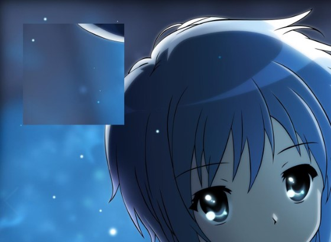
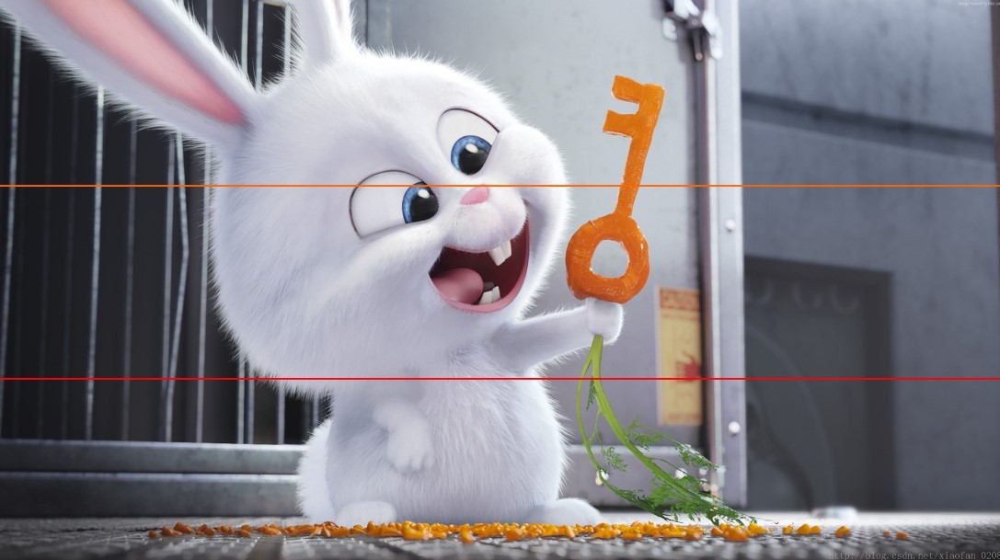
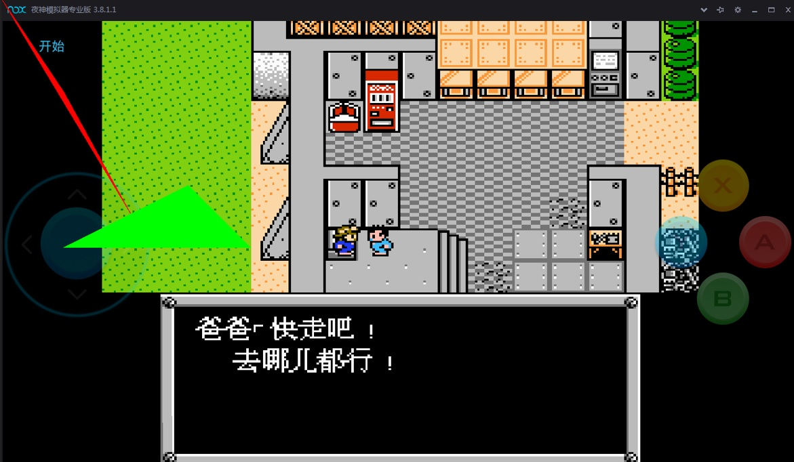
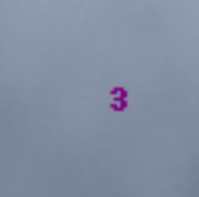

&emsp;&emsp;传统的`PIL`库不支持`python 3`，所以请使用从`PIL`派生出来的`Pillow`库。

### Image类

&emsp;&emsp;`Pillow`中最重要的类就是`Image`，该类存在于同名的模块中。使用`Image`类中的`open`函数打开一张图片：

``` python
from PIL import Image
​
im = Image.open('001.jpg')
print(im)
print(im.format, im.size, im.mode)
```

如果打开成功，则返回一个`Image`对象，可以通过对象属性查看文件内容：

``` python
<PIL.JpegImagePlugin.JpegImageFile image mode=RGB size=2560x1600 at 0x1C75B0EA588>
JPEG (2560, 1600) RGB
```

`format`属性定义了图像的格式，如果图像不是从文件打开的，那么该属性值为`None`；`size`属性是一个`tuple`，表示图像的宽和高(单位为像素)；`mode`属性为图像的模式，模式属性如下：

模式    | 说明
--------|----
`1`     | `1`位像素，黑和白，存成`8`位的像素
`L`     | `8`位像素，黑白
`P`     | `8`位像素，使用调色板映射到任何其他模式
`RGB`   | `3 * 8`位像素，真彩
`RGBA`  | `4 * 8`位像素，真彩加上透明通道
`CMYK`  | `4 * 8`位像素，颜色隔离
`YCbCr` | `3 * 8`位像素，彩色视频格式
`I`     | `32`位整型像素
`F`     | `32`位浮点型像素

当有一个`Image`对象时，可以用`Image`类的各个方法操作图像，例如显示图片：

``` python
im.show()
```

标准版本的`show`方法不是很有效率，因为它先将图像保存为一个临时文件，然后使用查看器进行显示。

### 读写图片

&emsp;&emsp;`Pillow`库支持相当多的图片格式，因此可以直接使用`Image`模块中的`open`函数读取图片，而不必先处理图片的格式。`Image`模块中的`save`函数可以保存图片，除非你指定文件格式，那么文件名中的扩展名则用来指定文件格式：

``` python
im = Image.open('001.jpg')
im.save('f.png')
```

通常情况下，`save`用于保存一个临时的`image`对象到硬盘，而转换工作则由一个功能更为强大的`convert`方法来完成。

### 拷贝、粘贴以及合并图片

&emsp;&emsp;代码如下：

``` python
from PIL import Image
​
im = Image.open('001.jpg')
box = (100, 100, 500, 500)  # 设置要拷贝的区域
# 将im表示的图片对象拷贝到region中，大小为(400*400)像素。这个region可以用来进行
# 后续的操作(region其实就是一个Image对象)，box变量是一个四元组(左, 上, 右, 下)
region = im.crop(box)
region = region.transpose(Image.ROTATE_90)  # 先把region中的Image反转90度，然后再放回到region中
im.paste(region, box)  # 粘贴box大小的region到原先的图片对象中
im.save('1.jpg')
```



区域由一个`4-tuple`来决定，该`tuple`中的信息为`(left, upper, right, lower)`，`Pillow`的系统原点`(0, 0)`为图片左上角，坐标中的数字单位为像素点。粘贴后的图片是临时性，所以需要使用`save`保存成新图片。如果只是复制一个图像，则使用如下方法：

``` python
box = im.copy()  # 直接复制图像
```

### 分离和合并通道

&emsp;&emsp;每一个`RGB`图像都是由三个通道的灰度图叠加的，所以`Pillow`提供了将这三个通道分离的方法。对于单通道图片，`split`则返回图像本身。

``` python
r, g, b = im.split()  # 分割成三个通道
im = Image.merge("RGB", (b, g, r))  # 将b和r两个通道进行翻转
im.save('rgb.jpg')
```


### 几何转变

&emsp;&emsp;`Image`类中有`resize`、`rotate`、`transpose`和`transform`等方法进行几何变换，用以重定义图片大小或者对图片进行旋转等操作。
&emsp;&emsp;简单几何变换:

``` python
out = im.resize((128, 128))
out = im.rotate(45)
```

置换图像：

``` python
out = im.transpose(Image.FLIP_LEFT_RIGHT)  # 左右翻转
out = im.transpose(Image.FLIP_TOP_BOTTOM)  # 上下反向
out = im.transpose(Image.ROTATE_90)  # 上下反向
```

模式转换：

``` python
am = im.convert('L')  # 转为灰度图像
am.show()
```

### 图像增强

&emsp;&emsp;`ImageFilter`模块提供了很多预定义的图片加强滤镜，比如常用的细节(`detail`滤镜)：

``` python
out = im.filter(ImageFilter.DETAIL)
```

&emsp;&emsp;可以对每个像素点进行操作，而且每一个通道都可以独立地进行操作。比如将每个像素点的亮度增大`20%`：

``` python
out = im.point(lambda i: i * 1.2)
```

&emsp;&emsp;我们通常使用`open`方法打开图片，但是这不是唯一的方式，完全可以跟`python`的`IO`整合起来：

``` python
fp = open("001.jpg", "rb")
im = Image.open(fp)
```

### ImageDraw模块

&emsp;&emsp;`ImageDraw`模块提供了`Draw`类，它能在`Image`实例上进行简单的`2D`绘图。如果你想在`Image`实例上做复杂的绘图动作，最好是自行对`ImageDraw`模块提供的各种方法做一些封装。要在`Image`实例上绘制新的图样，首先要做的就是创建一个`Draw`类的实例：

``` python
from PIL import Image, ImageDraw
​
sourceFileName = "tu.jpg"
avatar = Image.open(sourceFileName)
drawAvatar = ImageDraw.Draw(avatar)
```

&emsp;&emsp;`Draw`类提供了`line(xy, options)`方法绘制直线，其中`xy`表示坐标列表，其形式如下：

- `[(x1, y1), (x2, y2), ...]`：包含若干个元组的列表。
- `[x1, y1, x2, y2, ...]`：按照顺序包含坐标信息的列表。
- `[x1, y1, (x2, y2), ...]`：以上两种情况的混合。
- `((x1, y1), (x2, y2), ...)`：包含若干个元组的元组。
- `(x1, y1, x2, y2, ...)`：按照顺序包含坐标信息的元组。
- `(x1, y1, (x2, y2), ...)`：以上两种情况的混合。

`options`可用的选项如下：

- `fill = (R, G, B)`：用于指定线条的颜色，其中`R`、`G`、`B`都是`0`至`255`的整数。
- `width = integer`：用于指定线条的宽度，单位是像素。

``` python
from PIL import Image, ImageDraw
​
sourceFileName = "tu.jpg"
avatar = Image.open(sourceFileName)
drawAvatar = ImageDraw.Draw(avatar)
xSize, ySize = avatar.size
drawAvatar.line([0, 0.33 * ySize, xSize, 0.33 * ySize], fill=(255, 100, 0), width=3)
drawAvatar.line([0, 0.67 * ySize, xSize, 0.67 * ySize], fill=(255, 0, 0), width=3)
del drawAvatar
avatar.show()
```

我们在图片的两个三等分位置分别画了一条宽度为`3`像素的平行线，一条颜色为`(255, 100, 0)`，另一条则是`(255, 0, 0)`。我们直接用`avatar.show()`来展现绘图的结果，可见`Draw`类的实例将直接在`Image`实例上进行操作。



&emsp;&emsp;`Draw`类也提供了`arc(xy, start, end, options)`方法来绘制弧。这里的`xy`是一个长度为`4`的列表，用来表示一个`bounding box`；`start`和`end`则是弧的起止角度，其中水平向右的方向为`0°`，竖直向下的方向为`90°`，水平向左的方向为`180°`，竖直向上的方向为`270°`；`options`中可用的选项是`fill = (R, G, B)`，用于指定线条的颜色，其中`R`、`G`、`B`都是`0`至`255`的整数。
&emsp;&emsp;`arc`方法将在内切于`bounding box`的圆中，按照给定的起止角度切下一段弧，并绘制于`Image`示例之上：

``` python
from PIL import Image, ImageDraw
​
sourceFileName = "tu.jpg"
avatar = Image.open(sourceFileName)
drawAvatar = ImageDraw.Draw(avatar)
xSize, ySize = avatar.size
drawAvatar.arc([0, 0, xSize, ySize], 0, 90, fill=(255, 100, 255))
del drawAvatar
avatar.show()
```



&emsp;&emsp;`Draw`类提供了`text(position, string, options)`方法，该方法可以在`Image`实例上写字。需要说明的是，`position`指定的是文本左上角的顶点，而不是文本中心。这里可用的`options`如下：

- `font = ImageFont instance`：指定字体，接受一个`ImageFont`的实例。
- `fill = (R, G, B)`：用于指定线条的颜色，其中`R`、`G`、`B`都是`0`至`255`的整数。

``` python
from PIL import Image, ImageDraw
​
sourceFileName = "tu.jpg"
avatar = Image.open(sourceFileName)
drawAvatar = ImageDraw.Draw(avatar)
xSize, ySize = avatar.size
drawAvatar.text([0.9 * xSize, 0.1 * ySize - drawAvatar.textsize("3")[1]], "3", fill=(128, 0, 128))
del drawAvatar
avatar.show()
```



### 新建图像

&emsp;&emsp;`Pillow`可以使用`new`函数新建空白图像：

``` python
PIL.Image.new(mode, size, color=0)
```

参数`mode`是颜色空间模式，通常使用`RGB`；参数`size`指定了图像的分辨率`(宽, 高)`；参数`color`是颜色，可以直接填入常用颜色的名称(例如`red`)，也可以填入十六进制表示的颜色(例如`#FF0000`表示红色)，还可以传入元组，比如`(255, 0, 0, 255)`或者`(255, 0, 0)`表示红色。

### 多边形polygon

&emsp;&emsp;函数原型如下：

``` python
PIL.ImageDraw.Draw.polygon(xy, fill=None, outline=None)
```

Draws a polygon. The polygon outline consists of straight lines between the given coordinates, plus a straight line between the last and the first coordinate.

- `xy`: Sequence of either `2-tuples` like `[(x, y), (x, y), ...]` or numeric values like `[x, y, x, y, ...]`.
- `outline`: Color to use for the outline.
- `fill`: Color to use for the fill.