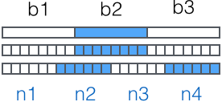

&emsp;&emsp;`Base64`是一种用`64`个字符来表示任意二进制数据的方法。<!--more-->
&emsp;&emsp;用记事本打开`exe`、`jpg`、`pdf`这些文件时，我们都会看到一大堆乱码，因为二进制文件包含很多无法显示和打印的字符。如果要让记事本这样的文本处理软件能处理二进制数据，就需要一个二进制到字符串的转换方法。`Base64`是一种最常见的二进制编码方法。
&emsp;&emsp;`Base64`的原理很简单，首先准备一个包含`64`个字符的数组：

``` python
['A', 'B', 'C', ... 'a', 'b', 'c', ... '0', '1', ... '+', '/']
```

然后对二进制数据进行处理，每`3`个字节一组，一共是`3 * 8 = 24bit`，划为`4`组，每组正好是`6`个`bit`：



这样就得到`4`个数字作为索引，然后查表获得相应的`4`个字符，就是编码后的字符串。所以`Base64`编码会把`3`字节的二进制数据编码为`4`字节的文本数据，长度增加了`33%`，好处是编码后的文本数据可以在邮件正文、网页等直接显示。
&emsp;&emsp;如果要编码的二进制数据不是`3`的倍数，最后会剩下`1`个或`2`个字节怎么办？`Base64`用`\x00`字节在末尾补足后，再在编码的末尾加上`1`个或`2`个`=`号，表示补了多少字节，解码时会自动去掉。
&emsp;&emsp;`Python`内置的`base64`模块可以直接进行`base64`的编解码：

``` python
>>> import base64
>>> base64.b64encode(b'binary\x00string')
b'YmluYXJ5AHN0cmluZw=='
>>> base64.b64decode(b'YmluYXJ5AHN0cmluZw==')
b'binary\x00string'
```

由于标准的`Base64`编码后可能出现字符`+`和`/`，在`URL`中就不能直接作为参数，所以又有一种`url safe`的`base64`编码，其实就是把字符`+`和`/`分别变成`-`和`_`：

``` python
>>> base64.b64encode(b'i\xb7\x1d\xfb\xef\xff')
b'abcd++//'
>>> base64.urlsafe_b64encode(b'i\xb7\x1d\xfb\xef\xff')
b'abcd--__'
>>> base64.urlsafe_b64decode(b'abcd--__')
b'i\xb7\x1d\xfb\xef\xff'
```

还可以自己定义`64`个字符的排列顺序，这样就可以得到定义的`Base64`编码，不过通常情况下完全没有必要。
&emsp;&emsp;`Base64`是一种通过查表的编码方法，不能用于加密，即使使用自定义的编码表也不行。它适用于小段内容的编码，比如数字证书签名、`Cookie`的内容等。