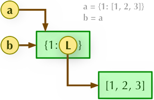
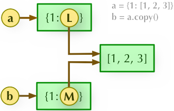
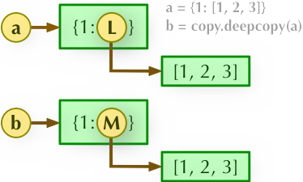

&emsp;&emsp;直接赋值其实就是对象的引用(`别名`)；浅拷贝就是拷贝父对象，不会拷贝对象的内部的子对象；深拷贝(`deepcopy`)借助`copy`模块的`deepcopy`方法，完全拷贝了父对象及其子对象。<!--more-->
&emsp;&emsp;字典浅拷贝实例：

``` python
>>> a = {1: [1,2,3]}
>>> b = a.copy()
>>> a, b
({1: [1, 2, 3]}, {1: [1, 2, 3]})
>>> a[1].append(4)
>>> a, b
({1: [1, 2, 3, 4]}, {1: [1, 2, 3, 4]})
```

深度拷贝需要引入`copy`模块：

``` python
>>> import copy
>>> c = copy.deepcopy(a)
>>> a, c
({1: [1, 2, 3, 4]}, {1: [1, 2, 3, 4]})
>>> a[1].append(5)
>>> a, c
({1: [1, 2, 3, 4, 5]}, {1: [1, 2, 3, 4]})
```

- `b = a`：赋值引用，`a`和`b`都指向同一个对象：



- `b = a.copy()`：浅拷贝，`a`和`b`是一个独立的对象，但它们的子对象还是指向统一对象：



- `b = copy.deepcopy(a)`：深度拷贝，`a`和`b`完全拷贝了父对象及其子对象，两者是完全独立的：



&emsp;&emsp;以下实例使用`copy`模块的`copy.copy`(浅拷贝)和`copy.deepcopy`(深拷贝)：

``` python
import copy

a = [1, 2, 3, 4, ['a', 'b']]  # 原始对象
b = a  # 赋值，传对象的引用
c = copy.copy(a)  # 对象拷贝，浅拷贝
d = copy.deepcopy(a)  # 对象拷贝，深拷贝
a.append(5)  # 修改对象a
a[4].append('c')  # 修改对象a中的['a', 'b']数组对象

print('a = ', a)
print('b = ', b)
print('c = ', c)
print('d = ', d)
```

执行结果：

``` python
a =  [1, 2, 3, 4, ['a', 'b', 'c'], 5]
b =  [1, 2, 3, 4, ['a', 'b', 'c'], 5]
c =  [1, 2, 3, 4, ['a', 'b', 'c']]
d =  [1, 2, 3, 4, ['a', 'b']]
```