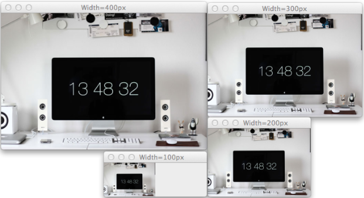
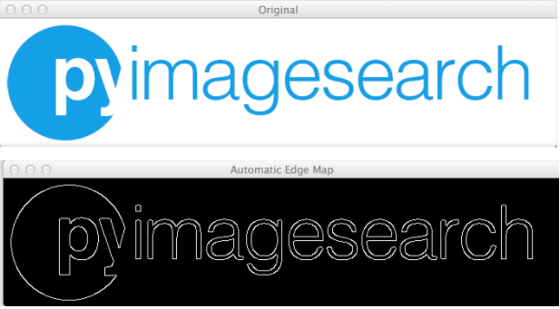

&emsp;&emsp;`imutils`提供一系列进行基本图像处理的便捷功能。<!--more-->

### Translation

&emsp;&emsp;使用`imutils.translate`进行图像的平移：

``` python
# translate the image x=25 pixels to the right and y=75 pixels up
translated = imutils.translate(workspace, 25, -75)
```


### Rotation

&emsp;&emsp;使用`imutils.rotate`进行图像的旋转：

``` python
# loop over the angles to rotate the image
for angle in range(0, 360, 90):
    # rotate the image and display it
    rotated = imutils.rotate(bridge, angle=angle)
    cv2.imshow("Angle=%d" % (angle), rotated)
```


### Resizing

&emsp;&emsp;使用`imutils.resize`调整图像的大小：

``` python
# loop over varying widths to resize the image to
for width in (400, 300, 200, 100):
    # resize the image and display it
    resized = imutils.resize(workspace, width=width)
    cv2.imshow("Width=%dpx" % (width), resized)
```



### Skeletonization

&emsp;&emsp;使用`imutils.skeletonize`提取图像的骨架：

``` python
gray = cv2.cvtColor(logo, cv2.COLOR_BGR2GRAY)
# skeletonize the image
skeleton = imutils.skeletonize(gray, size=(3, 3))
cv2.imshow("Skeleton", skeleton)
```


### 显示Matplotlib图像

&emsp;&emsp;使用`imutils.opencv2matplotlib`显示`Matplotlib`的图像：

``` python
# INCORRECT: show the image without converting color spaces
plt.figure("Incorrect")
plt.imshow(cactus)
# CORRECT: convert color spaces before using plt.imshow
plt.figure("Correct")
plt.imshow(imutils.opencv2matplotlib(cactus))
plt.show()
```


### 检查OpenCV版本

&emsp;&emsp;使用`imutils`检查`OpenCV`的版本：

``` python
print("Your OpenCV version: {}".format(cv2.__version__))
print("Are you using OpenCV 2.X? {}".format(imutils.is_cv2()))
print("Are you using OpenCV 3.X? {}".format(imutils.is_cv3()))
```

执行结果：

``` python
Your OpenCV version: 3.0.0
Are you using OpenCV 2.X? False
Are you using OpenCV 3.X? True
```

### 自动Canny边缘检测

&emsp;&emsp;使用`imutils.auto_canny`进行自动`Canny`边缘检测：

``` python
gray = cv2.cvtColor(logo, cv2.COLOR_BGR2GRAY)
edgeMap = imutils.auto_canny(gray)
cv2.imshow("Original", logo)
cv2.imshow("Automatic Edge Map", edgeMap)
```

