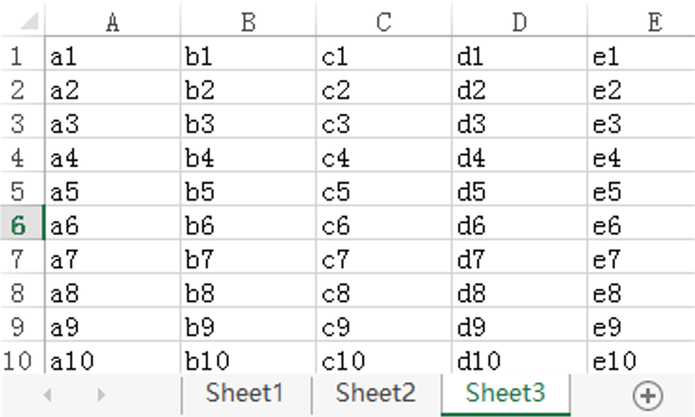
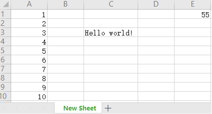

### 基本概念

&emsp;&emsp;在`openpyxl`中，主要用到`3`个概念：<!--more-->

- `Workbook`：一个`excel`工作表。
- `Sheet`：工作表中的一张表页。
- `Cell`：一个格子。

`openpyxl`就是围绕着这`3`个概念进行的：打开`Workbook`，定位`Sheet`，操作`Cell`。

### 读取xlsx

&emsp;&emsp;假设某个`excel`文档里有`Sheet1`、`Sheet2`和`Sheet3`，在`Sheet3`中填入了如下内容：



&emsp;&emsp;代码如下：

``` python
from openpyxl import load_workbook

wb = load_workbook("template.xlsx")
print(wb.sheetnames)  # 执行结果为['Sheet1', 'Sheet2', 'Sheet3']

sheet = wb.get_sheet_by_name("Sheet3")
print(sheet["C"])  # (<Cell Sheet3.C1>, <Cell Sheet3.C2>, <Cell Sheet3.C3>, (省略) <- 第C列
print(sheet["4"])  # (<Cell Sheet3.A4>, <Cell Sheet3.B4>, <Cell Sheet3.C4>, (省略) <- 第4行
print(sheet["C4"].value)  # c4 <- 第C4格的值
print(sheet.max_row)  # 10 <- 最大行数
print(sheet.max_column)  # 5 <- 最大列数

for i in sheet["C"]:
    print(i.value, end=" ")  # c1 c2 c3 c4 c5 c6 c7 c8 c9 c10 <- C列中的所有值
```

### 写入xlsx

&emsp;&emsp;代码如下：

``` python
from openpyxl import Workbook

wb = Workbook()
sheet = wb.active
sheet.title = "New Sheet"
sheet['C3'] = 'Hello world!'

for i in range(10):
    sheet["A%d" % (i + 1)].value = i + 1

sheet["E1"].value = "=SUM(A:A)"
wb.save('保存一个新的excel.xlsx')
```

