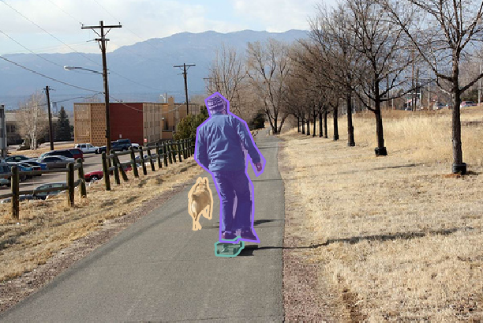
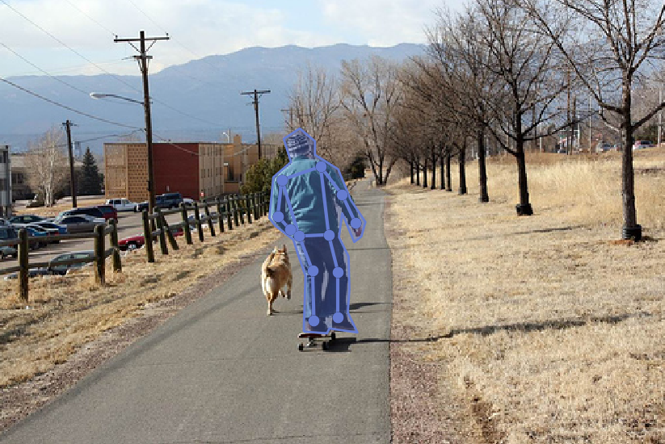

&emsp;&emsp;`COCO` is a large image dataset designed for object detection, segmentation, person keypoints detection, stuff segmentation, and caption generation. This package provides `Matlab`, `Python` and `Lua` `APIs` that assists in loading, parsing, and visualizing the annotations in `COCO`. Please visit `http://cocodataset.org/` for more information on `COCO`, including for the data, paper and tutorials. The exact format of the annotations is also described on the `COCO` website. The `Matlab` and `Python` `APIs` are complete, the `Lua` `API` provides only basic functionality.
&emsp;&emsp;In addition to this `API`, please download both the `COCO` images and annotations in order to run the demos and use the `API`. Both are available on the project website.

- Please download, unzip, and place the images in `coco/images/`.
- Please download and place the annotations in `coco/annotations/`.

For substantially more details on the `API`, please see `http://cocodataset.org/#download`.
&emsp;&emsp;The `COCO` `API` assists in loading, parsing and visualizing annotations in `COCO`. The `API` supports multiple annotation formats. For additional details, see `CocoApi.m`, `coco.py` and `CocoApi.lua` for `Matlab`, `Python` and `Lua` code, respectively, and also the `Python` `API` demo(Throughout the `API`, `ann` is annotation, `cat` is category and `img` is image).

API         | Description
------------|------------
`getAnnIds` | Get `ann` ids that satisfy given filter conditions.
`getCatIds` | Get `cat` ids that satisfy given filter conditions.
`getImgIds` | Get `img` ids that satisfy given filter conditions.
`loadAnns`  | Load anns with the specified ids.
`loadCats`  | Load cats with the specified ids.
`loadImgs`  | Load imgs with the specified ids.
`loadRes`   | Load algorithm results and create `API` for accessing them.
`showAnns`  | Display the specified annotations.

&emsp;&emsp;code one:

``` python
from pycocotools.coco import COCO
​
dataDir = '..'
dataType = 'val2017'
annFile = '{}/annotations/instances_{}.json'.format(dataDir, dataType)
coco = COCO(annFile)  # initialize COCO api for instance annotations
```

The result is:

``` python
loading annotations into memory...
Done (t=0.69s)
creating index...
index created!
```

&emsp;&emsp;code two:

``` python
from pycocotools.coco import COCO
​
dataDir = '..'
dataType = 'val2017'
annFile = '{}/annotations/instances_{}.json'.format(dataDir, dataType)
coco = COCO(annFile)  # initialize COCO api for instance annotations
​
# display COCO categories and supercategories
cats = coco.loadCats(coco.getCatIds())
nms = [cat['name'] for cat in cats]
print('COCO categories: \n{}\n'.format(' '.join(nms)))
​
nms = set([cat['supercategory'] for cat in cats])
print('COCO supercategories: \n{}'.format(' '.join(nms)))
```

The result is:

``` python
COCO categories:
person bicycle car motorcycle airplane bus train truck         \
    boat traffic light fire hydrant stop sign parking meter    \
    bench bird cat dog horse sheep cow elephant bear zebra     \
    giraffe backpack umbrella handbag tie suitcase frisbee     \
    skis snowboard sports ball kite baseball bat baseball      \
    glove skateboard surfboard tennis racket bottle wine       \
    glass cup fork knife spoon bowl banana apple sandwich      \
    orange broccoli carrot hot dog pizza donut cake chair      \
    couch potted plant bed dining table toilet tv laptop       \
    mouse remote keyboard cell phone microwave oven toaster    \
    sink refrigerator book clock vase scissors teddy bear hair \
    drier toothbrush
​
COCO supercategories:
appliance furniture accessory animal sports kitchen \
    electronic indoor person vehicle outdoor food
```

&emsp;&emsp;code three:

``` python
from pycocotools.coco import COCO
import numpy as np
import skimage.io as io
import matplotlib.pyplot as plt
import pylab
​
pylab.rcParams['figure.figsize'] = (8.0, 10.0)
​
dataDir = '..'
dataType = 'val2017'
annFile = '{}/annotations/instances_{}.json'.format(dataDir, dataType)
coco = COCO(annFile)  # initialize COCO api for instance annotations
​
# get all images containing given categories, select one at random
catIds = coco.getCatIds(catNms=['person', 'dog', 'skateboard'])
imgIds = coco.getImgIds(catIds=catIds)
imgIds = coco.getImgIds(imgIds=[324158])
img = coco.loadImgs(imgIds[np.random.randint(0, len(imgIds))])[0]
​
# load and display image, use url to load image
# I = io.imread('%s/images/%s/%s'%(dataDir,dataType,img['file_name']))
I = io.imread(img['coco_url'])
plt.axis('off')
plt.imshow(I)
plt.show()
```


&emsp;&emsp;code four:

``` python
from pycocotools.coco import COCO
import numpy as np
import skimage.io as io
import matplotlib.pyplot as plt
import pylab
​
pylab.rcParams['figure.figsize'] = (8.0, 10.0)
​
dataDir = '..'
dataType = 'val2017'
annFile = '{}/annotations/instances_{}.json'.format(dataDir, dataType)
coco = COCO(annFile)  # initialize COCO api for instance annotations
​
# get all images containing given categories, select one at random
catIds = coco.getCatIds(catNms=['person', 'dog', 'skateboard'])
imgIds = coco.getImgIds(catIds=catIds)
imgIds = coco.getImgIds(imgIds=[324158])
img = coco.loadImgs(imgIds[np.random.randint(0, len(imgIds))])[0]
​
I = io.imread(img['coco_url'])
# load and display instance annotations
plt.imshow(I)
plt.axis('off')
annIds = coco.getAnnIds(imgIds=img['id'], catIds=catIds, iscrowd=None)
anns = coco.loadAnns(annIds)
coco.showAnns(anns)
plt.show()
```



&emsp;&emsp;code five:

``` python
from pycocotools.coco import COCO
import numpy as np
import skimage.io as io
import matplotlib.pyplot as plt
import pylab
​
pylab.rcParams['figure.figsize'] = (8.0, 10.0)
dataDir = '..'
dataType = 'val2017'
# initialize COCO api for person keypoints annotations
annFile = '{}/annotations/person_keypoints_{}.json'.format(dataDir, dataType)
coco_kps = COCO(annFile)
# get all images containing given categories, select one at random
catIds = coco_kps.getCatIds(catNms=['person', 'dog', 'skateboard'])
imgIds = coco_kps.getImgIds(catIds=catIds)
imgIds = coco_kps.getImgIds(imgIds=[324158])
img = coco_kps.loadImgs(imgIds[np.random.randint(0, len(imgIds))])[0]
I = io.imread(img['coco_url'])
# load and display keypoints annotations# load
plt.imshow(I)
annIds = coco_kps.getAnnIds(imgIds=img['id'], catIds=catIds, iscrowd=None)
anns = coco_kps.loadAnns(annIds)
print(anns)
coco_kps.showAnns(anns)
plt.show()
```

The result is：

``` json
[{
    'segmentation': [
        [228.43, 247.9, 229.63, 206.62, 224.24, 191.07, 220.65,
         179.7, 207.49, 169.53, 202.71, 163.55, 205.7, 133.04,
         218.86, 121.68, 213.47, 104.33, 225.44, 96.55, 236.8,
         106.12, 236.8, 116.29, 254.15, 127.06, 263.72, 150.39,
         274.49, 166.54, 271.5, 177.31, 266.12, 181.5, 257.14,
         159.96, 254.75, 177.91, 261.93, 192.27, 262.53, 216.79,
         261.33, 234.14, 268.51, 249.1, 247.57, 246.11, 245.78,
         249.69, 229.03, 248.5]],
    'num_keypoints': 12,
    'area': 5999.5445,
    'iscrowd': 0,
    'keypoints': [
        0, 0, 0, 0, 0, 0, 0, 0, 0, 0, 0, 0, 0, 0, 0, 212, 135, 2,
        241, 125, 2, 209, 162, 2, 257, 146, 2, 218, 172, 2, 267,
        167, 2, 225, 177, 2, 247, 176, 2, 235, 203, 2, 254, 204,
        2, 236, 240, 2, 254, 238, 2],
    'image_id': 324158,
    'bbox': [202.71, 96.55, 71.78, 153.14],
    'category_id': 1,
    'id': 2162813
}]
```



&emsp;&emsp;code six:

``` python
from pycocotools.coco import COCO
import numpy as np
import skimage.io as io
import matplotlib.pyplot as plt
import pylab
​
pylab.rcParams['figure.figsize'] = (8.0, 10.0)
dataDir = '..'
dataType = 'val2017'
# initialize COCO api for caption annotations
annFile = '{}/annotations/captions_{}.json'.format(dataDir, dataType)
coco = COCO(annFile)
imgIds = coco.getImgIds(imgIds=[324158])
img = coco.loadImgs(imgIds[np.random.randint(0, len(imgIds))])[0]
# load and display caption annotations
annIds = coco.getAnnIds(imgIds=img['id'])
anns = coco.loadAnns(annIds)
coco.showAnns(anns)
```

The result is:

``` python
A man is skate boarding down a path and a dog is running by his side.
A man on a skateboard with a dog outside.
A person riding a skate board with a dog following beside.
This man is riding a skateboard behind a dog.
A man walking his dog on a quiet country road.
```

---

&emsp;&emsp;将人体关键点数据存储为`csv`文件：

``` python
from pycocotools.coco import COCO
import csv
​
dataDir = '..'
dataType = 'train2017'
# initialize COCO api for person keypoints annotations
annFile = '{}/annotations/person_keypoints_{}.json'.format(dataDir, dataType)
coco_kps = COCO(annFile)
​
# display COCO categories and supercategories
cats = coco_kps.loadCats(coco_kps.getCatIds())
nms = [cat['name'] for cat in cats]
print('COCO categories: \n{}\n'.format(' '.join(nms)))
​
nms = set([cat['supercategory'] for cat in cats])
print('COCO supercategories: \n{}'.format(' '.join(nms)))
​
# get all images containing given categories, select one at random
catIds = coco_kps.getCatIds(catNms=['person'])
imgIds = coco_kps.getImgIds(catIds=catIds)
print('there are %d images containing human' % len(imgIds))
​
def getBndboxKeypointsGT():
    csvFile = open('./KeypointBndboxGT.csv', 'w')
    keypointsWriter = csv.writer(csvFile)
    firstRow = [
        'imageName', 'personNumber', 'bndbox', 'nose',
        'left_eye', 'right_eye', 'left_ear', 'right_ear', 'left_shoulder', 'right_shoulder',
        'left_elbow', 'right_elbow', 'left_wrist', 'right_wrist', 'left_hip', 'right_hip',
        'left_knee', 'right_knee', 'left_ankle', 'right_ankle']

    keypointsWriter.writerow(firstRow)

    for i in range(len(imgIds)):
        imageNameTemp = coco_kps.loadImgs(imgIds[i])[0]
        imageName = imageNameTemp['file_name'].encode('raw_unicode_escape')
        img = coco_kps.loadImgs(imgIds[i])[0]
        annIds = coco_kps.getAnnIds(imgIds=img['id'], catIds=catIds, iscrowd=None)
        anns = coco_kps.loadAnns(annIds)
        personNumber = len(anns)

        for j in range(personNumber):
            bndbox = anns[j]['bbox']
            keyPoints = anns[j]['keypoints']
            keypointsRow = [
                imageName, str(personNumber),
                str(bndbox[0]) + '_' + str(bndbox[1]) + '_' + str(bndbox[2]) + '_' + str(bndbox[3]),
                str(keyPoints[0]) + '_' + str(keyPoints[1]) + '_' + str(keyPoints[2]),
                str(keyPoints[3]) + '_' + str(keyPoints[4]) + '_' + str(keyPoints[5]),
                str(keyPoints[6]) + '_' + str(keyPoints[7]) + '_' + str(keyPoints[8]),
                str(keyPoints[9]) + '_' + str(keyPoints[10]) + '_' + str(keyPoints[11]),
                str(keyPoints[12]) + '_' + str(keyPoints[13]) + '_' + str(keyPoints[14]),
                str(keyPoints[15]) + '_' + str(keyPoints[16]) + '_' + str(keyPoints[17]),
                str(keyPoints[18]) + '_' + str(keyPoints[19]) + '_' + str(keyPoints[20]),
                str(keyPoints[21]) + '_' + str(keyPoints[22]) + '_' + str(keyPoints[23]),
                str(keyPoints[24]) + '_' + str(keyPoints[25]) + '_' + str(keyPoints[26]),
                str(keyPoints[27]) + '_' + str(keyPoints[28]) + '_' + str(keyPoints[29]),
                str(keyPoints[30]) + '_' + str(keyPoints[31]) + '_' + str(keyPoints[32]),
                str(keyPoints[33]) + '_' + str(keyPoints[34]) + '_' + str(keyPoints[35]),
                str(keyPoints[36]) + '_' + str(keyPoints[37]) + '_' + str(keyPoints[38]),
                str(keyPoints[39]) + '_' + str(keyPoints[40]) + '_' + str(keyPoints[41]),
                str(keyPoints[42]) + '_' + str(keyPoints[43]) + '_' + str(keyPoints[44]),
                str(keyPoints[45]) + '_' + str(keyPoints[46]) + '_' + str(keyPoints[47]),
                str(keyPoints[48]) + '_' + str(keyPoints[49]) + '_' + str(keyPoints[50]),]
​
            keypointsWriter.writerow(keypointsRow)

    csvFile.close()
​
if __name__ == "__main__":
    print('Writing bndbox and keypoints to csv files..."')
    getBndboxKeypointsGT()
```