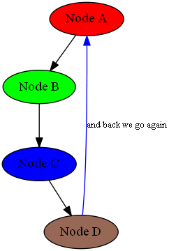

&emsp;&emsp;`pydot`是`GraphViz`图形库的`Python`接口，因此需要首先安装`GraphViz`。<!--more-->

### 代码实例1

&emsp;&emsp;代码如下：

``` python
import pydot

graph = pydot.Dot(graph_type='graph')

for i in range(3):
    edge = pydot.Edge("king", "lord%d" % i)
    graph.add_edge(edge)

vassal_num = 0

for i in range(3):
    for j in range(2):
        edge = pydot.Edge("lord%d" % i, "vassal%d" % vassal_num)
        graph.add_edge(edge)
        vassal_num += 1

graph.write_png('example1_graph.png')
```


### 代码实例2

&emsp;&emsp;代码如下:

``` python
import pydot

graph = pydot.Dot(graph_type='digraph')
node_a = pydot.Node("Node A", style="filled", fillcolor="red")
node_b = pydot.Node("Node B", style="filled", fillcolor="green")
node_c = pydot.Node("Node C", style="filled", fillcolor="#0000ff")
node_d = pydot.Node("Node D", style="filled", fillcolor="#976856")

graph.add_node(node_a)
graph.add_node(node_b)
graph.add_node(node_c)
graph.add_node(node_d)

graph.add_edge(pydot.Edge(node_a, node_b))
graph.add_edge(pydot.Edge(node_b, node_c))
graph.add_edge(pydot.Edge(node_c, node_d))
graph.add_edge(pydot.Edge(node_d, node_a, label="and back we go again", \
                          labelfontcolor="#009933", fontsize="10.0", color="blue"))
graph.write_png('example2_graph.png')
```

