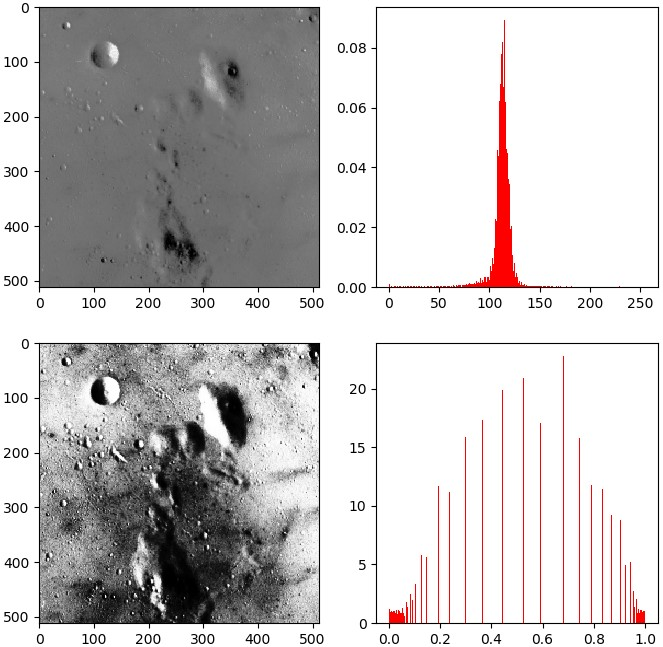

&emsp;&emsp;`scikit-image`是基于`scipy`的一款图像处理包，它将图片作为`numpy`数组进行处理。可以使用`pip`进行安装：

``` bash
pip install scikit-image
```

### skimage库子模块

&emsp;&emsp;`skimage`包含了很多子模块，各个子模块具有不同的功能：

子模块名称      | 实现功能
---------------|------------
`io`           | 读取、保存以及显示图片和视频
`color`        | 颜色空间变换
`data`         | 提供一些测试图片和样本数据
`filters`      | 图像增强的模块，例如边缘检测、自动阈值
`draw`         | 操作于`numpy`数组上的基本图形绘制，包括线条、矩阵、圆和文本等
`transform`    | 几何变换和其他变换，例如旋转、拉伸和`Radon`变换
`exposure`     | 图像强度调整，例如直方图均衡化
`feature`      | 特征检测和提取，例如纹理分析
`graph`        | 图论操作，例如最短路径
`measure`      | 图像属性测量，例如相似度和轮廓
`morphology`   | 形态学操作，例如开闭运算、骨架提取
`novice`       | 简化的用于教学目的的接口
`restoration`  | 修复算法，例如去卷积算法、去噪
`segmentation` | 图像分割为多个区域
`util`         | 通用工具
`viewer`       | 简单图形用户界面，用于可视化结果

### skimage操作

#### 图像读取与显示

&emsp;&emsp;`skimage`的`io`模块提供了图像读取、保存与显示等功能，`data`模块包含了一些示例图片。从外部读取图片并显示：

``` python
skimage.io.imread(fname)  # 读取fname指定的图片
skimage.io.imshow(arr)  # 显示arr数组表示的图片
```

示例代码：

``` python
from skimage import io

img = io.imread('cat.png')
io.imshow(img)
io.show()  # 不要忘记这一句
```


以灰度图的形式读取时，使用函数`skimage.io.imread(fname, as_grey=True)`，参数`fname`表示要显示的图片路径：

``` python
from skimage import io

img = io.imread('./cat.png', as_grey=True)
io.imshow(img)
io.show()
```


#### skimage自带图片

&emsp;&emsp;自带图片如下：

图片名称                | 说明
-----------------------|-----
`astronaut`            | 宇航员
`binary_blobs`         | 二元斑点
`camera`               | 相机
`checkerboard`         | 棋盘
`chelsea`              | 猫
`clock`                | 时钟
`coffee`               | 一杯咖啡
`coins`                | 硬币
`horse`                | 马
`hubble_deep_field`    | 星空
`immunohistochemistry` | 结肠图片
`logo`                 | 商标
`moon`                 | 月球表面
`page`                 | 书页内容
`rocket`               | 火箭
`text`                 | 文字图片

示例代码：

``` python
from skimage import io, data

img = data.hubble_deep_field()
io.imshow(img)
io.show()
```


图片名就是对应的函数名，如`camera`图片对应的函数名为`data.camera()`。这些图片存储在`skimage`的安装目录下，可以通过`data_dir`把路径打印出来：

``` python
from skimage import data_dir
print(data_dir)
```

#### 保存图片

&emsp;&emsp;使用`io.imsave(fname, arr)`函数对图片进行保存，参数`fname`表示保存的路径和名称，参数`arr`表示需要保存的数组变量：

``` python
from skimage import io, data

img = data.checkerboard()
io.imshow(img)
io.imsave('checkerboard_copy.jpg', img)
```

这样就在当前的工作目录下增加了一个`checkerboard_copy.jpg`文件。保存图片同时也起到了转换格式的作用，若读取的是`png`格式图片，当保存为`jpg`时，则图片从`png`格式转换为`jpg`格式。

#### 获取图片信息

&emsp;&emsp;代码如下：

``` python
from skimage import io, data

img = data.chelsea()
io.imshow(img)
io.show()
print(type(img))  # 类型
print(img.shape)  # 形状
print(img.shape[0])  # 图片宽度
print(img.shape[1])  # 图片高度
print(img.shape[2])  # 图片通道数
print(img.size)  # 显示总像素个数
print(img.max())  # 最大像素值
print(img.min())  # 最小像素值
print(img.mean())  # 像素平均值
```

#### 图像像素访问与裁剪

&emsp;&emsp;图片读入程序后，以`numpy`数组方式存储，因此对`numpy`数组的操作，都可以用于图片数组。对数组元素的访问，实际上就是对图片像素点的访问。对彩色图片的像素点访问方式如下：

``` python
img[i, j, c]
```

`i`表示图片的行数，`j`表示图片的列数，`c`表示图片的通道数(`RGB`三通道分别对应`0`、`1`和`2`)，坐标从左上角开始。
&emsp;&emsp;对灰度图片的像素点访问方式如下：

``` python
gray[i, j]
```

例如输出`data`中宇航员图片第`20`行第`10`列的`B`通道数值：

``` python
from skimage import data

img = data.astronaut()
pixel = img[20, 10, 2]
print(pixel)  # 输出“69”
```

显示图片的红色单通道如下：

``` python
from skimage import io, data

img = data.astronaut()
R = img[:, :, 0]
io.imshow(R)
io.show()
```


#### 像素修改

&emsp;&emsp;例如对宇航员图片随机添加椒盐噪声：

``` python
from skimage import io, data
import numpy as np

img = data.astronaut()
rows, cols, dims = img.shape

for i in range(5000):  # 随机生成5000个椒盐点
    x = np.random.randint(0, rows)
    y = np.random.randint(0, cols)
    img[x, y, :] = 255

io.imshow(img)
io.show()
```


#### 图片裁剪

&emsp;&emsp;由于图片是以`numpy`数组进行存储，因此对于数组的裁剪，就是对图片的裁剪。例如对宇航员图片进行裁剪：

``` python
from skimage import io, data

img = data.astronaut()
partial_img = img[50:150, 170:270, :]
io.imshow(partial_img)
io.show()
```


对多个像素点进行操作时，使用数组切片方式进行访问：

``` python
img[i, :] = im[j, :]  # 将第j行的数值赋值给第i行
img[:, i] = 100  # 将第i列的所有数值设为100
img[:100, :50].sum()  # 计算前100行、前50列所有数值的和
img[50:100, 50:100]  # 第50至100行，第50至100列(不包括第100行和第100列)
img[i].mean()  # 第i行所有数值的平均值
img[:, -1]  # 最后一列
img[-2, :] (or im[-2])  # 倒数第二行
```

将宇航员图片进行二值化，像素值大于`128`的变为`1`，否则变为`0`：

``` python
from skimage import io, data, color

img = data.astronaut()
img_gray = color.rgb2gray(img)
rows, cols = img_gray.shape

for i in range(rows):
    for j in range(cols):
        if (img_gray[i, j] <= 0.5):
            img_gray[i, j] = 0
        else:
            img_gray[i, j] = 1

io.imshow(img_gray)
io.show()
```


使用`color`模块的`rgb2gray`函数，将彩色三通道图片转换为灰度图片，转换结果为`float64`类型的数组，范围在`[0, 1]`之间。
&emsp;&emsp;对`R`通道的数值进行修改：

``` python
from skimage import io, data

img = data.astronaut()
img_idx_modified = img[:, :, 0] > 170
print(img_idx_modified)
img[img_idx_modified] = [0, 255, 0]
io.imshow(img)
io.show()
```


这个例子先对`R`通道的所有像素值进行判断，如果大于`170`，则将这个地方的像素值变为`[0, 255, 0]`，即`G`通道值为`255`，`R`和`B`通道值为`0`。

### 图像数据类型以及颜色空间转换

#### 图像数据类型

&emsp;&emsp;在`skimage`中，一张图片以`numpy`数组形式存储，数组的数据类型有很多中，相互之间可以转换。数据类型以及取值范围如下：

数据类型   | 数值范围
----------|----------
`uint8`   | `0` to `255`
`uint16`  | `0` to `65535`
`uint32`  | `0` to `2^32 - 1`
`float16` | 半精度浮点数：`16`位，正负号`1`位，指数`5`位，精度`10`位
`float32` | 单精度浮点数：`32`位，正负号`1`位，指数`8`位，精度`23`位
`float64` | 双精度浮点数：`64`位，正负号`1`位，指数`11`位，精度`52`位
`float`   | `-1` to `1` or `0` to `1`
`int8`    | `-128` to `127`
`int16`   | `-32768` to `32767`
`int32`   | `-2^31` to `2^32 - 1`

一张图片的像素值范围是`[0, 255]`，因此默认类型是`unit8`，可用如下代码查看数据类型：

``` python
from skimage import io, data

img = data.astronaut()
print(img.dtype.name)  # 输出“uint8”
```

在上面的表中，特别注意的是`float`类型，它的范围是`[-1, 1]`或`[0, 1]`之间。一张彩色图片转换为灰度图后，它的类型就由`unit8`变成了`float`。
&emsp;&emsp;`uint8`转为`float`如下：

``` python
from skimage import data, img_as_float

img = data.astronaut()
print(img.dtype.name)  # 输出“uint8”
dst = img_as_float(img)
print(dst.dtype.name)  # 输出“float64”
```

`float`转为`uint8`如下：

``` python
from skimage import img_as_ubyte
import numpy as np

img = np.array([0, 0.5, 1], dtype=float)
print(img.dtype.name)  # 输出“float64”
dst = img_as_ubyte(img)
print(dst.dtype.name)  # 输出“uint8”
```

`float`转为`uint8`可能会造成数据损失，因此会有警告。除了如上两种转换以外，还有其他的一些类型转换：

函数名          | 描述
---------------|-----
`img_as_float` | Convert to `64-bit` floating point
`img_as_ubyte` | Convert to `8-bit` uint
`img_as_uint`  | Convert to `16-bit` uint
`img_as_int`   | Convert to `16-bit` int

#### 颜色空间及转换

&emsp;&emsp;除了直接转换可以改变数据类型外，还可以通过图像的颜色空间转换来改变数据类型。常用的颜色空间有灰度空间、`rgb`空间、`hsv`空间和`cmyk`空间。颜色空间转换以后，图片类型都变成了`float`型。
&emsp;&emsp;所有的颜色空间转换函数都放在`skimage`的`color`模块内。例如`RGB`转为灰度图：

``` python
from skimage import io, data, color

img = data.camera()
gray = color.rgb2gray(img)
io.imshow(gray)
io.show()
```


其它转换的用法都是一样的：

``` python
skimage.color.rgb2grey(rgb)
skimage.color.rgb2hsv(rgb)
skimage.color.rgb2lab(rgb)
skimage.color.gray2rgb(image)
skimage.color.hsv2rgb(hsv)
skimage.color.lab2rgb(lab)
```

实际上，上面的所有转换函数都可以用一个函数来代替：

``` python
skimage.color.convert_colorspace(arr, fromspace, tospace)
```

表示将`arr`从`fromspace`颜色空间转换到`tospace`颜色空间。
&emsp;&emsp;`RGB`转为`HSV`如下：

``` python
from skimage import io, data, color

img = data.coffee()
hsv = color.convert_colorspace(img, 'RGB', 'HSV')
io.imshow(hsv)
io.show()
```


在`color`模块的颜色空间转换函数中，还有一个比较有用的函数是`skimage.color.label2rgb(arr)`，可以根据标签值对图片进行着色。以后的图片分类后着色就可以用这个函数。例如将`coffee`图片分成三类，然后用默认颜色对三类进行着色：

``` python
from skimage import io, data, color
import numpy as np

img = data.coffee()
gray = color.rgb2gray(img)
rows, cols = gray.shape
labels = np.zeros([rows, cols])

for i in range(rows):
    for j in range(cols):
        if (gray[i, j] < 0.4):
            labels[i, j] = 0
        elif (gray[i, j] < 0.75):
            labels[i, j] = 1
        else:
            labels[i, j] = 2

dst = color.label2rgb(labels)
io.imshow(dst)
io.show()
```


### 图像的批量处理

&emsp;&emsp;有时我们不仅要对一张图片进行处理，可能还会对一批图片处理。这时我们可以通过循环来执行处理，也可以调用程序自带的图片集合来处理。图片集合函数为：

``` python
skimage.io.ImageCollection(load_pattern, load_func=None)
```

该函数的第一个参数`load_pattern`表示图片组的路径，可以是一个`str`字符串；第二个参数`load_func`是一个回调函数，我们对图片进行批量处理就可以通过这个回调函数实现。回调函数默认为`imread`，即默认这个函数是批量读取图片。

``` python
import skimage.io as io
from skimage import data_dir

str = data_dir + '/*.png'
coll = io.ImageCollection(str)
print(len(coll))
```

显示结果为`28`，说明系统自带了`25`张`png`的示例图片。这些图片都读取了出来，放在图片集合`coll`里。如果我们想显示其中一张图片，则可以在后面加上代码：

``` python
io.imshow(coll[10])
io.show()
```


&emsp;&emsp;如果一个文件夹里，我们既存放了一些`jpg`格式的图片，又存放了一些`png`格式的图片。现在想把它们全部读取出来，可以采用如下方式：

``` python
import skimage.io as io

str = 'd:/pic/*.jpg:d:/pic/*.png'
coll = io.ImageCollection(str)
print(len(coll))
```

注意字符串`d:/pic/*.jpg:d:/pic/*.png`，它是两个字符串合在一起，第一个是`d:/pic/*.jpg`，第二个是`d:/pic/*.png`，合在一起后，中间用冒号来隔开，这样就可以把`d:/pic/`文件夹下的`jpg`和`png`格式的图片都读取出来。如果还想读取存放在其它地方的图片，也可以一并加进去，只是中间同样用冒号来隔开。
&emsp;&emsp;`io.ImageCollection`默认的第二个参数就是批量读取。如果我们不是想批量读取，而是其它批量操作(如批量转换为灰度图)，又该怎么做呢？那就需要先定义一个函数，然后将这个函数作为第二个参数：

``` python
from skimage import data_dir, io, color

def convert_gray(f):
    rgb = io.imread(f)
    return color.rgb2gray(rgb)

str = data_dir + '/*.png'
coll = io.ImageCollection(str, load_func=convert_gray)
io.imshow(coll[10])
io.show()
```


得到图片集合以后，我们还可以将这些图片连接起来，构成一个维度更高的数组。连接图片的函数为：

``` python
skimage.io.concatenate_images(ic)
```

该函数的参数就是以上的图片集合：

``` python
from skimage import io

coll = io.ImageCollection('d:/pic/*.jpg')
mat = io.concatenate_images(coll)
```

使用`concatenate_images(ic)`函数的前提是读取的这些图片尺寸必须一致，否则会出错。我们看看图片连接前后的维度变化：

``` python
from skimage import io

coll = io.ImageCollection('d:/pic/*.jpg')
print(len(coll))  # 连接的图片数量
print(coll[0].shape)  # 连接前的图片尺寸，所有的都一样
mat = io.concatenate_images(coll)
print(mat.shape)  # 连接后的数组尺寸
```

执行结果：

``` python
2
(870, 580, 3)
(2, 870, 580, 3)
```

可以看到，将`2`个`3`维数组连接成了一个`4`维数组。如果我们对图片进行批量操作后，想把操作后的结果保存起来，也是可以办到的。
&emsp;&emsp;把系统自带的所有`png`示例图片全部转换成`256 * 256`的`jpg`格式灰度图，保存在`d:/data/`文件夹下。改变图片的大小可以使用`tranform`模块的`resize`函数：

``` python
from skimage import data_dir, io, transform, color

def convert_gray(f):
    rgb = io.imread(f)  # 依次读取rgb图片
    gray = color.rgb2gray(rgb)  # 将rgb图片转换成灰度图
    dst = transform.resize(gray, (256, 256))  # 将灰度图片大小转换为“256*256”
    return dst

image_list = data_dir + '/*.png'
coll = io.ImageCollection(image_list, load_func=convert_gray)

for i in range(len(coll)):
    io.imsave('d:/data/' + str(i) + '.jpg', coll[i])  # 循环保存图片
```

### 图像的形变与缩放

&emsp;&emsp;图像的形变与缩放使用的是`skimage`的`transform`模块。

#### 改变图片尺寸resize

&emsp;&emsp;函数原型如下：

``` python
skimage.transform.resize(image, output_shape)
```

参数`image`是需要改变尺寸的图片，`output_shape`是新的图片尺寸。

``` python
from skimage import transform, data
import matplotlib.pyplot as plt

img = data.camera()
dst = transform.resize(img, (80, 60))
plt.figure('resize')
plt.subplot(121)
plt.title('before resize')
plt.imshow(img, plt.cm.gray)
plt.subplot(122)
plt.title('before resize')
plt.imshow(dst, plt.cm.gray)
plt.show()
```

将`camera`图片由原来的`512 * 512`变成了`80 * 60`大小，从下图中的坐标尺就能够看出来：


#### 按比例缩放rescale

&emsp;&emsp;函数原型如下：

``` python
skimage.transform.rescale(image, scale[, ...])
```

参数`scale`可以是单个`float`数，表示长和宽缩放的倍数；也可以是一个`float`型的`tuple`(例如`[0.2, 0.5]`)，将行列分别进行缩放：

``` python
from skimage import transform, data

img = data.camera()
print(img.shape)  # 图片原始大小
print(transform.rescale(img, 0.1).shape)  # 长和宽缩小为原来图片大小的0.1
print(transform.rescale(img, [0.5, 0.25]).shape)  # 行缩小为原来图片的一半，列为四分之一
print(transform.rescale(img, 2).shape)  # 长和宽放大为原来图片大小的2倍
```

执行结果：

``` python
(512, 512)
(51, 51)
(256, 128)
(1024, 1024)
```

#### 旋转rotate

&emsp;&emsp;函数原型如下：

``` python
skimage.transform.rotate(image, angle[, ...], resize = False)
```

参数`angle`是一个`float`类型数，表示旋转的度数；参数`resize`用于控制在旋转时是否改变大小。

``` python
from skimage import transform, data
import matplotlib.pyplot as plt

img = data.camera()
print(img.shape)  # 图片原始大小
img1 = transform.rotate(img, 60)  # 旋转90度，不改变大小
print(img1.shape)
img2 = transform.rotate(img, 30, resize=True)  # 旋转30度，同时改变大小
print(img2.shape)
plt.figure('resize')
plt.subplot(121)
plt.title('rotate 60')
plt.imshow(img1, plt.cm.gray)
plt.subplot(122)
plt.title('rotate 30')
plt.imshow(img2, plt.cm.gray)
plt.show()
```

执行结果：

``` python
(512, 512)
(512, 512)
(700, 700)
```


### 图像金字塔

&emsp;&emsp;以多分辨率来解释图像的一种有效但概念简单的结构就是图像金字塔。图像金字塔最初用于机器视觉和图像压缩，一幅图像的金字塔是一系列以金字塔形状排列的分辨率逐步降低的图像集合。金字塔的底部是待处理图像的高分辨率表示，而顶部是低分辨率的近似。当向金字塔的上层移动时，尺寸和分辨率就降低。
&emsp;&emsp;在此我们举一个高斯金字塔的应用实例，函数原型为：

``` python
skimage.transform.pyramid_gaussian(image, downscale=2)
```

`downscale`控制着金字塔的缩放比例。

``` python
import numpy as np
import matplotlib.pyplot as plt
from skimage import data, transform

image = data.astronaut()  # 载入宇航员图片
rows, cols, dim = image.shape  # 获取图片的行数、列数和通道数
# 产生高斯金字塔图像，共生成了“log(512) = 9”幅金字塔图像，加上原始图像共10幅
pyramid = tuple(transform.pyramid_gaussian(image, downscale=2))
composite_image = np.ones((rows, cols + cols // 2, 3), dtype=np.float)  # 生成背景
composite_image[:rows, :cols, :] = pyramid[0]  # 融合原始图像
i_row = 0

for p in pyramid[1:]:
    n_rows, n_cols = p.shape[:2]
    composite_image[i_row:i_row + n_rows, cols:cols + n_cols] = p  # 循环融合9幅金字塔图像
    i_row += n_rows

plt.imshow(composite_image)
plt.show()
```


上图就是`10`张金字塔图像，下标为`0`的表示原始图像，后面每层的图像行和列变为上一层的一半，直至变为`1`。

### 对比度与亮度调整

&emsp;&emsp;图像亮度与对比度的调整是放在`skimage`的`exposure`模块里面。

#### gamma调整

&emsp;&emsp;原理是`I = I * g`，对原图像的像素进行幂运算，得到新的像素值，公式中的`g`就是`gamma`值。如果`gamma > 1`，新图像比原图像暗；如果`gamma < 1`，新图像比原图像亮。

``` python
skimage.exposure.adjust_gamma(image, gamma=1)
```

参数`gamma`默认为`1`，即原图像不发生变化。

``` python
from skimage import data, exposure, img_as_float
import matplotlib.pyplot as plt

image = img_as_float(data.moon())
gam1 = exposure.adjust_gamma(image, 2)  # 调暗
gam2 = exposure.adjust_gamma(image, 0.5)  # 调亮
plt.figure('adjust_gamma', figsize=(8, 8))
plt.subplot(131)
plt.title('origin image')
plt.imshow(image, plt.cm.gray)
plt.axis('off')
plt.subplot(132)
plt.title('gamma = 2')
plt.imshow(gam1, plt.cm.gray)
plt.axis('off')
plt.subplot(133)
plt.title('gamma = 0.5')
plt.imshow(gam2, plt.cm.gray)
plt.axis('off')
plt.show()
```


#### log对数调整

&emsp;&emsp;这个函数刚好和`gamma`相反，原理是`I = log(I)`：

``` python
from skimage import data, exposure, img_as_float
import matplotlib.pyplot as plt

image = img_as_float(data.moon())
gam1 = exposure.adjust_log(image)  # 对数调整
plt.figure('adjust_gamma', figsize=(8, 8))
plt.subplot(121)
plt.title('origin image')
plt.imshow(image, plt.cm.gray)
plt.axis('off')
plt.subplot(122)
plt.title('log')
plt.imshow(gam1, plt.cm.gray)
plt.axis('off')
plt.show()
```


#### 判断图像对比度是否偏低

&emsp;&emsp;函数是`is_low_contrast(img)`，返回一个`bool`型值：

``` python
from skimage import data, exposure

image = data.moon()
result = exposure.is_low_contrast(image)
print(result)  # 输出“False”
```

#### 调整强度

&emsp;&emsp;函数原型如下：

``` python
skimage.exposure.rescale_intensity(image, in_range='image', out_range='dtype')
```

参数`in_range`表示输入图片的强度范围，默认为`image`，表示用图像的最大和最小像素值作为范围；参数`out_range`表示输出图片的强度范围，默认为`dtype`，表示用图像的类型的最大和最小值作为范围。默认情况下，输入图片的`[min, max]`范围被拉伸到`[dtype.min, dtype.max]`，如果`dtype=uint8`，那么`dtype.min`为`0`，`dtype.max`为`255`。

``` python
import numpy as np
from skimage import exposure

image = np.array([51, 102, 153], dtype=np.uint8)
mat = exposure.rescale_intensity(image)
print(mat)  # 输出“[0 127 255]”
```

即像素最小值由`51`变为`0`，最大值由`153`变为`255`，整体进行了拉伸，但是数据类型没有变，还是`uint8`。
&emsp;&emsp;前面我们讲过，可以通过`img_as_float`函数将`unit8`类型转换为`float`型，实际上还有更简单的方法，就是乘以`1.0`：

``` python
import numpy as np

image = np.array([51, 102, 153], dtype=np.uint8)
print(image * 1.0)  # 输出“[ 51. 102. 153.]”
```

而`float`类型的范围是`[0, 1]`，因此对`float`进行`rescale_intensity`调整后，范围变为`[0, 1]`，而不是`[0, 255]`：

``` python
import numpy as np
from skimage import exposure

image = np.array([51, 102, 153], dtype=np.uint8)
tmp = image * 1.0
mat = exposure.rescale_intensity(tmp)
print(mat)  # 输出“[0.  0.5 1. ]”
```

如果原始像素值不想被拉伸，只是等比例缩小，就使用`in_range`参数：

``` python
import numpy as np
from skimage import exposure

image = np.array([51, 102, 153], dtype=np.uint8)
tmp = image * 1.0
mat = exposure.rescale_intensity(tmp, in_range=(0, 255))
print(mat)  # 输出“[0.2 0.4 0.6]”，即原像素值除以255
```

如果参数`in_range`的范围要比原始像素值的范围`[min, max]`大或者小，那就进行裁剪：

``` python
mat = exposure.rescale_intensity(tmp, in_range=(0, 102))
print(mat)  # 输出“[0.5 1.  1. ]”，即原像素值除以102，超出1的变为1
```

如果一个数组里面有负数，现在想调整到正数，就使用`out_range`参数：

``` python
import numpy as np
from skimage import exposure

image = np.array([-10, 0, 10], dtype=np.int8)
mat = exposure.rescale_intensity(image, out_range=(0, 127))
print(mat)  # 输出“[  0  63 127]”
```

### 直方图与均衡化

&emsp;&emsp;在`skimage`中，对直方图的处理是放在`exposure`模块中。

#### 计算直方图

&emsp;&emsp;函数原型如下：

``` python
skimage.exposure.histogram(image, nbins=256)
```

`numpy`也提供了一个计算直方图的函数`histogram`，两者大同小义。该函数返回一个`tuple(hist, bins_center)`，前一个数组是直方图的统计量，后一个数组是每个`bin`的中间值。

``` python
import numpy as np
from skimage import exposure, data

image = data.camera() * 1.0
hist1 = np.histogram(image, bins=2)  # 用numpy计算直方图
hist2 = exposure.histogram(image, nbins=2)  # 用skimage计算直方图
print(hist1)
print(hist2)
```

执行结果：

``` python
(array([107432, 154712], dtype=int64), array([  0. , 127.5, 255. ]))
(array([107432, 154712], dtype=int64), array([ 63.75, 191.25]))
```

每个`bin`的统计量是一样的，但`numpy`返回的是每个`bin`的两端的范围值，而`skimage`返回的是每个`bin`的中间值。

#### 绘制直方图

&emsp;&emsp;绘图可以调用`matplotlib.pyplot`库来进行，其中的`hist`函数可以直接绘制直方图：

``` python
n, bins, patches = plt.hist(arr, bins=10, normed=0, facecolor='black', \
                            edgecolor='black', alpha=1, histtype='bar')
```

- `arr`: 显示直方图的一维数组。
- `bins`: 直方图的柱数。
- `normed`: 是否将得到的直方图向量归一化。
- `facecolor`: 直方图颜色。
- `edgecolor`: 直方图边框颜色。
- `alpha`: 透明度。
- `histtype`: 直方图类型，例如`bar`、`barstacked`、`step`和`stepfilled`。

返回值如下：

- `n`: 直方图向量，是否归一化由参数`normed`设定。
- `bins`: 返回各个`bin`的区间范围。
- `patches`: 返回每个`bin`里面包含的数据，是一个`list`。

``` python
from skimage import data
import matplotlib.pyplot as plt

img = data.camera()
plt.figure("hist")
arr = img.flatten()
n, bins, patches = plt.hist(arr, bins=256, normed=1, edgecolor='None', facecolor='red')
plt.show()
```


其中的`flatten`是`numpy`中的函数，用于将多维数组序列化成一维数组。

#### 彩色图片三通道直方图

&emsp;&emsp;一般来说直方图都是针对灰度图的，如果要画`rgb`图像的三通道直方图，实际上就是三个直方图的叠加：

``` python
from skimage import data
import matplotlib.pyplot as plt

img = data.coffee()
ar = img[:, :, 0].flatten()
plt.hist(ar, bins=256, normed=1, facecolor='r', edgecolor='r', hold=1)
ag = img[:, :, 1].flatten()
plt.hist(ag, bins=256, normed=1, facecolor='g', edgecolor='g', hold=1)
ab = img[:, :, 2].flatten()
plt.hist(ab, bins=256, normed=1, facecolor='b', edgecolor='b')
plt.show()
```

其中加一个参数`hold = 1`，表示可以叠加：


#### 直方图均衡化

&emsp;&emsp;如果一幅图像的像素占有很多的灰度级而且分布均匀，那么这样的图像往往有高对比度和多变的灰度色调。直方图均衡化就是一种能仅靠输入图像直方图信息自动达到这种效果的变换函数。

``` python
from skimage import data, exposure
import matplotlib.pyplot as plt

img = data.moon()
plt.figure("hist", figsize=(8, 8))
arr = img.flatten()
plt.subplot(221)
plt.imshow(img, plt.cm.gray)  # 原始图像
plt.subplot(222)
plt.hist(arr, bins=256, normed=1, edgecolor='None', facecolor='red')  # 原始图像直方图
img1 = exposure.equalize_hist(img)
arr1 = img1.flatten()
plt.subplot(223)
plt.imshow(img1, plt.cm.gray)  # 均衡化图像
plt.subplot(224)
plt.hist(arr1, bins=256, normed=1, edgecolor='None', facecolor='red')  # 均衡化直方图
plt.show()
```



### HOG特征

&emsp;&emsp;该函数返回一维`hog`特征和`hog`特征的可视化图像：

``` python
skimage.feature.hog(
    image, orientations=9, pixels_per_cell=(8, 8), cells_per_block=(3, 3),
    visualise=False, transform_sqrt=False, feature_vector=True, normalise=None)
```

- `image`：传入要进行`hog`特征计算的灰度图。
- `orientations`：设置方向梯度直方图的箱子个数。
- `pixels_per_cell`：设置每个单元的像素。
- `cells_per_block`：设置每个区块的单元数。
- `visualise`：设置是否返回可视化的`hog`特征。

代码如下：

``` python
import matplotlib.pyplot as plt
from skimage import data, color, exposure
from skimage.feature import hog

image = color.rgb2gray(data.astronaut())
fd, hog_image = hog(image, orientations=8, pixels_per_cell=(16, 16), cells_per_block=(1, 1), visualize=True)
fig, (ax1, ax2) = plt.subplots(1, 2, figsize=(8, 4), sharex=True, sharey=True)
ax1.axis('off')
ax1.imshow(image, cmap=plt.cm.gray)
ax1.set_title('Input image')

# Rescale histogram for better display
hog_image_rescaled = exposure.rescale_intensity(hog_image, in_range=(0, 0.02))
ax2.axis('off')
ax2.imshow(hog_image_rescaled, cmap=plt.cm.gray)
ax2.set_title('Histogram of Oriented Gradients')
plt.show()
```

