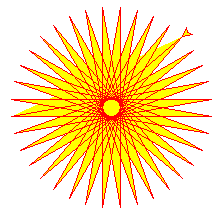
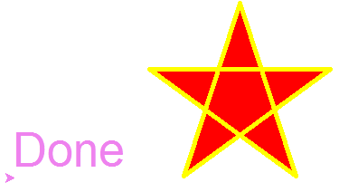
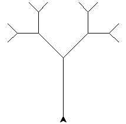

&emsp;&emsp;`Turtle`库是`Python`中一个很流行的绘制图像的函数库，想象一个小乌龟，在一个横轴为`x`、纵轴为`y`的坐标系原点，`(0, 0)`位置开始，它根据一组函数指令的控制，在这个平面坐标系中移动，从而在它爬行的路径上绘制了图形。

### 画布

&emsp;&emsp;画布就是`turtle`为我们展开用于绘图区域，我们可以设置它的大小和初始位置。设置画布大小：

``` python
turtle.screensize(canvwidth=None, canvheight=None, bg=None)
```

参数`canvwidth`是画布的宽(单位是像素)，`canvheight`是画布的高，`bg`是背景颜色。

``` python
turtle.screensize(800, 600, "green")
turtle.screensize()  # 返回默认大小(400, 300)
```

&emsp;&emsp;`setup`函数如下：

``` python
turtle.setup(width=0.5, height=0.75, startx=None, starty=None)
```

对于参数`width`和`height`，当输入宽和高为整数时，表示像素；为小数时，表示占据电脑屏幕的比例；对于`(startx, starty)`，这一坐标表示矩形窗口左上角顶点的位置；如果为空，则窗口位于屏幕中心。

``` python
turtle.setup(width=0.6, height=0.6)
turtle.setup(width=800, height=800, startx=100, starty=100)
```

### 画笔

#### 画笔的状态

&emsp;&emsp;在画布上，默认有一个坐标原点为画布中心的坐标轴，坐标原点上有一只面朝`x`轴正方向小乌龟。这里我们描述小乌龟时使用了两个词语：坐标原点(`位置`)，面朝`x`轴正方向(`方向`)，`turtle`绘图就是使用位置方向描述小乌龟(`画笔`)的状态。

#### 画笔的属性

&emsp;&emsp;画笔的属性包括颜色、画线的宽度等：

- `turtle.pensize()`：设置画笔的宽度。
- `turtle.pencolor()`：没有参数传入，返回当前画笔颜色，传入参数设置画笔颜色，可以是字符串(例如`green`、`red`)，也可以是`RGB`的`3`元组。
- `turtle.speed(speed)`：设置画笔移动速度，画笔绘制的速度范围`[0, 10]`整数，数字越大越快。

#### 绘图命令

&emsp;&emsp;操纵海龟绘图有着许多的命令，这些命令可以划分为`3`种：一种为运动命令，一种为画笔控制命令，还有一种是全局控制命令。
&emsp;&emsp;画笔运动命令如下：

命令                        | 说明
----------------------------|-----
`turtle.forward(distance)`  | 向当前画笔方向移动`distance`像素长度
`turtle.backward(distance)` | 向当前画笔相反方向移动`distance`像素长度
`turtle.right(degree)`      | 顺时针移动`degree`度
`turtle.left(degree)`       | 逆时针移动`degree`度
`turtle.pendown()`          | 移动时绘制图形，缺省时也为绘制
`turtle.goto(x,y)`          | 将画笔移动到坐标为`(x, y)`的位置
`turtle.penup()`            | 提起笔移动，不绘制图形，用于另起一个地方绘制
`turtle.circle()`           | 画圆，半径为正(负)，表示圆心在画笔的左边(右边)画圆
`setx()`                    | 将当前`x`轴移动到指定位置
`sety()`                    | 将当前`y`轴移动到指定位置
`setheading(angle)`         | 设置当前朝向为`angle`角度
`home()`                    | 设置当前画笔位置为原点，朝向东
`dot(r)`                    | 绘制一个指定直径和颜色的圆点

&emsp;&emsp;画笔控制命令如下：

命令                            | 说明
--------------------------------|-----
`turtle.fillcolor(colorstring)` | 绘制图形的填充颜色
`turtle.color(color1, color2)`  | 同时设置`pencolor = color1`和`fillcolor = color2`
`turtle.filling()`              | 返回当前是否在填充状态
`turtle.begin_fill()`           | 准备开始填充图形
`turtle.end_fill()`             | 填充完成
`turtle.hideturtle()`           | 隐藏画笔的`turtle`形状
`turtle.showturtle()`           | 显示画笔的`turtle`形状

&emsp;&emsp;全局控制命令如下：

- `turtle.clear()`：清空`turtle`窗口，但是`turtle`的位置和状态不会改变。
- `turtle.reset()`：清空窗口，重置`turtle`状态为起始状态。
- `turtle.undo()`：撤销上一个`turtle`动作。
- `turtle.isvisible()`：返回当前`turtle`是否可见。
- `stamp()`：复制当前图形。
- `turtle.write(s [, font=("font-name", font_size, "font_type")])`：写文本，`s`为文本内容，`font`是字体的参数，分别为字体名称、大小和类型。`font`为可选项，`font`参数也是可选项。

&emsp;&emsp;其他命令如下：

- `turtle.mainloop()`或`turtle.done()`：启动事件循环，它调用`Tkinter`的`mainloop`函数。必须是乌龟图形程序中的最后一个语句。
- `turtle.mode(mode=None)`：设置乌龟模式(`standard`、`logo`或`world`)并执行重置。如果没有给出模式，则返回当前模式。

模式       | 初始龟标题 | 正角度
-----------|-----------|-------
`standard` | 向右(东)  | 逆时针
`logo`     | 向上(北)  | 顺时针

- `turtle.delay(delay=None)`：设置或返回以毫秒为单位的绘图延迟。
- `turtle.begin_poly()`：开始记录多边形的顶点。当前的乌龟位置是多边形的第一个顶点。
- `turtle.end_poly()`：停止记录多边形的顶点。当前的乌龟位置是多边形的最后一个顶点。将与第一个顶点相连。
- `turtle.get_poly()`：返回最后记录的多边形。

### 命令详解

&emsp;&emsp;`circle`函数如下：

``` python
turtle.circle(radius, extent=None, steps=None)
```

该函数的作用是以给定半径来画圆。

- `radius`(半径)：半径为正(负)，表示圆心在画笔的左边(右边)画圆；
- `extent`(弧度)：可选项。
- `steps`：可选项，做一个半径为`radius`的圆的内切正多边形，多边形边数为`steps`。

``` python
circle(50)  # 整圆
circle(50, steps=3)  # 三角形
circle(120, 180)  # 半圆
```

### 具体应用

&emsp;&emsp;太阳花如下：

``` python
import turtle
​
turtle.color("red", "yellow")
turtle.begin_fill()

for _ in range(50):
    turtle.forward(200)
    turtle.left(170)

turtle.end_fill()​
turtle.mainloop()
```



&emsp;&emsp;五角星如下：

``` python
import turtle
import time
​
turtle.pensize(5)
turtle.pencolor("yellow")
turtle.fillcolor("red")
turtle.begin_fill()

for _ in range(5):
    turtle.forward(200)
    turtle.right(144)

turtle.end_fill()
time.sleep(2)
​
turtle.penup()
turtle.goto(-150, -120)
turtle.color("violet")
turtle.write("Done", font=('Arial', 40, 'normal'))​
turtle.mainloop()
```



&emsp;&emsp;递归画出树：

``` python
import turtle
​
def branch(length, level):
    if level <= 0:
        return
​
    turtle.forward(length)
    turtle.left(45)
    branch(0.6 * length, level - 1)
    turtle.right(90)
    branch(0.6 * length, level - 1)
    turtle.left(45)
    turtle.backward(length)
    return
​
if __name__ == "__main__":
    turtle.left(90)
    branch(100, 4)
    turtle.mainloop()
```

