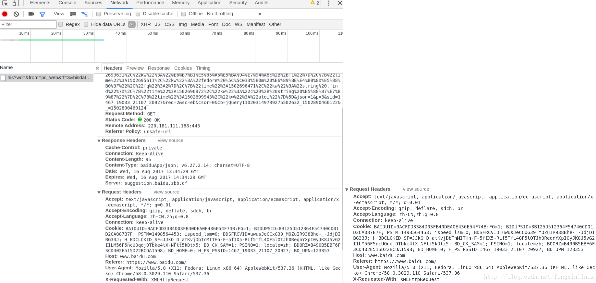
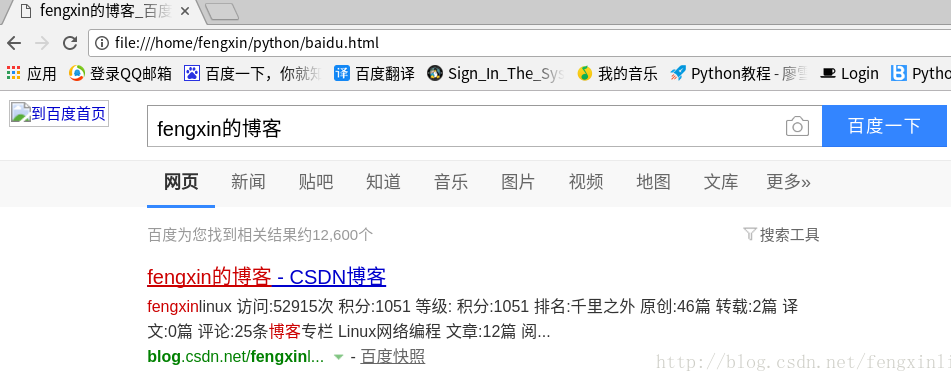
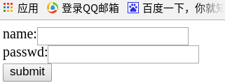
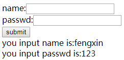

&emsp;&emsp;`Urllib`库是`Python`中的一个功能强大、用于操作`URL`，并在做爬虫时经常要用到的库。在`Python2.x`中，分为`Urllib`库和`Urllin2`库，`Python3.x`之后都合并到`Urllib`库中，使用方法稍有不同。本文介绍的是`Python3`中的`urllib`库。<!--more-->

### 什么是Urllib库

&emsp;&emsp;`Urllib`是`Python`提供的一个用于操作`URL`的模块，我们在爬取网页的时候，经常需要用到这个库。升级合并后，模块中的包位置变化的地方较多，在此列举一些常见的位置变动，方便之前用`Python2.x`的朋友在使用`Python3.x`的时候可以快速掌握。常见的变化如下：

Pytho2.x              | Python3.x
----------------------|-----------
`import urllib2`      | `import urllib.request, urllib.error`
`import urllib`       | `import urllib.request, urllib.error, urllib.parse`
`import urlparse`     | `import urllib.parse`
`import urlopen`      | `import urllib.request.urlopen`
`import urlencode`    | `import urllib.parse.urlencode`
`import urllib.quote` | `import urllib.request.quote`
`cookielib.CookieJar` | `http.CookieJar`
`urllib2.Request`     | `urllib.request.Request`

### 快速使用Urllib爬取网页

&emsp;&emsp;首先需要导入用到的模块(`urllib.request`)：

``` python
import urllib.request
```

在导入了模块之后，我们需要使用`urllib.request.urlopen`打开并爬取一个网页，此时可以输入如下代码爬取百度首页(`www.baidu.com`)。爬取后，将爬取的网页赋给了变量`file`：

``` python
file = urllib.request.urlopen('www.baidu.com')
```

此时还需要将对应的网页内容读取出来，可以使用`file.read`读取全部内容，或者也可以使用`file.readline`读取一行内容：

``` python
data = file.read()  # 读取全部
dataline = file.readline()  # 读取一行内容
```

读取内容常见的有`3`种方式：

- `readlines`读取文件的全部内容，它会把读取到的内容赋值给一个列表变量。
- `readline`读取文件的一行内容。
- `read`读取文件的全部内容，与`readlines`不同的是，`read`会把读取到的内容赋给一个字符串变量。

刚才已经成功获取到了百度首页的内容并读取赋给了变量`data`，接下来可以通过以下代码实现将爬取到的网页保存在本地：

``` python
fhandle = open("./1.html", "wb")
fhandle.write(data)
fhandle.close()
```

此时`1.html`已存储在指定的目录下，用浏览器打开该文件，就可以看到爬取的网页界面。
&emsp;&emsp;如果希望返回与当前环境有关的信息，我们可以使用`info`：

``` python
file.info()
```

执行结果：

``` python
<http.client.HTTPMessage object at 0x0000000003623D68>
```

如果希望获取当前爬取网页的状态码，可以使用`getcode`。若返回`200`，则表示正确，否则表示不正确：

``` python
file.getcode()  # 执行结果“200”
```

如果想要获取当前所爬取的`URL`地址，可以使用`geturl`：

``` python
file.geturl()  # 执行结果“'http://www.baidu.com'”
```

&emsp;&emsp;一般来说，标准`URL`只会允许一部分`ASCII`字符(比如数字、字母、部分符号)，而其他的一些字符(比如汉字)是不符合`URL`标准的，此时需要进行编码，可以使用`urllib.request.quote`：

``` python
urllib.request.quote('http://www.baidu.com')  # 执行结果“'http%3A//www.baidu.com'”
```

有时需要对编码的网址进行解码：

``` python
urllib.request.unquote('http%3A//www.baidu.com')  # 执行结果“'http://www.baidu.com'”
```

### 浏览器的模拟：Headers属性

&emsp;&emsp;有时我们无法爬取一些网页，经常会出现`403`错误，因为这些网页为了防止别人恶意采集其信息采取了一些反爬虫的设置。那么如果我们需要爬取这些网页的信息，应该怎么办呢？可以设置一些`Headers`信息，模拟成浏览器去访问这些网站。
&emsp;&emsp;那我们该添加什么头部信息呢？我们需要让爬虫模拟成浏览器，模拟成浏览器可以设置`User-Agent`信息。任意打开一个网页，比如打开百度，然后按`F12`，然后出现一个窗口。切换到`Network`标签页，然后单击网页中的`百度一下`，即让网页发生一个动作。此时可以观察到下方的窗口出现了一些数据，将界面右上方的标签切换到`Headers`中，即可以看到了对应的头信息。此时往下拖动，就可以找到`User-Agent`字样的一串信息，这一串信息即是模拟浏览器所需要用到的信息：



&emsp;&emsp;我们可以得到如下信息：

``` python
User-Agent:Mozilla/5.0 (X11; Fedora; Linux x86_64)
AppleWebKit/537.36 (KHTML, like Gecko) Chrome/58.0.3029.110 Safari/537.36
X-Requested-With:XMLHttpRequest
```

接下来实现让爬虫模拟成浏览器访问页面：

``` python
import urllib.request
import urllib.parse

url = 'http://www.baidu.com'
header = {'User-Agent': 'Mozilla/5.0 (X11; Fedora; Linux x86_64) AppleWebKit/537.36 (KHTML, like Gecko) Chrome/58.0.3029.110 Safari/537.36'}
request = urllib.request.Request(url, headers=header)
reponse = urllib.request.urlopen(request).read()

fhandle = open("./1.html", "wb")
fhandle.write(reponse)
fhandle.close()
```

首先设置要爬取的网址，然后调用`urllib.request.Request`函数创建一个`request`对象。该函数第一个参数传入`url`，第二个参数可以传入数据，默认是传入`0`数据，第三个参数是传入头部，该参数也是有默认值的，默认是不传任何头部。需要创建一个`dict`，将头部信息以键值对的形式存入到`dict`对象中，然后将该`dict`对象传入`urllib.request.Request`函数第三个参数。此时已经成功设置好报头，然后使用`urlopen`打开该`Request`对象即可打开对应的网址。

### HTTP协议请求实战

&emsp;&emsp;如果要进行客户端与服务器端之间的消息传递，我们可以使用`HTTP`协议请求进行。`HTTP`协议请求主要分为`6`种类型，各类型的主要作用如下：

- `GET`请求：`GET`请求会通过`URL`网址传递信息，可以直接在`URL`中写上要传递的信息，也可以用表单进行传递。如果使用表单进行传递，这表单中的信息会自动转为`URL`地址中的数据，通过`URL`地址传递。
- `POST`请求：可以向服务器提交数据，是一种比较主流也比较安全的数据传递方式，比如在登录时，经常使用`POST`请求发送数据。
- `PUT`请求：请求服务器存储一个资源，通常要指定存储的位置。
- `DELETE`请求：请求服务器删除一个资源。
- `HEAD`请求：请求获取对应的`HTTP`报头信息。
- `OPTIONS`请求：可以获取当前`URL`所支持的请求类型。

除此之外，还有`TRACE`请求与`CONNECT`请求等。接下来将通过实例讲解`HTTP`协议请求中的`GET`请求和`POST`请求，这两种请求相对来说用的最多。

### GET请求示例分析

&emsp;&emsp;有时想在百度上查询一个关键词，我们会打开百度首页，并输入该关键词进行查询，那么这个过程怎样使用爬虫自动实现呢？我们首先需要对查询过程进行相应的分析，可以打开百度首页，然后输入想检索的关键词，比如输入`hello`，然后按回车键，观察一下`URL`的变化。此时的`URL`变成如下字符串：

``` xml
https://www.baidu.com/s?ie=utf-8&f=8&rsv_bp=0&rsv_idx=1&tn=baidu&wd=hello
```

可以发现，对应的查询信息是通过`URL`传递的，这里采用的就是`HTTP`请求中的`GET`请求方法。我们将该网址提取出来进行分析：字段`ie`的值为`utf8`，代表的是编码信息；而字段`wd`为`hello`，刚好是我们要查询的信息，所以字段`wd`应该存储的就是用户检索的关键词。根据我们的猜测，可以将该地址化简为：

``` xml
https://www.baidu.com/s?wd=hello
```

将该网址复制到浏览器中，刷新一下，会发现该网址也能够出现关键词为`hello`的搜索结果。由此可见，我们在百度上查询一个关键字时，会使用`GET`请求，其中关键性字段是`wd`，网址格式为：

``` xml
https://www.baidu.com/s?wd=关键词
```

分析到这里，大概知道该怎么用爬虫实现自动地在百度上查询关键词结果了：

``` python
import urllib.request
import urllib.parse

url = 'http://www.baidu.com/s?wd='
key = 'fengxin的博客'
key_code = urllib.request.quote(key)  # 因为URL里含中文，需要进行编码
url_all = url + key_code

header = {'User-Agent': 'Mozilla/5.0 (X11; Fedora; Linux x86_64) AppleWebKit/537.36 \
                        (KHTML, like Gecko) Chrome/58.0.3029.110 Safari/537.36'}
request = urllib.request.Request(url_all, headers=header)
reponse = urllib.request.urlopen(request).read()

fh = open("./baidu.html", "wb")
fh.write(reponse)
fh.close()
```

此时用浏览器打开刚才保存的`baidu.html`文件，就可以看到刚才爬取的网页结果：



通过以上实例得知，如果要使用`GET`请求，需要以下步骤：

1. 构建对应的`URL`地址，该`URL`地址包含`GET`请求的字段名和字段内容等信息，并且`URL`地址满足`GET`请求的格式，即`http://网址?字段名1=字段内容1&字段名2=字段内容2`。
2. 以对应的`URL`为参数，构建`Request`对象。
3. 通过`urlopen`打开构建的`Request`对象。
4. 按需求进行后续的处理操作，比如读取网页的内容、将内容写入文件等。

### POST请求实例分析

&emsp;&emsp;我们在进行注册、登录等操作的时候，基本上都会遇到`POST`请求。接下来就为大家通过实例来分析如何通过爬虫来实现`POST`请求。
&emsp;&emsp;首先示范一下如何使用爬虫通过`POST`表单传递信息。给大家提供一个`POST`表单的测试网页：

``` xml
http://www.iqianyue.com/mypost
```

打开网址，会发现有一个表单：



如何通过爬虫自动实现这个传递过程呢？因为这里所采用的传递方法是`POST`方法，所以如果要使用爬虫自动实现，需要构造`PSOT`请求，实现思路如下：

1. 设置好`URL`网址。
2. 构建表单数据，并使用`urllib.parse.urlencode`对数据进行编码处理。
3. 构建`Request`对象，参数包括`URL`地址和要传递的数据。
4. 添加头部信息，模拟浏览器进行爬取。
5. 使用`urllib.requesr.urlopen`打开对应的`Request`对象，完成信息的传递。
6. 后续处理，比如读取网页内容、将内容写入文件等。

首先需要设置好对应的`URL`地址。在单击提交之后，会传递到当前页面进行处理，所以处理的页面应该是`http://www.iqianyue.com/mypost`，即`URL`应该设置为`http://www.iqianyue.com/mypost`。然后需要构建表单数据，在该网页上右击`查看网页源代码`，找到对应的`form`表单部分，然后进行分析：

``` xml
<html>
    <head>
        <title>Post Test Page</title>
    </head>
    <body>
        <form action="" method="post">
        name:<input name="name" type="text" /><br>
        passwd:<input name="pass" type="text" /><br>
        <input name="" type="submit" value="submit" />
        <br />
    </body>
</html>
```

可以发现，表单中的姓名对应的输入框中，`name`属性值为`name`；密码对应的输入框中，`name`属性值为`pass`，所以构造的数据中会包含两个字段，字段名分别是`name`和`pass`，字段值设置我们要传递的信息。格式为字典形式：

``` json
{字段名1: 字段值1, 字段名2:字段值2, ...}
```

其他的部分和上面的`GET`请求类似：

``` python
import urllib.request
import urllib.parse

url = 'http://www.iqianyue.com/mypost'
header = {'User-Agent': 'Mozilla/5.0 (X11; Fedora; Linux x86_64) \
            AppleWebKit/537.36 (KHTML, like Gecko) Chrome/58.0.3029.110 Safari/537.36'}
data = {'name': 'fengxin', 'pass': '123'}
postdata = urllib.parse.urlencode(data).encode('utf8')  # 进行编码
request = urllib.request.Request(url, postdata)
reponse = urllib.request.urlopen(request).read()

fhandle = open("./1.html", "wb")
fhandle.write(reponse)
fhandle.close()
```

在浏览器中打开刚才保存的`1.html`文件，可以看到数据已经成功提交：



---

### urlretrieve函数

&emsp;&emsp;`urllib`模块提供了`urlretrieve`方法，用于直接将远程数据下载到本地：

``` python
urlretrieve(url, filename=None, reporthook=None, data=None)
```

- `filename`：指定了保存本地路径。如果参数未指定，`urllib`会生成一个临时文件保存数据。
- `reporthook`：回调函数，当连接上服务器以及相应的数据块传输完毕时会触发该回调函数，可以利用这个回调函数来显示当前的下载进度。
- `data`：指的是`post`到服务器的数据，该方法返回一个包含两个元素的`(filename, headers)`元组，`filename`表示保存到本地的路径，`header`表示服务器的响应头。

&emsp;&emsp;下载`Python2`的安装包，同时显示下载的进度：

``` python
import os
import urllib.request

def cbk(a, b, c):  # 回调函数
    """ 参数a是已经下载的数据块数量，b是数据块的大小，c是远程文件的大小 """
    per = 100.0 * a * b / c

    if per > 100:
        per = 100

    print('%.2f%%' % per)

url = 'http://www.python.org/ftp/python/2.7.5/Python-2.7.5.tar.bz2'
dir = os.path.abspath('.')
work_path = os.path.join(dir, 'Python-2.7.5.tar.bz2')
urllib.request.urlretrieve(url, work_path, cbk)
```