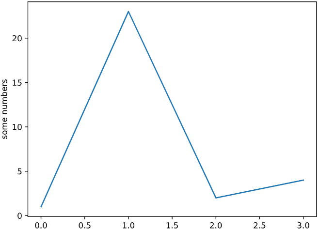
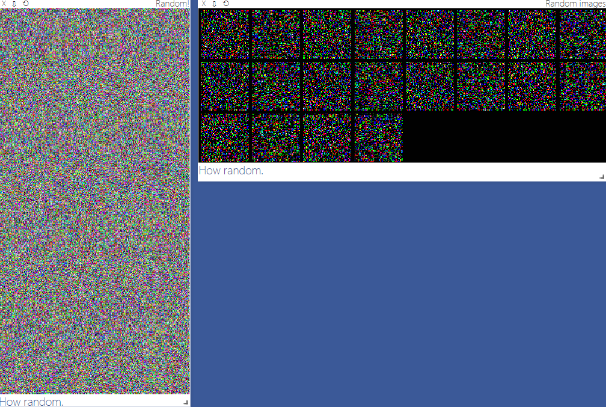
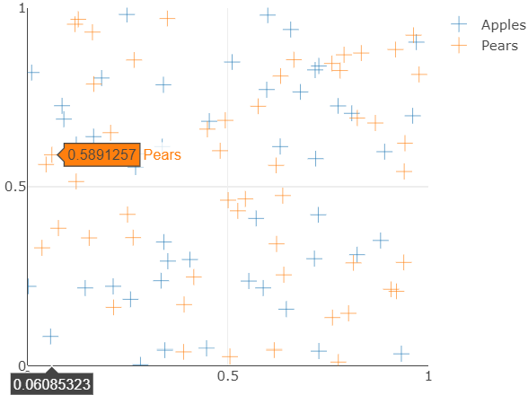
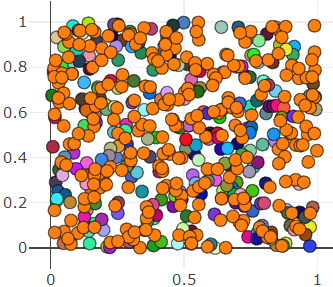
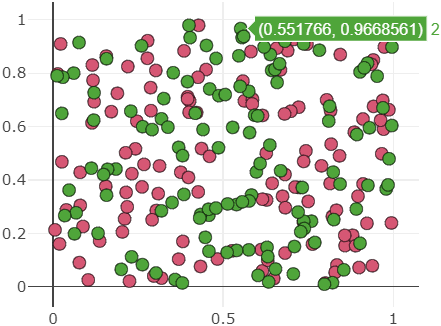
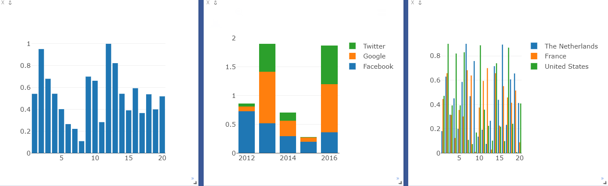
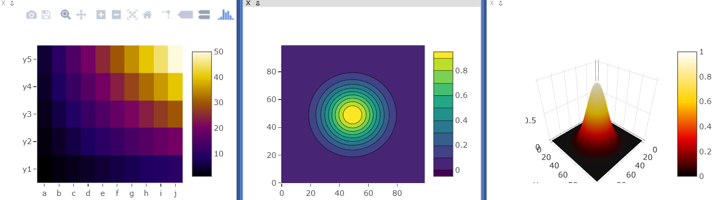
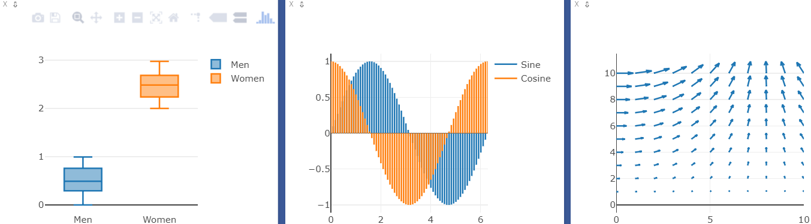
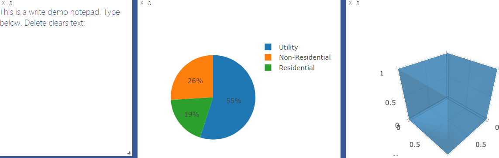

&emsp;&emsp;`visdom`可以创造、组织和共享多种数据的可视化，包括数值、图像、文本，甚至是视频，支持`PyTorch`、`Torch`及`Numpy`。用户可通过编程组织可视化空间，或通过用户接口为数据打造仪表板，检查实验结果或调试代码。
&emsp;&emsp;`visdom`中有两个重要概念：
<!--more-->
- `env`(环境)：不同环境的可视化结果相互隔离，互不影响。在使用时如果不指定`env`，则默认使用`main`。不同用户、不同程序一般使用不同的`env`。
- `pane`(窗格)：窗格用于可视化图像、数值或打印文本等，可以拖动、缩放、保存和关闭。一个程序中可使用同一个`env`中的不同`pane`，每个`pane`可视化或记录某一信息。

点击`clear`按钮可以清空当前`env`的所有`pane`，点击`save`按钮可将当前`env`保存成`json`文件，保存路径位于`~/.visdom/`目录下。也可修改`env`的名字后点击`fork`，保存当前`env`的状态至更名后的`env`。
&emsp;&emsp;`visdom`可以通过命令`pip install visdom`来实现。安装完成后，需要通过`python -m visdom.server`命令启动`visdom`服务，或通过`nohup python -m visdom.server &`命令将服务放至后台运行。`visdom`服务是一个`web server`服务，默认绑定`8097`端口(需要在浏览器上输入`http://localhost:8097`)，客户端与服务器间通过`tornado`进行非阻塞交互。
&emsp;&emsp;`visdom`的使用有两点需要注意的地方：

- 需手动指定保存`env`，可在`web`界面点击`save`按钮或在程序中调用`save`方法，否则`visdom`服务重启后，`env`等信息会丢失。
- 客户端与服务器之间的交互采用`tornado`异步框架，可视化操作不会阻塞当前程序，网络异常也不会导致程序退出。

&emsp;&emsp;`visdom`以`Plotly`为基础，支持丰富的可视化操作。`vis = visdom.Visdom(env=u'test1')`，用于构建一个客户端，客户端除指定`env`之外，还可以指定`host`、`port`等参数。`vis`作为一个客户端对象，可以使用常见的画图函数：

- `line`：类似于`Matlab`中的`plot`操作，用于记录某些标量的变化，如损失、准确率等。
- `image`：可视化图片，可以是输入的图片，也可以是`GAN`生成的图片，还可以是卷积核的信息。
- `text`：用于记录日志等文字信息，支持`html`格式。
- `histgram`：可视化分布，主要是查看数据、参数的分布。
- `scatter`：绘制散点图。
- `bar`：绘制柱状图。
- `pie`：绘制饼状图。

&emsp;&emsp;`visdom`同时支持`PyTorch`的`tensor`和`Numpy`的`ndarray`两种数据结构，但不支持`Python`的`int`、`float`等类型，因此每次传入时都需先将数据转成`ndarray`或`tensor`。上述操作的参数一般不同，但有两个参数是绝大多数操作都具备的：

- `win`：用于指定`pane`的名字，如果不指定，`visdom`将自动分配一个新的`pane`。如果两次操作指定的`win`名字一样，新的操作将覆盖当前`pane`的内容，因此建议每次操作都重新指定`win`。
- `opts`：选项，接收一个字典，常见的`option`包括`title`、`xlabel`、`ylabel`、`width`等，主要用于设置`pane`的显示格式。

&emsp;&emsp;之前提到过，每次操作都会覆盖之前的数值，但往往我们在训练网络的过程中需要不断地更新数值，例如损失值等，这时就需要指定参数`update='append'`来避免覆盖之前的数值。而除了使用`update`参数以外，还可以使用`vis.updateTrace`方法来更新图，但`updateTrace`不仅能在指定`pane`上新增一个和已有数据相互独立的`Trace`，还能像`update='append'`那样在同一条`trace`上追加数据。

### viz.maplotlib(matplotlib显示)

&emsp;&emsp;代码如下：

``` python
from visdom import Visdom
import matplotlib.pyplot as plt
​
viz = Visdom()
assert viz.check_connection()
​
try:
    plt.plot([1, 23, 2, 4])
    plt.ylabel('some numbers')
    viz.matplot(plt)
except BaseException as err:
    print('Skipped matplotlib example')
    print('Error message: ', err)
```



### vis.video(视频)

&emsp;&emsp;代码如下：

``` python
from visdom import Visdom
import urllib.request
import os
​
viz = Visdom()
assert viz.check_connection()
​
try:
    video_url = 'http://media.w3.org/2010/05/sintel/trailer.ogv'
    videofile = 'trailer.ogv'
    urllib.request.urlretrieve(video_url, videofile)
​
    if os.path.isfile(videofile):
        viz.video(videofile=videofile)
except ImportError:
    print('Skipped video example')
```


### vis.image(图片)

&emsp;&emsp;代码如下：

``` python
from visdom import Visdom
import numpy as np
​
viz = Visdom()
assert viz.check_connection()
​
viz.image(  # 单张图像
    np.random.rand(3, 512, 256),
    opts=dict(title='Random!', caption='How random.'))
viz.images(  # 多张图像
    np.random.randn(20, 3, 64, 64),
    opts=dict(title='Random images', caption='How random.'))
```



### vis.scatter(散点图)

&emsp;&emsp;代码如下：

``` python
from visdom import Visdom
import numpy as np
import time
​
viz = Visdom()
assert viz.check_connection()
​
Y = np.random.rand(100)
old_scatter = viz.scatter(  # 画出随机的散点图
    X=np.random.rand(100, 2),
    Y=(Y[Y > 0] + 1.5).astype(int),
    opts=dict(legend=['Didnt', 'Update'],
            xtickmin=-50, xtickmax=50, xtickstep=0.5,
            ytickmin=-50, ytickmax=50, ytickstep=0.5,
            markersymbol='cross-thin-open',),
)
​
time.sleep(5)
​
viz.update_window_opts(  # 对窗口进行更新，包括标注、坐标和样式等
    win=old_scatter,
    opts=dict(legend=['Apples', 'Pears'],
            xtickmin=0, xtickmax=1, xtickstep=0.5, ytickmin=0,
            ytickmax=1, ytickstep=0.5, markersymbol='cross-thin-open',),
)
```



&emsp;&emsp;通过`update='new'`添加新散点：

``` python
from visdom import Visdom
import numpy as np
import time
​
viz = Visdom()
assert viz.check_connection()
​
win = viz.scatter(
    X=np.random.rand(255, 2),
    opts=dict(markersize=10, markercolor=np.random.randint(0, 255, (255, 3,)),),)
assert viz.win_exists(win), 'Created window marked as not existing'  # 判断窗口是否存在
time.sleep(2)
# 向散点图中加入新的描述
viz.scatter(X=np.random.rand(255), Y=np.random.rand(255), win=win, name='new_trace', update='new')
```



&emsp;&emsp;为`2D`散点图分配不同颜色：

``` python
from visdom import Visdom
import numpy as np
​
viz = Visdom()
assert viz.check_connection()
​
viz.scatter(
    X=np.random.rand(255, 2),
    Y=(np.random.rand(255) + 1.5).astype(int),  # 随机指定1或者2
    opts=dict(
        markersize=10,
        markercolor=np.random.randint(0, 255, (2, 3,)),  # 分配两种颜色
    ),
)
```



### vis.bar(柱状图)

&emsp;&emsp;代码如下：

``` python
from visdom import Visdom
import numpy as np
​
viz = Visdom()
assert viz.check_connection()
​
viz.bar(X=np.random.rand(20))
​
viz.bar(
    X=np.abs(np.random.rand(5, 3)),
    opts=dict(stacked=True, legend=['Facebook', 'Google', 'Twitter'], \
              rownames=['2012', '2013', '2014', '2015', '2016'])
)
​
viz.bar(X=np.random.rand(20, 3), opts=dict(stacked=False, \
        legend=['The Netherlands', 'France', 'United States']))
```



### vis.heat/contour/surface(热程图/地理图/表面图)

&emsp;&emsp;代码如下：

``` python
from visdom import Visdom
import numpy as np
​
viz = Visdom()
assert viz.check_connection()
​
viz.heatmap(
    X=np.outer(np.arange(1, 6), np.arange(1, 11)),
    opts=dict(
        columnnames=['a', 'b', 'c', 'd', 'e', 'f', 'g', 'h', 'i', 'j'],
        rownames=['y1', 'y2', 'y3', 'y4', 'y5'], colormap='Electric',)
)
​
# contour
x = np.tile(np.arange(1, 101), (100, 1))
y = x.transpose()
X = np.exp((((x - 50) ** 2) + ((y - 50) ** 2)) / -(20.0 ** 2))
viz.contour(X=X, opts=dict(colormap='Viridis'))
viz.surf(X=X, opts=dict(colormap='Hot'))  # surface
```



### viz.boxplot(箱形图)/stem(茎干图)/quiver(箭状图)

&emsp;&emsp;代码如下：

``` python
from visdom import Visdom
import numpy as np
import math
​
viz = Visdom()
assert viz.check_connection()
​
# boxplot
X = np.random.rand(100, 2)
X[:, 1] += 2
viz.boxplot(X=X, opts=dict(legend=['Men', 'Women']))
​
# stemplot
Y = np.linspace(0, 2 * math.pi, 70)
X = np.column_stack((np.sin(Y), np.cos(Y)))
viz.stem(X=X, Y=Y, opts=dict(legend=['Sine', 'Cosine']))
​
# quiver plot
X = np.arange(0, 2.1, .2)
Y = np.arange(0, 2.1, .2)
X = np.broadcast_to(np.expand_dims(X, axis=1), (len(X), len(X)))
Y = np.broadcast_to(np.expand_dims(Y, axis=0), (len(Y), len(Y)))
U = np.multiply(np.cos(X), Y)
V = np.multiply(np.sin(X), Y)
viz.quiver(X=U, Y=V, opts=dict(normalize=0.9),)
```



### viz.text(文字)/pie(饼图)/mesh(网丝图)

&emsp;&emsp;代码如下：

``` python
from visdom import Visdom
import numpy as np
​
viz = Visdom()
assert viz.check_connection()
​
# text window with Callbacks
txt = 'This is a write demo notepad. Type below. Delete clears text:<br>'
callback_text_window = viz.text(txt)
​
# pie chart
X = np.asarray([19, 26, 55])
viz.pie(X=X, opts=dict(legend=['Residential', 'Non-Residential', 'Utility']))
​
# mesh plot
x = [0, 0, 1, 1, 0, 0, 1, 1]
y = [0, 1, 1, 0, 0, 1, 1, 0]
z = [0, 0, 0, 0, 1, 1, 1, 1]
X = np.c_[x, y, z]
i = [7, 0, 0, 0, 4, 4, 6, 6, 4, 0, 3, 2]
j = [3, 4, 1, 2, 5, 6, 5, 2, 0, 1, 6, 3]
k = [0, 7, 2, 3, 6, 7, 1, 1, 5, 5, 7, 6]
Y = np.c_[i, j, k]
viz.mesh(X=X, Y=Y, opts=dict(opacity=0.5))
```

