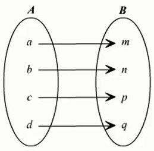

&emsp;&emsp;字典来源于映射关系：<!--more-->



注意，字典不是序列类型，而是映射类型。不使用字典的索引(很麻烦)：

``` python
brand = ["李宁", "耐克", "阿迪达斯", "鱼C工作室"]
slogan = ["一切皆有可能", "Just do it", "Impossible is nothing", "让编程改变世界"]
# 结果为“鱼C工作室的口号是：让编程改变世界”
print("鱼C工作室的口号是：", slogan[brand.index("鱼C工作室")])
```

&emsp;&emsp;创建和访问字典：

``` python
dict1 = {"李宁": "一切皆有可能", "耐克": "Just do it", \
         "阿迪达斯": "Impossible is nothing", "鱼C工作室": "让编程改变世界"}
# 结果为“鱼C工作室的口号是：让编程改变世界”
print("鱼C工作室的口号是：", dict1["鱼C工作室"])
dict2 = {1: "one", 2: "two", 3: "three"}
dict2  # 结果为{1: 'one', 2: 'two', 3: 'three'}
dict2[2]  # 结果为“two”
```

&emsp;&emsp;特殊用法：

``` python
dict3 = dict((("F", 70), ("i", 105), ("s", 115), ("h", 104)))
dict3  # 结果为{'i': 105, 's': 115, 'h': 104, 'F': 70}
dict4 = dict(小="little", 付="fool")
dict4  # 结果为{'付': 'fool', '小': 'little'}
dict4 = dict(小="little", "付" = "fool")  # 结果为“出错”
dict4["付"] = "fu"  # 更改字典数据
dict4  # 结果为{'付': 'fu', '小': 'little'}
dict4["康"] = "kang"  # 增加字典数据
dict4  # 结果为{'付': 'fu', '小': 'little', '康': 'kang'}
```

&emsp;&emsp;`dict`是`Python`的工厂函数(类型)，`str`、`int`、`list`和`tuple`都是工厂函数。

``` python
dict.fromkeys(S[, v]) -> New dict with keys from S and values equal to v(v defaults to None)
```

在终端输入：

``` python
dict1 = {}
dict1.fromkeys((1, 2, 3))  # 结果为{1: None, 2: None, 3: None}
dict1.fromkeys((1, 2, 3), "number")  # 结果为{1: 'number', 2: 'number', 3: 'number'}
# 结果为{1: ('one', 'two', 'three'), 2: ('one', 'two', 'three'), 3: ('one', 'two', 'three')}
dict1.fromkeys((1, 2, 3), ("one", "two", "three"))
dict1.fromkeys((1, 3), "数字")  # 结果为{1: '数字', 3: '数字'}
dict1 = dict1.fromkeys(range(32), "赞")  # 结果为{0: '赞', 1: '赞', 2: '赞', 3: '赞', ..., 30: '赞', 31: '赞'}
# ---------------------------------
for eachKey in dict1.keys():
    print(eachKey)  # 结果为打印从0到31的数字

for eachValue in dict1.values():
    print(eachValue)  # 结果为打印32个“赞”字

for eachitem in dict1.items():
    print(eachitem)  # 结果为打印“(0, '赞')、(1, '赞')、(2, '赞')、...、(31, '赞')”
# ---------------------------------
print(dict1[31])  # 结果为“赞”
print(dict1[32])  # 结果为“出错”
print(dict1.get(32))  # 结果为None
dict1.get(32, "木有")  # 结果为“木有”
dict1.get(31, "木有")  # 结果为“赞”
31 in dict1  # 结果为True
32 in dict1  # 结果为False
# ---------------------------------
print(dict1[31])  # 结果为“赞”
print(dict1[32])  # 结果为“出错”
print(dict1.get(32))  # 结果为None
dict1.get(32, "木有")  # 结果为“木有”
dict1.get(31, "木有")  # 结果为“赞”
31 in dict1  # 结果为True
32 in dict1  # 结果为False
```

&emsp;&emsp;`Python`的拷贝：

``` python
a = {1: "one", 2: "two", 3: "three"}
b = a.copy()  # 浅拷贝
c = a
c  # 得到{1: 'one', 2: 'two', 3: 'three'}
a  # 得到{1: 'one', 2: 'two', 3: 'three'}
b  # 得到{1: 'one', 2: 'two', 3: 'three'}
id(a)  # 得到41703384
id(b)  # 得到41704144
id(c)  # 得到41703384
c[4] = "four"
c  # 得到{1: 'one', 2: 'two', 3: 'three', 4: 'four'}
a  # 得到{1: 'one', 2: 'two', 3: 'three', 4: 'four'}
b  # 得到{1: 'one', 2: 'two', 3: 'three'}
# ----------------------------------------
a  # 得到{1: 'one', 2: 'two', 3: 'three', 4: 'four'}
a.pop(2)  # 得到“two”
a  # 得到{1: 'one', 3: 'three', 4: 'four'}
a.popitem()  # 得到(1, 'one')
a.setdefault("小白")
a  # 得到{3: 'three', 4: 'four', '小白': None}
a.setdefault(5, "five")  # 得到“five”
a  # 得到{3: 'three', 4: 'four', 5: 'five', '小白': None}
b = {"小白": "狗"}
a.update(b)
a  # 得到{3: 'three', 4: 'four', 5: 'five', '小白': '狗'}
```

### 删除字典元素

&emsp;&emsp;能删单一的元素，也能清空字典，清空只需一项操作。删除一个字典用`del`命令：

``` python
dict = {'Name': 'Runoob', 'Age': 7, 'Class': 'First'}

del dict['Name']  # 删除键“Name”
dict.clear()  # 清空字典
del dict  # 删除字典

print("dict['Age']: ", dict['Age'])
print("dict['School']: ", dict['School'])
```

但这会引发一个异常，因为用执行`del`操作后字典不再存在：

``` python
Traceback (most recent call last):
  File "test.py", line 9, in <module>
    print ("dict['Age']: ", dict['Age'])
TypeError: 'type' object is not subscriptable
```

### 字典键的特性

&emsp;&emsp;字典值可以是任何的`python`对象，既可以是标准的对象，也可以是用户定义的，但键不行。两个重要的点需要记住：

- 不允许同一个键出现两次。创建时如果同一个键被赋值两次，后一个值会被记住：

``` python
dict = {'Name': 'Runoob', 'Age': 7, 'Name': '小菜鸟'}
print("dict['Name']:", dict['Name'])
```

执行结果：

``` python
dict['Name']: 小菜鸟
```

- 键必须不可变，所以可以用数字，字符串或元组充当，而用列表就不行：

``` python
dict = {['Name']: 'Runoob', 'Age': 7}
print("dict['Name']: ", dict['Name'])
```

执行结果：

``` python
Traceback (most recent call last):
  File "test.py", line 3, in <module>
    dict = {['Name']: 'Runoob', 'Age': 7}
TypeError: unhashable type: 'list'
```

### 字典内置函数和方法

&emsp;&emsp;`Python`字典包含了以下内置函数：

- `len(dict)`：计算字典元素个数，即键的总数。
- `str(dict)`：输出字典，以可打印的字符串表示。
- `type(variable)`：返回输入的变量类型，如果变量是字典，就返回字典类型。

&emsp;&emsp;`Python`字典包含了以下内置方法：

- `radiansdict.clear()`：删除字典内所有元素。
- `radiansdict.copy()`：返回一个字典的浅复制。
- `radiansdict.fromkeys()`：创建一个新字典，以序列`seq`中元素做字典的键，`val`为字典所有键对应的初始值。
- `radiansdict.get(key, default=None)`：返回指定键的值，如果值不在字典中，返回`default`值。
- `key in dict`：如果键在字典`dict`里返回`true`，否则返回`false`。
- `radiansdict.items()`：以列表返回可遍历的元组数组。
- `radiansdict.keys()`：以列表返回一个字典所有的键。
- `radiansdict.setdefault(key, default=None)`：和`get`类似, 但如果键不存在于字典中，将会添加键并将值设为`default`。
- `radiansdict.update(dict2)`：把字典`dict2`的键值对更新到`dict`里。
- `radiansdict.values()`：以列表返回字典中的所有值。
- `pop(key[, default])`：删除字典给定键`key`所对应的值，返回值为被删除的值。`key`值必须给出，否则返回`default`值。
- `popitem()`：随机返回并删除字典中的一对键和值(一般删除末尾对)。