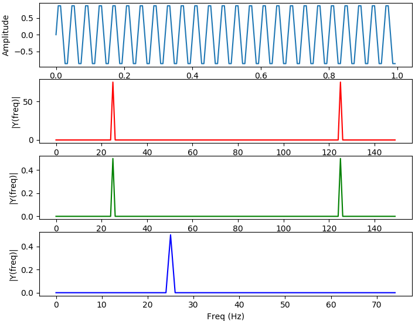
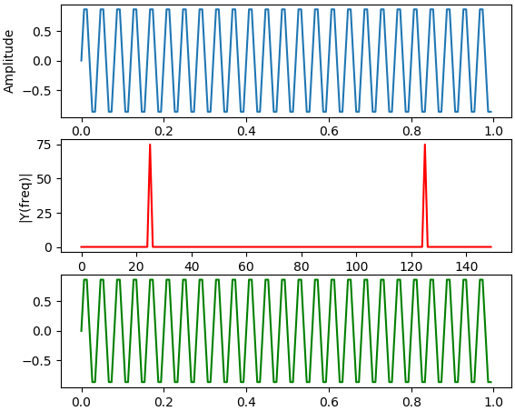
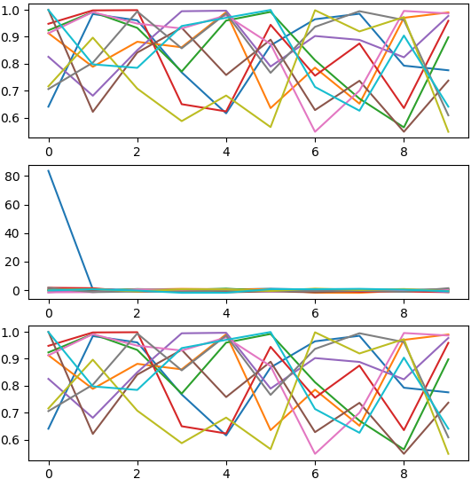
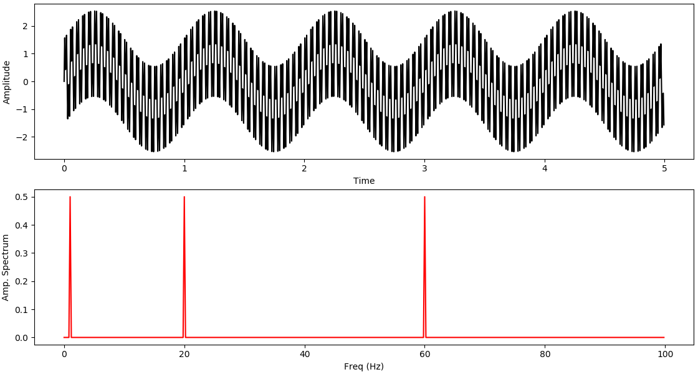
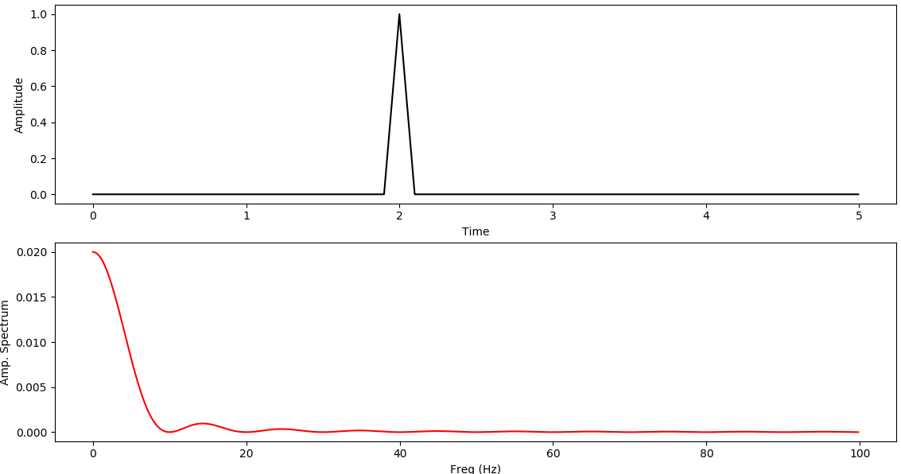
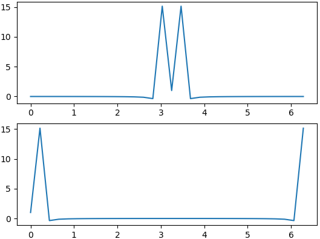

&emsp;&emsp;代码如下：

``` python
import matplotlib.pyplot as plt
import numpy as np
​
Fs = 150.0  # 采样率
Ts = 1.0 / Fs  # 采样区间
t = np.arange(0, 1, Ts)  # Ts是步长
​
ff = 25  # frequency of the signal
y = np.sin(2 * np.pi * ff * t)
​
n = len(y)  # length of the signal
k = np.arange(n)
T = n / Fs
frq = k / T  # two sides frequency range
frq1 = frq[range(int(n / 2))]  # one side frequency range
​
YY = np.fft.fft(y)  # 未归一化
Y = np.fft.fft(y) / n  # fft computing and normalization(归一化)
Y1 = Y[range(int(n / 2))]
​
fig, ax = plt.subplots(4, 1)
​
ax[0].plot(t, y)
ax[0].set_xlabel('Time')
ax[0].set_ylabel('Amplitude')
​
ax[1].plot(frq, abs(YY), 'r')  # plotting the spectrum
ax[1].set_xlabel('Freq (Hz)')
ax[1].set_ylabel('|Y(freq)|')
​
ax[2].plot(frq, abs(Y), 'G')  # plotting the spectrum
ax[2].set_xlabel('Freq (Hz)')
ax[2].set_ylabel('|Y(freq)|')
​
ax[3].plot(frq1, abs(Y1), 'B')  # plotting the spectrum
ax[3].set_xlabel('Freq (Hz)')
ax[3].set_ylabel('|Y(freq)|')
​
plt.show()
```



&emsp;&emsp;傅里叶反变换如下：

``` python
import matplotlib.pyplot as plt
import numpy as np
​
Fs = 150.0  # 采样率
Ts = 1.0 / Fs  # 采样区间
t = np.arange(0, 1, Ts)  # Ts是步长
​
ff = 25  # frequency of the signal
y = np.sin(2 * np.pi * ff * t)
​
n = len(y)  # length of the signal
k = np.arange(n)
T = n / Fs
frq = k / T  # two sides frequency range
​
YY = np.fft.fft(y)
​
fig, ax = plt.subplots(3, 1)
​
ax[0].plot(t, y)
ax[0].set_xlabel('Time')
ax[0].set_ylabel('Amplitude')
​
ax[1].plot(frq, abs(YY), 'r')
ax[1].set_xlabel('Freq (Hz)')
ax[1].set_ylabel('|Y(freq)|')
​
Y = np.real(np.fft.ifft(YY))
ax[2].plot(t, Y, 'G')  
​
plt.show()
```



&emsp;&emsp;二维傅里叶变换如下：

``` python
import numpy as np
import matplotlib.pyplot as plt
​
x = np.random.rand(10, 10)  # 二维随机信号
wave = np.cos(x)
​
fig, ax = plt.subplots(3, 1)
transformed = np.fft.fft2(wave)
recover = np.fft.ifft2(transformed)  # 二维反变换
​
ax[0].plot(wave)
ax[1].plot(np.real(transformed))
ax[2].plot(np.real(recover))
​
plt.show()
```



&emsp;&emsp;信号处理叠加如下：

``` python
import matplotlib.pyplot as plt
import numpy as np
​
def show(ori_func, ft, sampling_period=5):
    n = len(ori_func)
    interval = sampling_period / n
    # 绘制原始函数
    plt.subplot(2, 1, 1)
    plt.plot(np.arange(0, sampling_period, interval), ori_func, 'black')
    plt.xlabel('Time'), plt.ylabel('Amplitude')
    # 绘制变换后的函数
    plt.subplot(2, 1, 2)
    frequency = np.arange(n / 2) / (n * interval)
    nfft = abs(ft[range(int(n / 2))] / n)
    plt.plot(frequency, nfft, 'red')
    plt.xlabel('Freq (Hz)'), plt.ylabel('Amp. Spectrum')
    plt.show()
​
# 生成频率为1(角速度为“2 * pi”)的正弦波
time = np.arange(0, 5, .005)
x = np.sin(2 * np.pi * 1 * time)
# 将其与频率为20和60的波叠加起来
x2 = np.sin(2 * np.pi * 20 * time)
x3 = np.sin(2 * np.pi * 60 * time)
x += x2 + x3
y = np.fft.fft(x)
show(x, y)
```



&emsp;&emsp;对脉冲波的处理：

``` python
import matplotlib.pyplot as plt
import numpy as np
​
def show(ori_func, ft, sampling_period=5):
    n = len(ori_func)
    interval = sampling_period / n
    # 绘制原始函数
    plt.subplot(2, 1, 1)
    plt.plot(np.arange(0, sampling_period, interval), ori_func, 'black')
    plt.xlabel('Time'), plt.ylabel('Amplitude')
    # 绘制变换后的函数
    plt.subplot(2, 1, 2)
    frequency = np.arange(n / 2) / (n * interval)
    nfft = abs(ft[range(int(n / 2))] / n)
    plt.plot(frequency, nfft, 'red')
    plt.xlabel('Freq (Hz)'), plt.ylabel('Amp. Spectrum')
    plt.show()
​
time = np.arange(0, 5, .005)
# 生成脉冲波
x = np.zeros(len(time))
x[380:400] = np.arange(0, 1, .05)
x[400:420] = np.arange(1, 0, -.05)
y = np.fft.fft(x)
show(x, y)
```



&emsp;&emsp;代码如下：

``` python
# 创建0至9的随机整数信号
a = np.random.randint(10, size = 10)  # array([7, 4, 9, 9, 6, 9, 2, 6, 8, 3])
a.mean()  # 6.2999999999999998
A = np.fft.fft(a)  # 进行傅里叶变换，其结果如下：
"""
array([ 63.00000000 +0.00000000e+00j,
        -2.19098301 -6.74315233e+00j,
        -5.25328890 +4.02874005e+00j,
        -3.30901699 -2.40414157e+00j,
        13.75328890 -1.38757276e-01j,
         1.00000000 -2.44249065e-15j,
        13.75328890 +1.38757276e-01j,
        -3.30901699 +2.40414157e+00j,
        -5.25328890 -4.02874005e+00j,
        -2.19098301 +6.74315233e+00j])
"""
A[0] / 10  # (6.2999999999999998+0j)
A[int(10 / 2)]  # (1-2.4424906541753444e-15j)
# A[0]是0频率的项，A[1:n/2]是正频率项，A[n/2 + 1: n]是负频率项
np.fft.fftshift(A)  # 如果我们要把0频率项调整到中间，可以调用fft.fftshift，其结果如下：
"""
array([ 1.00000000 -2.44249065e-15j,
       13.75328890 +1.38757276e-01j,
       -3.30901699 +2.40414157e+00j,
       -5.25328890 -4.02874005e+00j,
       -2.19098301 +6.74315233e+00j,
       63.00000000 +0.00000000e+00j,
       -2.19098301 -6.74315233e+00j,
       -5.25328890 +4.02874005e+00j,
       -3.30901699 -2.40414157e+00j,
       13.75328890 -1.38757276e-01j])
"""
# fft2用于二维，fftn用于多维
x = np.random.random(24)
x.shape = 2,12
y2 = np.fft.fft2(x)
x.shape = 1,2,12
y3 = np.fft.fftn(x, axes = (1, 2))
np.allclose(y2, y3) # True
```

&emsp;&emsp;代码如下：

``` python
import numpy as np
import matplotlib.pyplot as plt
​
x = np.linspace(0, 2 * np.pi, 30)
wave = np.cos(x)
transformed = np.fft.fft(wave)
shifted = np.fft.fftshift(transformed)  # 频移
print(np.all((np.fft.ifftshift(shifted) - transformed) < 10 ** (-9)))  # 逆频移
​
fig, ax = plt.subplots(2, 1)
ax[0].plot(x, shifted.real)
ax[1].plot(x, np.fft.ifftshift(shifted).real)
plt.show()
```



&emsp;&emsp;**补充说明**：`fft`变换结果是复数，一般情况下要取实部。