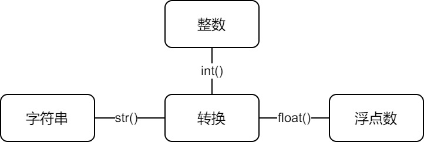

### 数据类型

&emsp;&emsp;`Python`的数据类型分为整型、布尔类型、浮点型、`e`记法。在终端输入`a = 0.00000000000000000015`，再输入`a`得到`1.5e-19`；在终端输入`b = 1.5e12`，再输入`b`，得到`1500000000000.0`，这就是`e`记法。也可以输入`b = 15e11`，达到同样的结果。
&emsp;&emsp;布尔类型是特殊的整型，在终端输入：

``` python
True + True  # 结果为2
True * True  # 结果为1
True + False  # 结果为1
True * False  # 结果为0
True / False  # 结果出错
```

类型转换如下：



&emsp;&emsp;在终端输入：

``` python
a = '520'
b = int(a)  # b为得到整数520
```

如果`a`为`hello`，则程序出错。

``` python
a = 5.99
c = int(a)  # c为整数5
c = str(5e19)  # c为字符串“5e+19”
```

注意`str`的使用，在终端输入：

``` python
str = "hello"
c = str(520)  # 这样会报错！
```

&emsp;&emsp;关于获取类型的信息，使用`type`或者`isinstance`这些`BIF`。在终端输入：

``` python
a = '510'
type(a)  # 得到<class 'str'>
type(5.2)  # 得到<class 'float'>
type(True)  # 得到<class 'bool'>
type(5e12)  # 得到<class 'float'>
# --------------------------------
a = "hello"
isinstance(a, str)  # 结果为True
isinstance(a, int)  # 结果为False
isinstance(520, int)  # 结果为True
isinstance(320.25, float)  # 结果为True
isinstance(320.25, bool)  # 结果为False
```

#### 多个变量赋值

&emsp;&emsp;`Python`允许你同时为多个变量赋值：

``` python
a = b = c = 1
```

以上实例创建一个整型对象(值为`1`)，从后向前赋值，三个变量被赋予相同的数值。也可以为多个对象指定多个变量：

``` python
a, b, c = 1, 2, "runoob"
```

两个整型对象`1`和`2`被分配给变量`a`和`b`，字符串对象`runoob`分配给变量`c`。

---

### 循环

#### for循环

&emsp;&emsp;语法如下：

``` python
for 目标 in 表达式:
    循环体
```

在终端输入：

``` python
favourite = "hello"

for i in favourite:
    print(i, end=' ')  # 打印“h e l l o ”
```

在终端输入：

``` python
member = ['one', 'two', 'three', 'four']  # Python的列表，相当于C语言的数组

for each in member:
    print(each, len(each))  # len是Python的BIF
```

输出结果为：

``` python
one 3
two 3
three 5
four 4
```

#### for和else

&emsp;&emsp;使用`break`关键字终止当前循环就不会执行`else`语句，而使用`continue`则进入下一轮循环。如果正常地结束循环，就会触发`else`语句。
&emsp;&emsp;正常结束的循环：

``` python
list = [1, 2, 3, 4, 5]

for x in list:
    print(x, end=" ")
else:
    print("else")
```

执行结果为`1 2 3 4 5 else`。使用`continue`关键字：

``` python
list = [1, 2, 3, 4, 5]

for x in list:
    continue
    print(x)
else:
    print("else")
```

执行结果为`else`。不触发`else`：

``` python
list = [1, 2, 3, 4, 5]

for x in list:
    print(x)
    break
else:
    print("else")
```

执行结果为`1`。

#### range

&emsp;&emsp;语法如下：

``` python
range([start, ] stop[, step = 1])
```

这个`BIF`有三个参数，其中括号括起来的表示这两个参数是可选的。`range`的作用是生成一个从`start`参数的值开始到`stop`参数的值结束的数字序列。

``` python
range(5)  # 得到range(0, 5)
list(range(5))  # 得到[0, 1, 2, 3, 4]
​
for i in range(5):
    print(i)  # 得到0、1、2、3、4这5个数字
​
for i in range(2, 9):
    print(i)  # 得到2、3、4、5、6、7、8这7个数字
​
for i in range(1, 10, 2):
    print(i)  # 得到1、3、5、7、9这5个数字
```

#### break和continue

&emsp;&emsp;`Python`的`break`、`continue`语句和`C`语言的类似。`break`用法如下：

``` python
bingo = "hello"
​
answer = input("Please input the answer: ")
​
while True:
    if answer == bingo:
        break

    answer = input("No, you are wrong! Input the answer again: ")
​
print("Yes! you are right!")
```

`continue`用法如下：

``` python
for i in range(10):
    if i % 2 != 0:
        print(i)
        continue

    i += 2
    print(i)
```

最后结果是`2`、`1`、`4`、`3`、`6`、`5`、`8`、`7`、`10`、`9`这些数字。