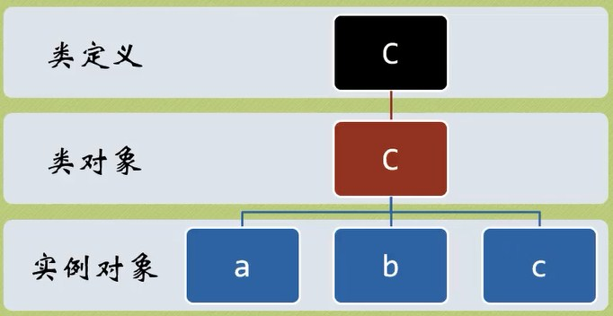

### 对象

&emsp;&emsp;对象就是属性加上方法：<!--more-->

``` python
class Turtle:  # Python中的类名约定以大写字母开头
    # 属性
    color = "green"
    legs = 4
    shell = True
    mouth = "大嘴"

    # 方法
    def climb(self):
        print("我在努力地往前爬......")

    def bite(self):
        print("咬死你！")

    def sleep(self):
        print("我要睡了！")

tt = Turtle()  # 创建对象实例
Turtle()  # 结果为<__main__.Turtle object at 0x024AD650>
tt.climb()  # 结果为“我在努力地往前爬......”
tt.bite()  # 结果为“咬死你！”
tt.sleep()  # 结果为“我要睡了！”
```

&emsp;&emsp;面向对象的特征：

- 封装：信息屏蔽技术。
- 继承：继承是子类自动共享父类之间数据和方法的机制。
- 多态：同一操作作用于不同的对象，可以有不同的解释，产生不同的执行结果。

&emsp;&emsp;关于封装：

``` python
list1 = [2, 1, 7, 5, 3]
list1.sort()
list1  # 结果为[1, 2, 3, 5, 7]
list1.append(9)
list1  # 结果为[1, 2, 3, 5, 7, 9]
```

关于继承：

``` python
class MyList(list):  # 让MyList继承list
    pass  # 占位符，无作用

list2 = MyList()
list2.append(5)
list2.append(3)
list2.append(7)
list2  # 结果为[5, 3, 7]
list2.sort()
list2  # 结果为[3, 5, 7]
```

关于多态：

``` python
class A:  # 创建A类
    def fun(self):
        print("我是A...")

class B:  # 创建B类
    def fun(self):
        print("我是B...")

a = A()  # 创建A类对象实例
b = B()  # 创建B类对象实例
a.fun()  # 结果为“我是A...”
b.fun()  # 结果为“我是B...”
```

`Python`的`self`相当于`C++`的`this`指针。`Python`可以产生无数个对象，每个对象需要`self`区分自己的数据和方法。在终端输入：

``` python
class Ball:
    def setName(self, name):
        self.name = name

    def kick(self):
        print("我叫%s，谁踢我的" % self.name)

a = Ball()
a.setName("球A")
b = Ball()
b.setName("球B")
a.kick()  # 结果为“我叫球A，谁踢我的”
b.kick()  # 结果为“我叫球B，谁踢我的”
```

#### \_\_init\_\_方法

&emsp;&emsp;在`Python`对象实例创建的时候，`__init__`方法会被自动调用，即`__init__(self)`，相当于`C++`的构造函数。我们可以重写这些方法，具体为`__init__(self, param1, param2, ...)`。在终端输入：

``` python
class Ball:
    def __init__(self, name):
        self.name = name

    def kick(self):
        print("我叫%s，谁踢我的" % self.name)

b = Ball("土豆")
b.kick()  # 结果为“我叫土豆，谁踢我的”
```

`Python`运用`name mangling`(名字改编或名字重整)技术实现私有变量和私有方法：

``` python
class Person():
    __name = "fool"  # 私有变量

p = Person()
p.name  # 结果为“出错”
p.__name  # 结果为“出错”
# ------------------
class Person():
    __name = "fool"

    def getName(self):  # 创建访问私有变量的方法
        return self.__name

p = Person()
p.getName()  # “fool”
```

在`Python`中定义私有变量只需要在变量名或函数名前加上`__`两个下划线，那么这个函数或变量就会成为私有的。其实`Python`并没有私有机制，它是`伪私有`，只是把变量名改为`_类名__变量名`，也可以访问变量：

``` python
p._Person__name  # 结果为“fool”
```

#### 关于self

&emsp;&emsp;类的方法与普通的函数只有一个特别的区别：它们必须有一个额外的第一个参数名称，按照惯例，它的名称是`self`。

``` python
class Test:
    def prt(self):
        print(self)
        print(self.__class__)

t = Test()
t.prt()
```

执行结果：

``` python
<__main__.Test object at 0x00000000021CB1D0>
<class '__main__.Test'>
```

可以很明显地看出，`self`代表的是类的实例，代表当前对象的地址，而`self.class`则指向类。`self`不是`python`关键字，我们把它换成`runoob`也是可以正常执行的：

``` python
class Test:
    def prt(runoob):
        print(runoob)
        print(runoob.__class__)

t = Test()
t.prt()
```

### 继承

&emsp;&emsp;继承如下：

``` python
            子类       基类、父类或超类
class DerivedClassName(BaseClassName):
    ...
```

`BaseClassName`必须与派生类定义在一个作用域内。除了类，还可以用表达式，当基类定义在另一个模块中时，这一点非常有用：

``` python
class DerivedClassName(modname.BaseClassName):
```

&emsp;&emsp;在终端输入：

``` python
class Parent:  # 定义父类
    def hello(self):
        print("正在调用父类的方法")

class Child(Parent):  # 定义子类
    pass

p = Parent()
p.hello()  # 结果为“正在调用父类的方法”
c = Child()
c.hello()  # 结果为“正在调用父类的方法”
# --------------------------------------
class Child(Parent):
    def hello(self):
        print("正在调用子类的方法")

c = Child()
c.hello()  # 结果为“正在调用子类的方法”
```

&emsp;&emsp;下面是类源程序：

``` python
import random as r

class Fish:
    def __init__(self):
        self.x = r.randint(0, 10)
        self.y = r.randint(0, 10)

    def move(self):
        self.x -= 1
        print("我的位置是：", self.x, self.y)

class Goldfish(Fish):
    pass

class Carp(Fish):
    pass

class Shark(Fish):
    def __init__(self):
        self.hungry = True

    def eat(self):
        if self.hungry:
            print("吃货的梦想就是天天有的吃！")
            self.hungry = False
        else:
            print("我吃不下了！")
```

以下是执行结果：

``` python
fish = Fish()
fish.move()  # 结果为“我的位置是：4 6”
fish.move()  # 结果为“我的位置是：3 6”
goldfish = Goldfish()
goldfish.move()  # 结果为“我的位置是：0 6”
goldfish.move()  # 结果为“我的位置是：-1 6”
shark = Shark()
shark.eat()  # 结果为“吃货的梦想就是天天有的吃！”
shark.eat()  # 结果为“我吃不下了！”
shark.move()  # 结果为“出错”，是因为子类的“__init__”方法覆盖了父类的“__init__”方法
```

解决方法有两个：调用未绑定的父类方法；使用`super`函数。
&emsp;&emsp;调用未绑定的父类方法，对`Shark`类进行修改：

``` python
class Shark(Fish):
    def __init__(self):
        Fish.__init__(self)  # 注意，这里的self还是Shark的self
        self.hungry = True

    def eat(self):
        if self.hungry:
            print("吃货的梦想就是天天有的吃！")
            self.hungry = False
        else:
            print("我吃不下了！")

shark = Shark()
shark.move()  # 结果为“我的位置是：4 4”
Fish.__init__()  # 结果为“出错”
Fish.__init__(shark)
shark.move()  # 结果为“我的位置是：-1 2”
```

&emsp;&emsp;使用`super`函数，对`Shark`类进行修改：

``` python
class Shark(Fish):
    def __init__(self):
        super().__init__()
        self.hungry = True

    def eat(self):
        if self.hungry:
            print("吃货的梦想就是天天有的吃！")
            self.hungry = False
        else:
            print("我吃不下了！")

shark = Shark()
shark.move()  # 结果为“我的位置是：2 2”
```

&emsp;&emsp;多重继承是一个子类继承多个父类：

``` python
class DerivedClassName(base1, base2, base3):
    ...
```

需要注意圆括号中基类的顺序，若是基类中有相同的方法名，而在子类使用时未指定，则`python`从左到右查找基类中是否包含方法。
&emsp;&emsp;在终端输入：

``` python
class Base1:  # 定义Base1类
    def foo1(self):
        print("我是foo1，我为Base1代言")

class Base2:  # 定义Base2类
    def foo2(self):
        print("我是foo2，我为Base2代言")

class C(Base1, Base2):  # 定义C类
    pass

c = C()
c.foo1()  # 结果为“我是foo1，我为Base1代言”
c.foo2()  # 结果为“我是foo2，我为Base2代言”
```

注意，多重继承可能会让程序产生不可预见的错误，而不可预见的错误对程序来说是致命的！

### 组合

&emsp;&emsp;现在要求定义一个类，叫水池，水池里要有乌龟和鱼：

``` python
class Turtle:
    def __init__(self, x):
        self.num = x

class Fish:
    def __init__(self, x):
        self.num = x

class Pool:
    def __init__(self, x, y):
        self.turtle = Turtle(x)
        self.fish = Fish(y)

    def print_num(self):
        print("水池里共有乌龟%d只，小鱼%d条！" % (self.turtle.num, self.fish.num))

pool = Pool(1, 10)
pool.print_num()  # 结果为“水池里共有乌龟1只，小鱼10条！”
```

组合就是把旧类的实例化放入一个新类里面，那么就把旧类组合进去了。把几个没有直线关系的类放到一起，就是组合！

#### 类、类对象和实例对象

&emsp;&emsp;在终端输入：

``` python
class C:
    count = 0

a = C()
b = C()
c = C()
a.count  # 结果为0
b.count  # 结果为0
c.count  # 结果为0
C.count  # 结果为0
c.count += 10
c.count  # 结果为10
a.count  # 结果为0
b.count  # 结果为0
C.count += 100
a.count  # 结果为100
b.count  # 结果为100
c.count  # 结果为10
```

在进行`c.count += 10`时，实例对象`c`生成了一个实例属性`count`来覆盖原来的类属性`count`。



注意，当属性和方法重名时，属性会覆盖方法：

``` python
class C:
    def x(self):
        print("X-man")

c = C()
c.x()  # 结果为“X-man”
c.x = 1
c.x  # 结果为1
c.x()  # 结果为“出错”
```

要记住，不要在一个类里边定义出所有能想到的特性和方法，应该利用继承和组合机制来进行扩展；用不同的词性命名，如属性名用名词，方法名用动词。

#### 绑定

&emsp;&emsp;`Python`严格要求方法需要有实例才能被调用，这种限制其实就是`Python`所谓的绑定概念，即`self`机制。在终端输入：

``` python
class BB:
    def printBB():
        print("no zuo no dai")

BB.printBB()  # 结果为“no zuo no dai”
bb = BB()
bb.printBB()  # 结果为“出错”
# ---------------------------
class CC:
    def setXY(self, x, y):
        self.x = x
        self.y = y

    def printXY(self):
        print(self.x, self.y)

dd = CC()
dd.__dict__  # 结果为“{}”，“__dict__”查看对象所拥有的属性
CC.__dict__  # 结果很长，略过
dd.setXY(4, 5)  # 类似于dd.setXY(dd, 4, 5)
dd.__dict__  # 结果为“{'y': 5, 'x': 4}”
CC.__dict__  # 结果很长，与上一次一样，略过
del CC
ee = CC()  # 结果为“出错”
dd.printXY()  # 结果为“4 5”
```

类中定义的属性是静态的，方法也是静态的，就算类对象被删除了，它们依旧存在内存中。在编程中，要考虑使用实例属性如`self.x`、`self.y`，`self`相当于实例的名字；尽量不要用类属性，类属性通常用于跟踪与类相关的值。

### 构造和析构

&emsp;&emsp;`__init__`函数原型如下：

``` python
__init__(self [, ...])
```

`__init__`的返回值是`None`。实际上，当实例对象产生时，第一个被调用的函数是`__new__(cls[, ...])`。在终端输入：

``` python
class Rectangle:
    def __init__(self, x, y):
        self.x = x
        self.y = y

    def getPeri(self):
        return (self.x + self.y) * 2

    def getArea(self):
        return self.x * self.y

rect = Rectangle(3, 4)
rect.getPeri()  # 结果为14
rect.getArea()  # 结果为12
# --------------------
class A:
    def __init__(self):
        return "I am A"

a = A()  # 结果为“出错”
# --------------------
class Capstr(str):
    def __new__(cls, string):
        string = string.upper()
        print("string is " + string)  # 结果为“string is I LOVE YOU”
        return str.__new__(cls, string)
        # return string

a = Capstr("I love you")
print(a)  # 结果为“I LOVE YOU”
```

当继承一个不可变类型的时候，又需要进行修改的时候，就需要修改`__new__`方法。`__new__`方法需要返回一个实例化的对象。
&emsp;&emsp;`__init__`和`__new__`都是构造函数，`__del__(self)`是析构函数。在终端输入：

``` python
class C:
    def __init__(self):
        print("我是__init__")

    def __del__(self):
        print("我是__del__")

c1 = C()  # 结果为“我是__init__”
c2 = c1
c3 = c2
del c3
del c2
del c1  # 结果为“我是__del__”
```