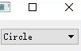

&emsp;&emsp;`QComboBox`提供了下拉列表框的控件，下面简单地介绍几个的方法和属性。<!--more-->
&emsp;&emsp;`addItems`在列表的最后一项添加一个文本内容为`text`选项：

``` cpp
void addItem ( const QString &text, const QVariant &userData = QVariant() );
void addItem ( const QIcon &icon, const QString &text, const QVariant &userData = QVariant() );
```

&emsp;&emsp;`currentText`返回下拉列表框中当前选中的文本：

``` cpp
QString currentText() const;
```

&emsp;&emsp;`count`返回当前列表框中选项数量：

``` cpp
int count() const;
```

&emsp;&emsp;`currentIndex`返回当前列表框中选中文本的序号：

``` cpp
int currentIndex() const;
```

&emsp;&emsp;代码如下：

``` cpp
#include "widget.h"
#include <QComboBox>
#include <QLayout>
#include <QDebug>

Widget::Widget ( QWidget *parent ) : QWidget ( parent ) {
    QComboBox *combobox = new QComboBox ( this );
    combobox->addItem ( tr ( "Circle" ) );
    combobox->addItem ( tr ( "Pology" ) );
    QGridLayout *mainLayout = new QGridLayout ( this );
    mainLayout->addWidget ( combobox, 0, 0 );
    qDebug() << "Now there are " << combobox->count() << "Items";
    qDebug() << "The current item is" << combobox->currentText();
}

Widget::~Widget() {
}
```



执行结果：

``` cpp
Now there are 2 Items
The current item is "Circle"
```