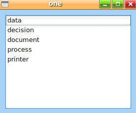
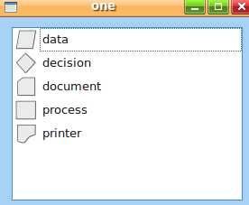
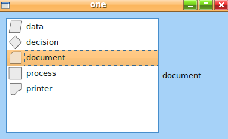
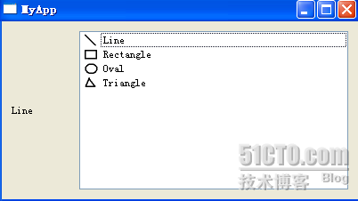
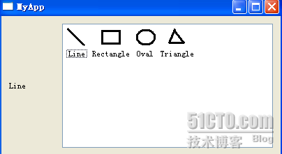
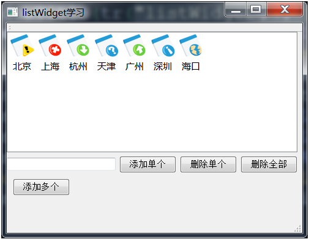

&emsp;&emsp;`QListWidget`可以显示一个清单，清单中的每个项目是`QListWidgetItem`的一个实例，每个项目可以通过`QListWidgetItem`来操作。可以通过`QListWidgetItem`来设置每个项目的图像与文字。<!--more-->
&emsp;&emsp;示例`1`如下：

``` cpp
#include <QApplication>
#include <QWidget>
#include <QVBoxLayout>
#include <QListWidget>
#include <QListWidgetItem>

int main ( int argc, char **argv ) {
    QApplication app ( argc, argv );
    QWidget *widget = new QWidget;
    QListWidget *listWidget = new QListWidget;
    QVBoxLayout *layout = new QVBoxLayout;
    QListWidgetItem *lst1 = new QListWidgetItem ( "data", listWidget );
    QListWidgetItem *lst2 = new QListWidgetItem ( "decision", listWidget );
    QListWidgetItem *lst3 = new QListWidgetItem ( "document", listWidget );
    QListWidgetItem *lst4 = new QListWidgetItem ( "process", listWidget );
    QListWidgetItem *lst5 = new QListWidgetItem ( "printer", listWidget );
    listWidget->insertItem ( 1, lst1 );
    listWidget->insertItem ( 2, lst2 );
    listWidget->insertItem ( 3, lst3 );
    listWidget->insertItem ( 4, lst4 );
    listWidget->insertItem ( 5, lst5 );
    listWidget->show();
    layout->addWidget ( listWidget );
    widget->setLayout ( layout );
    widget->show();
    app.exec();
}
```



&emsp;&emsp;示例`2`如下：

``` cpp
#include <QApplication>
#include <QWidget>
#include <QVBoxLayout>
#include <QListWidget>
#include <QListWidgetItem>

int main ( int argc, char **argv ) {
    QApplication app ( argc, argv );
    QWidget *widget = new QWidget;
    QListWidget *listWidget = new QListWidget;
    QVBoxLayout *layout = new QVBoxLayout;
    QListWidgetItem *lst1 = new QListWidgetItem ( QIcon ( "images/data.png" ), "data", listWidget );
    QListWidgetItem *lst2 = new QListWidgetItem ( QIcon ( "images/decision.png" ), "decision", listWidget );
    QListWidgetItem *lst3 = new QListWidgetItem ( QIcon ( "images/document.png" ), "document", listWidget );
    QListWidgetItem *lst4 = new QListWidgetItem ( QIcon ( "images/process.png" ), "process", listWidget );
    QListWidgetItem *lst5 = new QListWidgetItem ( QIcon ( "images/printer.png" ), "printer", listWidget );
    listWidget->insertItem ( 1, lst1 );
    listWidget->insertItem ( 2, lst2 );
    listWidget->insertItem ( 3, lst3 );
    listWidget->insertItem ( 4, lst4 );
    listWidget->insertItem ( 5, lst5 );
    listWidget->show();
    layout->addWidget ( listWidget );
    widget->setLayout ( layout );
    widget->show();
    app.exec();
}
```



&emsp;&emsp;示例`3`如下：

``` cpp
#include <QApplication>
#include <QWidget>
#include <QHBoxLayout>
#include <QListWidget>
#include <QListWidgetItem>
#include <QLabel>

int main ( int argc, char **argv ) {
    QApplication app ( argc, argv );
    QWidget *widget = new QWidget;
    QListWidget *listWidget = new QListWidget;
    QHBoxLayout *layout = new QHBoxLayout;
    QLabel *label = new QLabel;
    label->setFixedWidth ( 100 );
    QListWidgetItem *lst1 = new QListWidgetItem ( QIcon ( "images/data.png" ), "data", listWidget );
    QListWidgetItem *lst2 = new QListWidgetItem ( QIcon ( "images/decision.png" ), "decision", listWidget );
    QListWidgetItem *lst3 = new QListWidgetItem ( QIcon ( "images/document.png" ), "document", listWidget );
    QListWidgetItem *lst4 = new QListWidgetItem ( QIcon ( "images/process.png" ), "process", listWidget );
    QListWidgetItem *lst5 = new QListWidgetItem ( QIcon ( "images/printer.png" ), "printer", listWidget );
    listWidget->insertItem ( 1, lst1 );
    listWidget->insertItem ( 2, lst2 );
    listWidget->insertItem ( 3, lst3 );
    listWidget->insertItem ( 4, lst4 );
    listWidget->insertItem ( 5, lst5 );
    QObject::connect (
        listWidget, SIGNAL ( currentTextChanged ( const QString & ) ),
        label, SLOT ( setText ( const QString & ) ) );
    listWidget->show();
    layout->addWidget ( listWidget );
    layout->addWidget ( label );
    widget->setLayout ( layout );
    widget->show();
    app.exec();
}
```



---

&emsp;&emsp;`QListWidget`为我们展示一个`List`列表的视图。
&emsp;&emsp;`listwidget.h`如下：

``` cpp
#ifndef LISTWIDGET_H
#define LISTWIDGET_H

#include <QtGui>

class ListWidget : public QWidget {
public:
    ListWidget();
private:
    QLabel *label;
    QListWidget *list;
};

#endif // LISTWIDGET_H
```

&emsp;&emsp;`listwidget.cpp`如下：

``` cpp
#include "listwidget.h"

ListWidget::ListWidget() {
    label = new QLabel;
    label->setFixedWidth ( 70 );
    list = new QListWidget;
    list->addItem ( new QListWidgetItem ( QIcon ( ":/images/line.PNG" ), tr ( "Line" ) ) );
    list->addItem ( new QListWidgetItem ( QIcon ( ":/images/rect.PNG" ), tr ( "Rectangle" ) ) );
    list->addItem ( new QListWidgetItem ( QIcon ( ":/images/oval.PNG" ), tr ( "Oval" ) ) );
    list->addItem ( new QListWidgetItem ( QIcon ( ":/images/tri.PNG" ), tr ( "Triangle" ) ) );
    QHBoxLayout *layout = new QHBoxLayout;
    layout->addWidget ( label );
    layout->addWidget ( list );
    setLayout ( layout );
    connect ( list, SIGNAL ( currentTextChanged ( QString ) ), label, SLOT ( setText ( QString ) ) );
}
```

&emsp;&emsp;`main.cpp`如下：

``` cpp
#include <QtGui>
#include "listwidget.h"

int main ( int argc, char *argv[] ) {
    QApplication a ( argc, argv );
    ListWidget lw;
    lw.resize ( 400, 200 );
    lw.show();
    return a.exec();
}
```

`ListWidget`类中包含一个`QLabel`对象和一个`QListWidget`对象。创建这个`QListWidget`对象很简单，只需要使用`new`运算符创建出来，然后调用`addItem`函数即可将`item`添加到这个对象中。我们添加的对象是`QListWidgetItem`的指针，`addItem`有四个重载的函数，我们使用的是其中的一个：它接受两个参数，第一个是`QIcon`引用类型，作为`item`的图标；第二个是`QString`类型，作为这个`item`后面的文字说明。当然也可以使用`insertItem`函数在特定的位置动态地增加`item`。最后将这个`QListWidget`的`currentTextChanged`信号同`QLabel`的`setText`连接起来，这样在点击`item`时，`label`的文字就可以改变了。



我们还可以设置`viewModel`这个参数，来使用不同的视图进行显示：

``` cpp
list->setViewMode ( QListView::IconMode );
```



---

### QListWidget控件的使用

&emsp;&emsp;`Qt`提供了`QListWidget`类列表框控件，用来加载并显示多个列表项。`QListWidgetItem`类就是列表项类，一般列表框控件中的列表项有两种加载方式：一种是由用户手动添加的列表项，比如音乐播放器中加载音乐文件的文件列表，每一个音乐文件都是一个列表项。对于这种列表项，用户可以进行增加、删除、单击以及双击等操作。一种是由程序员事先编写好，写在程序中供用户选择的列表项，比如餐厅的电子菜单，每一道菜对应一个列表项。对于这种列表项，用户可以进行单机和双击操作(增加和删除操作也是可以进行的，但是一般的点菜系统会屏蔽掉这种功能)。
&emsp;&emsp;`QListWidget`类列表框控件支持两种列表项显示方式，即`QListView::IconMode`和`QListView::ListMode`。



&emsp;&emsp;`main.cpp`如下：

``` cpp
#include <QtGui/QApplication>
#include "mainwindow.h"
#include <QTextCodec>

int main ( int argc, char *argv[] ) {
    QApplication a ( argc, argv );
    /* Qt文本的国际化显示 */
    QTextCodec::setCodecForTr ( QTextCodec::codecForName ( "GB18030" ) );
    QTextCodec::setCodecForLocale ( QTextCodec::codecForName ( "GB18030" ) );
    QTextCodec::setCodecForCStrings ( QTextCodec::codecForName ( "GB18030" ) );
    MainWindow w;
    w.show();
    return a.exec();
}
```

&emsp;&emsp;`mainwindow.h`如下：

``` cpp
#ifndef MAINWINDOW_H
#define MAINWINDOW_H
#include <QMainWindow>
#include <QtDebug>
#include <QMessageBox>
#include <QListWidgetItem> /* 列表框空间头文件 */
#include <QFileDialog> /* 文件对话框控件 */
#include <QStringList> /* 字符串容器 */
#include <QDir> /* 目录类头文件 */
#include <QString>

namespace Ui {
    class MainWindow;
}

class MainWindow : public QMainWindow {
    Q_OBJECT
public:
    explicit MainWindow ( QWidget *parent = 0 );
    ~MainWindow();
private:
    Ui::MainWindow *ui;
private slots:
    void addbtn();
    void deletebtn();
    void delallbtn();
    void addallbtn();
    void singleclicked ( QListWidgetItem *item );
    void doubleclicked ( QListWidgetItem *item );
};
#endif // MAINWINDOW_H
```

&emsp;&emsp;`mainwindow.cpp`如下：

``` cpp
#include "mainwindow.h"
#include "ui_mainwindow.h"

MainWindow::MainWindow ( QWidget *parent ) : QMainWindow ( parent ), ui ( new Ui::MainWindow ) {
    ui->setupUi ( this );
    this->setWindowTitle ( tr ( "listWidget学习" ) ); /* 设置标题框文本 */
    ui->listWidget->setViewMode ( QListView::IconMode ); /* 设置显示模式为图标模式 */
    // ui->listWidget->setViewMode ( QListView::ListMode ); /* 设置显示模式为列表模式 */
    QObject::connect ( ui->AddButton, SIGNAL ( clicked() ), this, SLOT ( addbtn() ) );
    QObject::connect ( ui->lineEdit, SIGNAL ( returnPressed() ), this, SLOT ( addbtn() ) );
    QObject::connect ( ui->DeleteButton, SIGNAL ( clicked() ), this, SLOT ( deletebtn() ) );
    QObject::connect ( ui->DelAllButton, SIGNAL ( clicked() ), this, SLOT ( delallbtn() ) );
    QObject::connect ( ui->ShowDirButton, SIGNAL ( clicked() ), this, SLOT ( addallbtn() ) );
    QObject::connect (
        ui->listWidget, SIGNAL ( itemDoubleClicked ( QListWidgetItem * ) ),
        this, SLOT ( doubleclicked ( QListWidgetItem * ) ) );
}

MainWindow::~MainWindow() {
    delete ui;
}

void MainWindow::addbtn() { /* 添加单个列表项 */
    QString str = ui->lineEdit->text(); /* 获取行编辑框文本 */
    QListWidgetItem *item = new QListWidgetItem;
    item->setText ( str ); /* 设置列表项的文本 */
    ui->listWidget->addItem ( item ); /* 加载列表项到列表框 */
    // delete item; /* 此处若解除注释，将无法添加到列表框 */
    // item = NULL;
    ui->lineEdit->clear(); /* 清空行编辑框 */
}

void MainWindow::deletebtn() { /* 删除单个列表项 */
    /* 获取列表项的指针 */
    QListWidgetItem *item = ui->listWidget->takeItem ( ui->listWidget->currentRow() );
    delete item; /* 释放指针所指向的列表项 */
}

void MainWindow::delallbtn() { /* 删除多个列表项 */
    int num = ui->listWidget->count(); /* 获取列表项的总数目 */
    /* 将光标设置到列表框上，若注释该语句，则删除时，要手动将焦点设置到列表框，即点击列表项 */
    ui->listWidget->setFocus();

    for ( int i = 0; i < num; i++ ) { /* 逐个获取列表项的指针，并删除 */
        QListWidgetItem *item = ui->listWidget->takeItem ( ui->listWidget->currentRow() );
        delete item;
    }
}

void MainWindow::addallbtn() { /* 添加多个列表项 */
    QStringList FileNames = QFileDialog::getOpenFileNames (
        this, "打开", QDir::currentPath(), "所有文件(*.*);;文本文档(*.txt)" );
    //ui->listWidget->addItems ( FileNames ); /* 方法1：整体添加 */
    /* 方法2：逐个添加 */
    int index = 0, count = 0;
    count = FileNames.count(); /* 获取打开文件的总数目 */

    // for(index = 0; index < count; index++) /* 这样会报错，无法先取出栈底元素 */
    for ( index = count - 1; index >= 0; index-- ) { /* QList<QString>的数据结构是栈，只能从栈顶取元素 */
        QListWidgetItem *item = new QListWidgetItem;
        item->setText ( FileNames.takeAt ( index ) ); /* 逐个设置列表项的文本 */
        // qDebug() << FileNames.takeAt( index );
        ui->listWidget->addItem ( item ); /* 加载列表项到列表框 */
    }
}

void MainWindow::singleclicked ( QListWidgetItem *item ) { /* 列表项单击操作 */
    QMessageBox::information ( this, "单击消息", "单击" + item->text() );
}

void MainWindow::doubleclicked ( QListWidgetItem *item ) { /* 列表项双击操作 */
    QMessageBox::information ( this, "双击消息", "双击" + item->text() );
}
```

### 添加操作

&emsp;&emsp;添加操作又可以分为单列表项操作和多列表项操作。

- `void QListWidget::addItems ( const QStringList & labels )`：该函数用来将字符串列表中的全部字符串作为列表项添加到列表框中。
- `void QListWidget::addItem ( QListWidgetItem * item )`：该函数用来将一个列表项添加到列表框当中。注意，一个列表项只能被添加到列表框中一次，如果多次添加同一个列表项到列表框中，将导致不可预期的结果。
- `void QListWidget::addItem ( const QString & label )`：重载函数，用来将参数`label`所引用的字符串作为一个列表项，添加到列表框中。
- `int QList::count ()const and int QList::size () const`：上述两个函数的功能等价，都是用来返回列表中存储的对象元素的个数。
- `T QList::takeAt ( int i )`：该函数按照参数`i`指定的索引位置，将存储在列表中对应的对象元素移除并返回。返回类型为模板类型，由存储的数据的类型决定。索引值的大小范围为`0 <= i <= size()`。

注意，`QList<QString>`的数据结构是栈，只能从栈顶取元素。

### 删除操作

&emsp;&emsp;删除操作又可以分为单文件操作和多文件操作。删除单个列表项(删除列表框中的单个列表项)：

- `QListWidgetItem *QListWidget::takeItem ( int row )`：该函数用来将索引号为`row`的列表项从列表框移除，并返回该列表项的指针。
- `int currentRow() const`：该常成员函数用来获取当前列表项的索引号，并返回它。