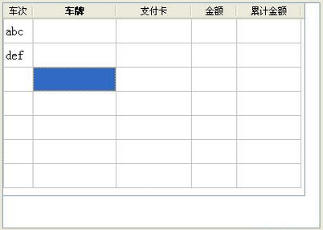
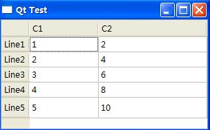

&emsp;&emsp;代码如下：<!--more-->

``` cpp
#include <QTableWidget>
/* 构造一个QTableWidget类的实体对象tableWidget */
tableWidget = new QTableWidget ( ui->textBrowser );
tableWidget->setRowCount ( 7 ); /* 设置行数为7 */
tableWidget->setColumnCount ( 5 ); /* 设置列数为5 */
tableWidget->setGeometry ( QRect ( 0, 0, 401, 241 ) ); /* 设置tableWidget的大小 */
tableWidget->setItem ( 0, 0, new QTableWidgetItem ( "abc" ) ); /* 第一行第一列的内容设置为“abc” */
tableWidget->setItem ( 1, 0, new QTableWidgetItem ( "def" ) ); /* 第二行第一列的内容设置为“abc” */
/* 40, 110, 100, 60, 85 */
tableWidget->setColumnWidth ( 0, 40 ); /* 设置第一列的列宽 */
tableWidget->setColumnWidth ( 1, 110 ); /* 设置第二列的列宽 */
tableWidget->setColumnWidth ( 2, 100 ); /* 设置第三列的列宽 */
tableWidget->setColumnWidth ( 3, 60 ); /* 设置第四列的列宽 */
tableWidget->setColumnWidth ( 4, 85 ); /* 设置第五列的列宽 */

/* 列表的标题为：车次、车牌、支付卡、金额、累计金额 */
tableWidget->setHorizontalHeaderLabels (
    QStringList() << tr ( "车次" ) << tr ( "车牌" ) \
                  << tr ( "支付卡" ) << tr ( "金额" ) << tr ( "累计金额" ) );
tableWidget->setFont ( QFont ( "wenquanyi", 12, 3 ) ); /* 设置字体 */
QHeaderView *headerView = tableWidget->verticalHeader();
headerView->setHidden ( true ); /* 行名隐藏 */
```



---

&emsp;&emsp;表格是`GUI`中常用的控件，`Qt`中常用的表格类是`QTableWidget`：

``` cpp
QTableWidget *table = new QTableWidget ( 4, 2 ); /* 新建一4行2列的表格 */

/* 设置表格行标题 */
QStringList headerLabels;
headerLabels << "C1" << "C2";
table->setHorizontalHeaderLabels ( headerLabels );

/* 设置表格行标题的对齐方式 */
table->horizontalHeader()->setDefaultAlignment ( Qt::AlignLeft );

/* 设置行表题 */
QStringList rowLabels;
rowLabels << "Line1" << "Line2" << "Line3" << "Line4";
table->setVerticalHeaderLabels ( rowLabels );

for ( int i = 0; i < 4; i++ ) { /* 设置每一行的高度 */
    table->setRowHeight ( i, 22 );
}

/* 自动调整最后一列的宽度使它和表格的右边界对齐 */
table->horizontalHeader()->setStretchLastSection ( true );
/* 设置表格的选择方式 */
table->setSelectionBehavior ( QAbstractItemView::SelectItems );
/* 设置编辑方式 */
table->setEditTriggers ( QAbstractItemView::DoubleClicked );

for ( int row = 0; row < 4; ++row ) { /* 设置表格的内容 */
    QTableWidgetItem *item0, *item1;
    item0 = new QTableWidgetItem;
    item1 = new QTableWidgetItem;
    QString txt = QString ( "%1" ).arg ( row + 1 );
    item0->setText ( txt );
    table->setItem ( row, 0, item0 );
    txt = QString ( "%1" ).arg ( ( row + 1 ) * 2 );
    item1->setText ( txt );
    table->setItem ( row, 1, item1 );
}

/* 增加一行 */
table->setRowCount ( 5 );
QTableWidgetItem *vHeader5 = new QTableWidgetItem ( "Line5" );
table->setVerticalHeaderItem ( 4, vHeader5 );
QTableWidgetItem *item5_0, *item5_1;
item5_0 = new QTableWidgetItem;
item5_1 = new QTableWidgetItem;
item5_0->setText ( QString ( "%1" ).arg ( 5 ) );
item5_1->setText ( QString ( "%1" ).arg ( 5 * 2 ) );
table->setItem ( 4, 0, item5_0 );
table->setItem ( 4, 1, item5_1 );
```

