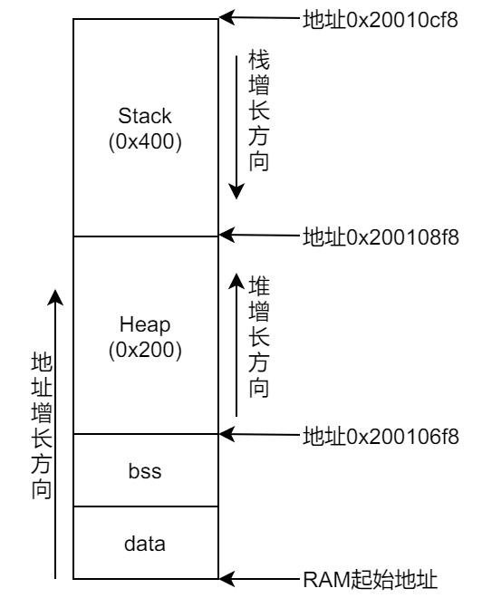

&emsp;&emsp;假设`Map`文件的内容如下：<!--more-->

``` cpp
HEAP  0x200106f8  Section  512  startup_stm32f2xx.o(HEAP)
STACK  0x200108f8  Section  1024  startup_stm32f2xx.o(STACK)

__heap_base  0x200106f8  Data  0  startup_stm32f2xx.o(HEAP)
__heap_limit  0x200108f8  Data  0  startup_stm32f2xx.o(HEAP)
__initial_sp  0x20010cf8  Data  0  startup_stm32f2xx.o(STACK)
```

- `__heap_base`：堆起始地址。
- `__heap_limit`：堆终止地址。
- `__initial_sp`：栈顶。

此时的`STM32`内存分布如下：

