&emsp;&emsp;`Liunx`下的`dialog`工具是一个可以和`shell`脚本配合使用的文本界面下的创建对话框的工具，每个对话框提供的输出有两种形式：

1. 将所有输出到`stderr`输出，不显示到屏幕。
2. 使用退出状态码，`OK`为`0`，`NO`为1，`ESC`为`255`。

&emsp;&emsp;通用选项如下(这些选项来设置`dialog box`的背景、颜色和标题等)：

- `--title <title>`：指定将在对话框的上方显示的标题字符串。
- `--no-shadow`：禁止阴影出现在每个对话框的底部。
- `--shadow`：应该是出现阴影效果。
- `--insecure`：输入部件的密码时，明文显示不安全，使用星号来代表每个字符。
- `--no-cancel`：设置在输入框、菜单和复选框中，不显示`cancel`项。
- `--clear`：完成清屏操作。在框体显示结束后，清除框体。这个参数只能单独使用，不能和别的参数联合使用。
- `--ok-label <str>`：覆盖使用`OK`按钮的标签，换做其他字符。
- `--cancel-label <str>`：功能同上。
- `--backtitle <backtitle>`：指定的`backtitle`字符串显示在背景顶端。
- `--begin <y> <x>`：指定对话框左上角在屏幕的上的做坐标。
- `--timeout <secs>`：超时(返回的错误代码)，如果用户在指定的时间内没有给出相应动作，就按超时处理。
- `--stderr`：以标准错误方式输出。
- `--stdout`：以标准方式输出。
- `--default-item <str>`：设置在一份清单，表格或菜单中的默认项目。通常在框中的第一项是默认。

&emsp;&emsp;常见的对话框控件选项有：

- `--calendar`：提供了一个日历，让你可以选择日期。
- `--checklist`：允许你显示一个选项列表，每个选项都可以被单独的选择(复选框)。
- `--from`：允许您建立一个带标签的文本字段，并要求填写。
- `--fselect`：提供一个路径，让你选择浏览的文件。
- `--gauge`：显示一个表，呈现出完成的百分比，就是显示出进度。
- `--infobox`：显示消息后，(没有等待响应)对话框立刻返回，但不清除屏幕(信息框)。
- `--inputbox`：让用户输入文本(输入框)。
- `--inputmenu`：提供一个可供用户编辑的菜单(可编辑的菜单框)。
- `--menu`：显示一个列表供用户选择(菜单框)。
- `--msgbox`：显示一条消息，并要求用户选择一个确定按钮(消息框)。
- `--pause`：显示一个表格用来显示一个指定的暂停期的状态。
- `--passwordbox`：显示一个输入框，它隐藏文本。
- `--passwordfrom`：显示一个来源于标签并且隐藏的文本字段。
- `--radiolist`：提供一个菜单项目组，只有一个项目，可以选择(单选框)。
- `--tailbox`：在一个滚动窗口文件中使用`tail`命令来显示文本。
- `--tailboxbg`：跟`tailbox`类似，但是在`background`模式下操作。
- `--textbox`：在带有滚动条的文本框中显示文件的内容(文本框)。
- `--timebox`：提供一个窗口，选择小时、分钟和秒。
- `--yesno`：提供一个带有`yes`和`no`按钮的简单信息框(是/否框)。

&emsp;&emsp;消息框格式如下：

``` shell
dialog --msgbox text height width
```

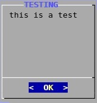

示例为：

``` shell
dialog --title TESTING --msgbox "this is a test" 10 20
```

&emsp;&emsp;`yesno`框格式如下：

``` shell
dialog --yesno text height width
```

示例为：

``` shell
dialog --title "yes/no" --no-shadow --yesno "Delete the file /tmp/chensiyao.txt?" 10 30
```

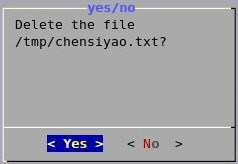

&emsp;&emsp;输入框格式如下：

``` shell
dialog --inputbox text height width
```

示例为：

``` shell
# 这里的“2>”是将错误信息输出重定向到了“/tmp/name.txt”文件中
dialog --title "Input your name" --inputbox "Please input your name:" 10 30 2> /tmp/name.txt
```

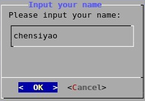

&emsp;&emsp;密码框格式如下：

``` shell
dialog --passwordbox text height width
```

示例为：

``` shell
dialog --title "Password" --passwordbox "Please give a password for the new user:" 10 35
```

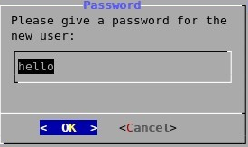

这样密码就暴露出来了，通常会加上一个安全选项`--insecure`，将每个字符用`*`来显示出来：

``` shell
dialog --title "Password" --insecure --passwordbox "Please give a password for the new user:" 10 30
```

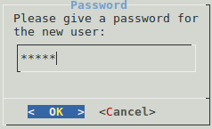

&emsp;&emsp;文本框格式如下：

``` shell
dialog --textbox file height width
```

示例为：

``` shell
dialog --title "The fstab" --textbox /etc/fstab 17 40
```

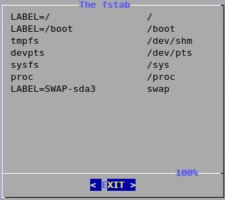

&emsp;&emsp;菜单框格式如下：

``` shell
dialog --menu text height width menu-height tag1 item1 tag2 item2 ...
```

示例为：

``` shell
dialog --title "Pick a choice" --menu "Choose one" 12 35 5 1 "say hello to everyone" 2 "thanks for your support" 3 "exit"
```

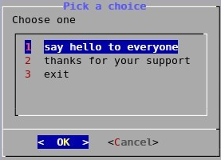

&emsp;&emsp;`Fselect`框(文件选框)格式如下：

``` shell
dialog --fselect filepath height width
```

示例为：

``` shell
dialog --title "Pick one file" --fselect /root/ 7 40
```

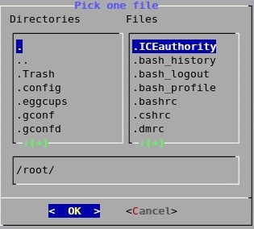

&emsp;&emsp;复选框格式如下：

``` shell
dialog --checklist "Test" height width menu-height tag1 item1 tag2 item2 ...
```

示例为：

``` shell
dialog --backtitle "Checklist" --checklist "Test" 20 50 10 Memory Memory_Size 1 Dsik Disk_Size 2
```

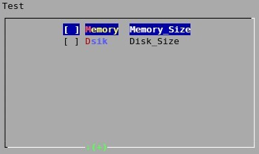

&emsp;&emsp;显示日历格式如下：

``` shell
dialog --calendar "Date" height width day month year
```

示例为：

``` shell
# 显示当前日期
dialog --title "Calendar" --calendar "Date" 5 50
```

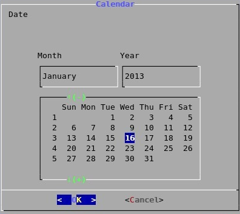

``` shell
# 显示指定日期
dialog --title "Calendar" --calendar "Date" 5 50 1 2 2013
```

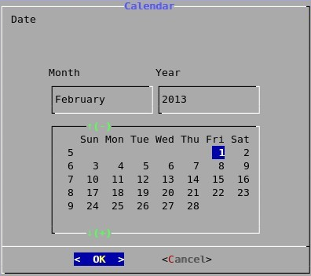

&emsp;&emsp;进度框架格式：

``` shell
dialog --gauge text height width [<percent>]
```

示例为：

``` cpp
# 固定进度显示
dialog --title "installation pro" --gauge "installation" 10 30 10
```

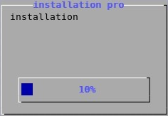

``` cpp
# 实时动度进度
for i in {1..100} ;do echo $i;done | dialog --title "installation pro" --gauge "installation" 10 30
```

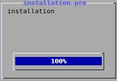

&emsp;&emsp;`form`框架(表单)格式如下：

``` shell
dialog --form text height width formheight [ label y x item y x flen ilen ] ...
```

其中`flen`表示`field length`，定义了选定字段中显示的长度；`ilen`表示`input-length`，定义了在外地输入的数据允许的长度。使用`up/down`(或`Ctrl-N`、`Ctrl-P`)在使用领域之间移动。使用`tab`键在窗口之间切换。示例为：

``` shell
dialog --title "Add a user" --form "Please input the infomation of new user:" 12 40 4  \
  "Username:" 1  1 "" 1  15  15  0  \
  "Full name:" 2  1 "" 2  15  15  0  \
  "Home Dir:" 3  1 "" 3  15  15  0  \
  "Shell:"    4   1 "" 4  15  15  0
```

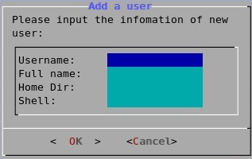

&emsp;&emsp;为了能够访问用户输入的结果，对于文本输入，你只需要重定向标准错误流或检查环境变量`$?`的内容，`$?`的值实际上就是前一个命令的退出状态：

``` shell
#!/bin/sh
​
dialog --title "Questionnaire" --msgbox "Welcome to my simple survey" 9 18
dialog --title "Confirm" --yesno "Are you willing to take part?" 9 18
​
if [ $? !=0 ]; then  # yes的返回码为0，“$?”为上一个命令的退出状态。
    dialog --infobox "Thank you anyway!" 5 20
    sleep 2
    dialog --clear  # “-clear”作用为清屏。
    exit 0
fi
​
# 重定向标准错误输出流(2)到“_1.txt”。
dialog --title "Questionnaire" --inputbox "Please enter your name" 9 30 2>_1.txt
Q_NAME=$(cat _1.txt)
dialog --menu "$Q_NAME,what music do you like best?" 15 30 4 1 "Classical" 2 "Jazz" 3 "Country" 4 "Other" 2>_1.txt
Q_MUSIC=$(cat _1.txt)
​
if [ "$Q_MUSIC" == "1" ]; then
    dialog --infobox "Good choice!" 5 20
else
    dialog --infobox "Thank you anyway" 5 20
fi
​
sleep 5
dialog --clear
exit 0
```