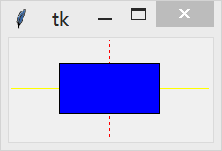
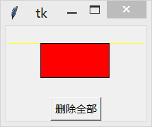
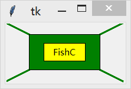
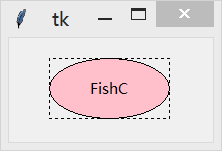
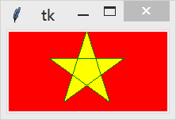
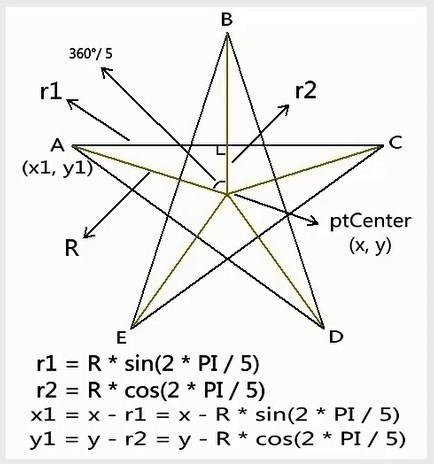
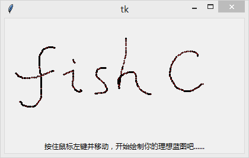
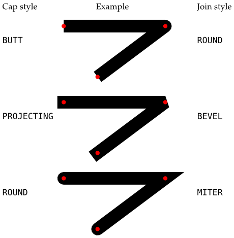

&emsp;&emsp;`Canvas`(画布)组件为`Tkinter`的图形绘制提供了基础。`Canvas`是一个高度灵活的组件，你可以用它绘制图形和图表，创建图形编辑器，并实现各种自定义的小部件。<!--more-->
&emsp;&emsp;`Canvas`是一个通用的组件，通常用于显示和编辑图形。你可以用它来绘制线段、圆形、多边形，甚至是绘制其它组件。

### 用法

&emsp;&emsp;在`Canvas`组件上绘制对象，可以用`create_xxx`的方法(`xxx`表示对象类型，例如线段`line`、矩形`rectangle`、文本`text`等)：

``` python
from tkinter import *

root = Tk()

w = Canvas(root, width=200, height=100)
w.pack()

w.create_line(0, 50, 200, 50, fill="yellow")  # 画一条黄色的横线
w.create_line(100, 0, 100, 100, fill="red", dash=(4, 4))  # 画一条红色的竖线(虚线)
w.create_rectangle(50, 25, 150, 75, fill="blue")  # 中间画一个蓝色的矩形

mainloop()
```



添加到`Canvas`上的对象会一直保留直着。如果你希望修改它们，你可以使用`coords`、`itemconfig`和`move`方法来移动画布上的对象，或者使用`delete`方法来删除：

``` python
line1 = w.create_line(0, 50, 200, 50, fill="yellow")
line2 = w.create_line(100, 0, 100, 100, fill="red", dash=(4, 4))
rect1 = w.create_rectangle(50, 25, 150, 75, fill="blue")

w.coords(line1, 0, 25, 200, 25)
w.itemconfig(rect1, fill="red")
w.delete(line2)

Button(root, text="删除全部", command=(lambda x=ALL: w.delete(x))).pack()
```



&emsp;&emsp;你还可以在`Canvas`上显示文本，使用的是`create_text`方法：

``` python
w.create_line(0, 0, 200, 100, fill="green", width=3)
w.create_line(200, 0, 0, 100, fill="green", width=3)
w.create_rectangle(40, 20, 160, 80, fill="green")
w.create_rectangle(65, 35, 135, 65, fill="yellow")

w.create_text(100, 50, text="FishC")
```



&emsp;&emsp;使用`create_oval`方法绘制椭圆形(或圆形)，参数是指定一个限定矩形(`Tkinter`会自动在这个矩形内绘制一个椭圆)：

``` python
w.create_rectangle(40, 20, 160, 80, dash=(4, 4))
w.create_oval(40, 20, 160, 80, fill="pink")
w.create_text(100, 50, text="FishC")
```



&emsp;&emsp;你想要绘制多边形，可以使用`create_polygon`方法：

``` python
from tkinter import *
import math as m

root = Tk()

w = Canvas(root, width=200, height=100, background="red")
w.pack()

center_x = 100
center_y = 50
r = 50

points = [
    # 左上点
    center_x - int(r * m.sin(2 * m.pi / 5)),
    center_y - int(r * m.cos(2 * m.pi / 5)),
    # 右上点
    center_x + int(r * m.sin(2 * m.pi / 5)),
    center_y - int(r * m.cos(2 * m.pi / 5)),
    # 左下点
    center_x - int(r * m.sin(m.pi / 5)),
    center_y + int(r * m.cos(m.pi / 5)),
    # 顶点
    center_x,
    center_y - r,
    # 右下点
    center_x + int(r * m.sin(m.pi / 5)),
    center_y + int(r * m.cos(m.pi / 5)),
]

w.create_polygon(points, outline="green", fill="yellow")

mainloop()
```



&emsp;&emsp;五角星的画法如下：



&emsp;&emsp;有点遗憾的是，`Tkinter`并没有提供画`点`的方法。不过，我们可以通过绘制一个超小的椭圆形来表示一个`点`。下边例子中，通过响应`鼠标左键按住拖动`事件(`B1-Motion>`)，我们在鼠标拖动的同时获取鼠标的实时位置`(x, y)`，并绘制一个超小的椭圆来代表一个`点`：

``` python
from tkinter import *

root = Tk()

w = Canvas(root, width=400, height=200)
w.pack()

def paint(event):
    x1, y1 = (event.x - 1), (event.y - 1)
    x2, y2 = (event.x + 1), (event.y + 1)
    w.create_oval(x1, y1, x2, y2, fill="red")

w.bind("<B1-Motion>", paint)

Label(root, text="按住鼠标左键并移动，开始绘制你的理想蓝图吧......").pack(side=BOTTOM)

mainloop()
```



### Canvas组件支持对象

- `arc`(弧形、弦或扇形)
- `bitmap`(内建的位图文件或`XBM`格式的文件)
- `image`(`BitmapImage`或`PhotoImage`的实例对象)
- `line`(线)
- `oval`(圆或椭圆形)
- `polygon`(多边形)
- `rectangle`(矩形)
- `text`(文本)
- `window`(组件)

其中，弦、扇形、椭圆形、圆形、多边形和矩形这些`封闭式`图形都是由轮廓线和填充颜色组成的，但都可以设置为透明(传入空字符串表示透明)。

### 坐标系

&emsp;&emsp;由于画布可能比窗口大(带有滚动条的`Canvas`组件)，因此`Canvas`组件可以选择使用两种坐标系：

- 窗口坐标系：以窗口的左上角作为坐标原点。
- 画布坐标系：以画布的左上角作为坐标原点。

将窗口坐标系转换为画布坐标系，可以使用`canvasx`或`canvasy`方法：

``` python
def callback(event):
    canvas = event.widget
    x = canvas.canvasx(event.x)
    y = canvas.canvasy(event.y)
    print(canvas.find_closest(x, y))
```

### 画布对象显示的顺序

&emsp;&emsp;`Canvas`组件中创建的画布对象都会被列入显示列表中，越接近背景的画布对象位于显示列表的越下方。显示列表决定当两个画布对象重叠的时候是如何覆盖的(默认情况下新创建的会覆盖旧的画布对象的重叠部分，即位于显示列表上方的画布对象将覆盖下方那个)。当然，显示列表中的画布对象可以被重新排序。

### 指定画布对象

&emsp;&emsp;`Canvas`组件提供几种方法让你指定画布对象：

- `Item handles`
- `Tags`
- `ALL`
- `CURRENT`

&emsp;&emsp;`Item handles`事实上是一个用于指定某个画布对象的整型数字(也成为画布对象的`ID`)。当你在`Canvas`组件上创建一个画布对象的时候，`Tkinter`将自动为其指定一个在该`Canvas`组件中独一无二的整型值。然后各种`Canvas`的方法可以通过这个值操纵该画布对象。
&emsp;&emsp;`Tags`是附在画布对象上的标签，`Tags`由普通的非空白字符串组成。一个画布对象可以与多个`Tags`相关联，一个`Tag`也可用于描述多个画布对象。然而，与`Text`组件不同，没有指定画布对象的`Tags`不能进行事件绑定和配置样式。也就是说，`Canvas`组件的`Tags`是仅为画布对象所拥有。
&emsp;&emsp;`Canvas`组件预定义了两个`Tags`(`ALL`和`CURRENT`)：

- `ALL`(或`all`)表示`Canvas`组件中的所有画布对象。
- `CURRENT`(或`current`)表示鼠标指针下的画布对象(如果有的话)。

### 参数

&emsp;&emsp;`Canvas(master=None, **options) (class)`：`master`是父组件；`options`是组件选项，下方表格列举了各个选项的具体含义和用法：

选项                  | 含义
----------------------|-----
`background`          | 指定`Canvas`的背景颜色
`bg`                  | 跟`background`一样
`borderwidth`         | 指定`Canvas`的边框宽度
`bd`                  | 跟`borderwidth`一样
`closeenough`         | 指定一个距离，当鼠标与画布对象的距离小于该值时，鼠标被认为在画布对象上。该选项是一个浮点类型的值
`confine`             | 指定`Canvas`组件是否允许滚动超出`scrollregion`选项指定的范围，默认值是`True`
`cursor`              | 指定当鼠标在`Canvas`上飘过的时候的鼠标样式
`height`              | 指定`Canvas`的高度，单位是像素
`highlightbackground` | 指定当`Canvas`没有获得焦点的时候高亮边框的颜色
`highlightcolor`      | 指定当`Canvas`获得焦点的时候高亮边框的颜色
`highlightthickness`  | 指定高亮边框的宽度
`relief`              | 指定`Canvas`的边框样式，默认值是`FLAT`，还可以选择`SUNKEN`、`RAISED`、`GROOVE`和`RIDGE`
`scrollregion`        | 指定`Canvas`可以被滚动的范围，该选项的值是一个`4`元组`(x1, y1, x2, y2)`表示的矩形
`selectbackground`    | 指定当画布对象被选中时的背景色
`selectborderwidth`   | 指定当画布对象被选中时的边框宽度(选中边框)
`selectforeground`    | 指定当画布对象被选中时的前景色
`state`               | 设置`Canvas`的状态：`NORMAL`或`DISABLED`，默认值是`NORMAL`。注意，该值不会影响画布对象的状态
`takefocus`           | 指定使用`Tab`键可以将焦点移动到输入框中，默认是开启的，可以将该选项设置为`False`避免焦点在此输入框中
`width`               | 指定`Canvas`的宽度，单位是像素
`xscrollcommand`      | 与`scrollbar`(滚动条)组件相关联(水平方向)，使用方法可以参考`Scrollbar`组件
`xscrollincrement`    | 该选项指定`Canvas`水平滚动的`步长`。例如`3c`表示`3`厘米，还可以选择的单位有`i`(英寸)、`m`(毫米)和`p`(`DPI`，`1i`约等于`72p`)。默认值是`0`，表示可以水平滚动到任意位置
`yscrollcommand`      | 与`scrollbar`(滚动条)组件相关联(垂直方向)，使用方法可以参考`Scrollbar`组件
`yscrollincrement`    | 该选项指定`Canvas`垂直滚动的`步长`，例如`3c`表示`3`厘米，还可以选择的单位有`i`(英寸)、`m`(毫米)和`p`(`DPI`，`1i`约等于`72p`)。默认值是`0`，表示可以水平滚动到任意位置

### 方法

- `addtag(tag, method, *args)`：添加一个`Tag`到一系列画布对象中。指定添加`Tag`的位置，可以是`above`、`all`、`below`、`closest`、`enclosed`、`overlapping`或`withtag`。`args`是附加参数，请参考下方等同的方法。
- `addtag_above(tag, item)`：为显示列表中`item`上方的画布对象添加`Tag`，该方法相当于`addtag(tag, "above", item)`，`item`可以是单个画布对象的`ID`，也可以是某个`Tag`。
- `addtag_all(tag)`：为`Canvas`组件中所有的画布对象添加`Tag`，该方法相当于`addtag(tag, "all")`。
- `addtag_below(tag, item)`：为显示列表中`item`下方的画布对象添加`Tag`，该方法相当于`addtag(tag, "below", item)`，`item`可以是单个画布对象的`ID`，也可以是某个`Tag`。
- `addtag_closest(tag, x, y, halo=None, start=None)`：将`Tag`添加到与给定坐标`(x, y)`相临近的画布对象。可选参数`halo`指定一个距离，表示以`(x, y)`为中心，该距离内的所有画布对象均添加`Tag`；可选参数`start`指定一个画布对象，该方法将为低于但最接近该对象的画布对象添加`Tag`。该方法相当于`addtag(tag, "closet", x, y, halo=None, start=None)`。该函数使用的是画布坐标系，如果同时由几个画布对象与给定坐标`(x, y)`的距离相同，则为位于显示列表上方的那个画布对象添加`Tag`。
- `addtag_enclosed(tag, x1, y1, x2, y2)`：为所有坐标在矩形`(x1, y1, x2, y2)`中的画布对象添加`Tag`，该方法相当于`addtag(tag, "enclosed", x1, y1, x2, y2)`。
- `addtag_overlapped(tag, x1, y1, x2, y2)`：跟`addtag_enclosed`方法相似，不过该方法范围更广(即使画布对象只有一部分在矩形中也算)，该方法相当于`addtag(tag, "overlapping", x1, y1, x2, y2)`。
- `addtag_withtag(tag, item)`：为`item`参数指定的画布对象添加`Tag`。`item`参数如果指定一个`Tag`，则为所有拥有此`Tag`的画布对象添加新的`Tag`；`item`参数如果指定一个画布对象，那么只为其添加`Tag`。该方法相当于`addtag(tag, "withtag", item)`。
- `bbox(*args)`：返回一个四元组`(x1, y1, x2, y2)`，用于描述`args`指定的画布对象所在的矩形范围。如果`args`参数忽略，返回所有的画布对象所在的矩形范围。
- `canvasx(screenx, gridspacing=None)`：将窗口坐标系的`X`坐标(`screenx`)转化为画布坐标系。如果提供`gridspacing`参数，则转换结果将为该参数的整数倍。
- `canvasy(screeny, gridspacing=None)`：将窗口坐标系的`Y`坐标(`screeny`)转化为画布坐标系。如果提供`gridspacing`参数，则转换结果将为该参数的整数倍。
- `coords(*args)`：如果仅提供一个参数(画布对象)，返回该画布对象的坐标`(x1, y1, x2, y2)`。你可以通过`coords(item, x1, y1, x2, y2)`来移动画布对象。
- `create_arc(bbox, **options)`：根据`bbox(x1, y1, x2, y2)`创建一个扇形(`PIESLICE`)、弓形(`CHORD`)或弧形(`ARC`)。新创建的画布对象位于显示列表的顶端，创建成功后返回该画布对象的`ID`。下方表格列举了各个`options`选项的具体含义：

选项                     | 含义
-------------------------|------
`activedash`             | 当画布对象状态为`ACTIVE`的时候，绘制虚线
`activefill`             | 当画布对象状态为`ACTIVE`的时候，填充颜色
`activeoutline`          | 当画布对象状态为`ACTIVE`的时候，绘制轮廓线
`activeoutlinestipple`   | 当画布对象状态为`ACTIVE`的时候，指定填充轮廓的位图
`activestipple`          | 当画布对象状态为`ACTIVE`的时候，指定填充的位图
`activewidth`            | 当画布对象状态为`ACTIVE`的时候，指定边框的宽度
`dash`                   | 指定绘制虚线轮廓，该选项值是一个整数元组，元组中的元素分别代表短线的长度和间隔。例如`(3, 5)`代表`3`个像素的短线和`5`个像素的间隔
`dashoffset`             | 指定虚线轮廓开始的偏移位置，例如当`dash=(5, 1, 2, 1)`，`dashoffset=3`，则从`2`开始画虚线
`disableddash`           | 当画布对象状态为`DISABLE`的时候，绘制虚线
`disabledfill`           | 当画布对象状态为`DISABLE`的时候，填充颜色
`disabledoutline`        | 当画布对象状态为`DISABLE`的时候，绘制轮廓线
`disabledoutlinestipple` | 当画布对象状态为`DISABLE`的时候，指定填充轮廓的位图
`disabledstipple`        | 当画布对象状态为`DISABLE`的时候，指定填充的位图
`disabledwidth`          | 当画布对象状态为`DISABLE`的时候，指定边框的宽度
`extent`                 | 指定跨度(从`start`选项指定的位置开始到结束位置的角度)，默认值是`90.0`
`fill`                   | 指定填充的颜色，空字符串表示透明
`offset`                 | 指定当点画模式时填充位图的偏移，该选项的值可以是`x,y`、`#x,y`、`N`、`NE`、`E`、`SE`、`S`、`SW`、`W`、`NW`和`CENTER`
`outline`                | 指定轮廓的颜色
`outlineoffset`          | 指定当点画模式绘制轮廓时位图的偏移，该选项的值可以是`x,y`、`#x,y`、`N`、`NE`、`E`、`SE`、`S`、`SW`、`W`、`NW`和`CENTER`
`outlinestipple`         | 当`outline`选项被设置时，该选项用于指定一个位图来填充边框。默认值是空字符串，表示黑色
`start`                  | 指定起始位置的偏移角度
`state`                  | 指定该画布对象的状态，可以是`NORMAL`、`DISABLED`(不可用，不响应事件)和`HIDDEN`(隐藏)，默认值是`NORMAL`
`stipple`                | 指定一个位图用于填充。默认值是空字符串，表示实心
`style`                  | 指定该方法创建的是扇形(`PIESLICE`)、弓形(`CHORD`)还是弧形(`ARC`)，默认创建的是扇形
`tags`                   | 为创建的画布对象添加标签
`width`                  | 指定边框的宽度

- `create_bitmap(position, **options)`：在`position`指定的位置`(x, y)`创建一个位图对象，创建成功后返回该位图对象的`ID`。下方表格列举了各个`options`选项的具体含义：

选项                 | 含义
---------------------|-------
`activebackground`   | 指定当位图对象状态为`ACTIVE`时候的背景颜色
`activebitmap`       | 指定当位图对象状态为`ACTIVE`时候填充的位图
`activeforeground`   | 指定当位图对象状态为`ACTIVE`时候的前景颜色
`anchor`             | 指定位图在`position`参数的相对位置，`N`、`NE`、`E`、`SE`、`S`、`SW`、`W`、`NW`或`CENTER`来定位(`EWSN`代表东西南北，上北下南左西右东)，默认值是`CENTER`
`background`         | 指定背景颜色，即在位图中值为`0`的点的颜色，空字符串表示透明
`bitmap`             | 指定显示的位图
`disabledbackground` | 指定当位图对象状态为`DISABLED`时候的背景颜色
`disabledbitmap`     | 指定当位图对象状态为`DISABLED`时候填充的位图
`disabledforeground` | 指定当位图对象状态为`DISABLED`时候的前景颜色
`foreground`         | 指定前景颜色，即在位图中值为`1`的点的颜色
`state`              | 指定该画布对象的状态，可以是`NORMAL`、`DISABLED`(不可用，不响应事件)和`HIDDEN`(隐藏)，默认值是`NORMAL`
`tags`               | 为创建的位图对象添加标签

- `create_image(position, **options)`：在`position`指定的位置`(x, y)`创建一个图片对象，创建成功后返回该图片对象的`ID`。下方表格列举了各个`options`选项的具体含义：

选项            | 含义
----------------|------
`activeimage`   | 指定当图片对象状态为`ACTIVE`时候显示的图片
`anchor`        | 指定位图在`position`参数的相对位置，`N`、`NE`、`E`、`SE`、`S`、`SW`、`W`、`NW`或`CENTER`来定位(`EWSN`代表东西南北，上北下南左西右东)，默认值是`CENTER`
`image`         | 指定要显示的图片
`disabledimage` | 指定当图片对象状态为`DISABLED`时候显示的图片
`state`         | 指定该图片对象的状态，可以是`NORMAL`、`DISABLED`(不可用，不响应事件)和`HIDDEN`(隐藏)，默认值是`NORMAL`
`tags`          | 为创建的图片对象添加标签

- `create_line(coords, **options)`：根据`coords`给定的坐标创建一条或多条线段，如果给定的坐标多余两个点，则会首尾相连变成一条折线，创建成功后返回该画布对象的`ID`。下方表格列举了各个`options`选项的具体含义：

选项              | 含义
------------------|-------
`activedash`      | 当画布对象状态为`ACTIVE`的时候，绘制虚线
`activefill`      | 当画布对象状态为`ACTIVE`的时候，填充颜色
`activestipple`   | 当画布对象状态为`ACTIVE`的时候，指定填充的位图
`activewidth`     | 当画布对象状态为`ACTIVE`的时候，指定边框的宽度
`arrow`           | 默认线段是不带箭头的，你可以通过设置该选项添加箭头到线段中。`FIRST`表示添加箭头到线段开始的位置，`LAST`表示添加箭头到线段结束的位置，`BOTH`表示两端均添加箭头
`arrowshape`      | 用一个三元组`(a, b, c)`来指定箭头的形状，`a`、`b`、`c`分别代表箭头的三条边的长，默认值是`(8, 10, 3)`
`capstyle`        | 指定线段两端的样式，该选项的值可以是：`BUTT`(线段的两段平切于起点和终点)、`PROJECTING`(线段的两段在起点和终点的位置分别延长一半`width`选项设置的长度)、`ROUND`(线段的两段在起点和终点的位置分别延长一半`width`选项设置的长度并以圆角绘制)，默认值是`BUTT`
`dash`            | 绘制虚线，该选项值是一个整数元组，元组中的元素分别代表短线的长度和间隔。例如`(3, 5)`代表`3`个像素的短线和`5`个像素的间隔
`dashoffset`      | 指定虚线开始的偏移位置，例如当`dash=(5, 1, 2, 1)`，`dashoffset=3`，则从`2`开始画虚线
`disableddash`    | 当画布对象状态为`DISABLE`的时候，绘制虚线
`disabledfill`    | 当画布对象状态为`DISABLE`的时候，填充颜色
`disabledstipple` | 当画布对象状态为`DISABLE`的时候，指定填充的位图
`disabledwidth`   | 当画布对象状态为`DISABLE`的时候，指定边框的宽度
`fill`            | 指定填充的颜色，空字符串表示透明
`joinstyle`       | 指定当绘制两个相邻线段之间接口的样式，该选项的值可以是：`ROUND`(以连接点为圆心，`1/2 width`选项设置的长度为半径绘制圆角)、`BEVEL`(在连接点处对两线段的夹角平切)、`MITER`(沿着两线段的夹角延伸至一个点)，默认值是`ROUND`
`offset`          | 指定当点画模式时填充位图的偏移，该选项的值可以是`x,y`、`#x,y`、`N`、`NE`、`E`、`SE`、`S`、`SW`、`W`、`NW`、`CENTER`
`smooth`          | 该选项的值为`True`时，将绘制贝塞尔样条曲线代替线段，默认值为`False`
`splinesteps`     | 当绘制贝塞尔样条曲线的时候，该选项指定由多少条折线来构成曲线，默认值是`12`，只有当`smooth`选项为`True`时该选项才能生效
`state`           | 指定该画布对象的状态，可以是`NORMAL`、`DISABLED`(不可用，不响应事件)和`HIDDEN`(隐藏)，默认值是`NORMAL`
`stipple`         | 指定一个位图用于填充，默认值是空字符串，表示实心
`tags`            | 为创建的画布对象添加标签
`width`           | 指定边框的宽度

有关`capstyle`和`joinstyle`选项的图解：



- `create_oval(bbox, **options)`：根据限定矩形`bbox`绘制一个椭圆，新创建的画布对象位于显示列表的顶端，创建成功后返回该画布对象的`ID`。下方表格列举了各个`options`选项的具体含义：

选项                     | 含义
-------------------------|-------
`activedash`             | 当画布对象状态为`ACTIVE`的时候，绘制虚线
`activefill`             | 当画布对象状态为`ACTIVE`的时候，填充颜色
`activeoutline`          | 当画布对象状态为`ACTIVE`的时候，绘制轮廓线
`activeoutlinestipple`   | 当画布对象状态为`ACTIVE`的时候，指定填充轮廓的位图
`activestipple`          | 当画布对象状态为`ACTIVE`的时候，指定填充的位图
`activewidth`            | 当画布对象状态为`ACTIVE`的时候，指定边框的宽度
`dash`                   | 指定绘制虚线轮廓，该选项值是一个整数元组，元组中的元素分别代表短线的长度和间隔。例如`(3, 5)`代表`3`个像素的短线和`5`个像素的间隔
`dashoffset`             | 指定虚线轮廓开始的偏移位置，例如当`dash=(5, 1, 2, 1)`，`dashoffset=3`，则从`2`开始画虚线
`disableddash`           | 当画布对象状态为`DISABLE`的时候，绘制虚线
`disabledfill`           | 当画布对象状态为`DISABLE`的时候，填充颜色
`disabledoutline`        | 当画布对象状态为`DISABLE`的时候，绘制轮廓线
`disabledoutlinestipple` | 当画布对象状态为`DISABLE`的时候，指定填充轮廓的位图
`disabledstipple`        | 当画布对象状态为`DISABLE`的时候，指定填充的位图
`disabledwidth`          | 当画布对象状态为`DISABLE`的时候，指定边框的宽度
`fill`                   | 指定填充的颜色，空字符串表示透明
`offset`                 | 指定当点画模式时填充位图的偏移，该选项的值可以是`x,y`、`#x,y`、`N`、`NE`、`E`、`SE`、`S`、`SW`、`W`、`NW`、`CENTER`
`outline`                | 指定轮廓的颜色
`outlineoffset`          | 指定当点画模式绘制轮廓时位图的偏移，该选项的值可以是`x,y`、`#x,y`、`N`、`NE`、`E`、`SE`、`S`、`SW`、`W`、`NW`、`CENTER`
`outlinestipple`         | 当`outline`选项被设置时，该选项用于指定一个位图来填充边框，默认值是空字符串，表示黑色
`state`                  | 指定该画布对象的状态，可以是`NORMAL`、`DISABLED`(不可用，不响应事件)和`HIDDEN`(隐藏)，默认值是`NORMAL`
`stipple`                | 指定一个位图用于填充，默认值是空字符串，表示实心
`tags`                   | 为创建的画布对象添加标签
`width`                  | 指定边框的宽度

- `create_polygon(coords, **options)`：根据`coords`给定的坐标绘制一个多边形，新创建的画布对象位于显示列表的顶端，创建成功后返回该画布对象的`ID`。下方表格列举了各个`options`选项的具体含义：

选项                     | 含义
-------------------------|-----
`activedash`             | 当画布对象状态为`ACTIVE`的时候，绘制虚线
`activefill`             | 当画布对象状态为`ACTIVE`的时候，填充颜色
`activeoutline`          | 当画布对象状态为`ACTIVE`的时候，绘制轮廓线
`activeoutlinestipple`   | 当画布对象状态为`ACTIVE`的时候，指定填充轮廓的位图
`activestipple`          | 当画布对象状态为`ACTIVE`的时候，指定填充的位图
`activewidth`            | 当画布对象状态为`ACTIVE`的时候，指定边框的宽度
`dash`                   | 指定绘制虚线轮廓，该选项值是一个整数元组，元组中的元素分别代表短线的长度和间隔。例如`(3, 5)`代表`3`个像素的短线和`5`个像素的间隔
`dashoffset`             | 指定虚线轮廓开始的偏移位置，例如当`dash=(5, 1, 2, 1)`，`dashoffset=3`，则从`2`开始画虚线
`disableddash`           | 当画布对象状态为`DISABLE`的时候，绘制虚线
`disabledfill`           | 当画布对象状态为`DISABLE`的时候，填充颜色
`disabledoutline`        | 当画布对象状态为`DISABLE`的时候，绘制轮廓线
`disabledoutlinestipple` | 当画布对象状态为`DISABLE`的时候，指定填充轮廓的位图
`disabledstipple`        | 当画布对象状态为`DISABLE`的时候，指定填充的位图
`disabledwidth`          | 当画布对象状态为`DISABLE`的时候，指定边框的宽度
`fill`                   | 指定填充的颜色，空字符串表示透明
`joinstyle`              | 指定当绘制两个相邻线段之间接口的样式，该选项的值可以是：`ROUND`(以连接点为圆心，`1/2 width`选项设置的长度为半径绘制圆角)、`BEVEL`(在连接点处对两线段的夹角平切)和`MITER`(沿着两线段的夹角延伸至一个点)，默认值是`ROUND`
`offset`                 | 指定当点画模式时填充位图的偏移，该选项的值可以是`x,y`、`#x,y`、`N`、`NE`、`E`、`SE`、`S`、`SW`、`W`、`NW`和`CENTER`
`outline`                | 指定轮廓的颜色
`outlineoffset`          | 指定当点画模式绘制轮廓时位图的偏移，该选项的值可以是`x,y`、`#x,y`、`N`、`NE`、`E`、`SE`、`S`、`SW`、`W`、`NW`和`CENTER`
`outlinestipple`         | 当`outline`选项被设置时，该选项用于指定一个位图来填充边框。默认值是空字符串，表示黑色
`smooth`                 | 该选项的值为`True`时，将绘制贝塞尔样条曲线代替线段，默认值为`False`
`splinesteps`            | 当绘制贝塞尔样条曲线的时候，该选项指定由多少条折线来构成曲线，默认值是`12`。只有当`smooth`选项为`True`时该选项才能生效
`state`                  | 指定该画布对象的状态，可以是`NORMAL`、`DISABLED`(不可用，不响应事件)和`HIDDEN`(隐藏)。默认值是`NORMAL`
`stipple`                | 指定一个位图用于填充，默认值是空字符串，表示实心
`tags`                   | 为创建的画布对象添加标签
`width`                  | 指定边框的宽度

- `create_rectangle(bbox, **options)`：根据限定矩形`bbox`绘制一个矩形，新创建的画布对象位于显示列表的顶端，创建成功后返回该画布对象的`ID`。下方表格列举了各个`options`选项的具体含义：

选项                     | 含义
-------------------------|-----
`activedash`             | 当画布对象状态为`ACTIVE`的时候，绘制虚线
`activefill`             | 当画布对象状态为`ACTIVE`的时候，填充颜色
`activeoutline`          | 当画布对象状态为`ACTIVE`的时候，绘制轮廓线
`activeoutlinestipple`   | 当画布对象状态为`ACTIVE`的时候，指定填充轮廓的位图
`activestipple`          | 当画布对象状态为`ACTIVE`的时候，指定填充的位图
`activewidth`            | 当画布对象状态为`ACTIVE`的时候，指定边框的宽度
`dash`                   | 指定绘制虚线轮廓，该选项值是一个整数元组，元组中的元素分别代表短线的长度和间隔。例如`(3, 5)`代表`3`个像素的短线和`5`个像素的间隔
`dashoffset`             | 指定虚线轮廓开始的偏移位置，例如当`dash=(5, 1, 2, 1)`，`dashoffset=3`，则从`2`开始画虚线
`disableddash`           | 当画布对象状态为`DISABLE`的时候，绘制虚线
`disabledfill`           | 当画布对象状态为`DISABLE`的时候，填充颜色
`disabledoutline`        | 当画布对象状态为`DISABLE`的时候，绘制轮廓线
`disabledoutlinestipple` | 当画布对象状态为`DISABLE`的时候，指定填充轮廓的位图
`disabledstipple`        | 当画布对象状态为`DISABLE`的时候，指定填充的位图
`disabledwidth`          | 当画布对象状态为`DISABLE`的时候，指定边框的宽度
`fill`                   | 指定填充的颜色，空字符串表示透明
`offset`                 | 指定当点画模式时填充位图的偏移，该选项的值可以是`x,y`、`#x,y`、`N`、`NE`、`E`、`SE`、`S`、`SW`、`W`、`NW`和`CENTER`
`outline`                | 指定轮廓的颜色
`outlineoffset`          | 指定当点画模式绘制轮廓时位图的偏移，该选项的值可以是`x,y`、`#x,y`、`N`、`NE`、`E`、`SE`、`S`、`SW`、`W`、`NW`和`CENTER`
`outlinestipple`         | 当`outline`选项被设置时，该选项用于指定一个位图来填充边框。默认值是空字符串，表示黑色
`state`                  | 指定该画布对象的状态，可以是`NORMAL`、`DISABLED`(不可用，不响应事件)和`HIDDEN`(隐藏)，默认值是`NORMAL`
`stipple`                | 指定一个位图用于填充，默认值是空字符串，表示实心
`tags`                   | 为创建的画布对象添加标签
`width`                  | 指定边框的宽度

- `create_text(position, **options)`：在`position`指定的位置`(x, y)`创建一个文本对象，创建成功后返回该文本对象的`ID`。下方表格列举了各个`options`选项的具体含义：

选项              | 含义
------------------|-------
`activefill`      | 指定当文本对象状态为`ACTIVE`时候文本的颜色
`activestipple`   | 指定当文本对象状态为`ACTIVE`时候文本填充的位图
`anchor`          | 指定文本在`position`参数的相对位置，`N`、`NE`、`E`、`SE`、`S`、`SW`、`W`、`NW`或`CENTER`来定位(`EWSN`代表东西南北，上北下南左西右东)，默认值是`CENTER`
`disabledfill`    | 指定当文本对象状态为`DISABLED`时候文本的颜色
`disabledstipple` | 指定当文本对象状态为`ACTIVE`时候文本填充的位图
`fill`            | 指定文本的颜色
`font`            | 指定文本的字体、尺寸等信息
`justify`         | 指定对于多行文本的对齐方式，该选项可以使用的值有`LEFT`(默认)、`CENTER`和`RIGHT`
`offset`          | 指定当点画模式时填充位图的偏移，该选项的值可以是`x,y`、`#x,y`、`N`、`NE`、`E`、`SE`、`S`、`SW`、`W`、`NW`和`CENTER`
`state`           | 指定该画布对象的状态，可以是`NORMAL`、`DISABLED`(不可用，不响应事件)和`HIDDEN`(隐藏)，默认值是`NORMAL`
`stipple`         | 指定一个位图用于填充，默认值是空字符串，表示实心
`tags`            | 为创建的位图对象添加标签
`text`            | 指定该文本对象将要显示的文本内容
`width`           | 如果指定该选项，则文本会在该宽度处自动断行；如果不指定该选项，文本对象的宽度等于文本最长行的长度

- `create_window(position, **options)`：在`position`指定的位置`(x, y)`创建一个窗口组件，创建成功后返回该窗口组件的`ID`。下方表格列举了各个`options`选项的具体含义：

选项     | 含义
---------|-----
`anchor` | 指定位图在`position`参数的相对位置，`N`、`NE`、`E`、`SE`、`S`、`SW`、`W`、`NW`或`CENTER`来定位(`EWSN`代表东西南北，上北下南左西右东)，默认值是`CENTER`
`height` | 指定窗口组件的高度
`state`  | 指定该图片的状态，可以是`NORMAL`、`DISABLED`(不可用，不响应事件)和`HIDDEN`(隐藏)，默认值是`NORMAL`
`tags`   | 为创建的图片对象添加标签
`width`  | 指定窗口组件的宽度
`window` | 指定一个窗口组件

- `dchars(item, from, to=None)`：删除`item`中从`from`到`to`(包含)参数中的字符串，`item`可以是单个画布对象的`ID`，也可以是某个`Tag`。
- `delete(item)`：删除`item`参数指定的画布对象，如果不存在`item`指定的画布对象，并不会产生错误。`item`可以是单个画布对象的`ID`，也可以是某个`Tag`。
- `dtag(item, tag=None)`：在`item`参数指定的画布对象中删除指定的`tag`。如果`tag`参数被忽略，则删除指定画布对象所有的`tags`；如果不存在`item`指定的画布对象，并不会产生错误。`item`可以是单个画布对象的`ID`，也可以是某个`Tag`。
- `find_above(item)`：返回在`item`参数指定的画布对象之上的`ID`。如果有多个画布对象符合要求，那么返回最顶端的那个；如果`item`参数指定的是最顶层的画布对象，那么返回一个空元组。`item`可以是单个画布对象的`ID`，也可以是某个`Tag`。
- `find_all`：返回`Canvas`组件上所有的画布对象。返回格式是一个元组，包含所有画布对象的`ID`。按照显示列表的顺序返回，该方法相当于`find_withtag(ALL)`。
- `find_below(item)`：返回在`item`参数指定的画布对象之下的`ID`。如果有多个画布对象符合要求，那么返回最底端的那个；如果`item`参数指定的是最底层的画布对象，那么返回一个空元组。`item`可以是单个画布对象的`ID`，也可以是某个`Tag`。
- `find_closest(x, y, halo=None, start=None)`：返回一个元组，包含所有靠近点`(x, y)`的画布对象的`ID`。如果没有符合的画布对象，则返回一个空元组。可选参数`halo`用于增加点`(x, y)`的辐射范围；可选参数`start`指定一个画布对象，该方法仅返回在显示列表中低于但最接近的一个`ID`。注意，点`(x, y)`的坐标是采用画布坐标系来表示。
- `find_enclosed(x1, y1, x2, y2)`：返回完全包含在限定矩形内所有画布对象的`ID`。
- `find_overlapping(x1, y1, x2, y2)`：返回所有与限定矩形有重叠的画布对象的`ID`(让然也包含在限定矩形内的画布对象)。
- `find_withtag(item)`：返回`item`指定的所有画布对象的`ID`。`item`可以是单个画布对象的`ID`，也可以是某个`Tag`。
- `focus(item=None)`：将焦点移动到指定的`item`。如果有多个画布对象匹配，则将焦点移动到显示列表中第一个可以接受光标输入的画布对象。`item`可以是单个画布对象的`ID`，也可以是某个`Tag`。
- `gettags(item)`：返回与`item`相关联的所有`Tags`。`item`可以是单个画布对象的`ID`，也可以是某个`Tag`。
- `icursor(item, index)`：将光标移动到`item`指定的画布对象，这里要求`item`指定的画布对象支持文本输入和转移焦点。`item`可以是单个画布对象的`ID`，也可以是某个`Tag`。
- `index(item, index)`：返回`index`在指定`item`中的位置(沿用`Python`的惯例，`0`表示第一)。`index`参数可以是`INSERT`(当前光标的位置)、`END`(最后一个字符的位置)、`SEL_FIRST`(当前选中文本的起始位置)、`SEL_LAST`(当前选中文本的结束位置)，还可以使用格式为`@x, y`(`x`和`y`是画布坐标系)来获得与此坐标最接近的位置。`item`可以是单个画布对象的`ID`，也可以是某个`Tag`。
- `insert(item, index, text)`：在允许进行文本编辑的画布对象的指定位置插入文本。`index`参数可以是`INSERT`(当前光标的位置)、`END`(最后一个字符的位置)、`SEL_FIRST`(当前选中文本的起始位置)、`SEL_LAST`(当前选中文本的结束位置)，还可以使用格式为`@x, y`(`x`和`y`是画布坐标系)来获得与此坐标最接近的位置。`item`可以是单个画布对象的`ID`，也可以是某个`Tag`。
- `itemcget(item, option)`：获得指定`item`的选项的当前值。`item`可以是单个画布对象的`ID`，也可以是某个`Tag`。
- `itemconfig(item, **options)`：修改指定`item`的选项的当前值。`item`可以是单个画布对象的`ID`，也可以是某个`Tag`。
- `itemconfigure(item, **options)`：跟`itemconfig`一样。
- `lift(item, **options)`：将指定画布对象移动到显示列表的顶部。`item`可以是单个画布对象的`ID`，也可以是某个`Tag`。和`tag_raise`一样。
- `lower(item, **options)`：将指定画布对象移动到显示列表的底部。`item`可以是单个画布对象的`ID`，也可以是某个`Tag`。跟`tag_lower`一样。
- `move(item, dx, dy)`：将`item`移动到新位置`(x, y)`。`item`可以是单个画布对象的`ID`，也可以是某个`Tag`。
- `postscript(**options)`：将`Canvas`的当前内容封装成`PostScript`格式表示。下方表格列举了各个`options`选项的具体含义：

选项        | 含义
------------|------
`colormode` | 该选项的值可以是`color`(颜色输出)、`gray`(灰阶输出)和`mono`(黑白输出)
`file`      | 该选项指定一个文件，将`PostScript`写入该文件中；如果忽略该选项，`PostScript`将以字符串的形式返回
`height`    | 指定要打印的`Canvas`组件的高度，默认值是`Canvas`组件的整体高度
`rotate`    | 如果该选项的值为`False`，该页面将以纵向呈现；如果该选项的值为`True`，该页面将以横向呈现
`x`         | 开始打印的最左边位置，以画布坐标系表示
`y`         | 开始打印的最顶端位置，以画布坐标系表示
`width`     | 指定要打印的`Canvas`组件的宽度，默认值是Canvas组件的整体宽度

- `scale(item, xOrigin, yOrigin, xScale, yScale)`：缩放`item`指定的画布对象，`xOrigin`和`yOrigin`决定要缩放的位置，`xScale`和`yScale`决定缩放的比例，`item`可以是单个画布对象的`ID`，也可以是某个`Tag`。注意，该方法无法缩放`Text`画布对象。
- `scan_dragto(x, y)`：见下方`scan_mark(x, y)`。
- `scan_mark(x, y)`：使用这种方式来实现`Canvas`内容的滚动。需要将鼠标按钮事件及当前鼠标位置绑定到`scan_mark(x, y)`方法，然后再将`motion`事件及当前鼠标位置绑定到`scan_dragto(x, y)`方法，就可以实现`Canvas`在当前位置和`sacn_mack(x, y)`指定的位置`(x, y)`之间滚动。
- `select_adjust(item, index)`：调整选中范围，使得给定的`index`参数指定的位置在范围内。`item`可以是单个画布对象的`ID`，也可以是某个`Tag`。
- `select_clear`：取消`Canvas`组件中所有选中的范围。
- `select_from(item, index)`：调整选中范围的起始位置为`index`参数指定的位置。`item`可以是单个画布对象的`ID`，也可以是某个`Tag`。
- `select_item`：范围在`Canvas`组件中当前文本的选中范围，如果没有则返回`None`。
- `select_to(item, index)`：调整选中范围的结束位置为`index`参数指定的位置。
- `tag_bind(item, event=None, callback, add=None)`：为`Canvas`组件上的画布对象绑定方法，`event`参数是绑定的事件名称，`callback`是与之关联的方法，`item`可以是单个画布对象的`ID`，也可以是某个`Tag`。注意，与绑定事件关联的是画布对象，而不是`Tag`。
- `tag_lower(item)`：将一个或多个画布对象移至底部，如果是多个画布对象，将它们都移至底部并保留原有顺序。`item`可以是单个画布对象的`ID`，也可以是某个`Tag`。注意，该方法对窗口组件无效，请使用`lower`代替。
- `tag_raise(item)`：将一个或多个画布对象移至顶部，如果是多个画布对象，将它们都移至顶部并保留原有顺序。`item`可以是单个画布对象的`ID`，也可以是某个`Tag`。注意，该方法对窗口组件无效，请使用`lift`代替。
- `tag_unbind(item, event, callback=None)`：解除与`item`绑定的事件。`item`可以是单个画布对象的`ID`，也可以是某个`Tag`。
- `tkraise(item, **options)`：将指定画布对象移动到显示列表的顶部。`item`可以是单个画布对象的`ID`，也可以是某个`Tag`。和`tag_raise`一样。
- `type(item)`：返回指定画布对象的类型。返回值可以是`arc`、`bitmap`、`image`、`line`、`oval`、`polygon`、`rectangle`、`text`或`window`。
- `xview(*args)`：该方法用于在水平方向上滚动`Canvas`组件的内容，一般通过绑定`Scollbar`组件的`command`选项来实现(具体操作参考`Scrollbar`)。如果第一个参数是`MOVETO`，则第二个参数表示滚动到指定的位置：`0.0`表示最左端，`1.0`表示最右端；如果第一个参数是`SCROLL`，则第二个参数表示滚动的数量，第三个参数表示滚动的单位(可以是`UNITS`或`PAGES`)，例如`xview(SCROLL, 3, UNITS)`表示向右滚动三行。
- `xview_moveto(fraction)`：和`xview(MOVETO, fraction)`一样。
- `xview_scroll(number, what)`：和`xview(SCROLL, number, what)`一样。
- `yview(*args)`：该方法用于在垂直方向上滚动`Canvas`组件的内容，一般通过绑定`Scollbar`组件的`command`选项来实现(具体操作参考`Scrollbar`)。如果第一个参数是`MOVETO`，则第二个参数表示滚动到指定的位置：`0.0`表示最顶端，`1.0`表示最底端；如果第一个参数是`SCROLL`，则第二个参数表示滚动的数量，第三个参数表示滚动的单位(可以是`UNITS`或`PAGES`)，例如`yview(SCROLL, 3, PAGES)`表示向下滚动三页。
- `yview_moveto(fraction)`：和`yview(MOVETO, fraction)`一样。
- `yview_scroll(number, what)`：和`yview(SCROLL, number, what)`一样。