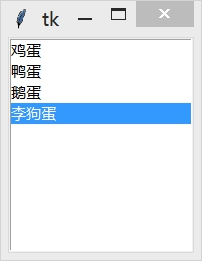

&emsp;&emsp;`Listbox`(列表框)组件用于显示一个选择列表。`Listbox`只能包含文本项目，并且所有的项目都需要使用相同的字体和颜色。根据组件的配置，用户可以从列表中选择一个或多个选项。<!--more-->
&emsp;&emsp;`Listbox`组件通常被用于显示一组文本选项，`Listbox`组件跟`Checkbutton`和`Radiobutton`组件类似，不过`Listbox`是以列表的形式来提供选项的，后两个是通过按钮的形式。

### 用法

&emsp;&emsp;当你创建一个`Listbox`组件的时候，它是空的，所以第一件要做的事就是添加一行或多行文本进去。我们使用`insert`方法添加文本，该方法有两个参数，第一个参数是插入的索引号，第二个参数是插入的字符串。索引号通常是项目的序号(`0`是列表中第一项的序号)。
&emsp;&emsp;不过你也可以使用一些特殊的索引号，比如`ACTIVE`表示选中的项目(如果`Listbox`允许多选，那么它表示最后一个被选中的项目)；`END`表示`Listbox`的最后一行，所以当要插入一个项目到列表时可以使用`END`：

``` python
from tkinter import *

master = Tk()

theLB = Listbox(master)  # 创建一个空列表
theLB.pack()

# 往列表里添加数据
for item in ["鸡蛋", "鸭蛋", "鹅蛋", "李狗蛋"]:
    theLB.insert(END, item)

mainloop()
```



&emsp;&emsp;使用`delete`方法删除列表中的项目，最常用的操作是删除列表中的所有项目(更新列表时需要做的事情)：

``` python
listbox.delete(0, END)
listbox.insert(END, newitem)
```

当然你也可以删除指定的项目，下边例子使用一个独立按钮来删除`ACTIVE`状态的项目：

``` python
theButton = Button(master, text="删除", command=lambda x=theLB: x.delete(ACTIVE))
theButton.pack()
```

`Listbox`组件根据`selectmode`选项提供了四种不同的选择模式：`SINGLE`(单选)、`BROWSE`(也是单选，但拖动鼠标或通过方向键可以直接改变选项)、`MULTIPLE`(多选)和`EXTENDED`(也是多选，但需要同时按住`Shift`键或`Ctrl`键或拖拽鼠标实现)。默认情况下是`BROWSE`。
&emsp;&emsp;获取索引以及值：

``` python
print(listbox.get(1))  # 返回制定索引的项值
print(listbox.get(0, 2))  # 返回多个项值,返回元组
print(listbox.curselection())  # 返回当前选中项的索引
```

&emsp;&emsp;双击选项：

``` python
def printList(event):
    print(listbox.get(listbox.curselection()))

listbox.bind('<Double-Button-1>', printList)
```

### 参数

&emsp;&emsp;`Listbox(master=None, **options) (class)`：`master`是父组件；`options`是组件选项，下方表格列举了各个选项的具体含义和用法：

选项                  | 含义
----------------------|---------
`background`          | 设置背景颜色，默认值由系统指定
`bg`                  | 跟`background`一样
`borderwidth`         | 指定`Listbox`的边框宽度，默认值由系统指定，通常是`2`像素
`bd`                  | 跟`borderwidth`一样
`cursor`              | 指定当鼠标在`Listbox`上飘过的时候的鼠标样式，默认值由系统指定
`exportselection`     | 指定选中的项目文本是否可以被复制到剪贴板，默认值是`True`，可以修改为`False`表示不允许复制项目文本
`font`                | 指定`Listbox`文本的字体，默认值由系统指定
`foreground`          | 设置`Listbox`的文本颜色，默认值由系统指定
`fg`                  | 跟`foreground`一样
`height`              | 设置`Listbox`显示的行数(不是像素)，默认值是`10`
`highlightbackground` | 指定当`Listbox`没有获得焦点的时候高亮边框的颜色，默认值由系统指定，通常是标准背景颜色
`highlightcolor`      | 指定当`Listbox`获得焦点的时候高亮边框的颜色，默认值由系统指定
`highlightthickness`  | 指定高亮边框的宽度，默认值是`1`
`listvariable`        | 指向一个`StringVar`类型的变量，该变量存放`Listbox`中所有的项目。在`StringVar`类型的变量中，用空格分隔每个项目，例如`var.set("鸡蛋 鸭蛋 鹅蛋 李狗蛋")`
`relief`              | 指定边框样式，默认值是`SUNKEN`
`selectbackground`    | 指定当某个项目被选中的时候背景颜色，默认值由系统指定
`selectborderwidth`   | 指定当某个项目被选中的时候边框的宽度。默认是由`selectbackground`指定的颜色填充，没有边框。如果设置了此选项，`Listbox`的每一项会相应变大，被选中项为`RAISED`样式
`selectforeground`    | 指定当某个项目被选中的时候文本颜色，默认值由系统指定
`selectmode`          | 决定选择的模式，四种不同的选择模式：`SINGLE`(单选)、`BROWSE`(也是单选，但拖动鼠标或通过方向键可以直接改变选项)、`MULTIPLE`(多选)和`EXTENDED`(也是多选，但需要同时按住`Shift`键或`Ctrl`键或拖拽鼠标实现)，默认是`BROWSE`
`setgrid`             | 指定一个布尔类型的值，决定是否启用网格控制，默认值是`False`
`takefocus`           | 指定该组件是否接受输入焦点(用户可以通过`tab`键将焦点转移上来)，默认值是`True`
`width`               | 设置`Listbox`的宽度(单位是文本单元)，文本单元是英文字母的平均宽度(所以如果该选项设置为`2`，那么是无法容纳`ww`这两个宽度大于平均宽度的字母的)，默认值是`20`
`xscrollcommand`      | 为`Listbox`组件添加一条水平滚动条，将此选项与`Scrollbar`组件相关联即可
`yscrollcommand`      | 为`Listbox`组件添加一条垂直滚动条，将此选项与`Scrollbar`组件相关联即可

### 方法

- `activate(index)`：将给定索引号对应的选项激活(在其文本下方画一条下划线)。
- `bbox(index)`：返回给定索引号对应的选项的边框。返回值是一个以像素为单位的`4`元祖表示边框`(xoffset、yoffset、width、height)`，`xoffset`和`yoffset`表示距离左上角的偏移位置，`width`是文本的实际宽度(单位为像素)。如果指向的选项是不可见的，那么返回值是`None`。
- `curselection`：返回一个元组，包含被选中的选项的序号(从`0`开始)。如果没有选中任何选项，返回一个空元组。
- `delete(first, last=None)`：删除参数`first`到`last`范围内(包含`first`和`last`)的所有选项。如果忽略`last`参数，表示删除`first`参数指定的选项。
- `get(first, last=None)`：返回一个元组，包含参数`first`到`last`范围内(包含`first`和`last`)的所有选项的文本。如果忽略`last`参数，表示返回`first`参数指定的选项的文本。
- `index(index)`：返回与`index`参数相应的选项的序号，例如`lb.index(END)`。
- `insert(index, *elements)`：添加一个或多个项目到`Listbox`中，使用`lb.insert(END)`添加新选项到末尾。
- `itemcget(index, option)`：获得`index`参数指定的项目对应的选项(由`option`参数指定)。
- `itemconfig(index, **options)`：设置`index`参数指定的项目对应的选项(由可变参数`option`指定)。
- `nearest(y)`：返回与给定参数`y`在垂直坐标上最接近的项目的序号。
- `scan_dragto(x, y)`：见`scan_mark(x, y)`。
- `scan_mark(x, y)`：使用这种方式来实现`Listbox`内容的滚动。需要将鼠标按钮事件及当前鼠标位置绑定到`scan_mark(x, y)`方法，然后再将`motion`事件及当前鼠标位置绑定到`scan_dragto(x, y)`方法，就可以实现`Listbox`在当前位置和`sacn_mack(x, y)`指定的位置`(x, y)`之间滚动。
- `see(index)`：调整列表框的位置，使得`index`参数指定的选项是可见的。
- `select_anchor(index)`：与`selection_anchor(index)`相同。
- `select_clear(first, last=None)`：与`selection_clear(first, last=None)`相同。
- `select_includes(index)`：与`selection_includes(index)`相同。
- `select_set(first, last=None)`：与`selection_set(first, last=None)`相同。
- `selection_anchor(index)`：在`index`参数的位置下一个锚点，此后你就可以通过特殊索引`ANCHOR`访问。
- `selection_clear(first, last=None)`：取消参数`first`到`last`范围内(包含`first`和`last`)选项的选中状态。如果忽略`last`参数，则只取消`first`参数指定选项的选中状态。
- `selection_includes(index)`：返回`index`参数指定的选项的选中状态。返回`1`表示选中，返回`0`表示未选中。
- `selection_set(first, last=None)`：设置参数`first`到`last`范围内(包含`first`和`last`)选项为选中状态。如果忽略`last`参数，则只设置`first`参数指定选项为选中状态。
- `size`：返回`Listbox`组件中选项的数量。
- `xview(*args)`：该方法用于在水平方向上滚动`Listbox`组件的内容，一般通过绑定`Scollbar`组件的`command`选项来实现。如果第一个参数是`MOVETO`，则第二个参数表示滚动到指定的位置：`0.0`表示最左端，`1.0`表示最右端；如果第一个参数是`SCROLL`，则第二个参数表示滚动的数量，第三个参数表示滚动的单位(可以是`UNITS`或`PAGES`)，例如`xview(SCROLL, 3, UNITS)`表示向右滚动三行。
- `xview_moveto(fraction)`：跟`xview(MOVETO, fraction)`一样。
- `xview_scroll(number, what)`：跟`xview(SCROLL, number, what)`一样。
- `yview(*args)`：该方法用于在垂直方向上滚动`Listbox`组件的内容，一般通过绑定`Scollbar`组件的`command`选项来实现。如果第一个参数是`MOVETO`，则第二个参数表示滚动到指定的位置：`0.0`表示最顶端，`1.0`表示最底端；如果第一个参数是`SCROLL`，则第二个参数表示滚动的数量，第三个参数表示滚动的单位(可以是`UNITS`或`PAGES`)，例如`yview(SCROLL, 3, PAGES)`表示向下滚动三页。
- `yview_moveto(fraction)`：跟`yview(MOVETO, fraction)`一样。
- `yview_scroll(number, what)`：跟`yview(SCROLL, number, what)`一样。