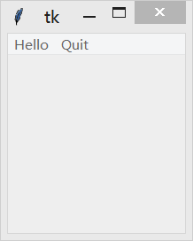
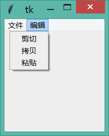

&emsp;&emsp;`Menu`(菜单)组件用于实现顶级菜单、下拉菜单和弹出菜单。`Menu`组件通常被用于实现应用程序上的各种菜单，由于该组件是底层代码实现，所以不建议你自行通过按钮和其他组件来实现菜单功能。
<!--more-->

### 用法

&emsp;&emsp;创建一个顶级菜单，你需要先创建一个菜单实例，然后使用`add`方法将命令和其它子菜单添加进去：

``` python
from tkinter import *
​
root = Tk()
​
def callback():
    print("~被调用了~")
​
# 创建一个顶级菜单
menubar = Menu(root)
menubar.add_command(label="Hello", command=callback)
menubar.add_command(label="Quit", command=root.quit)
​
root.config(menu=menubar)  # 显示菜单
​
mainloop()
```



&emsp;&emsp;创建一个下拉菜单(或者其他子菜单)，方法也是大同小异，最主要的区别是它们最后需要添加到主菜单上(而不是窗口上)：

``` python
from tkinter import *
​
root = Tk()
​
def callback():
    print("~被调用了~")
​
# 创建一个顶级菜单
menubar = Menu(root)
​
# 创建一个下拉菜单“文件”，然后将它添加到顶级菜单中
filemenu = Menu(menubar, tearoff=False)
filemenu.add_command(label="打开", command=callback)
filemenu.add_command(label="保存", command=callback)
filemenu.add_separator()
filemenu.add_command(label="退出", command=root.quit)
menubar.add_cascade(label="文件", menu=filemenu)
​
# 创建另一个下拉菜单“编辑”，然后将它添加到顶级菜单中
editmenu = Menu(menubar, tearoff=False)
editmenu.add_command(label="剪切", command=callback)
editmenu.add_command(label="拷贝", command=callback)
editmenu.add_command(label="粘贴", command=callback)
menubar.add_cascade(label="编辑", menu=editmenu)
​
root.config(menu=menubar)  # 显示菜单
​
mainloop()
```



&emsp;&emsp;创建一个弹出菜单方法也是一致的，不过需要使用`post`方法明确地将其显示出来：

``` python
from tkinter import *
​
root = Tk()
​
def callback():
    print("~被调用了~")
​
# 创建一个弹出菜单
menu = Menu(root, tearoff=False)
menu.add_command(label="撤销", command=callback)
menu.add_command(label="重做", command=callback)
​
frame = Frame(root, width=512, height=512)
frame.pack()
​
def popup(event):
    menu.post(event.x_root, event.y_root)
​
frame.bind("<Button-3>", popup)  # 绑定鼠标右键
​
mainloop()
```

### 参数

&emsp;&emsp;`Menu(master=None, **options) (class)`：`master`是父组件；`options`是组件选项，下方表格详细列举了各个选项的具体含义和用法：

选项                  | 含义
---------------------|-----
`activebackground`   | 设置当`Menu`处于活动状态(通过`state`选项设置状态)的背景色
`activeborderwidth`  | 设置当`Menu`处于活动状态(通过`state`选项设置状态)的边框宽度
`activeforeground`   | 设置当`Menu`处于活动状态(通过`state`选项设置状态)的前景色
`background`         | 设置背景颜色
`bg`                 | 跟`background`一样
`borderwidth`        | 指定边框宽度
`bd`                 | 跟`borderwidth`一样
`cursor`             | 指定当鼠标在`Menu`上飘过的时候的鼠标样式
`disabledforeground` | 指定当`Menu`处于`DISABLED`状态的时候的前景色
`font`               | 指定`Menu`中文本的字体
`foreground`         | 设置`Menu`的前景色
`fg`                 | 跟`foreground`一样
`postcommand`        | 将此选项与一个方法相关联，当菜单被打开的时候该方法将自动被调用
`relief`             | 指定边框样式，默认值是`FLAT`，另外你还可以设置`SUNKEN`、`RAISED`、`GROOVE`或`RIDGE`
`selectcolor`        | 指定当菜单项显示为单选按钮或多选按钮时选择中标志的颜色

### 方法

&emsp;&emsp;`add(type, **options)`：`type`参数指定添加的菜单类型，可以是`command`、`cascade`、`checkbutton`、`radiobutton`或`separator`。还可以通过`options`选项设置菜单的属性，下表列举了`options`可以使用的选项和具体含义：

选项               | 含义
-------------------|-----
`accelerator`      | 显示该菜单项的加速键(快捷键)，例如`accelerator = "Ctrl+N"`。该选项仅显示，并没有实现加速键的功能(通过按键绑定实现)
`activebackground` | 设置当该菜单项处于活动状态(通过`state`选项设置状态)的背景色
`activeforeground` | 设置当该菜单项处于活动状态(通过`state`选项设置状态)的前景色
`background`       | 设置该菜单项的背景颜色
`bitmap`           | 指定显示到该菜单项上的位图
`columnbreak`      | 从该菜单项开始另起一列显示
`command`          | 将该选项与一个方法相关联，当用户点击该菜单项时将自动调用此方法
`compound`         | 控制菜单项中文本和图像的混合模式；如果该选项设置为`CENTER`，文本显示在图像上(文本重叠图像)；如果该选项设置为`BOTTOM`、`LEFT`、`RIGHT`或`TOP`，那么图像显示在文本的旁边(例如`BOTTOM`，则图像在文本的下方)
`font`             | 指定文本的字体
`foreground`       | 设置前景色
`hidemargin`       | 是否显示菜单项旁边的空白
`image`            | 指定菜单项显示的图片，该值应该是`PhotoImage`、`BitmapImage`或者能兼容的对象
`label`            | 指定菜单项显示的文本
`menu`             | 该选项仅在`cascade`类型的菜单中使用，用于指定它的下级菜单
`offvalue`         | 默认情况下，`variable`选项设置为`1`表示选中状态，反之设置为`0`。设置`offvalue`的值可以自定义未选中状态的值
`onvalue`          | 默认情况下，`variable`选项设置为`1`表示选中状态，反之设置为`0`。设置`onvalue`的值可以自定义选中状态的值
`selectcolor`      | 指定当菜单项显示为单选按钮或多选按钮时选择中标志的颜色
`selectimage`      | 如果你在单选按钮或多选按钮菜单中使用图片代替文本，那么设置该选项指定被菜单项被选中时显示的图片
`state`            | 跟`text`选项一起使用，用于指定哪一个字符画下划线(例如用于表示键盘快捷键)
`underline`        | 用于指定在该菜单项的某一个字符处画下划线。例如设置为`1`，则说明在该菜单项的第`2`个字符处画下划线
`value`            | 当菜单项为单选按钮时，用于标志该按钮的值；在同一组中的所有按钮应该拥有各不相同的值；通过将该值与`variable`选项的值对比，即可判断用户选中了哪个按钮
`variable`         | 当菜单项是单选按钮或多选按钮时，与之关联的变量

- `add_cascade(**options)`：添加一个父菜单，相当于`add("cascade", **options)`。
- `add_checkbutton(**options)`：添加一个多选按钮的菜单项，相当于`add("checkbutton", **options)`。
- `add_command(**options)`：添加一个普通的命令菜单项，相当于`add("command", **options)`。
- `add_radiobutton(**options)`：添加一个单选按钮的菜单项，相当于`add("radiobutton", **options)`。
- `add_separator(**options)`：添加一条分割线，相当于`add("separator", **options)`。
- `delete(index1, index2=None)`：删除`index1`至`index2`(包含)的所有菜单项。如果忽略`index2`参数，则删除`index1`指向的菜单项。
- `entrycget(index, option)`：获得指定菜单项的某选项的值。
- `entryconfig(index, **options)`：设置指定菜单项的选项，选项的参数及具体含义请参考`add`方法。
- `entryconfigure(index, **options)`：跟`entryconfig`一样。
- `index(index)`：返回与`index`参数相应的选项的序号，例如`e.index(END)`。
- `insert(index, itemType, **options)`：插入指定类型的菜单项到`index`参数指定的位置。`itemType`参数指定添加的菜单类型，可以是`command`、`cascade`、`checkbutton`、`radiobutton`或`separator`。选项的参数及具体含义请参考`add`方法。
- `insert_cascade(index, **options)`：在`index`参数指定的位置添加一个父菜单，相当于`insert("cascade", **options)`。
- `insert_checkbutton(index, **options)`：在`index`参数指定的位置添加一个多选按钮，相当于`insert("checkbutton", **options)`。
- `insert_command(index, **options)`：在`index`参数指定的位置添加一个普通的命令菜单项，相当于`insert("command", **options)`。
- `insert_radiobutton(index, **options)`：在`index`参数指定的位置添加一个单选按钮，相当于`insert("radiobutton", **options)`。
- `insert_separator(index, **options)`：在`index`参数指定的位置添加一条分割线，相当于`insert("separator", **options)`。
- `invoke(index)`：调用`index`指定的菜单项相关联的方法。如果是单选按钮，设置该菜单项为选中状态；如果是多选按钮，切换该菜单项的选中状态。
- `post(x, y)`：在指定的位置显示弹出菜单。
- `type(index)`：获得`index`参数指定菜单项的类型。返回值可以是`command`、`cascade`、`checkbutton`、`radiobutton`或`separator`。
- `unpost`：移除弹出菜单。
- `yposition(index)`：返回`index`参数指定的菜单项的垂直偏移位置。该方法的目的是为了让你精确放置相对于当前鼠标的位置弹出菜单。