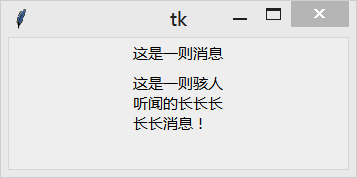

&emsp;&emsp;`Message`(消息)组件是`Label`组件的变体，用于显示多行文本消息。`Message`组件能够自动换行，并调整文本的尺寸使其适应给定的尺寸。
<!-- more -->
### 何时使用Message组件？

&emsp;&emsp;`Message`组件用于显示简单的文本消息，通常你可以使用`Label`来代替。如果你希望使用多种字体来显示文本，那么应该使用`Text`组件。
  
### 用法

&emsp;&emsp;创建一个`Message`组件，所有你要做的事就是指定要显示的文本内容。在必要的时候，该组件会自动换行，请随意感受下：

``` python
from tkinter import *
​
root = Tk()
​
w1 = Message(root, text="这是一则消息", width=100)
w1.pack()
​
w2 = Message(root, text="这是一则骇人听闻的长长长长长消息！", width=100)
w2.pack()
​
mainloop()
```



### 参数

&emsp;&emsp;`Message(master=None, **options) (class)`：`master`是父组件；`options`是组件选项，下方表格详细列举了各个选项的具体含义和用法：

选项                  | 含义
----------------------|----------
`anchor`              | 控制文本消息的显示位置，可以使用`N`、`NE`、`E`、`SE`、`S`、`SW`、`W`、`NW`或`CENTER`来定位(`EWSN`代表东西南北，上北下南左西右东)，默认值是`CENTER`
`aspect`              | 设置高宽比，即`宽度/高度`的百分比的值，默认值是`150`(宽度比高度大`50%`)。注意，如果设置了`width`选项的值，该选项将被忽略
`background`          | 设置背景颜色，默认值由系统指定
`bg`                  | 跟`background`一样
`borderwidth`         | 指定边框宽度，默认值由系统指定，通常是`1`或`2`像素
`bd`                  | 跟`borderwidth`一样
`cursor`              | 指定当鼠标在`Message`上飘过的时候的鼠标样式，默认值由系统指定
`font`                | 指定`Message`文本的字体，只能指定一种字体，默认值由系统指定
`foreground`          | 设置`Message`文本的颜色，默认值由系统指定
`fg`                  | 跟`foreground`一样
`highlightbackground` | 指定当`Message`没有获得焦点的时候高亮边框的颜色。默认值由系统指定，通常是标准背景颜色
`highlightcolor`      | 指定当`Message`获得焦点时高亮边框的颜色，默认值由系统指定
`highlightthickness`  | 指定高亮边框的宽度，默认值是`0`(不带高亮边框)
`justify`             | 定义如何对齐多行文本，可以使用`LEFT`、`RIGHT`或`CENTER`。注意，文本的位置取决于`anchor`选项。默认值是`CENTER`
`padx`                | 指定水平方向上的额外间距(内容和边框间)，单位是像素
`pady`                | 指定垂直方向上的额外间距(内容和边框间)，单位是像素
`relief`              | 指定边框样式，默认值是`FLAT`。另外，你还可以设置为`SUNKEN`、`RAISED`、`GROOVE`或`RIDGE`
`takefocus`           | 如果是`True`，该组件接受输入焦点，默认值是`False`
`text`                | 指定`Label`显示的文本。为了达到指定的高宽比(`aspect`选项指定)，文本内容将自动进行换行
`textvariable`        | `Message`显示`Tkinter`变量(通常是一个`StringVar`变量)的内容。如果变量被修改，`Message`的文本会自动更新
`width`               | 设置`Message`的宽度，单位是文本单元。如果忽略该选项，将根据`aspect`选项设置的高宽比来设置合适的宽度