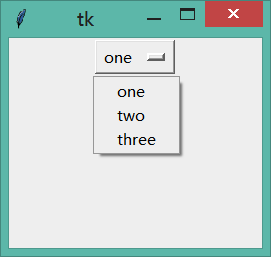
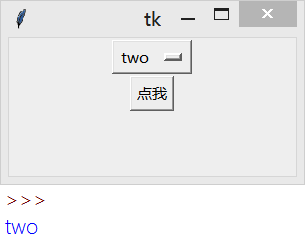

&emsp;&emsp;`OptionMenu`事实上是下拉菜单的改版，它的发明弥补了`Listbox`组件无法实现下拉列表框的遗憾。<!--more-->
&emsp;&emsp;创建一个选择菜单非常简单，只需要它一个`Tkinter`变量(用于记录用户选择的内容)以及若干选项即可：

``` python
from tkinter import *
​
root = Tk()
​
variable = StringVar()
variable.set("one")
​
w = OptionMenu(root, variable, "one", "two", "three")
w.pack()
​
mainloop()
```



要获得用户选择的内容，使用`Tkinter`变量的`get`方法即可：

``` python
def callback():
    print(variable.get())
​
Button(root, text="点我", command=callback).pack()
```



&emsp;&emsp;如下演示如何将很多选项添加到选择菜单中：

``` python
from tkinter import *
​
OPTIONS = [ "California", "458",
            "FF", "ENZO", "LaFerrari"]
​
root = Tk()
​
variable = StringVar()
variable.set(OPTIONS[0])
​
w = OptionMenu(root, variable, *OPTIONS)
w.pack()
​
def callback():
    print(variable.get())
​
Button(root, text="点我", command=callback).pack()
​
mainloop()
```