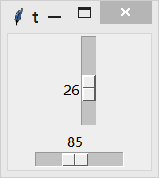
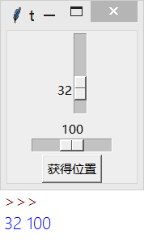

&emsp;&emsp;`Scale`(刻度)组件看起来像是一个带数据的`Scrollbar`(滚动条)组件，但事实上它们是不同的两个事物。`Scale`组件允许用于通过滑动滑块来选择一个范围内的数字，你可以控制该组件的最大值、最小值以及分辨率。<!--more-->
&emsp;&emsp;当你希望用户输入某个范围内的一个数值，使用`Scale`组件可以很好的代替`Entry`组件。
&emsp;&emsp;创建一个指定范围的`Scale`组件其实非常容易，你只需要指定它的`from`和`to`两个选项即可。但由于`from`本身是`Python`的关键字，所以为了区分需要在后边紧跟一个下划线，即`from_`：

``` python
from tkinter import *
​
root = Tk()
​
Scale(root, from_=0, to=42).pack()
Scale(root, from_=0, to=200, orient=HORIZONTAL).pack()
​
mainloop()
```



使用`get`方法可以获取当前滑块的位置：

``` python
from tkinter import *
​
root = Tk()
​
s1 = Scale(root, from_=0, to=42)
s1.pack()
​
s2 = Scale(root, from_=0, to=200, orient=HORIZONTAL)
s2.pack()
​
def show():
    print(s1.get(), s2.get())
​
Button(root, text="获得位置", command=show).pack()
​
mainloop()
```



可以通过`resolution`选项控制分辨率(步长)，通过`tickinterval`选项设置刻度：

``` python
from tkinter import *
​
root = Tk()
​
Scale(root, from_=0, to=42, tickinterval=5, length=200, \
      resolution=5, orient=VERTICAL).pack()
Scale(root, from_=0, to=200, tickinterval=10, length=600, \
      orient=HORIZONTAL).pack()
​
mainloop()
```


- `Scale(master=None, **options) (class)`：`master`是父组件；`options`是组件选项，下方表格列举了各个选项的具体含义和用法：

选项                  | 含义
----------------------|----
`activebackground`    | 指定当鼠标在上方飘过的时候滑块的背景颜色，默认值由系统指定
`background`          | 滚动槽外部的背景颜色，默认值由系统指定
`bg`                  | 跟`background`一样
`bigincrement`        | 该选项设置增长量的大小，默认值是`0`，增长量为范围的`1/10`
`borderwidth`         | 指定边框宽度，默认值是`2`
`bd`                  | 跟`borderwidth`一样
`command`             | 指定一个函数，每当滑块发生改变的时候都会自动调用该函数；该函数有一个唯一的参数，就是最新的滑块位置；如果滑块快速地移动，函数可能无法获得每一个位置，但一定会获得滑块停下时的最终位置
`cursor`              | 指定当鼠标在上方飘过的时候的鼠标样式，默认值由系统指定
`digits`              | 设置最多显示多少位数字。例如设置`from`选项为`0`，`to`选项为`20`，`digits`选项设置为`5`，那么滑块的范围就是在`0.000`至`20.000`直接滑动。默认值是`0`W(不开启)
`foreground`          | 指定滑块左侧的`Label`和刻度的文字颜色，默认值由系统指定
`fg`                  | 跟`foreground`一样
`font`                | 指定滑块左侧的`Label`和刻度的文字字体，默认值由系统指定
`from`                | 设置滑块最顶(左)端的位置，默认值是`0`
`highlightbackground` | 指定当`Scale`没有获得焦点的时候高亮边框的颜色，默认值由系统指定
`highlightcolor`      | 指定当`Scale`获得焦点的时候高亮边框的颜色，默认值由系统指定
`highlightthickness`  | 指定高亮边框的宽度，默认值是`0`(不带高亮边框)
`label`               | 你可以在垂直的`Scale`组件的顶端右侧(水平的话是左端上方)显示一个文本标签，默认值是不显示标签
`length`              | `Scale`组件的长度，默认值是`100`像素
`orient`              | 设置该`Scale`组件是水平放置(`HORIZONTAL`)还是垂直放置(`VERTICAL`)，默认值是`VERTICAL`
`relief`              | 指定边框样式，默认值是`SUNKEN`，可以选择`FLAT`、`RAISED`、`GROOVE`和`RIDGE`
`repeatdelay`         | 该选项指定鼠标左键点击滚动条凹槽的响应时间，默认值是`300`毫秒
`repeatinterval`      | 该选项指定鼠标左键紧按滚动条凹槽时的响应间隔，默认值是`100`毫秒
`resolution`          | 指定`Scale`组件的分辨率(步长，即在凹槽点击一下鼠标左键它移动的数量)。例如设置`from`选项为`0`，`to`选项为`20`，`resolution`选项设置为`0.1`的话，那么每点击一下鼠标就是在`0.0`至`20.0`之间以`0.1`的步长移动。默认值是`1`
`showvalue`           | 设置是否显示滑块旁边的数字，默认值为`True`
`sliderlength`        | 设置滑块的长度，默认值是`30`像素
`sliderrelief`        | 设置滑块的样式，可以选择`FLAT`、`SUNKEN`、`GROOVE`和`RIDGE`，默认值是`RAISED`
`state`               | 默认情况下`Scale`组件支持鼠标事件和键盘事件，可以通过设置该选项为`DISABLED`来禁用此功能，默认值是`NORMAL`
`takefocus`           | 指定使用`Tab`键是否可以将焦点移动到该`Scale`组件上。默认是开启的，可以通过将该选项设置为`False`避免焦点落在此组件上
`tickinterval`        | 设置显示的刻度，如果设置一个值，那么就会按照该值的倍数显示刻度。默认值是不显示刻度
`to`                  | 设置滑块最底(右)端的位置，默认值是`100`
`troughcolor`         | 设置凹槽的颜色，默认值由系统指定
`variable`            | 指定一个与`Scale`组件相关联的`Tkinter`变量，该变量存放滑块最新的位置；当滑块移动的时候，该变量的值也会发生相应的变化
`width`               | 指定`Scale`组件的宽度，默认值是`15`像素

- `coords(value=None)`：获得当前滑块的位置对应`Scale`组件左上角的相对坐标。如果设置`value`参数，则返回当滑块所在该位置时的相对坐标。
- `get`：获得当前滑块的位置。`Tkinter`会尽可能地返回一个整型值，否则返回一个浮点型值。
- `identify(x, y)`：返回一个字符串表示指定位置下(如果有的话)的`Scale`部件。返回值可以是`slider`(滑块)、`trough1`(左侧或上侧的凹槽)、`trough2`(右侧或下侧的凹槽)或`nothing`。
- `set(value)`：设置`Scale`组件的值(滑块的位置)。