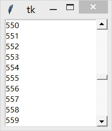

&emsp;&emsp;`Scrollbar`(滚动条)组件用于滚动一些组件的可见范围，根据方向可分为垂直滚动条和水平滚动条。`Scrollbar`组件常常被用于实现文本、画布和列表框的滚动。
&emsp;&emsp;`Scrollbar`组件通常几乎与`Text`组件、`Canvas`组件和`Listbox`组件一起使用，水平滚动条还能跟`Entry`组件配合。
&emsp;&emsp;为了在某个组件上安装垂直滚动条，你需要做两件事：设置该组件的`yscrollbarcommand`选项为`Scrollbar`组件的`set`方法；设置`Scrollbar`组件的`command`选项为该组件的`yview`方法。
<!--more-->

``` python
from tkinter import *
​
root = Tk()
​
sb = Scrollbar(root)
sb.pack(side=RIGHT, fill=Y)
​
lb = Listbox(root, yscrollcommand=sb.set)
​
for i in range(1000):
    lb.insert(END, str(i))

lb.pack(side=LEFT, fill=BOTH)
​
sb.config(command=lb.yview)
​
mainloop()
```



当`Listbox`组件的可视范围发生改变的时候，`Listbox`组件通过调用`set`方法通知`Scrollbar`组件。而当用户操纵滚动条的时候，将自动调用`Listbox`组件的`yview`方法。添加水平滚动条方法跟上边一样，只是将`yscrollcommand`改为`xscrollcommand`，`yview`改为`xview`即可。

- `Scrollbar(master=None, **options) (class)`：`master`是父组件；`options`是组件选项，下方表格列举了各个选项的具体含义和用法：

选项                  | 含义
----------------------|-------
`activebackground`    | 指定当鼠标在上方飘过的时候滑块和箭头的背景颜色，默认值由系统指定
`activerelief`        | 指定当鼠标在上方飘过的时候滑块的样式，可以选择`FLAT`、`SUNKEN`、`GROOVE`和`RIDGE`，默认值是`RAISED`
`background`          | 指定背景颜色，默认值由系统指定
`bg`                  | 跟`background`一样
`borderwidth`         | 指定边框宽度，默认值是`0`
`bd`                  | 跟`borderwidth`一样
`command`             | 当滚动条更新时回调的函数，通常的是指定对应组件的`xview`或`yview`方法
`cursor`              | 指定当鼠标在上方飘过的时候的鼠标样式，默认值由系统指定
`elementborderwidth`  | 指定滚动条和箭头的边框宽度，默认值是`-1`(表示使用`borderwidth`选项的值)
`highlightbackground` | 指定当滚动条没有获得焦点的时候高亮边框的颜色，默认值由系统指定
`highlightcolor`      | 指定当滚动条获得焦点的时候高亮边框的颜色，默认值由系统指定
`highlightthickness`  | 指定高亮边框的宽度，默认值是`0`(不带高亮边框)
`jump`                | 指定当用户拖拽滚动条时的行为，默认值是`False`，滚动条的任何一丝变动都会即刻调用`command`选项指定的回调函数；设置为`True`则当用户松开鼠标才调用
`orient`              | 指定绘制`HORIZONTAL`(垂直滚动条)还是`VERTICAL`(水平滚动条)，默认值是`VERTICAL`
`relief`              | 指定边框样式，可以选择`FLAT`、`RAISED`、`GROOVE`和`RIDGE`，默认值是`SUNKEN`
`repeatdelay`         | 该选项指定鼠标左键点击滚动条凹槽的响应时间，默认值是`300`毫秒
`repeatinterval`      | 该选项指定鼠标左键紧按滚动条凹槽时的响应间隔，默认值是`100`毫秒
`takefocus`           | 指定使用`Tab`键可以将焦点移到该`Scrollbar`组件上；默认是开启的，可以将该选项设置为`False`，避免焦点在此组件上
`troughcolor`         | 指定凹槽的颜色，默认值由系统指定
`width`               | 指定滚动条的宽度，默认值是`16`像素

- `activate(element)`：显示`element`参数指定的元素的背景颜色和样式。`element`参数可以设置为`arrow1`(箭头`1`)、`arrow2`(箭头`2`)或`slider`(滑块)。
- `delta(deltax, deltay)`：给定一个鼠标移动的范围`deltax`和`deltay`(单位为像素，`deltax`表示水平移动量，`deltay`表示垂直移动量)，然后该方法返回一个浮点类型的值(范围`-1.0`至`1.0`)。这通常在鼠标绑定上使用，用于确定当用户拖拽鼠标时滑块的如何移动。
- `fraction(x, y)`：给定一个像素坐标`(x, y)`，该方法返回最接近给定坐标的滚动条位置(范围`0.0`至`1.0`)。
- `get`：返回当前滑块的位置`(a, b)`。`a`值表示当前滑块的顶端或左端的位置，`b`值表示当前滑块的底端或右端的位置(范围`0.0`至`1.0`)。
- `identify(x, y)`：返回一个字符串表示指定位置下(如果有的话)的滚动条部件。返回值可以是`arrow1`(箭头`1`)、`arrow2`(箭头`2`)、`slider`(滑块)或`nothing`。
- `set(*args)`：设置当前滚动条的位置。如果设置则需要两个参数`(first, last)`，`first`表示当前滑块的顶端或左端的位置，`last`表示当前滑块的底端或右端的位置(范围`0.0`至`1.0`)。