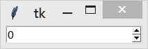
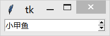

&emsp;&emsp;`Spinbox`组件是`Entry`组件的变体，用于从一些固定的值中选取一个。`Spinbox`组件通常用于在限定数字中选取的情况下代替普通的`Entry`组件。`Spinbox`组件跟`Entry`组件用法非常相似，主要区别是使用`Spinbox`组件，你可以通过范围或者元组指定允许用户输入的内容。<!--more-->

``` python
from tkinter import *

root = Tk()

w = Spinbox(root, from_=0, to=10)
w.pack()

mainloop()
```



你还可以通过元组指定允许输入的值：

``` python
from tkinter import *

root = Tk()

w = Spinbox(root, values=("小甲鱼", "~风介~", "wei_Y", "戴宇轩"))
w.pack()

mainloop()
```



### 参数

&emsp;&emsp;`Spinbox(master=None, **options) (class)`：`master`是父组件；`options`是组件选项，下方表格列举了各个选项的具体含义和用法：

选项                  | 含义
----------------------|----
`activebackground`    | 设置当`Spinbox`处于`ACTIVE`状态下的背景颜色
`background`          | 设置背景颜色，默认值由系统指定
`bg`                  | 跟`background`一样
`borderwidth`         | 设置边框宽度，默认值是`1`或`2`像素
`buttonbackground`    | 设置调节箭头的背景颜色
`buttoncursor`        | 指定当鼠标在调节箭头上方的鼠标样式
`buttondownrelief`    | 指定向下调节箭头的样式，默认值是`RAISED`，还可以设置为`FLAT`、`SUNKEN`、`GROOVE`和`RIDGE`
`buttonup`            | 指定向上调节箭头的样式，默认值是`RAISED`，还可以设置为`FLAT`、`SUNKEN`、`GROOVE`和`RIDGE`
`command`             | 指定一个函数，当用户点击调节箭头的时候将自动调用该函数。注意，当用户直接在输入框中输入数据时并不会触发该函数
`cursor`              | 指定当鼠标在`Spinbox`上飘过的时候的鼠标样式，默认值由系统指定
`disabledbackground`  | 设置当`Spinbox`处于`DISABLED`状态下的背景颜色
`disabledforeground`  | 设置当`Spinbox`处于`DISABLED`状态下的前景颜色
`exportselection`     | 指定选中的文本是否可以被复制到剪贴板，默认值是`True`。可以修改为`False`，表示不允许复制文本
`font`                | 指定`Spinbox`中文本的字体，默认值由系统指定
`foreground`          | 设置前景(文本)颜色，默认值由系统指定
`fg`                  | 跟`foreground`一样
`format`              | 使用该选项设置选择数值的样式(`from_`和`to`指定范围)。例如`format='%10.4f'`表示显示的数值占`10`位，小数点后保留`4`位
`from_`               | 该选项和`to`选项共同指定一个范围的数值，`increment`选项设置每次点击调节箭头递增(递减)的精度
`highlightbackground` | 指定当`Spinbox`没有获得焦点的时候高亮边框的颜色，默认值由系统指定
`highlightcolor`      | 指定当`Spinbox`获得焦点的时候高亮边框的颜色，默认值由系统指定
`highlightthickness`  | 指定高亮边框的宽度
`increment`           | 该选项指定当用户每次点击调节箭头的时候递增(递减)的精度。例如`from_ = 1`、`to = 10`、`increment = 0.5`时，每次用户点击调节箭头的时候，输入框中的数字递增(递减)`0.5`
`insertbackground`    | 指定输入光标的颜色
`insertborderwidth`   | 指定输入光标的边框宽度，如果被设置为非`0`值，光标样式会被设置为`RAISED`
`insertofftime`       | 该选项控制光标的闪烁频率(灭)，单位是毫秒
`insertontime`        | 该选项控制光标的闪烁频率(亮)，单位是毫秒
`insertwidth`         | 指定光标的宽度，默认值是`1`或`2`像素
`invalidcommand`      | 指定当输入框输入的内容`非法`时调用的函数
`invcmd`              | 跟`invalidcommand`一样
`justify`             | 定义如何对齐输入框中的文本，使用`LEFT`、`RIGHT`或`CENTER`，默认值是`LEFT`
`readonlybackground`  | 设置当`Spinbox`处于`readonly`状态下的背景颜色
`relief`              | 指定边框样式，默认值是`SUNKEN`，其他可以选择的值是`FLAT`、`RAISED`、`GROOVE`和`RIDGE`
`repeatdelay`         | 该选项指定鼠标左键点击滚动条凹槽的响应时间，默认值是`400`(毫秒)
`repeatinterval`      | 该选项指定鼠标左键紧按滚动条凹槽时的响应间隔，默认值是`100`(毫秒)
`selectbackground`    | 指定输入框的文本被选中时的背景颜色，默认值由系统指定
`selectborderwidth`   | 指定输入框的文本被选中时的边框宽度(选中边框)，默认值由系统指定
`selectforeground`    | 指定输入框的文本被选中时的字体颜色，默认值由系统指定
`state`               | `Spinbox`组件可以设置的状态：`NORMAL`、`DISABLED`或`readonly`(注意，这个是字符串，功能和`DISABLED`相似。但它支持选中和拷贝，只是不能修改，而`DISABLED`是完全禁止)。默认值是`NORMAL`。注意，如果此选项设置为`DISABLED`或`readonly`，那么调用`insert`和`delete`方法都会被忽略
`takefocus`           | 指定使用`Tab`键可以将焦点移动到输入框中，默认是开启的，可以将该选项设置为`False`，避免焦点在此输入框中
`textvariable`        | 指定一个与输入框的内容相关联的`Tkinter`变量(通常是`StringVar`)。当输入框的内容发生改变时，该变量的值也会相应发生改变
`to`                  | 该选项和`from_`选项共同指定一个范围的数值，`increment`选项设置每次点击调节箭头递增(递减)的精度
`validate`            | 该选项设置是否启用内容验证
`validatecommand`     | 该选项指定一个验证函数，用于验证输入框内容是否合法。验证函数需要返回`True`或`False`表示验证结果。注意，该选项只有当`validate`的值非`none`时才有效
`vcmd`                | 跟`validatecommand`一样
`values`              | 提供两个方法限定用户输入的内容，一种是通过`from_`和`to`选项设置范围，另一种则是将可选值以元组的形式赋值给`values`选项。例如`values = ("小甲鱼", "~风介~", "wei_Y", "戴宇轩")`，则允许用户在这`4`个字符串中选择
`width`               | 设置输入框的宽度，以字符为单位，默认值是`20`。对于变宽字体来说，组件的实际宽度等于字体的平均宽度乘以`width`选项的值
`wrap`                | 默认情况下(`Flase`)，当输入框中的值是第一个(最后一个)的时候，再点击向上(向下)调节箭头，内容不会改变；当该选项的值设置为`True`，则当达到第一个(最后一个)值的时候，再点击向上(向下)调节箭头，内容将回到最后一个(第一个)。其实就是开启循环的意思
`xscrollcommand`      | 与`scrollbar`(滚动条)组件相关联，如果你觉得用户输入的内容会超过该组件的输入框宽度，那么可以考虑设置该选项。使用方法可以参考`Scrollbar`组件

### 方法

- `bbox(index)`：返回一个`4`元组`(x1, y1, x2, y2)`，用于描述输入框中`index`参数指定的字符所在的矩形范围。
- `delete(first, last=None)`：删除参数`first`到`last`范围内(包含`first`和`last`)的所有内容。如果忽略`last`参数，表示删除`first`参数指定的选项。使用`delete(0, END)`实现删除输入框的所有内容。
- `get`：返回`Spinbox`当前的值。
- `icursor(index)`：将光标移动到`index`参数指定的位置，这同时也会设置`INSERT`的值。
- `identify(x, y)`：返回给定坐标`(x, y)`在`Spinbox`中对应的元素名字。返回值可以是`none`(什么都不是)、`buttondown`(向下调节箭头)、`buttonup`(向上调节箭头)或`entry`(输入框)。
- `index(index)`：返回与`index`参数相应的选项的序号，例如`e.index(END)`。
- `insert(index, text)`：将`text`参数的内容插入到`index`参数指定的位置。使用`insert(INSERT, text)`将`text`参数指定的字符串插入到光标的位置；使用`insert(END, text)`将`text`参数指定的字符串插入到输入框的末尾。
- `invoke(element)`：调用该方法的效果相当于用户点击调节箭头，`element`参数的值必须是`buttonup`或`buttondown`。
- `scan_dragto(x)`：见下方`scan_mark(x)`。
- `scan_mark(x)`：使用这种方式来实现输入框内容的滚动。需要将鼠标按下事件绑定到`scan_mark(x)`方法(`x`是鼠标当前的水平位置)，然后再将`motion`事件绑定到`scan_dragto(x)`方法(`x`是鼠标当前的水平位置)，就可以实现输入框在当前位置和`sacn_mack(x)`指定位置之间的水平滚动。
- `selection('from', index)`：设置选中范围的起始位置是`index`参数指定的值。
- `selection('to', index)`：设置选中范围的结束位置是`index`参数指定的值。
- `selection('range', start, end)`：设置选中范围是`start`到`end`参数之间的值。
- `selection_adjust(index)`：该方法是为了确保输入框中选中的范围包含`index`参数所指定的字符。如果选中的范围已经包含了该字符，那么什么事情也不会发生；如果选中的范围不包含该字符，那么会从光标的位置将选中的范围扩展至该字符。
- `selection_clear`：取消选中状态。
- `selection_element(element=None)`：该方法用于`设置`或`获取`选择范围。如果给`element`参数赋值，那么表示设置选择范围，否则表示获得当前的选择范围。