&emsp;&emsp;代码如下：

``` python
import tkinter as tk
​
class APP:
    def __init__(self, master):
        frame = tk.Frame(master)
        frame.pack()
​
        self.hi_there = tk.Button(frame, text="打招呼", bg="green", fg="red", command=self.hello)
        self.hi_there.pack()
​
    def hello(self):
        print("hello!")
​
root = tk.Tk()
app = APP(root)
root.mainloop()
```

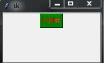

&emsp;&emsp;代码如下：

``` python
from tkinter import *
​
root = Tk()
textLabel = Label(root, text="重装机兵", justify=LEFT, padx=10)
textLabel.pack(side=LEFT)
​
photo = PhotoImage(file="zzjb.gif")  # 目前支持GIF格式
imageLabel = Label(root, image=photo)
imageLabel.pack(side=RIGHT)
​
mainloop()
```

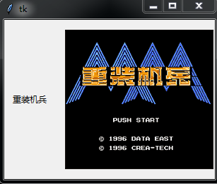


&emsp;&emsp;代码如下：

``` python
from tkinter import *
​
root = Tk()
​
photo = PhotoImage(file="bg.gif")
theLabel = Label(
    root,
    text="学Python\n到FishC",
    justify=LEFT,
    image=photo,
    compound=CENTER,
    font=("华康少女字体", 20),
    fg="white"
)
theLabel.pack()
​
mainloop()
```

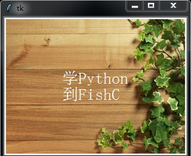

&emsp;&emsp;代码如下：

``` python
from tkinter import *
​
def callback():
    var.set("吹吧你，我才不信呢~")
​
root = Tk()
​
frame1 = Frame(root)
frame2 = Frame(root)
​
var = StringVar()  # 创建一个文本Label对象
var.set("您所下载的影片含有未成年人限制内容，\n请满18岁后再点击观看！")
textLabel = Label(
    frame1,
    textvariable=var,
    justify=LEFT
)
textLabel.pack(side=LEFT)
​
# 创建一个图像Label对象，用PhotoImage实例化一个图片对象(支持gif格式的图片)
photo = PhotoImage(file="18.gif")
imgLabel = Label(frame1, image=photo)
imgLabel.pack(side=RIGHT)
​
theButton = Button(frame2, text="已满18周岁", command=callback)  # 加一个按钮
theButton.pack()
​
frame1.pack(padx=10, pady=10)
frame2.pack(padx=10, pady=10)
​
mainloop()
```

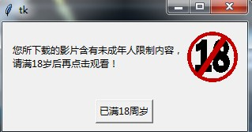

&emsp;&emsp;代码如下：

``` python
from tkinter import *
​
root = Tk()
​
v = IntVar()  # 需要一个Tkinter变量，用于表示该按钮是否被选中
​
c = Checkbutton(root, text="测试一下", variable=v)
c.pack()
​
# 如果选项被选中，那么变量v被赋值为1，否则为0
# 我们可以用个Label标签动态地给大家展示：
l = Label(root, textvariable=v)
l.pack()
​
mainloop()
```

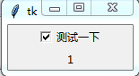

&emsp;&emsp;代码如下：

``` python
from tkinter import *
​
root = Tk()
​
GIRLS = ["西施", "王昭君", "貂蝉", "杨玉环"]
​
v = []
​
for girl in GIRLS:
    v.append(IntVar())
    b = Checkbutton(root, text=girl, variable=v[-1])
    b.pack(anchor=W)  # anchor表示方向
​
mainloop()
```

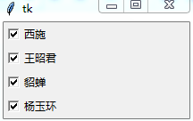

显示屏的方向图如下：

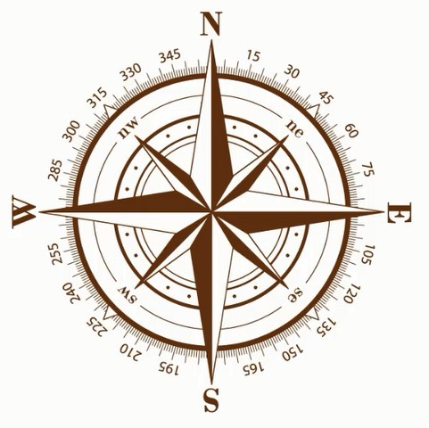

&emsp;&emsp;代码如下：

``` python
from tkinter import *
​
master = Tk()
​
v = IntVar()
​
Radiobutton(master, text="One", variable=v, value=1).pack(anchor=W)
Radiobutton(master, text="Two", variable=v, value=2).pack(anchor=W)
Radiobutton(master, text="Three", variable=v, value=3).pack(anchor=W)
​
mainloop()
```

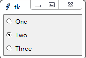

&emsp;&emsp;代码如下：

``` python
from tkinter import *
​
master = Tk()
​
LANGS = [
    ("Python", 1),
    ("Perl", 2),
    ("Ruby", 3),
    ("Lua", 4)
]
​
v = IntVar()
v.set(1)
for lang, num in LANGS:
    # indicatoron是指示器，即前面的小圆点
    b = Radiobutton(master, text=lang, variable=v, value=num, indicatoron=False)
    b.pack(fill=X)
​
mainloop()
```

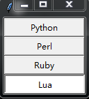

&emsp;&emsp;代码如下：

``` python
from tkinter import *
​
root = Tk()
​
group = LabelFrame(root, text="最好的脚本语言是？", padx=5, pady=5)
group.pack(padx=10, pady=10)
​
LANGS = [
    ("Python", 1),
    ("Perl", 2),
    ("Ruby", 3),
    ("Lua", 4)
]
​
v = IntVar()
v.set(1)
for lang, num in LANGS:
    b = Radiobutton(group, text=lang, variable=v, value=num)
    b.pack(anchor=W)
​
mainloop()
```

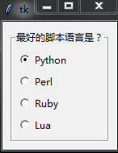

&emsp;&emsp;代码如下：

``` python
from tkinter import *
​
root = Tk()
​
e = Entry(root)
e.pack(padx=20, pady=20)
​
e.delete(0, END)  # 把输入框的内容清空
e.insert(0, "默认文本")  # 填充输入框
​
mainloop()
```

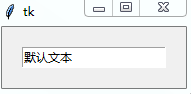

&emsp;&emsp;代码如下：

``` python
from tkinter import *
​
def show():
    print("作品：《%s》" % e1.get())
    print("作者：%s" % e2.get())
​
root = Tk()
​
Label(root, text="作品：").grid(row=0, column=0)
Label(root, text="作者：").grid(row=1, column=0)
​
e1 = Entry(root)
e2 = Entry(root)
e1.grid(row=0, column=1, padx=10, pady=5)
e2.grid(row=1, column=1, padx=10, pady=5)
​
Button(root, text="获取信息", width=10, command=show) \
    .grid(row=3, column=0, sticky=W, padx=10, pady=5)
​
Button(root, text="退出", width=10, command=root.quit) \
    .grid(row=3, column=1, sticky=E, padx=10, pady=5)
​
mainloop()
```

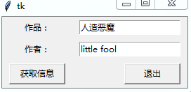

&emsp;&emsp;代码如下：

``` python
from tkinter import *
​
def show():
    print("账号：%s" % e1.get())
    print("密码：%s" % e2.get())
​
root = Tk()
​
Label(root, text="账号：").grid(row=0, column=0)
Label(root, text="密码：").grid(row=1, column=0)
​
v1 = StringVar()
v2 = StringVar()
​
e1 = Entry(root, textvariable=v1)
e2 = Entry(root, textvariable=v2, show="*")
e1.grid(row=0, column=1, padx=10, pady=5)
e2.grid(row=1, column=1, padx=10, pady=5)
​
Button(root, text="芝麻开门", width=10, command=show) \
    .grid(row=3, column=0, sticky=W, padx=10, pady=5)
​
Button(root, text="退出", width=10, command=root.quit) \
    .grid(row=3, column=1, sticky=E, padx=10, pady=5)
​
mainloop()
```

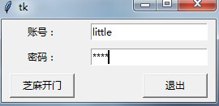

&emsp;&emsp;代码如下：

``` python
from tkinter import *
​
master = Tk()
​
frame = Frame(master)
frame.pack(padx=10, pady=10)
​
v1 = StringVar()
v2 = StringVar()
v3 = StringVar()
​
def test(content):
    return content.isdigit()
​
testCMD = master.register(test)
​
e1 = Entry(frame, width=10, textvariable=v1, validate="key", validatecommand=(testCMD, "%P")).grid(row=0, column=0)
Label(frame, text="+").grid(row=0, column=1)
e2 = Entry(frame, width=10, textvariable=v2, validate="key", validatecommand=(testCMD, "%P")).grid(row=0, column=2)
Label(frame, text="=").grid(row=0, column=3)
e3 = Entry(frame, width=10, textvariable=v3, state="readonly").grid(row=0, column=4)
​
def cal():
    result = int(v1.get()) + int(v2.get())
    v3.set(str(result))
​
Button(frame, text="计算结果", command=cal).grid(row=1, column=2, pady=5)
​
mainloop()
```

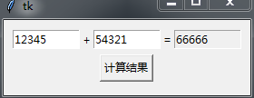

&emsp;&emsp;代码如下：

``` python
from tkinter import *
​
master = Tk()
​
# 创建一个空列表
theLB = Listbox(master, selectmode=EXTENDED)
theLB.pack()
​
# 往列表里添加数据
for item in ["鸡蛋", "鸭蛋", "鹅蛋", "李狗蛋"]:
    theLB.insert(END, item)
​
theButton = Button(master, text="删除", command=lambda x=theLB: x.delete(ACTIVE))
theButton.pack()
​
mainloop()
```

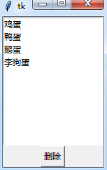

&emsp;&emsp;代码如下：

``` python
from tkinter import *
​
root = Tk()
​
def callback():
    print("~被调用了~")
​
menubar = Menu(root)
​
openVar = IntVar()
saveVar = IntVar()
quitVar = IntVar()
​
filemenu = Menu(menubar, tearoff=True)
filemenu.add_checkbutton(label="打开", command=callback, variable=openVar)
filemenu.add_checkbutton(label="保存", command=callback, variable=saveVar)
filemenu.add_separator()
filemenu.add_checkbutton(label="退出", command=root.quit, variable=quitVar)
menubar.add_cascade(label="文件", menu=filemenu)
​
editVar = IntVar()
​
editmenu = Menu(menubar, tearoff=False)
editmenu.add_radiobutton(label="剪切", command=callback, variable=editVar, value=1)
editmenu.add_radiobutton(label="拷贝", command=callback, variable=editVar, value=2)
editmenu.add_radiobutton(label="粘贴", command=callback, variable=editVar, value=3)
menubar.add_cascade(label="编辑", menu=editmenu)
​
root.config(menu=menubar) # 显示菜单
​
mainloop()
```

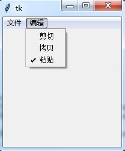

&emsp;&emsp;代码如下：

``` python
from tkinter import *
​
root = Tk()
​
def callback():
    print("~被调用了~")
​
mb = Menubutton(root, text="点我", relief=RAISED)
mb.pack()
​
filemenu = Menu(mb, tearoff=False)
filemenu.add_command(label="打开", command=callback)
filemenu.add_command(label="保存", command=callback)
filemenu.add_separator()
filemenu.add_command(label="退出", command=root.quit)
​
mb.config(menu=filemenu)
​
mainloop()
```

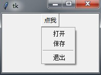

&emsp;&emsp;代码如下：

``` python
from tkinter import *
​
root = Tk()
​
variable = StringVar()
variable.set("one")
​
w = OptionMenu(root, variable, "one", "two", "three")
w.pack()
​
mainloop()
```

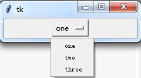

&emsp;&emsp;代码如下：

``` python
from tkinter import *

messagebox.askokcancel("FishC", "发射核弹")

mainloop()
```

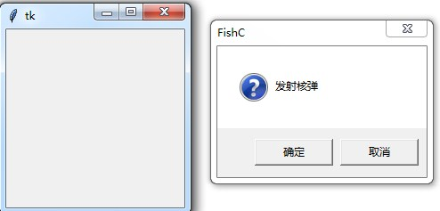