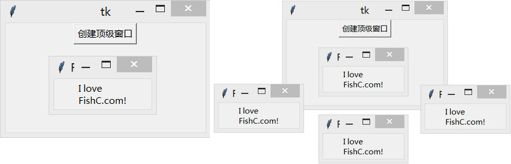

&emsp;&emsp;`Toplevel`(顶级窗口)组件类似于`Frame`组件，但`Toplevel`组件是一个独立的顶级窗口，这种窗口通常拥有标题栏、边框等部件。
&emsp;&emsp;`Toplevel`组件通常用在显示额外的窗口、对话框和其他弹出窗口上。

### 用法

&emsp;&emsp;下边例子中，我们在`root`窗口添加一个按钮用于创建一个顶级窗口，点一下来一个：

``` python
from tkinter import *
​
root = Tk()
​
def create():
    top = Toplevel()
    top.title("FishC Demo")
​
    msg = Message(top, text="I love FishC.com!")
    msg.pack()
​
Button(root, text="创建顶级窗口", command=create).pack()
​
mainloop()
```



### 参数

&emsp;&emsp;`Toplevel(master=None, **options) (class)`：`master`是父组件；`options`是组件选项，下方表格列举了各个选项的具体含义和用法：

选项                   | 含义
----------------------|-------------
`background`          | 设置背景颜色，默认值由系统指定。为了防止更新，可以将颜色值设置为空字符串
`bg`                  | 跟`background`一样
`borderwidth`         | 设置边框宽度
`bd`                  | 跟`borderwidth`一样
`class_`              | 默认值是`Toplevel`
`colormap`            | 有些显示器只支持`256`色(有些可能更少)，这种显示器通常提供一个颜色映射来指定要使用要使用的`256`种颜色。该选项允许你指定用于该组件以及其子组件的颜色映射。默认情况下，`Toplevel`使用与其父组件相同的颜色映射。使用此选项，你可以使用其他窗口的颜色映射代替(两窗口必须位于同个屏幕并且具有相同的视觉特性)。你也可以直接使用`new`为`Toplevel`组件分配一个新的颜色映射。一旦创建`Toplevel`组件实例，你就无法修改这个选项的值
`container`           | 该选项如果为`True`，意味着该窗口将被用作容器，一些其它应用程序将被嵌入，默认值是`False`
`cursor`              | 指定当鼠标在`Toplevel`上飘过的时候的鼠标样式，默认值由系统指定
`height`              | 设置高度
`highlightbackground` | 指定当`Toplevel`没有获得焦点的时候高亮边框的颜色
`highlightcolor`      | 指定当`Toplevel`获得焦点的时候高亮边框的颜色
`highlightthickness`  | 指定高亮边框的宽度
`menu`                | 设置该选项为`Toplevel`窗口提供菜单栏
`padx`                | 水平方向上的边距
`pady`                | 垂直方向上的边距
`relief`              | 指定边框样式，默认值是`FLAT`，还可以设置为`SUNKEN`、`RAISED`、`GROOVE`或`RIDGE`；注意，如果你要设置边框样式，记得设置`borderwidth`或`bd`选项不为`0`，才能看到边框
`takefocus`           | 指定该组件是否接受输入焦点(用户可以通过`tab`键将焦点转移上来)，默认值是`False`
`width`               | 设置宽度

### 方法

&emsp;&emsp;下边这一系列方法用于与窗口管理器进行交互。它们可以被Tk(根窗口)进行调用，同样也适用于Toplevel(顶级窗口)。注意，并非所有操作系统均完全支持下方所有方法的实现。

- `aspect(minNumer=None, minDenom=None, maxNumer=None, maxDenom=None)`：控制该窗口的宽高比(`width：height`)。宽高比限制在`minNumer/minDenom`至`maxNumer/maxDenom`。如果忽略参数，则返回一个`4`元组表示当前的限制(如果有的话)。
- `attributes(*args)`：设置和获取窗口属性，如果你只给出选项名，将返回当前窗口该选项的值。注意，以下选项不支持关键字参数，你需要在选项前添加横杠`-`并用字符串的方式表示，用逗号`,`隔开选项和值。例如你希望设置窗口的透明度为`50%`，你应该使用`attribute("-alpha", 0.5)`代替`attribute(alpha=0.5)`。下方表格列举了`args`可以使用各个选项的具体含义及用法：

选项         | 含义
-------------|-------
`alpha`      | (`Windows`、`Mac`)控制窗口的透明度，`1.0`表示不透明，`0.0`表示完全透明。该选项并不支持所有的系统，对于不支持的系统，`Tkinter`绘制一个不透明(`1.0`)的窗口
`disabled`   | (`Windows`)禁用整个窗口(这时候你只能从任务管理器中关闭它)
`fullscreen` | (`Windows`、`Mac`)如果设置为`True`，则全屏显示窗口
`modified`   | (`Mac`)如果设置为`True`，该窗口被标记为改动过
`titlepath`  | (`Mac`)设置窗口代理图标的路径
`toolwindow` | (`Windows`)如果设置为`True`，该窗口采用工具窗口的样式
`topmost`    | (`Windows`、`Mac`)如果设置为`True`，该窗口将永远置于顶层

- `client(name=None)`：设置和获取`WM_CLIENT_MACHINE`属性。如果要删除`WM_CLIENT_MACHINE`属性，赋值为空字符串即可。该属性仅支持`X`窗口系统的窗口管理器，其他系统均忽略。
- `colormapwindows(*wlist)`：设置和获取`WM_COLORMAP_WINDOWS`属性。该属性仅支持`X`窗口系统的窗口管理器，其他系统均忽略。
- `command(value=None)`：设置和获取`WM_COMMAND`属性。该属性仅支持`X`窗口系统的窗口管理器，其他系统均忽略。
- `deiconify`：显示窗口，默认情况下新创建的窗口都会显示在屏幕上，但使用`iconify`或`withdraw`方法可以在屏幕上移除窗口。
- `focusmodel(model=None)`：设置和获取焦点模式。
- `frame`：返回一个字符串表示当前系统特征。对于类`Unix`系统，返回值是`X`窗口标识符；对于`Windows`系统，返回值是`HWND`强制转换为长整形的结果。
- `geometry(geometry=None)`：设置和获取窗口的尺寸。`geometry`参数的格式为`"%dx%d%+d%+d" % (width, height, xoffset, yoffset)`。
- `grid(baseWidth=None, baseHeight=None, widthInc=None, heightInc=None)`：通知窗口管理器该窗口将以网格的形式重新调整尺寸。`baseWidth`和`baseHeight`指定`Tk_GeometryRequest`要求的网格单元数，`widthInc`和`heightInc`指定网格单元的宽度和高度(像素)。
- `group(window=None)`：将窗口添加到窗口群中。`window`参数指定控制窗口群的主窗口，如果忽略该参数，将返回当前窗口群的主窗口。
- `iconbitmap(bitmap=None, default=None)`：设置和获取窗口的图标，例如`root.iconbitmap(bitmap="FishC.ico")`。`default`参数可以用于指定由该窗口创建的子窗口的默认图标。
- `iconify`：将窗口图标化(最小化)。需要重新显示窗口，使用`deiconify`方法。该方法会使得`state`返回`iconic`。
- `iconmask(bitmap=None)`：设置和获取位图掩码。
- `iconname(newName=None)`：设置和获取当窗口图标化(最小化)时的图标名字。
- `iconposition(x=None, y=None)`：设置和获取当窗口图标化(最小化)时的图标位置。
- `iconwindow(pathName=None)`：设置和获取当窗口图标化(最小化)时的组件窗口，该方法会使得`state`返回`icon`。
- `maxsize(width=None, height=None)`：设置和获取该窗口的最大尺寸。
- `minsize(width=None, height=None)`：设置和获取该窗口的最小尺寸。
- `overrideredirect(boolean=None)`：如果参数为`True`，该窗口忽略所有的小部件(也就是说该窗口将没有传统的标题栏、边框等部件)。
- `positionfrom(who=None)`：指定窗口位置由`谁`决定。如果`who`参数是`user`，窗口位置由用户决定；如果`who`参数是`program`，窗口位置由系统决定。
- `protocol(name=None, func=None)`：将回调函数`func`与相应的规则`name`绑定。`name`参数可以是`WM_DELETE_WINDOW`(窗口被关闭的时候)、`WM_SAVE_YOURSELF`(窗口被保存的时候)和`WM_TAKE_FOCUS`(窗口获得焦点的时候)。
- `resizable(width=None, height=None)`：指定是否可以改变该窗口的尺寸。`width`为`True`说明允许调整窗口的水平尺寸，`height`为`True`说明允许调整窗口的垂直尺寸。
- `sizefrom(who=None)`：指定窗口尺寸由`谁`决定。如果`who`参数是`user`，窗口位置由用户决定；如果`who`参数是`program`，窗口位置由系统决定。
- `state(newstate=None)`：设置和获得当前窗口的状态。`newstate`的值可以是`normal`、`iconic`(见`iconify`)、`withdrawn`(见`withdraw`)、`icon`(见`iconwindow`)和`zoomed`(放大，`Windows`特有)。
- `title(string=None)`：设置窗口的标题。
- `transient(master=None)`：指定为`master`的临时窗口。
- `withdraw`：将窗口从屏幕上移除(并没有销毁)。需要重新显示窗口，使用`deiconify`方法。该方法会使得`state`返回`withdrawn`。
- `wm_aspect(minNumer=None, minDenom=None, maxNumer=None, maxDenom=None)`：见上方`aspect`。
- `wm_attributes(*args)`：见上方`attributes`。
- `wm_client(name=None)`：见上方`client`。
- `wm_colormapwindows(*wlist)`：见上方`colormapwindows`。
- `wm_command(value=None)`：见上方`command`。
- `wm_deiconify`：见上方`deiconify`。
- `wm_focusmodel(model=None)`：见上方`focusmodel`。
- `wm_frame`：见上方`frame`。
- `wm_geometry(geometry=None)`：见上方`geometry`。
- `wm_grid(baseWidth=None, baseHeight=None, widthInc=None, heightInc=None)`：见上方`grid`。
- `wm_group(window=None)`：见上方`group`。
- `wm_iconbitmap(bitmap=None, default=None)`：见上方`iconbitmap`。
- `wm_iconify`：见上方`iconify`。
- `wm_iconmask(bitmap=None)`：见上方`iconmask`。
- `wm_iconname(newName=None)`：见上方`iconname`。
- `wm_iconposition(x=None, y=None)`：见上方`iconposition`。
- `wm_iconwindow(pathName=None)`：见上方`iconwindow`。
- `wm_maxsize(width=None, height=None)`：见上方`maxsize`。
- `wm_minsize(width=None, height=None)`：见上方`minsize`。
- `wm_overrideredirect(boolean=None)`：见上方`overrideredirect`。
- `wm_positionfrom(who=None)`：见上方`positionfrom`。
- `wm_protocol(name=None, func=None)`：见上方`protocol`。
- `wm_resizable(width=None, height=None)`：见上方`resizable`。
- `wm_sizefrom(who=None)`：见上方`sizefrom`。
- `wm_state(newstate=None)`：见上方`state`。
- `wm_title(string=None)`：见上方`title`。
- `wm_transient(master=None)`：见上方`transient`。
- `wm_withdraw`：见上方`withdraw`。