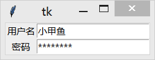
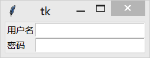
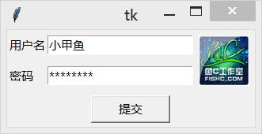

&emsp;&emsp;`pack`、`grid`和`place`均用于管理同在一个父组件下的所有组件的布局：`pack`是按添加顺序排列组件；`grid`是按`行/列`形式排列组件；`place`则允许程序员指定组件的大小和位置。<!--more-->
&emsp;&emsp;`grid`管理器可以说是`Tkinter`这三个布局管理器中最灵活多变的。如果你只希望学习使用一个布局管理器，那么`grid`绝对是首选。当你在设计对话框的时候，使用`gird`尤其便捷，使用一个`grid`就可以简单地实现你用很多个框架和`pack`搭建起来的效果。
&emsp;&emsp;使用`grid`排列组件，只需告诉它你想要将组件放置的位置(`行/列`，`row`选项指定行，`cloumn`选项指定列)。此外，你并不用提前指出网格(`grid`分布给组件的位置称为网格)的尺寸，因为管理器会自动计算。

``` python
from tkinter import *

root = Tk()

# column默认值是0
Label(root, text="用户名").grid(row=0)
Label(root, text="密码").grid(row=1)

Entry(root).grid(row=0, column=1)
Entry(root, show="*").grid(row=1, column=1)

mainloop()
```



默认情况下组件会居中显示在对应的网格里，你可以使用`sticky`选项来修改这一特性。该选项可以使用的值有`E`、`W`、`S`、`N`(`EWSN`分别表示东西南北，即上北下南左西右东)以及它们的组合。因此，我们可以通过`sticky = W`使得`Label`左对齐：

``` python
Label(root, text="用户名").grid(row=0, sticky=W)
Label(root, text="密码").grid(row=1, sticky=W)
```



有时候你可能需要用几个网格来放置一个组件，可以做到吗？当然可以，你只需要指定`rowspan`和`columnspan`就可以实现跨行和跨列的功能：

``` python
from tkinter import *

root = Tk()

Label(root, text="用户名").grid(row=0, sticky=W)
Label(root, text="密码").grid(row=1, sticky=W)

Entry(root).grid(row=0, column=1)
Entry(root, show="*").grid(row=1, column=1)

photo = PhotoImage(file="logo.gif")
Label(root, image=photo).grid(row=0, column=2, rowspan=2, padx=5, pady=5)

Button(text="提交", width=10).grid(row=2, columnspan=3, pady=5)

mainloop()
```



&emsp;&emsp;注意，下边所有方法适用于所有组件。

- `grid(**options)`：下方表格详细列举了各个选项的具体含义和用法：

选项         | 含义
-------------|-----------
`column`     | 指定组件插入的列(`0`表示第`1`列)，默认值是`0`
`columnspan` | 指定用多少列(跨列)显示该组件
`in_`        | 将该组件放到该选项指定的组件中，指定的组件必须是该组件的父组件
`ipadx`      | 指定水平方向上的内边距
`ipady`      | 指定垂直方向上的内边距
`padx`       | 指定水平方向上的外边距
`pady`       | 指定垂直方向上的外边距
`row`        | 指定组件插入的行(`0`表示第`1`行)
`rowspan`    | 指定用多少行(跨行)显示该组件
`sticky`     | 控制组件在`grid`分配的空间中的位置，可以使用`N`、`E`、`S`、`W`以及它们的组合来定位(`EWSN`代表东西南北，上北下南左西右东)；使用加号(`+`)表示拉长填充，例如`N + S`表示将组件垂直拉长填充网格，`N + S + W + E`表示填充整个网格；不指定该值则居中显示

- `grid_bbox(column=None, row=None, col2=None, row2=None)`：返回一个`4`元组描述该组件所在的限定矩形。如果指定`column`和`cow`参数，则返回该位置`(column, cow)`的组件的限定矩形描述。如果指定`4`个参数，则返回从`(column, cow)`到`(col2, row2)`所有组件的限定矩形描述。例如`grid_bbox(0, 0, 1, 1)`返回的是`4`个组件所在的限定矩形。
- `grid_columnconfigure(index, **options)`：设置列的属性。注意，设置的是该组件所拥有的grid的列。可以设置的选项及含义如下：

选项       | 含义
----------|-------
`minsize` | 指定该列的最小宽度
`pad`     | 指定该列中最大网格的水平边距
`weight`  | 指定列与列之间的相对距离，默认值是`0`。初创建窗口的时候，`grid`会自动根据组件的尺寸分配窗口的尺寸，当你拉伸窗口的尺寸时就会有空白显示出来。这个选项正是指定列与列之间是否填充空白，默认是不填充的。另外，该选项的值是指定填充空白的倍数，例如`weight = 2`的列会比`weight = 1`的列填充多一倍的空白。所以需要平均填充的话，只需要所有的列都设置`weight = 1`即可。

- `grid_configure(**options)`：跟`grid`一样。
- `grid_forget`：将组件从屏幕中`删除`，并没有销毁该组件，只是看不到了。可以通过`grid`或其他布局管理器显示已`删除`的组件，但该组件所在网格的选项设置不会恢复。
- `grid_info`：以字典的形式返回当前`grid`的选项。
- `grid_location(x, y)`：返回位于(或接近)给定坐标`(x, y)`的网格位置。返回值是一个`2`元组表示网格对应的`(列, 行)`。
- `grid_propagate(flag)`：如果开启，父组件会自动调节尺寸以容纳所有子组件，默认值是开启(`flag = True`)。该方法仅适用于父组件。
- `grid_remove`：跟`grid_forget`一样，但恢复的时候会记住该组件所在网格的选项设置。
- `grid_rowconfigure(index, **options)`：设置行的属性。注意，设置的是该组件所拥有的`grid`的行。可以设置的选项及含义如下：

选项      | 含义
----------|------
`minsize` | 指定该行的最小高度
`pad`     | 指定该列中最大网格的垂直边距
`weight`  | 指定行与行之间的相对距离，默认值是`0`。可以参考`grid_columnconfigure`的解释

- `grid_size`：返回该组件所拥有的grid的尺寸。返回值是一个`2`元组，表示`(列, 行)`分别的网格数。
- `grid_slaves(row=None, column=None)`：以列表的形式返回该组件的所有子组件，该方法仅适用于父组件。