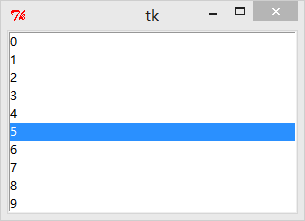
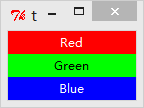
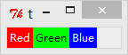

&emsp;&emsp;`pack`、`grid`和`place`均用于管理同在一个父组件下的所有组件的布局：<!--more-->

- `pack`是按添加顺序排列组件。
- `grid`是按行/列形式排列组件。
- `place`允许程序员指定组件的大小和位置。

### 何时使用pack管理器？

&emsp;&emsp;对比`grid`管理器，`pack`更适用于少量组件的排列，但它在使用上更加简单。如果你需要创建相对复杂的布局结构，那么建议是使用多个框架(`Frame`)结构构成，或者使用`grid`管理器实现。注意，不要在同一个父组件中混合使用`pack`和`grid`，因为`Tkinter`会很认真地计算到底先使用哪个布局管理器，以至于你等了半个小时，`Tkinter`还没有算出结果。

### 用法

&emsp;&emsp;我们常常会遇到将一个组件放到一个容器组件中，并填充整个父组件。下例生成一个`Listbox`组件，并将它填充到`root`窗口中：

``` python
from tkinter import *
​
root = Tk()
​
listbox = Listbox(root)
listbox.pack(fill=BOTH, expand=True)
​
for i in range(10):
    listbox.insert(END, str(i))
​
mainloop()
```



`fill`选项是告诉窗口管理器该组件将填充整个分配给它的空间，`BOTH`表示同时横向和纵向扩展，`X`表示横向，`Y`表示纵向；`expand`选项是告诉窗口管理器将父组件的额外空间也填满。默认情况下，`pack`是将添加的组件依次纵向排列：

``` python
from tkinter import *
​
root = Tk()
​
Label(root, text="Red", bg="red", fg="white").pack(fill=X)
Label(root, text="Green", bg="green", fg="black").pack(fill=X)
Label(root, text="Blue", bg="blue", fg="white").pack(fill=X)
​
mainloop()
```



如果想要组件横向按顺序排放，你可以使用`side`选项：

``` python
from tkinter import *
​
root = Tk()
​
Label(root, text="Red", bg="red", fg="white").pack(side=LEFT)
Label(root, text="Green", bg="green", fg="black").pack(side=LEFT)
Label(root, text="Blue", bg="blue", fg="white").pack(side=LEFT)
​
mainloop()
```



### 方法

&emsp;&emsp;注意，下边所有方法适用于所有组件。

- `pack(**options)`：下方表格详细列举了各个选项的具体含义和用法：

选项     | 含义
---------|-----
`anchor` | 控制组件在`pack`分配的空间中的位置，可以使用`N`、`NE`、`E`、`SE`、`S`、`SW`、`W`、`NW`或`CENTER`来定位(`EWSN`代表东西南北，上北下南左西右东)，默认值是`CENTER`
`expand` | 指定是否填充父组件的额外空间，默认值是`False`
`fill`   | 指定填充`pack`分配的空间，默认值是`NONE`，表示保持子组件的原始尺寸。还可以使用的值有：`X`(水平填充)、`Y`(垂直填充)和`BOTH`(水平和垂直填充)
`in_`    | 将该组件放到该选项指定的组件中，指定的组件必须是该组件的父组件
`ipadx`  | 指定水平方向上的内边距
`ipady`  | 指定垂直方向上的内边距
`padx`   | 指定水平方向上的外边距
`pady`   | 指定垂直方向上的外边距
`side`   | 指定组件的放置位置，默认值是`TOP`，还可以设置的值有`LEFT`、`BOTTOM`和`RIGHT`

- `pack_configure(**options)`：跟`pack`一样。
- `pack_forget`：将组件从屏幕中`删除`。并没有销毁该组件，只是看不到了，可以通过`pack`或其他布局管理器显示已`删除`的组件。
- `pack_info`：以字典的形式返回当前`pack`的选项。
- `pack_propagate(flag)`：如果开启，父组件会自动调节尺寸以容纳所有子组件，默认值是开启(`flag = True`)。该方法仅适用于父组件。
- `pack_slaves`：以列表的形式返回该组件的所有子组件，该方法仅适用于父组件。