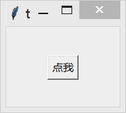
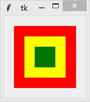

&emsp;&emsp;`pack`、`grid`和`place`均用于管理同在一个父组件下的所有组件的布局：`pack`是按添加顺序排列组件；`grid`是按行/列形式排列组件；`place`则允许程序员指定组件的大小和位置。
&emsp;&emsp;通常情况下不建议使用`place`布局管理器，因为对比起`pack`和`grid`，`place`要做更多的工作。但是，`place`在一些特殊的情况下可以发挥妙用。
<!--more-->

### 用法

&emsp;&emsp;将子组件显示在父组件的正中间：

``` python
from tkinter import *
​
root = Tk()
​
def callback():
    print("正中靶心")
​
Button(root, text="点我", command=callback).place(relx=0.5, rely=0.5, anchor=CENTER)
​
mainloop()
```



在某种情况下，或许你希望一个组件可以覆盖另一个组件，那么`place`又可以派上用场了。下面的例子演示用`Button`覆盖`Label`组件：

``` python
photo = PhotoImage(file="logo_big.gif")
Label(root, image=photo).pack()
Button(root, text="点我", command=callback).place(relx=0.5, rely=0.5, anchor=CENTER)
```


`relx`和`rely`选项指定的是相对于父组件的位置，范围是`0.0`至`1.0`，因此`0.5`表示位于正中间。那么`relwidth`和`relheight`选项则是指定相对于父组件的尺寸：

``` python
Label(root, bg="red").place(relx=0.5, rely=0.5, relheight=0.75, relwidth=0.75, anchor=CENTER)
Label(root, bg="yellow").place(relx=0.5, rely=0.5, relheight=0.5, relwidth=0.5, anchor=CENTER)
Label(root, bg="green").place(relx=0.5, rely=0.5, relheight=0.25, relwidth=0.25, anchor=CENTER)
```



无论你如何拉伸上面的窗口，三个`Label`的尺寸均会跟着改变。`x`和`y`选项用于设置偏移(像素)，如果同时设置`relx(rely)`和`x(y)`，那么`place`将优先计算`relx`和`rely`，然后再实现`x`和`y`指定的偏移值。

### 方法

&emsp;&emsp;注意，下边所有方法适用于所有组件。

- `place(**options)`：下方表格列举了各个选项的具体含义和用法：

选项         | 含义
-------------|-----
`anchor`     | 控制组件在`place`分配的空间中的位置。`N`、`NE`、`E`、`SE`、`S`、`SW`、`W`、`NW`或`CENTER`来定位(`EWSN`代表东西南北，上北下南左西右东)，默认值是`NW`
`bordermode` | 指定边框模式(`INSIDE`或`OUTSIDE`)，默认值是`INSIDE`
`height`     | 指定该组件的高度(像素)
`in_`        | 将该组件放到该选项指定的组件中，指定的组件必须是该组件的父组件
`relheight`  | 指定该组件相对于父组件的高度，取值范围`0.0`至`1.0`
`relwidth`   | 指定该组件相对于父组件的宽度，取值范围`0.0`至`1.0`
`relx`       | 指定该组件相对于父组件的水平位置，取值范围`0.0`至`1.0`
`rely`       | 指定该组件相对于父组件的垂直位置，取值范围`0.0`至`1.0`
`width`      | 指定该组件的宽度(像素)
`x`          | 指定该组件的水平偏移位置(像素)，如同时指定了`relx`选项，优先实现`relx`选项
`y`          | 指定该组件的垂直偏移位置(像素)，如同时指定了`rely`选项，优先实现`rely`选项

- `place_configure(**options)`：跟`place`一样。
- `place_forget`：将组件从屏幕中`删除`。并没有销毁该组件，只是看不到了。可以通过`place`或其他布局管理器显示已`删除`的组件。
- `place_info`：以字典的形式返回当前`place`的选项。
- `place_slaves`：以列表的形式返回该组件的所有子组件，该方法仅适用于父组件。
- `slaves`：跟`place_slaves`一样。