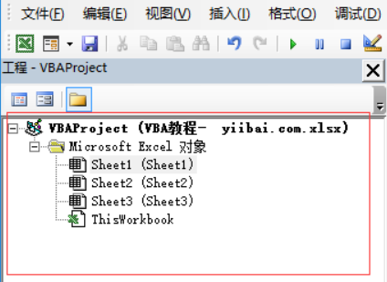
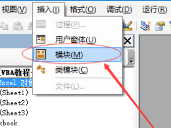
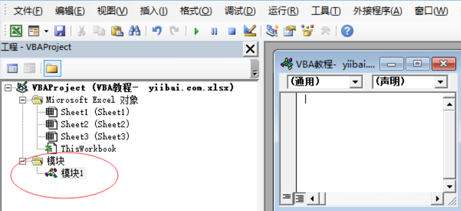

&emsp;&emsp;`VBA`代表`Visual Basic for Applications`，这是一种来自`Microsoft`的事件驱动编程语言，现在主要与`Microsoft Office`应用程序(如`MS-Excel`、`MS-Word`和`MS-Access`)一起使用。
<!--more-->
### 最简单的示例

&emsp;&emsp;在`Excel`中输入以下代码，然后运行，就会出现一个显示`Hello, World`的提示框：

``` VBScript
Private Sub hello()
    MsgBox “Hello, World”
End Sub
```

### VBA术语

#### 模块

&emsp;&emsp;模块是编写代码的区域。下图是一个新的工作簿，没有任何模块：



要插入模块，请使用步骤`插入 -> 模块`，然后就会有一个名为`模块1`的模块被创建了：



插入模块完成之后，就可以在模块中编写`VBA`代码。代码写在一个过程(`Sub`)中，一个过程是一系列`VBA`语句：



#### 程序/过程

&emsp;&emsp;程序(也叫做过程)是作为一个整体执行的一组语句，它指示`Excel`如何执行特定的任务。执行的任务可能是一个非常简单或非常复杂的任务，把复杂的程序分解成小的程序是一个很好的做法。下面是一段简单的代码：

``` VBScript
Sub fnadd(num1 As Integer, num2 As Integer)
    isum = num1 + num2
End Sub
```

#### 函数

&emsp;&emsp;函数是一组可重用的代码，可以在程序中的任何地方调用，有助于程序员将大型程序划分为许多小型且可管理的功能。
&emsp;&emsp;除了内置函数外，`VBA`还允许编写用户定义的函数，在`Function`和`End Function`关键字之间写入语句。

### VBA宏注释

&emsp;&emsp;注释用于记录程序逻辑和用户信息，其他程序员将来可以阅读并理解代码，解释器在执行时忽略注释。`VBA`使用两种方法进行注释：

- 以单引号`'`开头的语句：

``` VBScript
' This Script is invoked after successful login
' Written by: Yiibai Yiibai
' Return Value: True/False
```

- 以关键字`REM`开头的语句：

``` VBScript
REM This Script is written to Validate the Entered Input
REM Modified by: Yiibai
```