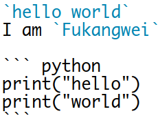
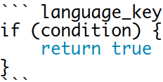

&emsp;&emsp;`Markdown`的优点主要有：纯文本，所以兼容性极强，可以用所有文本编辑器打开；让你专注于文字而不是排版；格式转换方便，`Markdown`的文本你可以轻松转换为`html`、电子书等；`Markdown`的标记语法有极好的可读性。<!--more-->

### 标题

&emsp;&emsp;在`word`中，插入标题的步骤是：`输入文本`->`选中文本`->`设置标题格式`。而在`Markdown`中，只需要在文本前面加上`#`即可。同理，你还可以增加二级标题至六级标题，只需要增加`#`即可，标题字号相应降低。注意，`#`和标题之间建议保留一个字符的空格，这是最标准的`Markdown`写法。

``` markdown
# 一级标题
## 二级标题
### 三级标题
#### 四级标题
##### 五级标题
###### 六级标题
```


### 列表

&emsp;&emsp;列表格式在文字排版中也很常用，使用`Markdown`只需要在文字前面加上`-`就可以了：

``` markdown
- 文本1
- 文本2
- 文本3
```

- 文本1
- 文本2
- 文本3

对于有序列表，在文字前面加上`1.`、`2.`、`3.`就可以了：

``` markdown
1. 文本1
2. 文本2
3. 文本3
```

1. 文本1
2. 文本2
3. 文本3

### 链接和图片

&emsp;&emsp;在`Markdown`中，插入链接不需要其他按钮，只需要使用`[显示文本](链接地址)`这样的语法即可：

``` markdown
[简书](http://www.jianshu.com)
```

也可以把链接放在文章的末尾，注意中间必须要有空行：

``` markdown
[简书]

[简书]:(http://www.jianshu.com)
```

插入图片只需要使用``这样的语法即可(此方法也可以插入本地图片)：

``` markdown

```

### 引用

&emsp;&emsp;在写作时经常需要引用他人的文字，于是引用这个格式就很有必要了。在`Markdown`中，只需要在希望引用的文字前面加上`>`就好了：

``` markdown
> 一盏灯，一片昏黄；一简书，一杯淡茶。守着那一份淡定，品读属于自己的寂寞。
```

> 一盏灯，一片昏黄；一简书，一杯淡茶。守着那一份淡定，品读属于自己的寂寞。

对于诗句的引用，在每一行前面加上`>`即可：

``` markdown
> 保持淡定，才能欣赏到最美丽的风景！
> 保持淡定，人生从此不再寂寞。
```

> 保持淡定，才能欣赏到最美丽的风景！
> 保持淡定，人生从此不再寂寞。

### 粗体和斜体

&emsp;&emsp;用两个`*`包含一段文本就是粗体的语法，用一个`*`包含一段文本就是斜体的语法：

``` markdown
*一盏灯*，一片昏黄；**一简书**
```

*一盏灯*，一片昏黄；**一简书**

### 代码引用

&emsp;&emsp;在引用代码时，如果引用的语句只有一段，且不分行，可以用<code>\`</code>将语句括起来。如果引用的语句为多行，可以将<code>\`\`\`</code>置于这段代码的首行和末行。



`hello world`
I am `Fukangwei`

``` python
print("hello")
print("world")
```

如果需要对代码进行高亮处理，可以使用如下格式：



``` language_key
if (condition) {
    return true
}
```

`language_key`可以是如下选项：

Language                   | key
---------------------------|----
`C`                        | `c`
`AVR Assembler`            | `avrasm`
`Bash`                     | `bash`
`CMake`                    | `cmake`
`CoffeeScript`             | `coffeescript`
`C++`                      | `cpp`
`C#`                       | `cs`
`CSS`                      | `css`
`Delphi`                   | `delphi`
`Diff`                     | `diff`
`Django`                   | `django`
`DOS .bat`                 | `dos`
`Go`                       | `go`
`Haskell`                  | `haskell`
`HTTP`                     | `http`
`Java`                     | `java`
`JavaScript`               | `javascript`
`JSON`                     | `json`
`Lua`                      | `lua`
`Makefile`                 | `makefile`
`Markdown`                 | `markdown`
`Matlab`                   | `matlab`
`nginx`                    | `nginx`
`Objective C`              | `objectivec`
`Oxygene`                  | `oxygene`
`Perl`                     | `perl`
`PHP`                      | `php`
`PowerShell`               | `powershell`
`Protocol Buffers`         | `protobuf`
`Python`                   | `python`
`R`                        | `r`
`Ruby`                     | `ruby`
`Rust`                     | `rust`
`Scala`                    | `scala`
`SQL`                      | `sql`
`Swift`                    | `swift`
`Tcl`                      | `tcl`
`TeX`                      | `tex`
`TypeScript`               | `typescript`
`VB.NET`                   | `vbnet`
`VBScript in HTML`         | `vbscript-html`
`VBScript`                 | `vbscript`
`Verilog`                  | `verilog`
`VHDL`                     | `vhdl`
`Intel x86 Assembly`       | `x86asm`
`XML`或`HTML`              | `xml`

### 表格

&emsp;&emsp;代码如下，注意这`3`列之间区别：

``` markdown
| Tables        | Are           | Cool  |
| ------------- |:-------------:| -----:|
| col 3 is      | right-aligned | $1600 |
| col 2 is      | centered      |   $12 |
| zebra stripes | are neat      |    $1 |
```

| Tables        | Are           | Cool  |
| ------------- |:-------------:| -----:|
| col 3 is      | right-aligned | $1600 |
| col 2 is      | centered      |   $12 |
| zebra stripes | are neat      |    $1 |

另一种写法如下：

``` markdown
dog | bird | cat
----|------|----
foo | foo  | foo
bar | bar  | bar
baz | baz  | baz
```

dog | bird | cat
----|------|----
foo | foo  | foo
bar | bar  | bar
baz | baz  | baz

### 分割线

&emsp;&emsp;分割线的语法只需要三个`*`号(实际上`***`、`---`、`===`和`___`都是分割线语法)：

``` markdown
***
hello, fukangwei
```

### 脚注

&emsp;&emsp;代码示例如下：

``` markdown
这是脚注一[^1]
这是脚注二[^2]

[^1]: 脚注一
[^2]: 脚注二
```

这是脚注一[^1]
这是脚注二[^2]

[^1]: 脚注一
[^2]: 脚注二

### 任务列表

&emsp;&emsp;在`GitHub`和`GitLab`等网站，除了可以使用有序列表和无序列表外，还可以使用任务列表，很适合要列出一些清单的场景。

``` markdown
- [ ] 一次性水杯
- [x] 西瓜
- [ ] 豆浆
- [x] 可口可乐
- [ ] 小茗同学
```

- [ ] 一次性水杯
- [x] 西瓜
- [ ] 豆浆
- [x] 可口可乐
- [ ] 小茗同学

### 反斜杠

&emsp;&emsp;`Markdown`可以利用反斜杠来插入一些在语法中有其它意义的符号(也就是进行转义)，例如下面的语句用于显示`*literal asterisks*`：

``` markdown
\*literal asterisks\*
```

转义符号如下：

符号 | 说明     | 符号           | 说明
-----|---------|----------------|-----
`\`  | 反斜线   | <code>`</code> | 反引号
`*`  | 星号     | `_`            | 底线
`{}` | 花括号   | `[]`           | 方括号
`()` | 括弧     | `#`            | 井字号
`+`  | 加号     | `-`            | 减号
`.`  | 英文句点 | `!`            | 惊叹号

### 删除线

&emsp;&emsp;删除线的语法如下：

``` markdown
~~这是删除线~~
```

~~这是删除线~~

### 首行缩进

&emsp;&emsp;使用特殊占位符可以实现首行缩进：

- `&ensp;`或`&#8194;`是半角。
- `&emsp;`或`&#8195;`是全角。

代码示例：

``` markdown
&ensp;你好
&emsp;你好
&emsp;&emsp;你好
hello, Look at me
```

&ensp;你好
&emsp;你好
&emsp;&emsp;你好
hello, Look at me