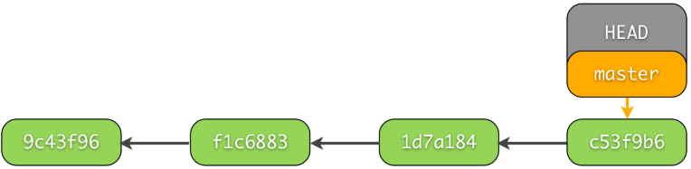
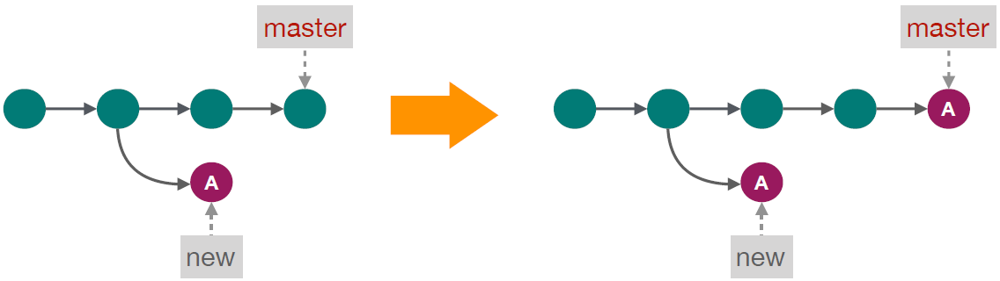

### 创建版本库(init)

&emsp;&emsp;例如对文件夹`gitTUT`中的代码进行管理，进入该文件夹：<!--more-->

``` bash
cd ~/Desktop/gitTUT
```

为了更好地使用`git`，我们需要记录每一个施加修改的人。在`git`中添加用户名`user.name`和他的邮箱`user.email`：

``` bash
git config --global user.name "Morvan Zhou"
git config --global user.email "mz@email.com"
```

然后就能在这个文件夹中建立`git`的管理文件了：

``` bash
git init
```

该命令输出`Initialized empty Git repository in /Users/MorvanZhou/Desktop/gitTUT/.git/`，这句话告诉我们已经建立了一个空的`git`管理库。

### 添加文件管理(add)

&emsp;&emsp;`git`创建的管理库文件`.git`是被隐藏起来的，所以需要执行命令`ls -al`才能看到被隐藏的文件。建立一个名为`1.py`的文件，然后使用`status`来查看版本库的状态：

``` bash
$ git status
On branch master  # 在master分支

Initial commit

Untracked files:
  (use "git add <file>..." to include in what will be committed)
    1.py  # 1.py文件没有被加入版本库(unstaged)
nothing added to commit but untracked files present (use "git add" to track)
```

目前，`1.py`并没有被放入版本库中(`unstaged`)，所以要使用`add`把它添加进版本库(`staged`)：

``` bash
$ git add 1.py
$ git status  # 再次查看状态status
On branch master

Initial commit

Changes to be committed:
  (use "git rm --cached <file>..." to unstage)
    new file: 1.py  # 版本库已识别1.py(staged)
```

如果想一次性添加文件夹中所有未被添加的文件，可以使用如下命令：

``` bash
git add .
```

### 提交改变(commit)

&emsp;&emsp;我们已经添加好了`1.py`文件，最后一步就是提交这次的改变，并在`-m`自定义这次改变的信息：

``` bash
$ git commit -m "create 1.py"
[master (root-commit) 6bd231e] create 1.py
1 file changed, 0 insertions(+), 0 deletions(-)
create mode 100644 1.py
```

上述过程可以被流程图直观地表现：


### 修改记录(log)

&emsp;&emsp;在`git`中，每一次提交(`commit`)的修改都会被单独地保存起来，也可以说`git`中的所有文件都是一次次修改累积起来的。文件好比楼房，每个`commit`记录了盖楼需添加或者拿走的材料，整个施工过程也被记录了下来。  
&emsp;&emsp;之前我们以`Morvan Zhou`的名义对版本库进行了一次修改，添加了一个`1.py`的文件，接下来就去查看版本库的些施工的过程。可以看到在`Author`中已经有名字和`email`信息了：

``` bash
$ git log
commit 13be9a7bf70c040544c6242a494206f240aac03c
Author: Morvan Zhou <mz@email.com>
Date:   Tue Nov 29 00:06:47 2016 +1100
    create 1.py  # 这是记录的修改信息
```

如果我们对`1.py`文件进行一次修改，例如添加如下代码：

``` bash
a = 1
```

然后就能在`status`中看到修改还没被提交的信息了：

``` bash
$ git status
On branch master
Changes not staged for commit:
  (use "git add <file>..." to update what will be committed)
  (use "git checkout -- <file>..." to discard changes in working directory)
    modified: 1.py  # 这里显示有一个修改还没被提交
no changes added to commit (use "git add" and/or "git commit -a")
```

我们先添加这次修改(`add`)，然后进行提交(`commit`)：

``` bash
$ git add 1.py
$ git commit -m "change 1"
[master fb51216] change 1
1 file changed, 1 insertion(+)  # 提示文件有一处添加
```

再次查看`log`，现在我们就能看到`create 1.py`和`change 1`这两条修改信息了，而且做出这两条`commit`的`ID`，修改的`Author`和`Date`也被显示在上面：

``` bash
$ git log
commit fb51216b081e00db3996e14edf8ff080fab1980a
Author: Morvan Zhou <mz@email.com>
Date:   Tue Nov 29 00:24:50 2016 +1100
    change 1

commit 13be9a7bf70c040544c6242a494206f240aac03c
Author: Morvan Zhou <mz@email.com>
Date:   Tue Nov 29 00:06:47 2016 +1100
    create 1.py
```

### 查看unstaged

&emsp;&emsp;把`1.py`的内容改为如下：

``` bash
a = 2
b = 1
```

&emsp;&emsp;如果想要查看这次还没`add`(处于`unstaged`状态)的修改部分和上个已经`commit`的文件有何不同，可以使用`diff`命令：

``` bash
$ git diff
diff --git a/1.py b/1.py
index 1337a53..ff7c36c 100644
--- a/1.py
+++ b/1.py
@@ -1 +1,2 @@
-a = 1  # 删除了“a = 1”
+a = 2  # 添加了“a = 2”
+b = 1  # 添加了“b = 1”
```

### 查看staged(--cached)

&emsp;&emsp;如果你已经`add`了这次修改，使文件变成了`可提交状态`(`staged`)，可以在`diff`中添加参数`--cached`来查看修改：

``` bash
$ git add .  # add全部修改文件
$ git diff --cached
diff --git a/1.py b/1.py
index 1337a53..ff7c36c 100644
--- a/1.py
+++ b/1.py
@@ -1 +1,2 @@
-a = 1
+a = 2
+b = 1
```

### 查看staged和unstaged(HEAD)

&emsp;&emsp;还有一种方法让我们可以查看`add`过(`staged`)和没`add`(`unstaged`)的修改。例如修改一下文件`1.py`但不进行`add`操作：

``` bash
a = 2
b = 1
c = b
```

目前`a = 2`和`b = 1`已被`add`，`c = b`是新的修改，还没被`add`：

``` bash
$ git diff HEAD  # staged & unstaged
@@ -1 +1,3 @@
-a = 1  # 已staged
+a = 2  # 已staged
+b = 1  # 已staged
+c = b  # 还没add(unstaged状态)
# -----------------------
$ git diff  # unstaged
@@ -1,2 +1,3 @@
 a = 2  # 注意前面没有“+”
 b = 1  # 注意前面没有“+”
+c = b  # 还没add(unstaged状态)
# -----------------------
$ git diff --cached  # staged
@@ -1 +1,2 @@
-a = 1  # 已staged
+a = 2  # 已staged
+b = 1  # 已staged
```

然后使用`add`命令变成`staged`状态，并进行`commit`：

``` bash
$ git add .
$ git commit -m "change 2"
[master 6cc6579] change 2
1 file changed, 3 insertions(+), 1 deletion(-)
```

### 修改已commit的版本

&emsp;&emsp;有时候我们总会忘记些什么，比如已经提交了`commit`，却发现在这个`commit`中忘了附上另一个文件。例如最后一个`commit`是`change 2`，我们将要添加另外一个文件，将这个修改也`commit`进`change 2`。复制文件`1.py`，改名为`2.py`，并把`2.py`变成`staged`，然后使用`--amend`将这次改变合并到之前的`change 2`中：

``` bash
$ git add 2.py
$ git commit --amend --no-edit  # “--no-edit”：不编辑，直接合并到上一个commit
$ git log --oneline  # “--oneline”：每个commit内容显示在一行
904e1ba change 2  # 合并过的“change 2”
c6762a1 change 1
13be9a7 create 1.py
```

### reset回到add之前

&emsp;&emsp;有时使用`add`添加了修改，但是又有些后悔，想补充一些内容再`add`。这时有一种方式可以回到`add`之前，比如在`1.py`文件中添加如下内容：

``` bash
d = 3
```

然后使用`add`达到`staged`状态，再尝试返回到`add`之前：

``` bash
$ git add 1.py
$ git status -s  # “-s”简化“git status”输出信息
M  1.py  # staged
# -----------------------
$ git reset 1.py
Unstaged changes after reset:
M  1.py
# -----------------------
$ git status -s
M 1.py  # unstaged
```

撤销所有已经`add`的文件：

``` bash
git reset HEAD .
```

### reset回到commit之前

&emsp;&emsp;在穿梭到过去的`commit`之前，我们必须了解`git`是如何一步一步累加更改的：



每个`commit`都有自己的`id`数字号，`HEAD`是一个指针，指引当前的状态是在哪个`commit`。最近的一次`commit`在最右边，如果要回到过去的`commit`，就是让`HEAD`回到过去(使用`reset`命令)：

``` bash
$ git reset --hard HEAD  # 不管之前有没有做了一些add工作，这一步让我们回到上一次的commit
HEAD is now at 904e1ba change 2
# -----------------------
$ git log --oneline  # 看看所有的log
904e1ba change 2
c6762a1 change 1
13be9a7 create 1.py
# -----------------------
# 回到c10ea64，即“change 1”
$ git reset --hard HEAD^  # 方式1：“HEAD^”
$ git reset --hard c6762a1  # 方式2：“commit id”
# -----------------------
$ git log --oneline  # 看看现在的log
c6762a1 change 1
13be9a7 create 1.py
```

怎么`change 2`消失了？还有办法挽救消失的`change 2`吗？我们可以使用`git reflog`查看最近做的所有`HEAD`的改动，并选择想要挽救的`commit id`：

``` bash
$ git reflog
c6762a1 HEAD@{0}: reset: moving to c6762a1
904e1ba HEAD@{1}: commit (amend): change 2
0107760 HEAD@{2}: commit: change 2
c6762a1 HEAD@{3}: commit: change 1
13be9a7 HEAD@{4}: commit (initial): create 1.py
```

重复`reset`就能回到`commit (amend): change 2`(`id = 904e1ba`)这一步了：

``` bash
$ git reset --hard 904e1ba
$ git log --oneline
904e1ba change 2
c6762a1 change 1
13be9a7 create 1.py
```

### 回到从前(checkout针对单个文件)

&emsp;&emsp;之前使用`reset`的时候是针对整个版本库，回到版本库的某个过去。如果我们只想回到某个文件的过去，可以使用`checkout`命令。其实`checkout`最主要的用途并不是让单个文件回到过去，之后会介绍`checkout`在分支`branch`中的应用，这一节主要讲`checkout`让文件回到过去。  
&emsp;&emsp;我们现在的版本库中有两个文件：

``` bash
- gitTUT
    - 1.py
    - 2.py
```

我们仅仅要对`1.py`进行回到过去操作，例如回到`c6762a1 change 1`这一个`commit`。使用`checkout + id c6762a1 + -- + 文件目录 1.py`就能将`1.py`的指针`HEAD`放在`c6762a1`位置：

``` bash
$ git log --oneline
904e1ba change 2
c6762a1 change 1
13be9a7 create 1.py
# ---------------------
$ git checkout c6762a1 -- 1.py
```

这时`1.py`文件就变成如下内容：

``` bash
a = 1
```

我们在`1.py`加上一行内容`# I went back to change 1`，然后使用`add`并`commit`：

``` bash
$ git add 1.py
$ git commit -m "back to change 1 and add comment for 1.py"
$ git log --oneline
47f167e back to change 1 and add comment for 1.py
904e1ba change 2
c6762a1 change 1
13be9a7 create 1.py
```

可以看出，与`reset`命令不同，`change 2`并没有消失，但是`1.py`却已经回到了过去，并改写了未来。

### 分支(branch)

&emsp;&emsp;之前编辑的所有改变都是在一条主分支`master`上进行的，通常会把`master`当作最终的版本；而开发新版本或者新属性的时候，在另外一个分支上进行，这样就能使开发和使用互不干扰了。  
&emsp;&emsp;之前的文件只有`master`分支，可以通过`--graph`来观看分支情况：

``` bash
$ git log --oneline --graph
* 47f167e back to change 1 and add comment for 1.py
* 904e1ba change 2
* c6762a1 change 1
* 13be9a7 create 1.py
```

接着建立另一个分支`dev`(`develop`的缩写)，并查看当前管理的所有分支：

``` bash
$ git branch dev  # 建立dev分支
$ git branch  # 查看当前分支
  dev
* master  # “*”代表了当前HEAD所在的分支
```

当需要把`HEAD`切换到`dev`分支时，可以用到上次说到的`checkout`命令：

``` bash
$ git checkout dev
Switched to branch 'dev'
# --------------------------
$ git branch
* dev  # 这时HEAD已经被切换至dev分支
  master
```

&emsp;&emsp;使用`checkout -b + 分支名`就能直接创建或切换到新建的分支：

``` bash
$ git checkout -b dev
Switched to a new branch 'dev'
# --------------------------
$ git branch
* dev  # 这时HEAD已经被切换至dev分支
  master
```

&emsp;&emsp;目前`dev`分支中的`1.py`与`2.py`和`master`中的文件是一模一样的，因为当前的指针`HEAD`在`dev`分支上，所以现在对文件夹中的文件进行修改将不会影响到`master`分支。我们在`1.py`上加入`# I was changed in dev branch`，然后再`commit`：

``` bash
git commit -am "change 3 in dev"  # “-am”：add所有改变，并直接commit
```

开发版`dev`已经更新好了，现在要将`dev`中的修改推送到`master`中，大家就能使用到正式版中的新功能了。首先切换到`master`，再将`dev`推送过来：

``` bash
$ git checkout master  # 切换至master才能把其他分支合并过来
$ git merge dev  # 将dev合并(merge)到master中
$ git log --oneline --graph
* f9584f8 change 3 in dev
* 47f167e back to change 1 and add comment for 1.py
* 904e1ba change 2
* c6762a1 change 1
* 13be9a7 create 1.py
```

需要注意的是，如果直接进行`git merge dev`，`git`会采用默认的`Fast forward`格式进行`merge`，此时`merge`操作不会有`commit`信息，`log`中也不会有分支的图案。我们可以采取`--no-ff`这种方式保留`merge`的`commit`信息：

``` bash
$ git merge --no-ff -m "keep merge info" dev  # 保留merge信息
$ git log --oneline --graph
*   c60668f keep merge info
|\
| * f9584f8 change 3 in dev  # 这里就能看出，我们建立过一个分支
|/
* 47f167e back to change 1 and add comment for 1.py
* 904e1ba change 2
* c6762a1 change 1
* 13be9a7 create 1.py
```

### merge分支冲突

&emsp;&emsp;假如不仅有人在做开发版`dev`的更新，还有人在修改`master`中的一些`bug`，当我们再`merge dev`的时候，冲突就会来了，因为`git`不知道应该怎么处理`merge`时`master`和`dev`的不同修改。  
&emsp;&emsp;当创建了一个分支后，我们同时对两个分支进行修改，例如在`master`中的`1.py`加上`# edited in master`，在`dev`中的`1.py`加上`# edited in dev`，下面可以看出`master`和`dev`中不同的`commit`：

``` bash
# 这是master的log
* 3d7796e change 4 in master  # 这一条commit和dev的不一样
* 47f167e back to change 1 and add comment for 1.py
* 904e1ba change 2
* c6762a1 change 1
* 13be9a7 create 1.py
# -----------------------------
# 这是dev的log
* f7d2e3a change 3 in dev  # 这一条commit和master的不一样
* 47f167e back to change 1 and add comment for 1.py
* 904e1ba change 2
* c6762a1 change 1
* 13be9a7 create 1.py
```

当我们想要将`dev`合并到`master`时：

``` bash
$ git branch
  dev
* master
# -------------------------
$ git merge dev
Auto-merging 1.py
CONFLICT (content): Merge conflict in 1.py
Automatic merge failed; fix conflicts and then commit the result.
```

`git`发现`1.py`在`master`和`dev`的版本是不同的，所以提示`merge`有冲突。`git`已经帮我们标记出来，打开`1.py`就能看到如下内容：

``` bash
a = 1
# I went back to change 1
<<<<<<< HEAD
# edited in master
=======
# edited in dev
>>>>>>> dev
```

只要在`1.py`中手动合并一下两者的不同就可以了，将当前`HEAD`(也就是`master`)中的描述和`dev`中的描述合并一下：

``` bash
a = 1
# I went back to change 1
# edited in master and dev
```

然后再`commit`现在的文件，冲突就解决了：

``` bash
git commit -am "solve conflict"
```

再来看看`master`的`log`：

``` bash
$ git log --oneline --graph
*   7810065 solve conflict
|\
| * f7d2e3a change 3 in dev
* | 3d7796e change 4 in master
|/
* 47f167e back to change 1 and add comment for 1.py
* 904e1ba change 2
* c6762a1 change 1
* 13be9a7 create 1.py
```

### 忽略特定项

&emsp;&emsp;在项目的根目录建立文件`.gitignore`，在该文件中添加要忽略的文件或文件夹。

### git clean

&emsp;&emsp;`git clean`命令用来从你的工作目录中删除所有没有`tracked`过的文件。  
&emsp;&emsp;`git clean`经常和`git reset --hard`一起结合使用。记住，`reset`只影响被`track`过的文件，所以需要`clean`来删除没有`track`过的文件。结合使用这两个命令，可以让你的工作目录完全回到一个指定的`commit`的状态。  
&emsp;&emsp;常见的命令用法如下：

- `git clean -n`是一次`clean`的演习，告诉你哪些文件会被删除。该命令不会真正的删除文件，只是一个提醒。
- `git clean -f`删除当前目录下所有没有`track`过的文件，它不会删除`.gitignore`文件里面指定的文件夹和文件，不管这些文件有没有被`track`过。
- `git clean -f path`删除指定路径`path`下的没有被`track`过的文件。
- `git clean -df`删除当前目录下没有被`track`过的文件和文件夹。
- `git clean -xf`删除当前目录下所有没有被`track`过的文件，不管它是否在`.gitignore`文件里。

&emsp;&emsp;`git reset --hard`和`git clean -f`是一对好基友，结合使用它们能让你的工作目录完全回退到最近一次`commit`的时候。  
&emsp;&emsp;`git clean`对于刚编译过的项目也非常有用，它可以删除掉编译生成的`.o`和`.exe`等文件，这个在打包要发布一个`release`的时候非常有用。

### git show命令

&emsp;&emsp;此命令可以用于显示各种类型对象的相关信息。  
&emsp;&emsp;查看对应的`commit`信息：

``` bash
git show commit-id
```

实例如下：

``` bash
$ git show 5a867f8
commit 5a867f8d91c9e5ac88bd7b09331a79e65191a1c9
Author: unknown <kangwei_fu@realsil.com.cn>
Date:   Mon Dec 2 14:01:11 2019 +0800

    first commit

diff --git a/1.py b/1.py
new file mode 100644
index 0000000..d25d49e
--- /dev/null
+++ b/1.py
@@ -0,0 +1 @@
+a = 1
```

### git cherry-pick命令

&emsp;&emsp;`git cherry-pick`可以理解为挑拣`commit`，它会获取某一个`branch`的单笔`commit`，并作为一个新的`commit`引入到你当前`branch`上，如下图所示：  



&emsp;&emsp;假如本地仓库中有分支`branch1`和`branch2`，我们先来查看各个分支的提交：

``` bash
# 切换到branch2分支
$ git checkout branch2
Switched to branch 'branch2'
# 查看最近三次提交
$ git log --oneline -3
23d9422 [Description]:branch2 commit 3
2555c6e [Description]:branch2 commit 2
b82ba0f [Description]:branch2 commit 1
# 切换到branch1分支
$ git checkout branch1
Switched to branch 'branch1'
# 查看最近三次提交
$ git log --oneline -3
20fe2f9 commit second
c51adbe commit first
ae2bd14 commit 3th
```

现在我想将`branch2`的第一次提交合入到`branch1`分支上，则可以使用`git cherry-pick`命令：

``` bash
$ git cherry-pick 2555c6e
error: could not apply 2555c6e... [Description]:branch2 commit 2
hint: after resolving the conflicts, mark the corrected paths
hint: with 'git add <paths>' or 'git rm <paths>'
hint: and commit the result with 'git commit'
```

当`cherry-pick`时，没有自动提交成功，这说明存在冲突。因此，首先需要解决冲突，然后使用`git commit`手动进行提交：

``` bash
$ git commit
[branch1 790f431] [Description]:branch2 commit 2
 Date: Fri Jul 13 18:36:44 2018 +0800
 1 file changed, 1 insertion(+)
 create mode 100644 only-for-branch2.txt
```

或者`git add .`后，直接使用`git cherry-pick --continue`继续提交。  
&emsp;&emsp;现在查看提交信息：

``` bash
$ git log --oneline -3
790f431 [Description]:branch2 commit 2
20fe2f9 commit second
c51adbe commit first
```

`branch2`分支上的第二次`commit`成功合入到了`branch1`分支上。

### 创建标签

&emsp;&emsp;在`Git`中打标签非常简单，首先切换到需要打标签的分支上：

``` bash
$ git branch
* dev
  master
$ git checkout master
Switched to branch 'master'
```

然后使用命令`git tag <name>`，就可以打一个新标签：

``` bash
git tag v1.0
```

可以用命令`git tag`查看所有标签：

``` bash
$ git tag
v1.0
```

默认标签是打在最新提交的`commit`上的。  
&emsp;&emsp;如果忘了打标签，比如现在已经是周五了，但应该在周一打的标签没有打，怎么办？方法是找到历史提交的`commit id`，然后打上就可以了：

``` bash
$ git log --pretty=oneline --abbrev-commit
12a631b (HEAD -> master, tag: v1.0, origin/master) merged bug fix 101
4c805e2 fix bug 101
e1e9c68 merge with no-ff
f52c633 add merge
cf810e4 conflict fixed
5dc6824 & simple
14096d0 AND simple
b17d20e branch test
d46f35e remove test.txt
b84166e add test.txt
519219b git tracks changes
e43a48b understand how stage works
1094adb append GPL
e475afc add distributed
eaadf4e wrote a readme file
```

比方说要对`add merge`这次提交打标签，它对应的`commit id`是`f52c633`，敲入命令：

``` bash
git tag v0.9 f52c633
```

再用命令`git tag`查看标签：

``` bash
$ git tag
v0.9
v1.0
```

注意，标签不是按时间顺序列出，而是按字母排序的。可以用`git show <tagname>`查看标签信息：

``` bash
$ git show v0.9
commit f52c63349bc3c1593499807e5c8e972b82c8f286 (tag: v0.9)
Author: Michael Liao <askxuefeng@gmail.com>
Date:   Fri May 18 21:56:54 2018 +0800

    add merge

diff --git a/readme.txt b/readme.txt
```

可以看到，`v0.9`确实打在`add merge`这次提交上。  
&emsp;&emsp;还可以创建带有说明的标签，用`-a`指定标签名，`-m`指定说明文字：

``` bash
git tag -a v0.1 -m "version 0.1 released" 1094adb
```

用命令`git show <tagname>`可以看到说明文字：

``` bash
$ git show v0.1
tag v0.1
Tagger: Michael Liao <askxuefeng@gmail.com>
Date:   Fri May 18 22:48:43 2018 +0800

version 0.1 released

commit 1094adb7b9b3807259d8cb349e7df1d4d6477073 (tag: v0.1)
Author: Michael Liao <askxuefeng@gmail.com>
Date:   Fri May 18 21:06:15 2018 +0800

    append GPL

diff --git a/readme.txt b/readme.txt
```

### git fetch和git pull

&emsp;&emsp;先用一张图来理一下`git fetch`和`git pull`的概念：


可以简单的概括为：

- `git fetch`是将远程主机的最新内容拉到本地，用户在检查了以后，决定是否合并到工作本机分支中。
- `git pull`是将远程主机的最新内容拉下来后直接合并，即`git pull = git fetch + git merge`，这样可能会产生冲突，需要手动解决。

#### git fetch用法

- `git fetch <远程主机名>`：这个命令将某个远程主机的更新全部取回本地。
- `git fetch <远程主机名> <分支名>`：如果只想取回特定分支的更新，可以指定分支名。最常见的命令是取回`origin`主机的`master`分支：

``` bash
git fetch origin master
```

取回更新后，会返回一个`FETCH_HEAD`，指的是某个`branch`在服务器上的最新状态。我们可以在本地通过它查看刚取回的更新信息：

``` bash
git log -p FETCH_HEAD
```


返回的信息包括更新的文件名、更新的作者和时间，以及更新的代码。我们可以通过这些信息来判断是否产生冲突，以确定是否将更新`merge`到当前分支。

#### git pull用法

&emsp;&emsp;`git pull`的过程可以理解为：

``` bash
git fetch origin master # 从远程主机的master分支拉取最新内容
git merge FETCH_HEAD    # 将拉取下来的最新内容合并到当前所在的分支中
```

`git pull`命令的完整格式如下：

``` bash
git pull <远程主机名> <远程分支名>:<本地分支名>
```

如果远程分支是与当前分支合并，则冒号后面的部分可以省略：

``` bash
git pull origin next
```

### git branch命令

- `git branch`：查看本地所有分支。
- `git branch -r`：查看远程所有分支。
- `git branch -a`：查看本地和远程的所有分支。
- `git branch <branchname>`：新建分支。
- `git branch -d <branchname>`：删除本地分支。
- `git branch -m <old_name> <new_name>`：重命名本地分支。