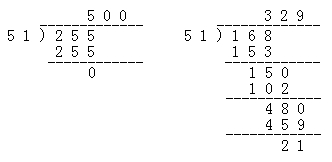

&emsp;&emsp;关于`AD`转换的代码如下：

``` cpp
for ( n = 0; n < 8; n++ ) {
    dis[2] = ad_data[n] / 51; /* 测得值转换为3位BCD码，最大为5.00V */
    dis[4] = ad_data[n] % 51; /* 余数暂存 */
    dis[4] = dis[4] * 10; /* 计算小数第一位 */
    dis[1] = dis[4] / 51;
    dis[4] = dis[4] % 51;
    dis[4] = dis[4] * 10; /* 计算小数第二位 */
    dis[0] = dis[4] / 51;
    .....
}
```

其中`ad_data`是`AD`转换后的数据，`dis`是要显示的内容。关于这段代码的解释如下：
&emsp;&emsp;`AD`转换一般是将外接的`0`至`5V`的电压变换成为`8`位二进制数，即`0`至`255`。如果想要将这些数字转换成`0.00`至`5.00V`，需要除以`51`。假设外接的电压是`3.29V`，经过`AD`转换后，送到单片机的数据将是`168`。由这个数字变换成`329`的运算步骤如下：



&emsp;&emsp;计算步骤如下：

1. `168`除以`51`，整数部分是`3`，余数部分是`15`。
2. `15`后面添上`0`，即余数部分乘以`10`。
3. `150`除以`51`，整数部分是`2`，余数部分是`48`。
4. `48`后面添上`0`，即余数部分乘以`10`。
5. `480`除以`51`，整数部分是`9`，余数部分是`21`。

此时就得到了`329`，如果要求精度较高，可以继续除下去。