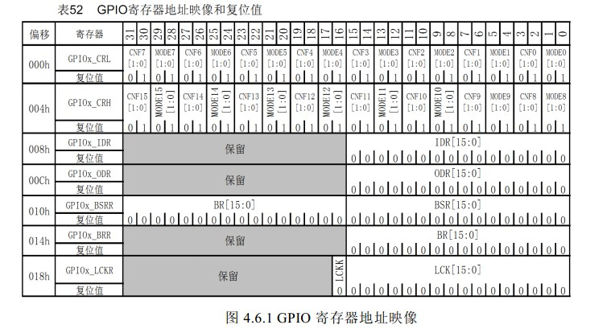
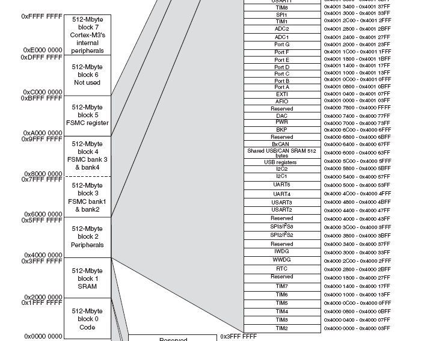

&emsp;&emsp;`51`单片机开发中经常会引用`reg51.h`头文件，这里来看看它是如何把名字和寄存器联系起来的：`sfr P0 = 0x80;`。`sfr`也是一种扩充数据类型，占用一个内存单元，值域为`0`至`255`。利用它可以访问`51`单片机内部的所有特殊功能寄存器。例如`sfr P1 = 0x90;`这一句定义`P1`为`P1`端口在片内的寄存器。然后我们往地址为`0x80`的寄存器设值的方法是`P0 = value;`。
&emsp;&emsp;`STM32`是否也可以这样做？答案是肯定的，`MDK`采用的方式是通过结构体来将寄存器组织在一起。下面我们就讲解`MDK`是怎么把结构体和地址对应起来的，为什么修改结构体成员变量的值就可以操作对应寄存器的值。这些事情都是在`stm32f10x.h`中完成的。
&emsp;&emsp;首先查看`STM32中文参考手册`中的寄存器地址映射表：



&emsp;&emsp;从这个表可以看出，`GPIOA`的`7`个寄存器都是`32`位的，所以每个寄存器占有`4`个地址，一共占用`28`个地址，地址偏移范围为`0x000`至`0x01B`。这个地址偏移是相对`GPIOA`的基地址而言的。`GPIOA`的基地址是怎么算出来的呢？因为`GPIOA`都是挂载在`APB2`总线之上，所以它的基地址是由`APB2`总线的基地址加上`GPIOA`在`APB2`总线上的偏移地址决定的。同理依次类推，我们便可以算出`GPIOA`基地址了。下面打开`stm32f10x.h`，定位到`GPIO_TypeDef`的定义处：

``` cpp
typedef struct {
    __IO uint32_t CRL;
    __IO uint32_t CRH;
    __IO uint32_t IDR;
    __IO uint32_t ODR;
    __IO uint32_t BSRR;
    __IO uint32_t BRR;
    __IO uint32_t LCKR;
} GPIO_TypeDef;
```

然后定位到如下内容：

``` cpp
#define GPIOA ( ( GPIO_TypeDef * ) GPIOA_BASE )
```

可以看出，`GPIOA`是将`GPIOA_BASE`强制转换为`GPIO_TypeDef`指针。这句话的意思是，`GPIOA`指向地址`GPIOA_BASE`，`GPIOA_BASE`存放的数据类型为`GPIO_TypeDef`。`GPIOA_BASE`的宏定义如下：

``` cpp
#define GPIOA_BASE ( APB2PERIPH_BASE + 0x0800 )
```

依次类推，可以找到最顶层：

``` cpp
#define APB2PERIPH_BASE ( PERIPH_BASE + 0x10000 )
#define PERIPH_BASE     ( ( uint32_t ) 0x40000000 )
```

所以便可以算出`GPIOA`的基地址为`GPIOA_BASE = 0x40000000+0x10000+0x0800 = 0x40010800`。
&emsp;&emsp;下面再根据`STM32中文参考手册`查看`GPIOA`的基地址是不是为`0x40010800`。从存储器映射表可以看到，`GPIOA`的起始地址(也就是基地址)确实是`0x40010800`：



&emsp;&emsp;已经知道`GPIOA`的基地址，那么`GPIOA`的`7`个寄存器的地址又是怎么算出来的呢？在上面已经讲过`GPIOA`的各个寄存器对于`GPIOA`基地址的偏移地址，所以自然可以算出来每个寄存器的地址：

``` cpp
GPIOA的寄存器的地址 = GPIOA基地址 + 寄存器相对GPIOA基地址的偏移值
```

这个偏移值在上面的寄存器地址映像表中可以查到。
&emsp;&emsp;那么在结构体里面这些寄存器又是怎么与地址一一对应的呢？这里涉及到结构体成员变量地址对齐方式方面的知识。在定义好地址对齐方式之后，每个成员变量对应的地址就可以根据其基地址来计算。对于结构体类型`GPIO_TypeDef`，它的所有成员变量都是`32`位，成员变量地址具有连续性，所以就可以算出`GPIOA`指向的结构体成员变量对应地址。

寄存器         | 偏移地址 | 实际地址 = 基地址 + 偏移地址
--------------|----------|---------------------------
`GPIOA->CRL`  | `0x00`   | `0x40010800 + 0x00`
`GPIOA->CRH`  | `0x04`   | `0x40010800 + 0x04`
`GPIOA->IDR`  | `0x08`   | `0x40010800 + 0x08`
`GPIOA->ODR`  | `0x0c`   | `0x40010800 + 0x0c`
`GPIOA->BSRR` | `0x10`   | `0x40010800 + 0x10`
`GPIOA->BRR`  | `0x14`   | `0x40010800 + 0x14`
`GPIOA->LCKR` | `0x18`   | `0x40010800 + 0x18`

&emsp;&emsp;把`GPIO_TypeDef`定义的成员变量的顺序和`GPIOx`寄存器地址映像进行对比可以发现，它们的顺序是一致的，如果不一致，就会导致地址混乱。这就是为什么固件库里面`GPIOA->BRR = value;`就是设置地址为`0x40010800 + 0x014(BRR偏移量) = 0x40010814`的寄存器`BRR`的值了。它和`51`中的`P0 = value;`是设置地址为`0x80`的`P0`寄存器的值是一样的道理。