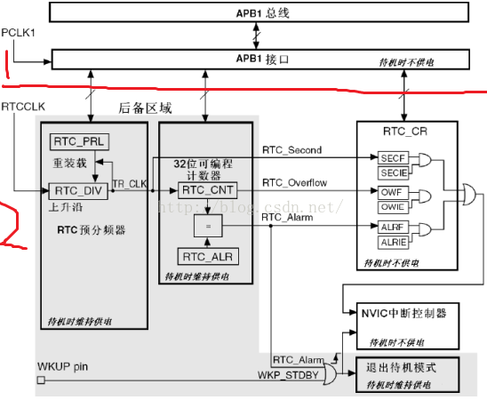

&emsp;&emsp;先熟悉一下几个知识点：

- `STM32`的实时时钟`RTC`是一个独立的定时器。
- `RTC`模块和其时钟配置系统(`RCC_BDCR`寄存器)是在后备区域。当系统复位或断电的时候，后备区域依然自动计时。我们可以在后备区域放一些关键的数据。
- `RTC`的部分区域可由`VCC`来供电，也可以由备用电源来供电。

&emsp;&emsp;`RTC`时钟框图可以分为完全独立的两个部分：第一个是`APB1`接口部分，用来`RTC`相关的寄存器；第二个是`RTC`核心。对于第一部分，这里涉及到寄存器`RTC_CRL`中的`RSF`位，这位是寄存器的同步标志。对于第二部分，这里分为两个模块：一是`RTC`预分频器模块；二是一个`32`位的可编程计数器。

&emsp;&emsp;下面开始分析第二部分，先给大家介绍下后备区域的几个特别重要的寄存器：

- `RTC_DIV`：`RTC`预分频器余数寄存器。这个寄存器的作用是来获得比秒钟更加准确的时钟(例如`0.1s`、`0.01s`)，该寄存器是自减的，用来保存还需要多少个时钟周期获得一个秒信号。这里加上一个公式`fTR_CLK = fRTCCLK/(PRL[19:0] + 1)`。`RTC_DIV`寄存器的值是由`RTC_PRL`(`RTC`预分频器装载寄存器)提供的，而`RTC_DIV`寄存器的时钟频率是由`RTCCLK`提供的。比如我们把`RTC_PRL`值设为`32767`，则`RTC_DIV`寄存器的值也为`32767`，它和`RTCCLK`的时钟频率是一样的。`RTCCLK`的时钟周期是`1/32768`(`s`)，也就是每一个`RTCCLK`的时钟周期，`RTC_DIV`自减`1`，直至到`1s`钟后，被硬件重新装载，也就是`1s`钟减`32768`次。那它到底是怎么提供`0.1s`，甚至是`0.01s`的呢？举个例子就明白了。比如我想要得到`1.12`秒的这个时间，就要求`RTC_DIV`自减`0.12 / (1 / 32768)`次。
- `RTC_PRL`：`RTC`预分频装载寄存器。这个寄存器有两个作用：一是提供给`RTC_DIV`的重新装载值，二是设置时钟分频系数。对于设置时钟分频系数，比如我们使用`32.768KHz`的晶振作为时钟输入，那么我们配置这个寄存器值为`32767`，就可以得到`1s`钟的计数频率(`32768 / (32767 + 1)`，单位是`Hz`)。
- `RTC_CNT`：它是`RTC`计数器寄存器。这个寄存器较简单，用来记录秒钟值。如果之前对`RTC_CR`的相关中断允许位配置的话，`RTC_CNT`寄存器可以产生一个溢出中断。
- `RTC_ALR`：它是`RTC`闹钟寄存器，用来标记闹钟产生时间。如果`RTC_CNT`的值和`RTC_ALR`的值相等，并使能中断的话(在`RTC_CR`中配置)，会产生一个闹钟中断。

&emsp;&emsp;给大家理一遍思路：首先外部加进来一个时钟信号`RTCCLK`(`32.768K`)，然后设置`RTC_PRL`的分频系数为`32767`，得到一个秒时钟信号`TR_CLK`(`1Hz`)。当`TR_CLK`每过一个时钟周期，产生一个`RTC_Second`(秒钟中断)，同时`RTC_CNT`计数器(记录秒值)加`1`。如果要求更精准的时间，还可以在`RTC_CR`寄存器的`RSF`位被置为`1`时去读`RTC_DIV`的值。
&emsp;&emsp;如果想显示时间，就要先设置一个基础时间，然后让系统在基础时间上进行自加。
&emsp;&emsp;第一步：设置一个基础时间。在对时钟进行配置时(在初始化函数`RTC_Init`中配置)，里面有个`RTC_Set`函数，此函数会对你设置的年月日时分秒进行计算，算出从`1970`年到你设置那个时刻总共是多少秒，然后把算出来的这个秒值赋给`RTC_CNT`计数器作为初值。
&emsp;&emsp;第二步：系统自己更新时间(自加)。在更新函数`RTC_Get`中，首先会读取`RTC_CNT`计数器中的值，然后经过一番计算，计算出年月日时分秒和星期，分别赋值给那些时间的结构体变量。