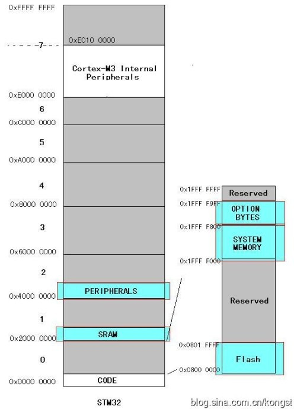
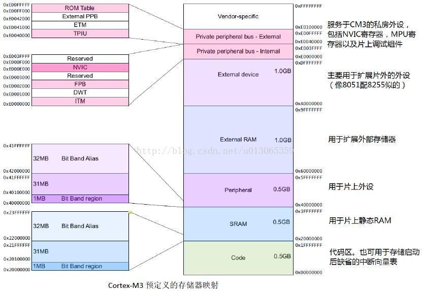
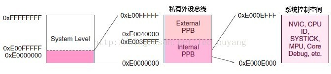

&emsp;&emsp;存储器映射是指把芯片中或芯片外的`FLASH`、`RAM`、外设、`BOOTBLOCK`等进行统一编址，即用地址来表示对象。这个地址绝大多数情况是由厂家规定好的，用户只能用而不能改。用户只能在挂载外部`RAM`或`FLASH`的情况下可进行自定义。
&emsp;&emsp;`Cortex-M3`是`32`位的内核，因此其`PC`指针可以指向`2^32 = 4G`的地址空间，也就是`0x0000_0000`至`0xFFFF_FFFF`这一大块空间。
&emsp;&emsp;`Cortex-M3`内核将`0x0000_0000`至`0xFFFF_FFFF`这块`4G`大小的空间分成`8`大块：代码、`SRAM`、外设、外部`RAM`、外部设备、专用外设总线(内部)、专用外设总线(外部)、特定厂商等，导致了使用该内核的芯片厂家必须按照这个进行各自芯片的存储器结构设计。
&emsp;&emsp;`STM32`的存储器地址空间被划分为大小相等的`8`块区域，每块区域大小为`512MB`。对`STM32`存储器知识的掌握，实际上就是对`Flash`和`SRAM`这两个区域知识的掌握。

### STM32的SRAM

&emsp;&emsp;不同类型的`STM32`单片机其`SRAM`大小是不一样的，但是它们的起始地址都是`0x2000_0000`，终止地址都是`0x2000_0000 + 其固定的容量大小`。`SRAM`的理解比较简单，其作用是用来存取各种动态的输入输出数据、中间计算结果以及与外部存储器交换的数据和暂存数据。设备断电后，`SRAM`中存储的数据就会丢失。

### STM32的Flash

&emsp;&emsp;`STM32`的`Flash`，严格说应该是`Flash`模块。该`Flash`模块包括：`Flash`主存储区(`Main memory`)、`Flash`信息区(`Information block`)以及`Flash`存储接口寄存器区(`Flash memory interface`)。三个组成部分分别在`0x0000_0000`至`0xFFFF_FFFF`不同的区域。下图中淡蓝色就是你需要知道的。

- `Peripherals`：片上外设的存储器映射，对该区域操作，就是对相应的片上外设进行操作。
- `SRAM`：运行时临时存放代码的地方。
- `Flash`：存放代码的地方。
- `System Memory`：`STM32`在出厂时，已经固化了一段程序在`System memory`(`medium-density devices`的地址为`0x1FFF_F000`，大小为`2KB`)存储器中。这段程序就是一个固定好的，并且没法修改的`Boot_Loader`。
- `Option Bytes`：可以按照用户的需要进行配置(如配置看门狗为硬件实现还是软件实现)。

---

### Cortex-M3存储器映射

&emsp;&emsp;`CM3`的地址空间有`4G`，但它只对这`4G`空间作了预先的定义，把`4G`空间分成`8`个块，每块大小为`512M`，并指出各段该分给哪些设备。具体的实现由芯片厂商决定，厂商可以设计出具有自己特色的产品。下图是`CM3`的存储器映射图(来自`Cortex-M3权威指南`)：

&emsp;&emsp;内部`SRAM`区的大小是`512MB`，用于让芯片制造商连接片上的`SRAM`，这个区通过系统总线来访问。在这个区的下部，有一个1MB的位带区，该位带区还有一个对应的`32MB`的`位带别名(alias)区`，容纳了`8M`个`位变量`(`8051`的只有`128`个位变量)。位带区对应的是最低的`1MB`地址范围，而位带别名区里面的每个字对应位带区的一个比特。位带操作只适用于数据访问，不适用于取指。通过位带的功能，可以把多个布尔型数据打包在单一的字中，却依然可以从位带别名区中，像访问普通内存一样地使用它们。位带别名区中的访问操作是原子的，消灭了传统的`读->改->写`三步曲。
&emsp;&emsp;地址空间的另一个`512MB`范围由片上外设(的寄存器)使用。这个区中也有一条`32MB`的位带别名，以便于快捷地访问外设寄存器，例如可以方便地访问各种控制位和状态位。要注意的是，外设内不允许执行指令。
&emsp;&emsp;还有两个`1GB`的范围，分别用于连接外部`RAM`和外部设备，它们之中没有位带。两者的区别在于外部`RAM`区允许执行指令，而外部设备区则不允许。
&emsp;&emsp;最后还剩下`0.5G`的隐秘地带，`CM3`内核的闺房就在这里面，包括了系统级组件、内部私有外设总线、外部私有外设总线以及由提供者定义的系统外设。私有外设总线有两条：

- `AHB`：私有外设总线，只用于`CM3`内部的`AHB`外设，它们是`NVIC`、`FPB`、`DWT`和`ITM`。
- `APB`：私有外设总线，既用于`CM3`内部的`APB`设备，也用于外部设备(这里的`外部`是对内核而言)。`CM3`允许器件制造商再添加一些片上`APB`外设到`APB`私有总线上，它们通过`ABP`接口来访问。

&emsp;&emsp;`NVIC`所处的区域叫做`系统控制空间(SCS)`，在`SCS`里的还有`SysTick`、`MPU`以及代码调试控制所用的寄存器：

&emsp;&emsp;最后，未用的提供商指定区(`Vendor-Specific`)也通过系统总线来访问，但是不允许在其中执行指令。
&emsp;&emsp;`CM3`中的`MPU`(内存保护单元)是选配的，由芯片制造商决定是否配上。
&emsp;&emsp;上述的存储器映射只是个粗线条的模板，半导体厂家会提供更展开的图示来表明芯片中片上外设的具体分布、`RAM`与`ROM`的容量和位置信息。