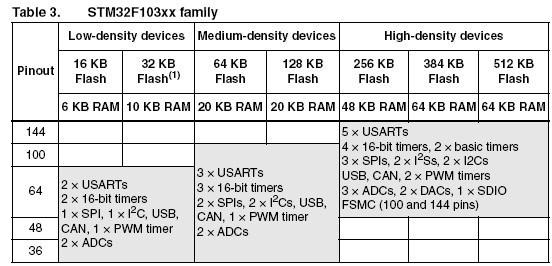
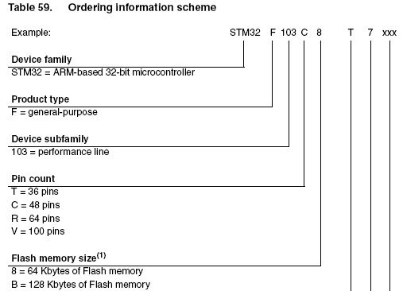

&emsp;&emsp;`STM32`启动文件选择如下：

``` cpp
startup_stm32f10x_ld_vl.s: for STM32 Low density Value line devices
startup_stm32f10x_ld.s:    for STM32 Low density devices
startup_stm32f10x_md_vl.s: for STM32 Medium density Value line devices
startup_stm32f10x_md.s:    for STM32 Medium density devices
startup_stm32f10x_hd.s:    for STM32 High density devices
startup_stm32f10x_xl.s:    for STM32 XL density devices
startup_stm32f10x_cl.s:    for STM32 Connectivity line devices
```

- `cl`：互联型产品，`stm32f105/107`系列。
- `vl`：超值型产品，`stm32f100`系列。
- `xl`：超高密度产品，`stm32f101/103`系列。
- `ld`：低密度产品，`FLASH`小于`64K`。
- `md`：中等密度产品，`FLASH = 64K or 128K`。
- `hd`：高密度产品，`FLASH`大于`128K`。

### 为什么需要选择启动文件？

&emsp;&emsp;1. 建立中断服务入口地址，即把中断向量与中断服务函数链接起来。
&emsp;&emsp;在串口`NVIC`配置中，我们只定义了`NVIC_InitStructure.NVIC_IRQChannel = USART2_IRQn;`，也就是中断服务向量。然后在`stm32f10x_it.c`文件的`USART2_IRQHandler`函数里添加串口的服务程序。但是`MCU`怎么知道中断向量`USART2_IRQn`对应的是`USART2_IRQHandler`呢，这个就是启动文件所起的作用。在`启动文件.s`中以`g_pfnVectors:`开头。
&emsp;&emsp;2. 从`SystemInit`函数进入到`main`函数。
&emsp;&emsp;对于`stm32`，我们定义系统时钟的时候直接在system_stm32f10x.c文件里修改宏定义即可，而事实上到底是从哪开始执行的呢？system_stm32f10x.c文件里有个SystemInit函数，就是对时钟的设置。而这个SystemInit在哪调用的呢？就是启动文件先调用了，然后才进入到main函数。
&emsp;&emsp;在`启动文件.s`中有以下一段话可以解释：

``` cpp
/* Call the clock system intitialization function */
    bl  SystemInit
/* Call static constructors */
    bl __libc_init_array
/* Call the application's entry point */
    bl main
    bx lr
```

&emsp;&emsp;3. 有些启动文件定义了堆栈大小，可以在这里进行修改(有些是在`.ld`文件进行定义的)。

### 这些文件在哪里？

&emsp;&emsp;打开官方库文件，可以看到`STM32F10x_StdPeriph_lib/Libraries/CMSIS/CM3/DeviceSupport/ST/STM32F10x/startup`下有`4`个文件夹：`arm`、`gcc_ride7`、`iar`、`TrueSTUDIO`，到底选择哪个文件夹呢？这与编译器有关，不同的编译器调用的指令集是不同的，所以需谨慎选择。`arm`适用于`arm`编译器，`gcc_ride7`适用基于`GCC_ride7`的编译器，`iar`适用于`IAR`编译器，`TrueSTDIO`是`ST`自己的编译器，当然也是基于`GCC`，在`MDK`与`eclipse`上可以使用(在`eclipse`下使用`GCC`插件的话，需要把后缀名`.s`改为`.S`，否则会编译出错)。

### 怎么选择101xx、102xx、103xx是小容量、中容量还是大容量？

&emsp;&emsp;查了一下`user manual`手册，以下为摘录：



&emsp;&emsp;可以这样认为：

- `flash容量 <= 32k`，选择`ld`。
- `64k <= flash容量 <= 128k`，选择`md`。
- `256k <= flash容量 <= 512k`，选择`hd`。

怎么区分`MCU`的`flash`容量呢？可以参考下表对于芯片命名说明：



可以得出结论：

命名 | 容量  | 命名 | 容量
-----|------|------|-----
`6`  | 32K  | `8`  | 64K
`B`  | 128K | `C`  | 256K
`D`  | 384K | `E`  | 512K