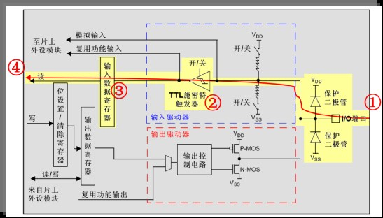
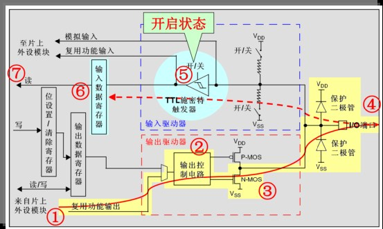

&emsp;&emsp;`STM32F103ZET6`一共有`7`组`IO`口，即`GPIOA`至`GPIOG`，每组`IO`口有`16`个`IO`，一共有`16 * 7 = 112`个`IO`口。`STM32`的大部分引脚除了当`GPIO`使用外，还可以复用为外设功能引脚(如串口)。<!--more-->
&emsp;&emsp;`STM32`共有`8`种模式：`4`种输入模式，分别是浮空输入模式(`GPIO_Mode_IN_FLOATING`)、上拉输入模式(`GPIO_Mode_IPU`)、下拉输入模式(`GPIO_Mode_IPD`)、模拟输入模式(`GPIO_Mode_AIN`)；`4`种输出模式，分别是普通推挽输出模式(`GPIO_Mode_Out_PP`)、普通开漏输出模式(`GPIO_Mode_Out_OD`)、复用推挽输出模式(`GPIO_Mode_AF_PP`)、复用开漏输出模式(`GPIO_Mode_AF_OD`)。

### 输入模式

&emsp;&emsp;浮空输入模式：



&emsp;&emsp;`IO`口的电平状态经过`TTL`施密特触发器(开)，再到输入数据寄存器，`CPU`即可从数据寄存器读取到该电平状态。内部的上拉下拉的开关是关闭的。当此`IO`口悬空，其电平状态是不确定的，由外部输入决定，这个模式直接用电压表测量其引脚电压为`1.X`伏。由于其输入阻抗比较大，一般这种输入模式用于标准的通讯协议(如`I2C`、`USART`)的接收端。
&emsp;&emsp;上拉输入模式：


&emsp;&emsp;和浮空很相似，唯一不同地方在于，上拉的开关被打开，若`IO`口处于悬空状态，会有上拉电阻拉高。即默认电平为高电平。
&emsp;&emsp;下拉输入模式：


&emsp;&emsp;和上拉输入模式很相似，唯一不同的地方在于下拉的开关被打开，`IO`口悬空时默认电平为低电平。
&emsp;&emsp;模拟输入模式：


&emsp;&emsp;接入到`IO`口的不是电平状态，而是电压(`2V`、`3V`等)，上下拉被关闭、`TTL`施密特触发器被关闭，加在`IO`口的电压直接到模拟输入。当`IO`口被用作`ADC`采样时就是这种结构，当使用`ADC`外设时，必须设置为模拟输入模式。

### 输出模式

&emsp;&emsp;普通推挽输出模式：


&emsp;&emsp;往寄存器写`1`，通过输出控制电路，`P-MOS`管导通，`N-MOS`管关闭，`IO`口即为高电平；往寄存器写`0`，通过输出控制电路，`P-MOS`管关闭，`N-MOS`管导通，`IO`口即为低电平。两个管子轮流导通，一个负责灌电流、一个负责拉电流，使其负载能力和开关速度都比普通的方式有很大的提升，推挽输出的低电平为`0V`，高电平为`3.3V`。无论何时，`CPU`都可以通过输入驱动器读取该`IO`口的实际电平值。
&emsp;&emsp;普通开漏输出模式：


&emsp;&emsp;该模式下，`P-MOS`管不起作用，往寄存器写`0`，通过输出控制电路，则使`N-MOS`管导通，使输出接地，`IO`口即为低电平；往寄存器写`1`，`N-MOS`管截止，此时`IO`口即不是高电平也不是低电平，为高阻态，即无法直接输出高电平，使用时必须在外部接上一个上拉电阻。当输出为高阻态时，由上拉将该`IO`口拉高，一般用于电平不匹配的情况下，如需要输出`5V`高电平，就需要加上拉电阻，电源为`5V`。当输出为高阻态时，由上拉电阻和电源向外输出`5V`电平。
&emsp;&emsp;注意此模式具有`线与`特性，即很多个开漏模式引脚连在一起时，只有当所有引脚都输出高阻态(即`1`)，才会被外部上拉电阻拉高提供电平，此时电平的电压为外部上拉电阻所接电源的电压。若其中一个引脚为低电平，那线路就相当于短接到地，使得整条线路为低电平(`0V`)。
&emsp;&emsp;上拉电阻的阻值决定了逻辑电平转换的沿的速度，阻值越大，速度越低功耗越小。只有在写`1`时，才可以通过输入驱动器读取该`IO`口的实际电平值，利用此原理，适合模拟`I2C`，接上拉电阻，就能够正确输出`0`和`1`，读值时先`GPIO_SetBits(GPIOB, GPIO_Pin_0)`拉高，然后使用`GPIO_ReadInputDataBit(GPIOB, GPIO_Pin_0)`读`IO`的值。
&emsp;&emsp;复用推挽输出模式：


&emsp;&emsp;复用推挽输出模式和普通推挽输出模式基本是一样，只是一个是由片上外设控制，一个是由`CPU`控制。无论何时，`CPU`都可以通过输入驱动器读取该`IO`口的实际电平值。
&emsp;&emsp;复用开漏输出模式：



&emsp;&emsp;复用开漏输出模式和普通开漏输出模式基本是一样，只是一个是由片上外设控制，一个是由`CPU`控制。无论何时，`CPU`都可以通过输入驱动器读取该`IO`口的实际电平值。复用模式是根据`GPIO`的复用功能来选择的，如`GPIO`的引脚作用串口`TX`，则采用复用推挽输出模式，如果是`I2C`、`SMBUS`这些线与功能的复用场合则采用复用开漏输出模式。在使用任何一种开漏模式时，一般都是接上拉电阻。
&emsp;&emsp;通常有`5`种方式使用某个引脚功能，它们的配置方式如下：

- 作为普通`GPIO`输入：根据需要配置该引脚为浮空输入、带弱上拉输入或带弱下拉输入，同时不要使能该引脚对应的所有复用功能模块。
- 作为普通`GPIO`输出：根据需要配置该引脚为推挽输出或开漏输出，同时不要使能该引脚对应的所有复用功能模块。
- 作为普通模拟输入：配置该引脚为模拟输入模式，同时不要使能该引脚对应的所有复用功能模块。
- 作为内置外设的输入：根据需要配置该引脚为浮空输入、带弱上拉输入或带弱下拉输入，同时使能该引脚对应的某个复用功能模块。
- 作为内置外设的输出：根据需要配置该引脚为复用推挽输出或复用开漏输出，同时使能该引脚对应的所有复用功能模块。

&emsp;&emsp;如果有多个复用功能模块对应同一个引脚，只能使能其中之一，其它模块保持非使能状态。`STM32`复位后，`IO`端口处于输入浮空状态。复位后，`JTAG`引脚被置于输入上拉或下拉模式：

- `PA15`：`JTDI`置于上拉模式。
- `PA14`：`JTCK`置于下拉模式。
- `PA13`：`JTMS`置于上拉模式。
- `PB4`：`JNTRST`置于上拉模式。

&emsp;&emsp;所有`IO`端口都具有外部中断能力，端口必须配置成输入模式，才能使用外部中断功能。`IO`端口复用功能配置：

- 对于复用功能输入，端口可以配置成任意输入模式或者复用功能输出模式。
- 对于复用功能输出，端口必须配置成复用功能输出。
- 对于双向复用功能，端口必须配置成复用功能输出。
- `STM32`的部分`IO`端口的复用功能可以重新映射成另外的复用功能。
- `STM32`具有`GPIO`锁定机制，即锁定`GPIO`配置，下次复位前不能再修改。
- 当`LSE`振荡器关闭时，`OSC32_IN`和`OSC32_OUT`可以用作通用`IO`即`PC14`和`PC15`。
- 当进入待机模式或者备份域由`VBAT`供电，`PC14`、`PC15`功能丢失，该两个`IO`口线设置为模拟输入功能。
- `OSC_IN`和`OSC_OUT`可以重新映射为`PD0`、`PD1`。`PD`、`PD1`用于输出地时候仅能用于`50MHz`输出模式。
- `PC13`、`PC14`、`PC15`只能用于`2MHz`的输出模式，最多只能带`30pf`的负载，并且同时只能使用一个引脚。

---

### STM32的GPIO相关寄存器

&emsp;&emsp;每个`GPIO`端口有两个`32`位配置寄存器(`GPIOx_CRH`、`GPIOx_CRL`)分别控制每个端口的高`8`位和低`8`位。如果`IO`口是`0`至`7`，则写`CRL`寄存器；如果`IO`口是`8`至`15`，则写`CRH`寄存器。两个`32`位数据寄存器(`GPIOx_IDR`、`GPIOx_ODR`)一个是输入数据寄存器，另一个是输出寄存器。`32`位`置位/复位`寄存器为`GPIOx_BSRR`，`16`位复位寄存器为`GPIOx_BRR`，`32`位锁定寄存器为`GPIOx_LCKR`。常用的`IO`端口寄存器只有四个，即`CRH`、`CRL`、`IDR`、`ODR`。
&emsp;&emsp;数据手册中列出了每个`I/O`端口的特定硬件特征，`GPIO`端口的每个位可以由软件分别配置成多种模式。每个`I/O`端口位可以自由编程，然而`I/0`端口寄存器必须按`32`位字被访问(不允许半字或字节访问)。另外，`STM32`的每个端口使用前都要将其时钟使能，`STM32`的`GPIO`的时钟统一挂接在`APB2`上，具体的使能寄存器为`RCC_APB2ENR`，该寄存器的第`2`位到第`8`位分别控制`GPIOx`(`x = A、B、C、D、E、F、G`)端口的时钟使能。当外设时钟没有启用时，程序不能读出外设寄存器的数值。例如打开`PORTA`时钟为：

``` cpp
RCC->APB2ENR |= 1 << 2; /* 使能PORTA时钟 */
```

&emsp;&emsp;使能外设时钟后，`GPIOA`的十六位就可以按照设定的状态工作了，之后就是具体设置哪一位了。以第`8`位为例，即高位的首位，在`GPIOx_CRH`寄存器中进行设置，`GPIOA`的每一位都由该寄存器的四位来设定相应的参数，这四位中的高两位(`CNF0`、`CNF1`)设置`GPIO`的输入输出模式，低两位(`MODE0`、`MODE1`)是设置`GPIO`的输出频率。

``` cpp
/* 清掉PA8原来的设置，同时屏蔽其它端口，不影响其它端口的设置 */
GPIOA->CRH &= 0xFFFFFFF0;
GPIOA->CRH |= 0x00000003; /* PA8推挽输出 */
```

&emsp;&emsp;十六进制中的`3`换成二进制是`0011`。前两位`00`表示推挽输出，`11`代表输出频率`50MHz`，若`CRH |= 0x4`，表示模拟输入模式(`ADC`使用)，`0x3`表示推挽输出模式(用作输出口，`50M`速率)，`0x8`表示`上/下拉`输入模式(用作输入口)，`0xB`表示复用输出(使用`IO`口的第二功能，`50M`速率)。这是对一位的操作，当然也可以多位操作，因为`STM32`对`GPIO`操作必须是`32`位全字操作，设置完成后`GPIOA`的第`8`位就可以使用了。之后给`GPIOA->ODR = 0x xxxx xxxx`送数据就可以了。