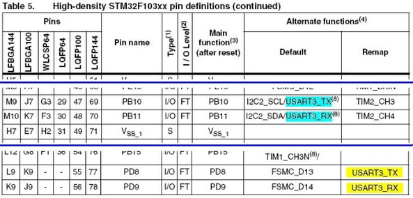
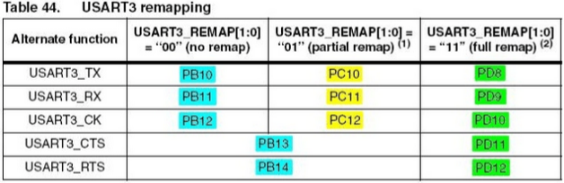
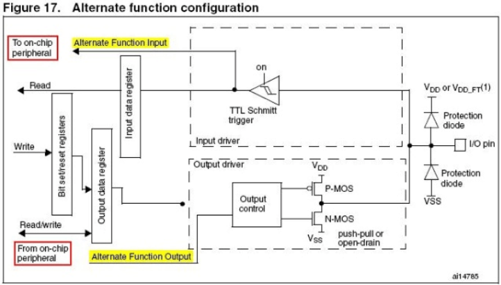
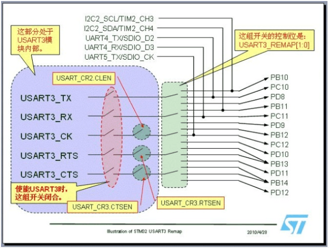
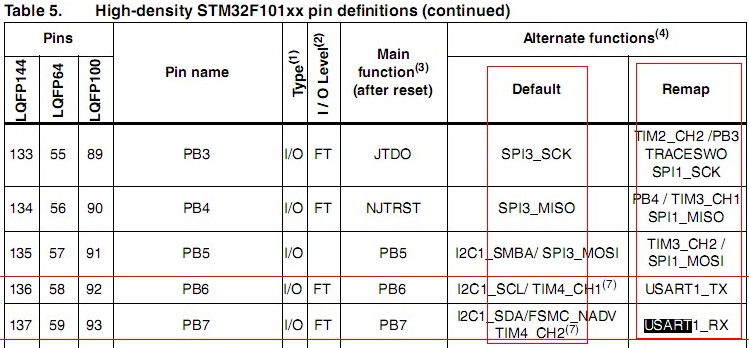
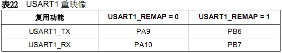
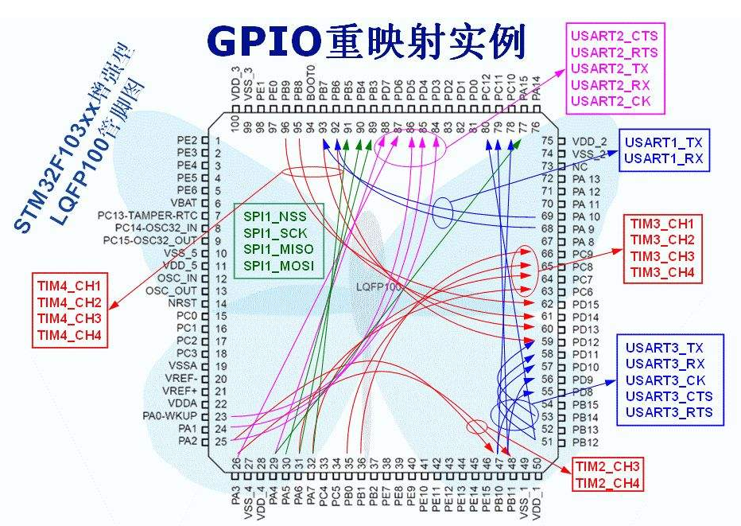

&emsp;&emsp;`STM32`中有很多内置外设的输入输出引脚都具有重映射(`remap`)的功能，本文对一些在使用引脚重映射时所遇到的有关问题加以说明。
&emsp;&emsp;我们知道每个内置外设都有若干个输入输出引脚，一般这些引脚的输出脚位都是固定不变的。为了让设计工程师可以更好地安排引脚的功能，在`STM32`中引入了外设引脚重映射的概念，即一个外设的引脚除了具有默认的脚位外，还可以通过设置重映射寄存器的方式，把这个外设的引脚映射到其它的脚位。下面是`STM32F103xC`中有关`USART3`引脚的摘要片段：



从这里可以看出，`USART3_TX`的默认引出脚是`PB10`，`USART3_RX`的默认引出脚是`PB11`；但经过重映射后，可以变更`USART3_TX`的引出脚为`PD8`，变更`USART3_RX`的引出脚为`PD9`。
&emsp;&emsp;`STM32`中的很多内置外设都具有重映射的功能，比如`USART`、定时器、`CAN`、`SPI`、`I2C`等，详细请看`STM32`参考手册(`RM0008`)和`STM32`数据手册。
&emsp;&emsp;有些模块(内置外设)的重映射功能还可以有多种选择，下面是`RM0008`上有关`USART3`输入输出引脚的重映射功能表：



从这个表中可以看出，`USART3`的`TX`和`RX`引脚默认的引出脚位是`PB10`和`PB11`，根据配置位的设置，可以重映射到`PC10`和`PC11`，还可以重映射到`PD8`和`PD9`。
&emsp;&emsp;一个模块的功能引脚不管是从默认的脚位引出还是从重映射的脚位引出，都要通过`GPIO`端口模块实现，相应的`GPIO`端口必须配置为输入(对应模块的输入功能，如`USART`的`RX`)或复用输出(对应模块的输出功能，如`USART`的`TX`)，对于输出引脚，可以按照需要配置为推挽复用输出或开漏复用输出。



&emsp;&emsp;上图是`STM32`的`GPIO`端口模块，使用复用功能时的配置。从图中可以看出，配置为复用输出时，该端口对应的`GPIO`输出功能将不起作用。例如当配置`PB10`对应的引脚为复用输出功能时，操作`PB10`对应的输出寄存器将不影响引脚上的信号。从图中还可以看出，普通的`GPIO`端口输入功能与复用的输入功能的配置方式没有区别，这意味着在使用引脚的复用输入功能时，可以在这个引脚的输入寄存器上读出引脚上的信号。例如使能`USART3`模块后，可以读`GPIOB_IDR`寄存器，得到`PB11`信号线上的当前状态。
&emsp;&emsp;有不少引脚上配备了来自多个模块的复用功能引出脚，例如本文第一张图中显示的`PB10`，默认复用功能就有`I2C2_SCL`和`USART3_TX`两个功能。`TIM2`重映射后，`TIM2_CH3`也使用`PB10`的复用功能。
&emsp;&emsp;在使用引脚的复用功能时，需要注意在软件上只可以使能一个外设模块，否则在引脚上可能产生信号冲突。例如如果使能了`USART3`模块，同时没有对`USART3`进行重映射配置，则不可以使能`I2C2`模块；如果需要使用`I2C2`模块，则不能使能`USART3`模块。但是如果配置了`USART3`的引脚重映射，`USART3`的`TX`和`RX`信号将从`PC10`和`PC11`，或`PD8`和`PD9`引出，避开了`I2C2`使用的`PB10`和`PB11`，这时就可以同时使用`I2C2`模块和`USART3`模块了。
&emsp;&emsp;`USART3`模块共有`5`个信号，分别为`TX`、`RX`、`CK`、`CTS`和`RTS`，从上面给出的第二张图中可以看出，重映射是对所有信号同时有效。这`5`个信号中，在使能了`USART3`模块后，只有`TX`和`RX`是始终与对应的引出脚相连，而其它`3`个信号分别有独立的控制位，控制它们是否与外部引脚相连。如果程序中不使用某个信号的功能，则可以关闭这个信号的功能，对应的引脚可以做为其它功能的引出脚。例如当关闭了`USART3`的`CK`、`CTS`和`RTS`功能并且没有重映射`USART3`时，`PB12`、`PB13`和`PB14`可以作为通用输入输出端口使用，也可以作为其它模块的复用功能引出脚。
&emsp;&emsp;下面这张图是一个内部控制连接的等效示意图，它并不表示真正的内部连接，但可以有效地帮助理解重映射和复用引脚的概念。图中右边引出的信号，分别连接到了本文第三张图的输入输出模块。



---

### STM32端口复用和重映射(USART Remap)

&emsp;&emsp;`STM32`有很多`I/O`口，也有很多内置外设，例如`I2C`、`ADC`、`ISP`、`USART`。为了节省引脚，这些内置外设基本上是与`I/O`口共用的，也就是`I/O`管脚的复用功能。但是`STM32`还有一个特别之处：很多复用内置的外设的`I/O`引脚可以通过重映射功能从不同的`I/O`管脚引出，即复用功能的引脚是可通过程序改变的。



&emsp;&emsp;在三个红框交汇处位置，`STM32F103VCT6`的`USART1`接的是`PB6`和`PB7`，但是上电初始化后默认功能并非是`USART1`，所以想要用串口功能必须进行端口复用。`STM32`的单片机每个功能模块有自己的时钟系统，所以要想要调用`STM32`单片机的功能模块时，必须先配置对应时钟，然后才能去操作相应的功能模块。端口重映射也一样：



&emsp;&emsp;重映射步骤为：
&emsp;&emsp;1. 打开复用时钟和`USART`重映射后的`I/O`口引脚时钟：

``` cpp
RCC_APB2PeriphClockCmd ( RCC_APB2Periph_GPIOB | RCC_APB2Periph_AFIO, ENABLE );
```

&emsp;&emsp;2. `I/O`口重映射开启：

``` cpp
GPIO_PinRemapConfig ( GPIO_Remap_USART1, ENABLE );
```

&emsp;&emsp;3. 配制重映射引脚，这里只需配置重映射后的`I/O`：

``` cpp
GPIO_InitStructure.GPIO_Pin = GPIO_Pin_6;
GPIO_InitStructure.GPIO_Mode = GPIO_Mode_AF_PP;
GPIO_InitStructure.GPIO_Speed = GPIO_Speed_50MHz;
GPIO_Init ( GPIOB, &GPIO_InitStructure );
​
GPIO_InitStructure.GPIO_Pin = GPIO_Pin_7;
GPIO_InitStructure.GPIO_Mode = GPIO_Mode_IN_FLOATING;
GPIO_Init ( GPIOB, &GPIO_InitStructure );
```

&emsp;&emsp;最后总结一下：`STM32`的`IO`口有`3`个功能，一个是默认的，一个是复用，另一个是重映射功能(这个其实也属于复用)。如果配置成复用，则将打开`AFIO`时钟；如果配置成重映射，则打开`AFIO`时钟和`Remap`时钟。

