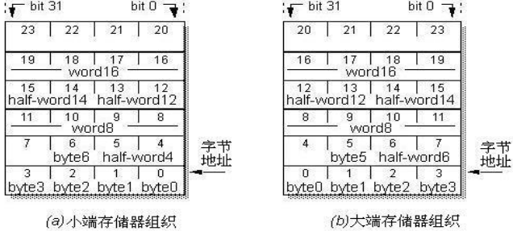
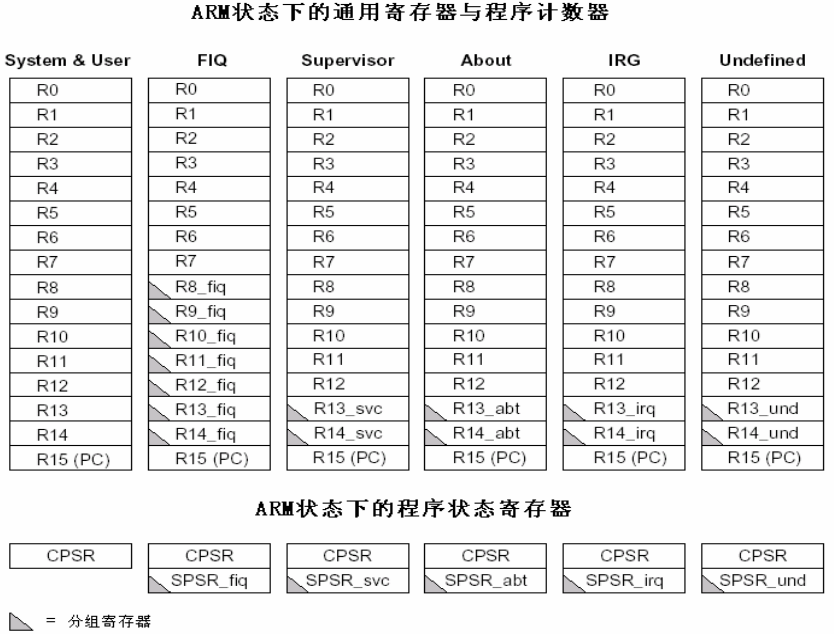
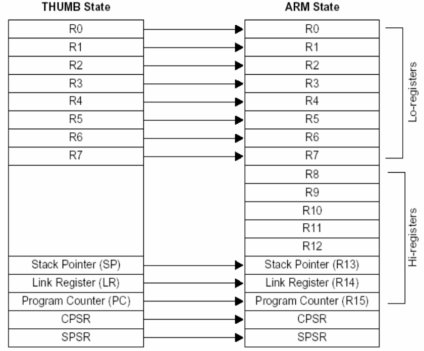
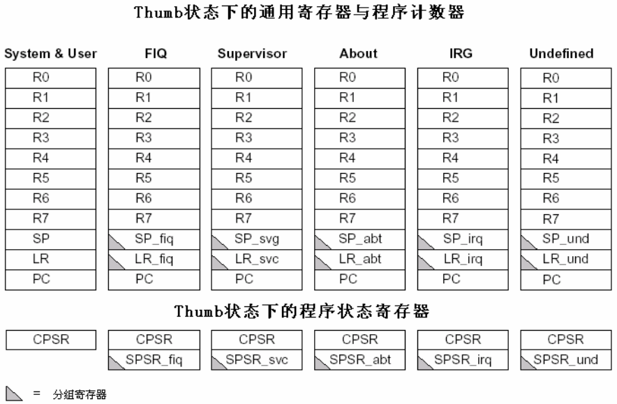
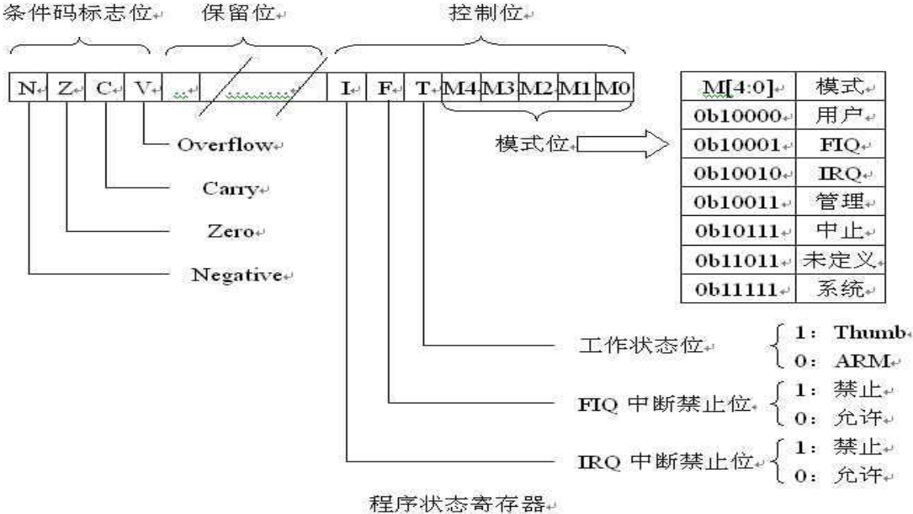

### ARM工作模式

#### 工作状态

&emsp;&emsp;从编程的角度看，`ARM`微处理器的工作状态一般有两种，并可在两种状态之间切换：<!--more-->

- `ARM`状态：此时处理器执行`32`位的，字对齐的`ARM`指令。
- `Thumb`状态：此时处理器执行`16`位的，半字对齐的`Thumb`指令。

当`ARM`微处理器执行`32`位的`ARM`指令集时，工作在`ARM`状态；当`ARM`微处理器执行`16`位的`Thumb`指令集时，工作在`Thumb`状态。在程序的执行过程中，微处理器可以随时在两种工作状态之间切换，并且处理器工作状态的转变并不影响处理器的工作模式和相应寄存器中的内容。

#### 存储器格式

&emsp;&emsp;`ARM`体系结构将存储器看作是从零地址开始的字节的线性组合。从零字节到三字节放置第一个存储的字(`32`位)数据，从第四个字节到第七个字节放置第二个存储的字数据，依次排列。作为`32`位的微处理器，`ARM`体系结构所支持的最大寻址空间为`4GB`。`ARM`体系结构可以用两种方法存储字数据，称之为`大端格式`和`小端格式`。

- 大端格式：字数据的高字节存储在低地址中，而字数据的低字节则存放在高地址中。
- 小端格式：与大端存储格式相反，在小端存储格式中，低地址中存放的是字数据的低字节，高地址存放的是字数据的高字节。



#### 指令长度

&emsp;&emsp;`ARM`微处理器的指令长度可以是`32`位(在`ARM`状态下)，也可以为`16`位(在`Thumb`状态下)。`ARM`微处理器支持字节(`8`位)、半字(`16`位)、字(`32`位)三种数据类型。其中，字需要`4`字节对齐(地址的低两位为`0`)、半字需要`2`字节对齐(地址的最低位为`0`)。

#### 工作模式

&emsp;&emsp;`ARM`微处理器支持`7`种工作模式：

- 用户模式(`Usr`)：用于正常执行程序。
- 快速中断模式(`FIQ`)：用于高速数据传输。
- 外部中断模式(`IRQ`)：用于通常的中断处理。
- 管理模式(`svc`)：操作系统使用的保护模式。
- 数据访问终止模式(`abt`)：当数据或指令预取终止时进入该模式，可用于虚拟存储及存储保护。
- 系统模式(`sys`)：运行具有特权的操作系统任务。
- 未定义指令中止模式(`und`)：当未定义的指令执行时进入该模式，可用于支持硬件。

&emsp;&emsp;`ARM`微处理器的运行模式可以通过软件改变，也可以通过外部中断或异常处理改变。应用程序运行在用户模式下，当处理器运行在用户模式下时，某些被保护的系统资源是不能被访问的。除用户模式以外，其余的所有`6`种模式称之为`非用户模式`，或`特权模式`(`Privileged Modes`)；其中除去用户模式和系统模式以外的`5`种又称为`异常模式`(`Exception Modes`)，常用于处理中断或异常，以及需要访问受保护的系统资源等情况。

### ARM寄存器

#### 寄存器

&emsp;&emsp;`ARM`微处理器共有`37`个`32`位寄存器，其中`31`个为通用寄存器，`6`个为状态寄存器。但是这些寄存器不能被同时访问，具体哪些寄存器是可以访问的，取决`ARM`处理器的工作状态及具体的运行模式。但在任何时候，通用寄存器`R14`至`R0`、程序计数器`PC`、一个状态寄存器都是可访问的。

#### 寄存器(ARM状态)

&emsp;&emsp;在`ARM`工作状态下，任一时刻可以访问`16`个通用寄存器和一到两个状态寄存器。在非用户模式(特权模式)下，则可访问到特定模式分组寄存器，具体见下页图：



#### 寄存器(Thumb状态)

&emsp;&emsp;`Thumb`状态下的寄存器集是`ARM`状态下寄存器集的一个子集，程序可以直接访问`8`个通用寄存器(`R7`至`R0`)、程序计数器(`PC`)、堆栈指针(`SP`)、连接寄存器(`LR`)和`CPSR`。



#### 寄存器对应

&emsp;&emsp;`Thumb`状态下的寄存器组织与ARM状态下的寄存器组织的关系：

- `Thumb`状态下和`ARM`状态下的`R0`至`R7`是相同的。
- `Thumb`状态下和`ARM`状态下的`CPSR`和`SPSR`是相同的。
- `Thumb`状态下的`SP`对应于`ARM`状态下的`R13`。
- `Thumb`状态下的`LR`对应于`ARM`状态下的`R14`。
- `Thumb`状态下的程序计数器`PC`对应于`ARM`状态下的`R15`。



#### 通用寄存器

&emsp;&emsp;通用寄存器如下：

- `R0`至`R15`
- `R13_svc`、`R14_svc`
- `R13_abt`、`R14_abt`
- `R13_und`、`R14_und`
- `R13_irq`、`R14_irq`
- `R8_fiq`至`R14_fiq`

不分组寄存器(`The unbanked registers`)是`R0`至`R7`，分组寄存器(`The banked registers`)是`R8`至`R14`，程序计数器是`R15`(`PC`)。

#### 不分组通用寄存器

&emsp;&emsp;`R0`至`R7`是不分组寄存器，这意味着在所有处理器模式下，访问的都是同一个物理寄存器。未分组寄存器没有被系统用于特别的用途，任何可采用通用寄存器的应用场合都可以使用未分组寄存器。

#### 分组通用寄存器

- 分组寄存器`R8`至`R12`：`FIQ`模式分组寄存器`R8`至`R12`；`FIQ`以外的分组寄存器`R8`至`R12`。
- 分组寄存器`R13`、`R14`：寄存器`R13`通常用做堆栈指针`SP`；寄存器`R14`用作子程序链接寄存器(`Link Register`，`LR`)，指向函数的返回地址。

#### 程序计数器

&emsp;&emsp;寄存器`R15`被用作程序计数器，也称为`PC`。其值等于`当前正在执行的指令的地址 + 8`(因为在取址和执行之间多了一个译码的阶段)。

#### 状态寄存器

&emsp;&emsp;状态寄存如下：

- `CPSR`
- `SPSR_svc`
- `SPSR_abt`
- `SPSR_und`
- `SPSR_irq`
- `SPSR_fiq`

&emsp;&emsp;`ARM`所有工作模式下都可以访问程序状态寄存器`CPSR`。`CPSR`包含条件码标志、中断禁止位、当前处理器模式以及其它状态和控制信息。`CPSR`在每种异常模式下都有一个对应的物理寄存器，即程序状态保存寄存器`SPSR`。当异常出现时，`SPSR`用于保存`CPSR`的值，以便异常返回后恢复异常发生时的工作状态。
&emsp;&emsp;只有异常模式下才有`SPSR`，`SPSR`是`CPSR`的一个备份。`CPSR`保存的是程序运行的状态，处理器是运行在`ARM`状态还是`Thumb`转态都将被记录在`CPSR`中。当异常情况发生时，`CPSR`可能被破坏，程序中断结束后不能返回原来的现场。有`SPSR`后，当异常情况到来时，`CPSR`的值保存在`SPSR`中；当把异常处理完之后，再把`SPSR`的值还给`CPSR`，这样现场就能恢复。`CPSR`和`SPSR`有着相同的格式。



CPSR[4:0] | 模式     | 用途                                         | 可访问的寄存器
----------|----------|---------------------------------------------|--------------
`10000`   | `用户`   | 正常用户模式，程序正常执行模式                 | `PC`，`R0`至`R14`，`CPSR`
`10001`   | `FIQ`    | 处理快速中断，支持高速数据传送或通道处理        | `PC`，`R8_fiq`至`R14_fiq`，`R0`至`R7`，`CPSR`，`SPSR_fiq`
`10010`   | `IRQ`    | 处理普通中断                                 | `PC`，`R13_irq`至`R14_irq`，`R0`至`R12`，`CPSR`，`SPSR_irq`
`10011`   | `SVC`    | 操作系统保护模式，处理软件中断(`SWI`)          | `PC`，`R13_svc`至`R14_svc`，`R0`至`R12`，`CPSR`，`SPSR_svc`
`10111`   | `中止`   | 处理存储器故障，实现虚拟存储器和存储器保护      | `PC`，`R13_abt`至`R14_abt`，`R0`至`R12`，`CPSR`，`SPSR_abt`
`11011`   | `未定义` | 处理未定义的指令陷阱，支持硬件协处理器的软件仿真 | `PC`，`R13_und`至`R14_und`，`R0`至`R12`，`CPSR`，`SPSR_und`
`11111`   | `系统`   | 运行特权操作系统任务                          | `PC`，`R0`至`R14`，`CPSR`

### ARM寻址方式

#### 寻址方式

&emsp;&emsp;所谓寻址方式就是处理器根据指令中给出的地址信息来寻找物理地址的方式。

#### 立即寻址

&emsp;&emsp;立即寻址也叫立即数寻址，这是一种特殊的寻址方式，操作数本身就在指令中给出，只要取出指令也就取到了操作数。这个操作数被称为立即数，对应的寻址方式也就叫做立即寻址。例如以下指令：

``` cpp
ADD R0, R0, #1    ; R0 <- R0 + 1
ADD R0, R0, #0x3f ; R0 <- R0 + 0x3f
```

在以上两条指令中，第二个源操作数即为立即数，要求以`#`为前缀，对于以十六进制表示的立即数，还要求在`#`后加上`0x`或`&`。

#### 寄存器寻址

&emsp;&emsp;寄存器寻址就是利用寄存器中的数值作为操作数，这种寻址方式是各类微处理器经常采用的一种方式，也是一种执行效率较高的寻址方式。

``` cpp
ADD R0, R1, R2 ; R0 <- R1 + R2
```

该指令的执行效果是将寄存器`R1`和`R2`的内容相加，其结果存放在寄存器`R0`中。

#### 寄存器间接寻址

&emsp;&emsp;寄存器间接寻址就是以寄存器中的值作为操作数的地址，而操作数本身存放在存储器中。例如以下指令：

``` cpp
ADD R0, R1, [R2] ; R0 <- R1 + [R2]
LDR R0, [R1]     ; R0 <- [R1]
```

在第一条指令中，以寄存器`R2`的值作为操作数的地址，在存储器中取得一个操作数后与`R1`相加，结果存入寄存器`R0`中。第二条指令将以`R1`的值为地址的存储器中的数据传送到`R0`中。

#### 基址变址寻址

&emsp;&emsp;基址变址寻址就是将寄存器(该寄存器一般称作基址寄存器)的内容与指令中给出的地址偏移量相加，从而得到一个操作数的有效地址：

``` cpp
LDR R0, [R1, #4]  ; R0 <- [R1 + 4]
LDR R0, [R1, #4]! ; R0 <- [R1 + 4]、R1 <- R1 + 4
LDR R0, [R1], #4  ; R0 <- [R1]、R1 <- R1 + 4
LDR R0, [R1, R2]  ; R0 <- [R1 + R2]
```

#### 多寄存器寻址

&emsp;&emsp;采用多寄存器寻址方式，一条指令可以完成多个寄存器值的传送。这寻址方式可以用一条指令完成传送最多`16`个通用寄存器的值。例如以下指令：

``` cpp
LDMIA R0, {R1, R2, R3, R4} ; R1 <- [R0]
                           ; R2 <- [R0 + 4]
                           ; R3 <- [R0 + 8]
                           ; R4 <- [R0 + 12]
```

该指令的后缀`IA`表示在每次执行完`加载/存储`操作后，`R0`按字长度增加，因此，指令可将连续存储单元的值传送到`R1`至`R4`。

#### 相对寻址

&emsp;&emsp;与基址变址寻址方式相类似，相对寻址以程序计数器`PC`的当前值为基地址，指令中的地址标号作为偏移量，将两者相加之后得到操作数的有效地址。以下程序段完成子程序的调用和返回，跳转指令`BL`采用了相对寻址方式：

``` cpp
BL NEXT ; 跳转到子程序NEXT处执行
...
NEXT
...
MOV PC, LR ; 从子程序返回
```

#### 堆栈寻址

&emsp;&emsp;堆栈是一种数据结构，按先进后出(`First In Last Out`，`FILO`)的方式工作，使用一个称作堆栈指针的专用寄存器指示当前的操作位置，堆栈指针总是指向栈顶。

- 递增堆栈：向高地址方向生长。
- 递减堆栈：向低地址方向生长。
- 满堆栈：堆栈指针指向最后压入堆栈的有效数据项。
- 空堆栈：堆栈指针指向下一个要放入数据的空位置。

### ARM指令集

#### 跳转指令

&emsp;&emsp;跳转指令用于实现程序流程的跳转，在`ARM`程序中有两种方法可以实现程序流程的跳转：

- 使用专门的跳转指令。
- 直接向程序计数器`PC`写入跳转地址值，通过向程序计数器`PC`写入跳转地址值，可以实现在`4GB`的地址空间中的任意跳转，在跳转之前结合使用：

``` cpp
MOV LR, PC
```

等类似指令，可以保存将来的返回地址值，从而实现在`4GB`连续的线性地址空间的子程序调用。
&emsp;&emsp;`ARM`指令集中的跳转指令可以完成从当前指令向前或向后的`32MB`的地址空间的跳转，包括以下`4`条指令：

- `B`：跳转指令。
- `BL`：带返回的跳转指令。
- `BLX`：带返回和状态切换的跳转指令。
- `BX`：带状态切换的跳转指令。

&emsp;&emsp;`B`指令的格式为`B{条件} 目标地址`，`B`指令是最简单的跳转指令。一旦遇到一个`B`指令，`ARM`处理器将立即跳转到给定的目标地址，从那里继续执行。

``` cpp
B Label ; 程序无条件跳转到标号Label处执行
CMP R1, #0
BEQ Label ; 当CPSR寄存器中的Z条件码置位时，程序跳转到标号Label处执行
```

#### 指令条件

指令条件 | 标志位                 | 含义
--------|------------------------|-----
`EQ`    | `Z`置位                | 相等
`NE`    | `Z`清零                | 不相等
`CS`    | `C`置位                | 无符号数大于或等于
`CC`    | `C`清零                | 无符号数小于
`MI`    | `N`置位                | 负数
`PL`    | `N`清零                | 正数或零
`VS`    | `V`置位                | 溢出
`VC`    | `V`清零                | 未溢出
`HI`    | `C`置位`Z`清零         | 无符号数大于
`LS`    | `C`清零`Z`置位         | 无符号数小于或等于
`GE`    | `N`等于`V`             | 带符号数大于或等于
`LT`    | `N`不等于`V`           | 带符号数小于
`GT`    | `Z`清零且(`N`等于`V`)   | 带符号数大于
`LE`    | `Z`置位或(`N`不等于`V`) | 带符号数小于或等于
`AL`    | 忽略                   | 无条件执行

&emsp;&emsp;`BL`指令的格式为`BL{条件} 目标地址`，`BL`是另一个跳转指令，但跳转之前，会在寄存器`R14`中保存`PC`当前值，因此可以通过将`R14`的内容重新加载到`PC`中，来返回到跳转指令之后的那个指令处执行。该指令是实现子程序调用的一个基本但常用的手段。

``` cpp
; 当程序无条件跳转到标号Label处执行时，同时将当前的PC值保存到R14中
BL Label
```

&emsp;&emsp;`BLX`指令的格式为`BLX 目标地址`，`BLX`指令从`ARM`指令集跳转到指令中所指定的目标地址，并将处理器的工作状态有`ARM`状态切换到`Thumb`状态，该指令同时将`PC`的当前内容保存到寄存器`R14`中。因此，当子程序使用`Thumb`指令集，而调用者使用`ARM`指令集时，可以通过`BLX`指令实现子程序的调用和处理器工作状态的切换。同时，子程序的返回可以通过将寄存器`R14`值复制到`PC`中来完成。
&emsp;&emsp;`BX`指令的格式为`BX{条件} 目标地址`，`BX`指令跳转到指令中所指定的目标地址，目标地址处的指令既可以是`ARM`指令，也可以是`Thumb`指令。

#### 数据处理指令

&emsp;&emsp;数据处理指令可分为数据传送指令、算术逻辑运算指令和比较指令等。数据传送指令用于在寄存器和存储器之间进行数据的双向传输。算术逻辑运算指令完成常用的算术与逻辑的运算，该类指令不但将运算结果保存在目的寄存器中，同时更新`CPSR`中的相应条件标志位。

#### MOV指令

&emsp;&emsp;`MOV`指令的格式为`MOV{条件}{S} 目的寄存器, 源操作数`，`MOV`指令完成从另一个寄存器、被移位的寄存器或将一个立即数加载到目的寄存器。其中`S`选项决定指令的操作是否影响`CPSR`中条件标志位的值，当没有`S`时，指令不更新`CPSR`中条件标志位的值。

``` cpp
MOV R1, R0        ; 将寄存器R0的值传送到寄存器R1
MOV PC, R14       ; 将寄存器R14的值传送到PC，常用于子程序返回
MOV R1, R0, LSL#3 ; 将寄存器R0的值左移3位后传送到R1
```

#### MVN指令

&emsp;&emsp;`MVN`指令的格式为`MVN{条件}{S} 目的寄存器, 源操作数`，`MVN`指令可完成从另一个寄存器、被移位的寄存器、或将一个立即数加载到目的寄存器。与`MOV`指令不同之处是在传送之前按位被取反了，即把一个被取反的值传送到目的寄存器中。其中`S`决定指令的操作是否影响`CPSR`中条件标志位的值，当没有`S`时，指令不更新`CPSR`中条件标志位的值。

``` cpp
MVN R0, #0xff ; 将0xffffff00赋给R0
```

#### CMP指令

&emsp;&emsp;`CMP`指令的格式为`CMP{条件} 操作数1, 操作数2`，`CMP`指令用于把一个寄存器的内容和另一个寄存器的内容或立即数进行比较，同时更新`CPSR`中条件标志位的值。该指令进行一次减法运算，但不存储结果，只更改条件标志位。标志位表示的是`操作数1`与`操作数2`的关系(大、小、相等)。例如，当`操作数1`大于操作`操作数2`，则此后的有`GT`后缀的指令将可以执行。

``` cpp
CMP R1, R0   ; 将寄存器R1的值与寄存器R0的值相减，并根据结果设置CPSR的标志位
CMP R1, #100 ; 将寄存器R1的值与立即数100相减，并根据结果设置CPSR的标志位
```

#### TST指令

&emsp;&emsp;`TST`指令的格式为`TST{条件} 操作数1, 操作数2`，`TST`指令用于把一个寄存器的内容和另一个寄存器的内容或立即数进行按位的与运算，并根据运算结果更新`CPSR`中条件标志位的值。`操作数1`是要测试的数据，而`操作数2`是一个位掩码，根据测试结果设置相应标志位。当位与结果为`0`时，`EQ`位被设置。

``` cpp
TST R1, #%1 ; 用于测试在寄存器R1中是否设置了最低位(“%”表示二进制数)
```

#### ADD指令

&emsp;&emsp;`ADD`指令的格式为`ADD{条件}{S} 目的寄存器, 操作数1, 操作数2`，`ADD`指令用于把两个操作数相加，并将结果存放到目的寄存器中。`操作数1`应是一个寄存器，`操作数2`可以是一个寄存器，被移位的寄存器，或一个立即数。

``` cpp
ADD R0, R1, R2        ; R0 = R1 + R2
ADD R0, R1, #256      ; R0 = R1 + 256
ADD R0, R2, R3, LSL#1 ; R0 = R2 + (R3 << 1)
```

#### SUB指令

&emsp;&emsp;`SUB`指令的格式为`SUB{条件}{S} 目的寄存器, 操作数1, 操作数2`，`SUB`指令用于把`操作数1`减去`操作数2`，并将结果存放到目的寄存器中。`操作数1`应是一个寄存器，`操作数2`可以是一个寄存器，被移位的寄存器，或一个立即数。

``` cpp
SUB R0, R1, R2        ; R0 = R1 - R2
SUB R0, R1, #256      ; R0 = R1 - 256
SUB R0, R2, R3, LSL#1 ; R0 = R2 - (R3 << 1)
```

#### AND指令

&emsp;&emsp;`AND`指令的格式为`AND{条件}{S} 目的寄存器, 操作数1, 操作数2`，`AND`指令用于在两个操作数上进行逻辑与运算，并把结果放置到目的寄存器中。`操作数1`应是一个寄存器，`操作数2`可以是一个寄存器，被移位的寄存器，或一个立即数。该指令常用于屏蔽`操作数1`的某些位。

``` cpp
AND R0, R0, #3 ; 该指令保持R0的0、1位，其余位清零
```

#### ORR指令

&emsp;&emsp;`ORR`指令的格式为`ORR{条件}{S} 目的寄存器, 操作数1, 操作数2`，`ORR`指令用于在两个操作数上进行逻辑或运算，并把结果放置到目的寄存器中。`操作数1`应是一个寄存器，`操作数2`可以是一个寄存器，被移位的寄存器，或一个立即数。该指令常用于设置`操作数1`的某些位。

``` cpp
ORR R0, R0, #3 ; 该指令设置R0的0、1位，其余位保持不变
```

#### BIC指令

&emsp;&emsp;`BIC`指令的格式为`BIC{cond}{S} Rd, Rn, operand2`，`BIC`指令用于清除`Rn`中的某些位，并把结果存放在`Rd`中，操作数`operand2`为`32`位的掩码，如果掩码中设置了某一位为`1`，则清除这一位。

``` cpp
BIC R0, R0, #%1011 ; 将R0的0、1、3位清零，其余位不变
```

#### MUL指令

&emsp;&emsp;`MUL`指令的格式为`MUL{条件}{S} 目的寄存器, 操作数1, 操作数2`，`MUL`指令完成将`操作数1`与`操作数2`的乘法运算，并把结果放置到目的寄存器中，同时可以根据运算结果设置`CPSR`中相应的条件标志位。其中，`操作数1`和`操作数2`均为`32`位的有符号数或无符号数。

``` cpp
MUL R0, R1, R2  ; R0 = R1 * R2
MULS R0, R1, R2 ; R0 = R1 * R2，同时设置CPSR中的相关条件标志位
```

#### 程序状态寄存器访问指令

&emsp;&emsp;`ARM`微处理器支持程序状态寄存器访问指令，用于在程序状态寄存器和通用寄存器之间传送数据。

#### MRS指令

&emsp;&emsp;`MRS`指令的格式为`MRS{条件} 通用寄存器, 程序状态寄存器(CPSR或SPSR)`，`MRS`指令用于将程序状态寄存器的内容传送到通用寄存器中(注意，`MOV`指令无法直接传送一个值到程序状态寄存器中)。该指令一般用在以下几种情况：

- 当需要改变程序状态寄存器的内容时，可用`MRS`将程序状态寄存器的内容读入通用寄存器，修改后再写回程序状态寄存器。
- 当在异常处理或进程切换时，需要保存程序状态寄存器的值，可先用该指令读出程序状态寄存器的值，然后保存。

``` cpp
MRS R0, CPSR ; 传送CPSR的内容到R0
MRS R0, SPSR ; 传送SPSR的内容到R0
```

#### MSR指令

&emsp;&emsp;`MSR`指令的格式为`MSR{条件} 程序状态寄存器(CPSR或SPSR)_<域>, 操作数`，`MSR`指令用于将操作数的内容传送到程序状态寄存器的特定域中。其中，操作数可以为通用寄存器或立即数。`域`用于设置程序状态寄存器中需要操作的位，`32`位的程序状态寄存器可分为`4`个域：

- 位`[31:24]`为条件标志位域，用`f`表示。
- 位`[23:16]`为状态位域，用`s`表示。
- 位`[15:8]`为扩展位域，用`x`表示。
- 位`[7:0]`为控制位域，用`c`表示。

该指令通常用于恢复或改变程序状态寄存器的内容，在使用时，一般要在`MSR`指令中指明将要操作的域。

``` cpp
MSR CPSR, R0   ; 传送R0的内容到CPSR
MSR SPSR, R0   ; 传送R0的内容到SPSR
MSR CPSR_c, R0 ; 传送R0的内容到SPSR，但仅仅修改CPSR中的控制位域
```

#### 加载/存储指令

&emsp;&emsp;`ARM`微处理器支持`加载/存储指令`，用于在寄存器和存储器之间传送数据。加载指令用于将存储器中的数据传送到寄存器，存储指令则完成相反的操作。

#### LDR指令

&emsp;&emsp;`LDR`指令的格式为`LDR{条件} 目的寄存器, <存储器地址>`，`LDR`指令用于从存储器中将一个`32`位的字数据传送到目的寄存器中。该指令通常用于从存储器中读取`32`位的字数据到通用寄存器，然后对数据进行处理。

``` cpp
LDR R0, [R1]             ; 将存储器地址为R1的字数据读入寄存器R0
LDR R0, [R1, R2]         ; 将存储器地址为“R1 + R2”的字数据读入寄存器R0
LDR R0, [R1, #8]         ; 将存储器地址为“R1 + 8”的字数据读入寄存器R0
LDR R0, [R1, R2]!        ; 将存储器地址为“R1 + R2”的字数据读入寄存器R0，并将新地址“R1 + R2”写入R1
LDR R0, [R1, #8]!        ; 将存储器地址为“R1 + 8”的字数据读入寄存器R0，并将新地址“R1 + 8”写入R1
LDR R0, [R1], R2         ; 将存储器地址为R1的字数据读入寄存器R0，并将新地址“R1 + R2”写入R1
LDR R0, [R1, R2, LSL#2]! ; 将存储器地址为“R1 + R2 * 4”的字数据读入寄存器R0，并将新地址“R1 + R2 * 4”写入R1
LDR R0, [R1], R2, LSL#2  ; 将存储器地址为R1的字数据读入寄存器R0，并将新地址“R1 + R2 * 4”写入R1
```

注意如下代码：

``` cpp
; 将0x30003100赋给R1。这是个伪指令，不是加载指令，
; 它的作用相当于MOV。判断的方法是看立即数的前面是否有“=”号
LDR R1, =0x30003100
```

#### LDRB指令

&emsp;&emsp;`LDRB`指令的格式为`LDR{条件}B 目的寄存器, <存储器地址>`，`LDRB`指令用于从存储器中将一个`8`位的字节数据传送到目的寄存器中，同时将寄存器的高`24`位清零。该指令通常用于从存储器中读取`8`位的字节数据到通用寄存器，然后对数据进行处理。

``` cpp
LDRB R0, [R1]     ; 将存储器地址为R1的字节数据读入寄存器R0，并将R0的高24位清零
LDRB R0, [R1, #8] ; 将存储器地址为“R1 + 8”的字节数据读入寄存器R0，并将R0的高24位清零
```

#### LDRH指令

&emsp;&emsp;`LDRH`指令的格式为`LDR{条件}H 目的寄存器, <存储器地址>`，`LDRH`指令用于从存储器中将一个`16`位的半字数据传送到目的寄存器中，同时将寄存器的高`16`位清零。该指令通常用于从存储器中读取`16`位的半字数据到通用寄存器，然后对数据进行处理。

``` cpp
LDRH R0, [R1]     ; 将存储器地址为R1的半字数据读入寄存器R0，并将R0的高16位清零
LDRH R0, [R1, R2] ; 将存储器地址为“R1 + R2”的半字数据读入寄存器R0，并将R0的高16位清零
```

#### STR指令

&emsp;&emsp;`STR`指令的格式为`STR{条件} 源寄存器, <存储器地址>`，`STR`指令用于从源寄存器中将一个`32`位的字数据传送到存储器中。

``` cpp
STR R0, [R1], #8 ; 将R0中的字数据写入以R1为地址的存储器中，并将新地址“R1 + 8”写入R1
STR R0, [R1, #8] ; 将R0中的字数据写入以“R1 + 8”为地址的存储器中
```

#### 批量加载/存储指令

&emsp;&emsp;`ARM`微处理器所支持的批量数据`加载/存储`指令可以一次在一片连续的存储器单元和多个寄存器之间传送数据，批量加载指令用于将一片连续的存储器中的数据传送到多个寄存器，批量数据存储指令则完成相反的操作。常用的加载存储指令如下：

- `LDM`：批量数据加载指令。
- `STM`：批量数据存储指令。

#### LDM指令

&emsp;&emsp;`LDM`指令的格式为`LDM {条件}{类型} 基址寄存器{!}, 寄存器列表{^}`，`LDM`(或`STM`)指令用于从由基址寄存器所指示的一片连续存储器到寄存器列表所指示的多个寄存器之间传送数据，该指令的常见用途是将多个寄存器的内容入栈或出栈。其中，`{类型}`为以下几种情况：

- `IA`：每次传送后地址加`1`。
- `IB`：每次传送前地址加`1`。
- `DA`：每次传送后地址减`1`。
- `DB`：每次传送前地址减`1`。
- `FD`：满递减堆栈。
- `ED`：空递减堆栈。
- `FA`：满递增堆栈。
- `EA`：空递增堆栈。

&emsp;&emsp;`{!}`为可选后缀，若选用该后缀，则当数据传送完毕之后，将最后的地址写入基址寄存器，否则基址寄存器的内容不改变。基址寄存器不允许为`R15`，寄存器列表可以为`R0`至`R15`的任意组合。`{^}`为可选后缀，当指令为`LDM`且寄存器列表中包含`R15`，选用该后缀时表示：除了正常的数据传送之外，还将`SPSR`复制到`CPSR`。

``` cpp
STMFD R13!, {R0, R4-R12, LR} ; 将寄存器列表中的寄存器(R0、R4到R12、LR)存入堆栈
LDMFD R13!, {R0, R4-R12, PC} ; 将堆栈内容恢复到寄存器(R0、R4到R12、LR)
```

#### 数据交换指令

&emsp;&emsp;`ARM`微处理器所支持数据交换指令能在存储器和寄存器之间交换数据。数据交换指令有如下两条：

- `SWP`：字数据交换指令。
- `SWPB`：字节数据交换指令。

#### SWP指令

&emsp;&emsp;`SWP`指令的格式为`SWP{条件} 目的寄存器，源寄存器1，[源寄存器2]`，`SWP`指令用于将`源寄存器2`所指向的存储器中的字数据传送到目的寄存器中，同时将`源寄存器1`中的字数据传送到`源寄存器2`所指向的存储器中。显然，当`源寄存器1`和`目的寄存器`为同一个寄存器时，指令交换该寄存器和存储器的内容。

``` cpp
SWP R0, R1, [R2] ; 将R2所指向的存储器中的字数据传送到R0，同时将R1中的字数据传送到R2所指向的存储单元
SWP R0, R0, [R1] ; 该指令完成将R1所指向的存储器中的字数据与R0中的字数据交换
```

#### 移位指令

&emsp;&emsp;`ARM`微处理器支持数据的移位操作，移位操作在`ARM`指令集中不作为单独的指令使用，它只能作为指令格式中是一个字段，在汇编语言中表示为指令中的选项。移位操作包括如下`6`种类型，`ASL`和`LSL`是等价的，可以自由互换：

- `LSL`：逻辑左移。
- `ASL`：算术左移。
- `LSR`：逻辑右移。
- `ASR`：算术右移。
- `ROR`：循环右移。

#### LSL操作

&emsp;&emsp;`LSL`操作的格式为`通用寄存器, LSL操作数`，`LSL`可完成对通用寄存器中的内容进行逻辑左移操作，按操作数所指定的数量向左移位，低位用`0`来填充。其中，操作数可以是通用寄存器，也可以是立即数(`0`至`31`)。

``` cpp
MOV R0, R1, LSL#2 ; 将R1中的内容左移两位后传送到R0中
```

#### ROR操作

&emsp;&emsp;`ROR`操作的格式为`通用寄存器, ROR操作数`，`ROR`可完成对通用寄存器中的内容进行循环右移的操作，按操作数所指定的数量向右循环移位，左端用右端移出的位来填充。其中，操作数可以是通用寄存器，也可以是立即数(`0`至`31`)。显然，当进行`32`位的循环右移操作时，通用寄存器中的值不改变。

``` cpp
MOV R0, R1, ROR#2 ; 将R1中的内容循环右移两位后传送到R0中
```

#### 异常产生指令

&emsp;&emsp;`ARM`微处理器所支持的异常指令有如下两条：

- `SWI`：软件中断指令。
- `BKPT`：断点中断指令。

#### SWI指令

&emsp;&emsp;`SWI`指令的格式为`SWI{条件} 24位的立即数`，`SWI`指令用于产生软件中断，以便用户程序能调用操作系统的系统`API`。操作系统在`SWI`的异常处理程序中提供相应的系统服务，指令中`24`位的立即数指定用户程序调用的`API`类型。

``` cpp
SWI 0x02 ; 该指令调用操作系统编号位02的系统例程
```

### ARM伪指令

#### 伪指令

&emsp;&emsp;在`ARM`汇编语言程序里，有一些特殊指令助记符，这些助记符与指令系统的助记符不同，没有相对应的操作码，通常称这些特殊指令助记符为伪指令，他们所完成的操作称为伪操作。伪指令在源程序中的作用是为完成汇编程序作各种准备工作的，这些伪指令仅在汇编过程中起作用，一旦汇编结束，伪指令的使命就完成(类似于`C`语言中的宏定义、关键字等)。在`ARM`的汇编程序中，有如下几种伪指令：符号定义伪指令、数据定义伪指令、汇编控制伪指令、宏指令以及其他伪指令。

#### 符号定义伪指令

&emsp;&emsp;符号定义伪指令用于定义`ARM`汇编程序中的变量、对变量赋值以及定义寄存器的别名等操作。常见的符号定义伪指令有如下几种：

- 定义全局变量的`GBLA`、`GBLL`和`GBLS`。
- 定义局部变量的`LCLA`、`LCLL`和`LCLS`。
- 对变量赋值的`SETA`、`SETL`和`SETS`。
- 为通用寄存器列表定义名称的`RLIST`。

#### GBLA/GBLL/GBLS

&emsp;&emsp;语法格式为`GBLA(GBLL或GBLS) 全局变量名`，`GBLA`、`GBLL`和`GBLS`伪指令用于定义一个`ARM`程序中的全局变量，并将其初始化。

- `GBLA`：定义一个全局的数字变量，并初始化为`0`。
- `GBLL`：定义一个全局的逻辑变量，并初始化为`F`(假)。
- `GBLS`：定义一个全局的字符串变量，并初始化为空。

以上三条伪指令用于定义全局变量，因此在整个程序范围内变量名必须唯一。

``` cpp
GBLA Test1           ; 定义一个全局的数字变量，变量名为Test1
Test1 SETA 0xaa      ; 将该变量赋值为0xaa
GBLL Test2           ; 定义一个全局的逻辑变量，变量名为Test2
Test2 SETL {TRUE}    ; 将该变量赋值为真
GBLS Test3           ; 定义一个全局的字符串变量，变量名为Test3
Test3 SETS "Testing" ; 将该变量赋值为Testing
```

#### RLIST指令

&emsp;&emsp;语法格式为`名称 RLIST {寄存器列表}`，`RLIST`伪指令用于对一个通用寄存器列表定义名称，使用该伪指令定义的列表名称可在`ARM`指令`LDM/STM`中使用。在`LDM/STM`指令中，列表中的寄存器访问次序为根据寄存器的编号由低到高，而与列表中的寄存器排列次序无关。

``` cpp
; 将寄存器列表名称定义为RegList，可在ARM指令LDM/STM中通过该名称访问寄存器列表
RegList RLIST {R0-R5, R8, R10}
```

#### 数据定义伪指令

&emsp;&emsp;数据定义伪指令一般用于为特定的数据分配存储单元，同时可完成已分配存储单元的初始化。常见的数据定义伪指令有如下几种：`DCB`、`DCW`、`DCD`、`DCFD`、`DCFS`、`DCQ`、`SPACE`、`MAP`、`FIELD`。

#### DCB指令

&emsp;&emsp;语法格式`标号 DCB 表达式`，`DCB`伪指令用于分配一片连续的字节存储单元并用伪指令中指定的表达式初始化。其中，表达式可以为`0`至`255`的数字或字符串。`DCB`也可用`=`代替。

``` cpp
Str DCB “This is a test！” ; 分配一片连续的字节存储单元并初始化。
```

#### SPACE指令

&emsp;&emsp;语法格式`标号 SPACE 表达式`，`SPACE`伪指令用于分配一片连续的存储区域并初始化为`0`。其中，表达式为要分配的字节数。`SPACE`也可用`%`代替。

``` cpp
DataSpace SPACE 100 ; 分配连续100字节的存储单元并初始化为0
```

#### MAP指令

&emsp;&emsp;语法格式`MAP 表达式{, 基址寄存器}`，`MAP`伪指令用于定义一个结构化的内存表的首地址。`MAP`也可用`^`代替。表达式可以为程序中的标号或数学表达式，基址寄存器为可选项，当基址寄存器选项不存在时，表达式的值即为内存表的首地址，当该选项存在时，内存表的首地址为表达式的值与基址寄存器的和。`MAP`伪指令通常与`FIELD`伪指令配合使用来定义结构化的内存表。

``` cpp
MAP 0x100, R0 ; 定义结构化内存表首地址的值为“0x100 + R0”
```

#### FILED指令

&emsp;&emsp;语法格式`标号 FIELD 表达式`，`FIELD`伪指令用于定义一个结构化内存表中的数据域。`FILED`也可用`#`代替。表达式的值为当前数据域在内存表中所占的字节数。`FIELD`伪指令常与`MAP`伪指令配合使用来定义结构化的内存表。`MAP`伪指令定义内存表的首地址，`FIELD`伪指令定义内存表中的各个数据域，并可以为每个数据域指定一个标号供其他的指令引用。

``` cpp
MAP 0x100   ; 定义结构化内存表首地址的值为0x100
A FIELD 16  ; 定义A的长度为16字节，位置为0x100
B FIELD 32  ; 定义B的长度为32字节，位置为0x110
S FIELD 256 ; 定义S的长度为256字节，位置为0x130
```

#### 汇编控制伪指令

#### IF指令

&emsp;&emsp;语法格式如下：

``` cpp
IF 逻辑表达式
    指令序列1
ELSE
    指令序列2
ENDIF
```

`IF`、`ELSE`、`ENDIF`伪指令能根据条件的成立与否决定是否执行某个指令序列。当`IF`后面的逻辑表达式为真，则执行`指令序列1`，否则执行`指令序列2`。其中，`ELSE`及`指令序列2`可以没有。`IF`、`ELSE`、`ENDIF`伪指令可以嵌套使用。

``` cpp
GBLL Test ；声明一个全局的逻辑变量，变量名为Test
...
IF Test = TRUE
    指令序列1
ELSE
    指令序列2
ENDIF
```

#### WHILE指令

&emsp;&emsp;语法格式如下：

``` cpp
WHILE 逻辑表达式
    指令序列
WEND
```

`WHILE`、`WEND`伪指令能根据条件的成立与否决定是否循环执行某个指令序列。当`WHILE`后面的逻辑表达式为真，则执行指令序列，该指令序列执行完毕后，再判断逻辑表达式的值，若为真则继续执行，一直到逻辑表达式的值为假。`WHILE`、`WEND`伪指令可以嵌套使用。

``` cpp
GBLA Counter   ; 声明一个全局的数学变量，变量名为Counter
Counter SETA 3 ; 由变量Counter控制循环次数
...
WHILE Counter < 10
    指令序列
WEND
```

#### 其他伪指令

#### AREA指令

&emsp;&emsp;语法格式为`AREA 段名 属性1, 属性2, ...`。`AREA`伪指令用于定义一个代码段或数据段。其中，段名若以数字开头，则该段名需用`|`括起来，如`|1_test|`。属性字段表示该代码段(或数据段)的相关属性，多个属性用逗号分隔。常用的属性如下：

- `CODE`属性：用于定义代码段，默认为`READONLY`。
- `DATA`属性：用于定义数据段，默认为`READWRITE`。
- `READONLY`属性：指定本段为只读，代码段默认为`READONLY`。
- `READWRITE`属性：指定本段为可读可写，数据段的默认属性为`READWRITE`。

&emsp;&emsp;`ALIGN`属性使用方式为`ALIGN 表达式`。在默认时，`ELF`(可执行连接文件)的代码段和数据段是按字对齐的。一个汇编语言程序至少要包含一个段，当程序太长时，也可以将程序分为多个代码段和数据段。

``` cpp
AREA Init, CODE, READONLY ; 该伪指令定义了一个代码段，段名为Init，属性为只读
```

#### ALIGN指令

&emsp;&emsp;语法格式为`ALIGN {表达式{, 偏移量}}`，`ALIGN`伪指令可通过添加填充字节的方式，使当前位置满足一定的对其方式。其中，表达式的值用于指定对齐方式，可能的取值为`2`的幂，如`1`、`2`、`4`、`8`、`16`等。若未指定表达式，则将当前位置对齐到下一个字的位置。偏移量也为一个数字表达式，若使用该字段，则当前位置的对齐方式为`2的表达式次幂 + 偏移量`。

``` cpp
AREA Init, CODE, READONLY, ALIEN=3 ; 指定后面的指令为8字节对齐。
```

#### CODE16指令

&emsp;&emsp;语法格式为`CODE16`(或`CODE32`)，`CODE16`伪指令通知编译器，其后的指令序列为`16`位的`Thumb`指令。`CODE32`伪指令通知编译器，其后的指令序列为`32`位的`ARM`指令。因此，在使用`ARM`指令和`Thumb`指令混合编程的代码里，可用这两条伪指令进行切换，但注意它们只通知编译器其后指令的类型，并不能对处理器进行状态的切换。

``` cpp
AREA Init, CODE, READONLY
...
CODE32          ; 通知编译器其后的指令为32位的ARM指令
LDR R0, =NEXT+1 ; 将跳转地址放入寄存器R0
BX R0           ; 程序跳转到新的位置执行，并将处理器切换到Thumb工作状态
....
CODE16          ; 通知编译器其后的指令为16位的Thumb指令
NEXT LDR R3, =0x3FF
....
END             ; 程序结束
```

#### ENTRY指令

&emsp;&emsp;语法格式为`ENTRY`，`ENTRY`伪指令用于指定汇编程序的入口点。在一个完整的汇编程序中至少要有一个`ENTRY`(也可以有多个，当有多个`ENTRY`时，程序的真正入口点由链接器指定)，但在一个源文件里最多只能有一个`ENTRY`(可以没有)。

``` cpp
AREA Init, CODE, READONLY
ENTRY ; 指定应用程序的入口点
...
```

#### EQU指令

&emsp;&emsp;语法格式为`名称 EQU 表达式{, 类型}`，`EQU`伪指令用于为程序中的常量、标号等定义一个等效的字符名称，类似于`C`语言中的`#define`。其中`EQU`可用`*`代替。

``` cpp
Test EQU 50           ; 定义标号Test的值为50
Addr EQU 0x55, CODE32 ; 定义Addr的值为0x55，且该处为32位的ARM指令
```

#### EXPORT指令

&emsp;&emsp;语法格式为`EXPORT 标号`，`EXPORT`伪指令用于在程序中声明一个全局的标号，该标号可在其他的文件中引用。`EXPORT`可用`GLOBAL`代替。标号在程序中区分大小写。

``` cpp
AREA Init, CODE, READONLY
EXPORT Stest ; 声明一个可全局引用的标号Stest
```

#### IMPORT指令

&emsp;&emsp;语法格式为`IMPORT 标号`，`IMPORT`伪指令用于通知编译器要使用的标号在其他的源文件中定义，但要在当前源文件中引用。标号在程序中区分大小写。

``` cpp
AREA Init, CODE, READONLY
IMPORT Main ; 通知编译器当前文件要引用标号Main，但Main在其他源文件中定义
```

#### END指令

&emsp;&emsp;语法格式为`END`，`END`伪指令用于通知编译器已经到了源程序的结尾。

``` cpp
AREA Init, CODE, READONLY
...
END ; 指定应用程序的结尾
```

### C/C++混合编程

&emsp;&emsp;在应用系统的程序设计中，若所有的编程任务均用汇编语言来完成，其工作量是可想而知的，同时不利于系统升级或应用软件移植。事实上，`ARM`体系结构支持`C/C++`以及与汇编语言的混合编程，在一个完整的程序设计的中，除了初始化部分用汇编语言完成以外，其主要的编程任务一般都用`C/C++`完成。汇编语言与`C/C++`的混合编程通常有以下几种方式：

- 在`C/C++`代码中嵌入汇编指令。
- 在汇编程序和`C/C++`的程序之间进行变量的互访。
- 汇编程序、`C/C++`程序间的相互调用。

&emsp;&emsp;在实际的编程中，使用较多的方式是：程序的初始化部分用汇编语言完成，然后用`C/C++`完成主要的编程任务，程序在执行时首先完成初始化过程，然后跳转到`C/C++`程序代码中，汇编程序和`C/C++`程序之间一般没有参数的传递，也没有频繁的相互调用，因此整个程序的结构显得相对简单，容易理解。

``` cpp
IMPORT Main             ; 通知编译器该标号为一个外部标号
AREA Init,CODE,READONLY ; 定义一个代码段
ENTRY                   ; 定义程序的入口点
LDR R0,=0x3FF0000       ; 初始化系统配置寄存器
LDR R1,=0xE7FFFF80
STR R1,[R0]
LDR SP, =0x3FE1000      ; 初始化用户堆栈
BL Main                 ; 跳转到Main函数处的“C/C++”代码执行
END                     ; 标识汇编程序的结束

void Main ( void ) {
    int i;
    * ( ( volatile unsigned long * ) 0x3ff5000 ) = 0x0000000f;

    while ( 1 ) {
        * ( ( volatile unsigned long * ) 0x3ff5008 ) = 0x00000001;
        for ( i = 0; i < 0x7fFFF; i++ );
        * ( ( volatile unsigned long * ) 0x3ff5008 ) = 0x00000002;
        for ( i = 0; i < 0x7FFFF; i++ );
    }
}
```