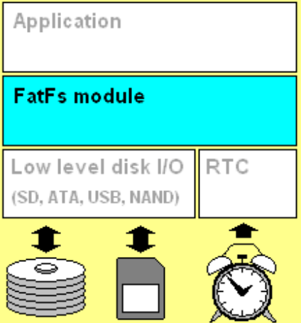

### FatFs

&emsp;&emsp;`FatFS`是一个为小型嵌入式系统设计的通用`FAT`(`File Allocation Table`)文件系统模块。`FatFs`的编写遵循`ANSI C`，并且完全与磁盘`I/O`层分开，因此它独立(不依赖)于硬件架构。它可以被嵌入到低成本的微控制器中，如`AVR`、`8051`、`PIC`、`ARM`、`Z80`、`68K`，而不需要做任何修改。<!--more-->



&emsp;&emsp;特点如下：

- `Windows`兼容的`FAT`文件系统。
- 不依赖于平台，易于移植。
- 代码和工作区占用空间非常小。

&emsp;&emsp;多种配置选项：

- 多卷(物理驱动器和分区)。
- 多`ANSI/OEM`代码页，包括`DBCS`。
- 在`ANSI/OEM`或`Unicode`中长文件名的支持。
- `RTOS`的支持。
- 多扇区大小的支持。
- 只读、最少`API`、`I/O`缓冲区等等。

### 应用程序接口

&emsp;&emsp;`FatFs`模块为应用程序提供了下列函数，这些函数描述了`FatFs`能对`FAT`卷执行哪些操作。

#### f_mount

&emsp;&emsp;在`FatFs`模块上注册或注销一个工作区(文件系统对象)：

``` cpp
FRESULT f_mount (
    BYTE Drive, /* 逻辑驱动器号 */
    FATFS *FileSystemObject /* 工作区指针 */
);
```

参数`Drive`为注册/注销工作区的逻辑驱动器号(`0`至`9`)，`FileSystemObject`为工作区(文件系统对象)指针。返回值为`FR_OK`表示成功，`FR_INVALID_DRIVE`表示驱动器号无效。
&emsp;&emsp;`f_mount`函数在`FatFs`模块上注册或注销一个工作区。在使用任何其他文件函数之前，必须使用该函数为每个卷注册一个工作区。要注销一个工作区，只要指定`FileSystemObject`为`NULL`即可，然后该工作区可以被丢弃。该函数只初始化给定的工作区，以及将该工作区的地址注册到内部表中，不访问磁盘`I/O`层。卷装入过程是在`f_mount`函数后或存储介质改变后的第一次文件访问时完成的。

``` cpp
f_mount ( 0, &fs );
```

#### f_open

&emsp;&emsp;创建或打开一个用于访问文件的文件对象：

``` cpp
FRESULT f_open (
    FIL *FileObject, /* 空白文件对象结构指针 */
    const XCHAR *FileName, /* 文件名指针 */
    BYTE ModeFlags /* 模式标志 */
);
```

参数`FileObject`为将被创建的文件对象结构的指针；`FileName`指定了将被创建或打开的文件名；`ModeFlags`指定文件的访问类型和打开方法，它是由下列标志的一个组合指定的：

模式               | 描述
-------------------|-----
`FA_READ`          | 指定读访问对象，可以从文件中读取数据。与`FA_WRITE`结合可以进行读写访问
`FA_WRITE`         | 指定写访问对象，可以向文件中写入数据。与`FA_READ`结合可以进行读写访问
`FA_OPEN_EXISTING` | 打开文件，如果文件不存在，则打开失败(默认)
`FA_OPEN_ALWAYS`   | 如果文件存在，则打开；否则，创建一个新文件
`FA_CREATE_NEW`    | 创建一个新文件，如果文件已存在，则创建失败
`FA_CREATE_ALWAYS` | 创建一个新文件，如果文件已存在，则它将被截断并覆盖

注意当`_FS_READONLY == 1`时，模式标志`FA_WRITE`、`FA_CREATE_ALWAYS`、`FA_CREATE_NEW`、`FA_OPEN_ALWAYS`是无效的。返回值如下：

- `FR_OK`：函数成功，该文件对象有效。
- `FR_NO_FILE`：找不到该文件。
- `FR_NO_PATH`：找不到该路径。
- `FR_INVALID_NAME`：文件名无效。
- `FR_INVALID_DRIVE`：驱动器号无效。
- `FR_EXIST`：该文件已存在。
- `FR_DENIED`：由于下列原因，所需的访问被拒绝：

1. 以写模式打开一个只读文件。
2. 由于存在一个同名的只读文件或目录，而导致文件无法被创建。
3. 由于目录表或磁盘已满，而导致文件无法被创建。

- `FR_NOT_READY`：由于驱动器中没有存储介质或任何其他原因，而导致磁盘驱动器无法工作。
- `FR_WRITE_PROTECTED`：在存储介质被写保护的情况下，以写模式打开或创建文件对象。
- `FR_DISK_ERR`：由于底层磁盘`I/O`接口函数中的一个错误，而导致该函数失败。
- `FR_INT_ERR`：由于一个错误的`FAT`结构或一个内部错误，而导致该函数失败。
- `FR_NOT_ENABLED`：逻辑驱动器没有工作区。
- `FR_NO_FILESYSTEM`：磁盘上没有有效的`FAT`卷。

&emsp;&emsp;如果函数成功，则创建一个文件对象。该文件对象被后续的读/写函数用来访问文件。如果想要关闭一个打开的文件对象，则使用`f_close`函数。如果不关闭修改后的文件，那么文件可能会崩溃。在使用任何文件函数之前，必须使用`f_mount`函数为驱动器注册一个工作区。只有这样，其他文件函数才能正常工作。文件拷贝的代码如下：

``` cpp
void main ( void ) {
    FATFS fs[2]; /* 逻辑驱动器的工作区(文件系统对象) */
    FIL fsrc, fdst; /* 文件对象 */
    BYTE buffer[4096]; /* 文件拷贝缓冲区 */
    FRESULT res; /* FatFs函数公共结果代码 */
    UINT br, bw; /* 文件读/写字节计数 */
    /* 为逻辑驱动器注册工作区 */
    f_mount ( 0, &fs[0] );
    f_mount ( 1, &fs[1] );

    /* 打开驱动器1上的源文件 */
    res = f_open ( &fsrc, "1:srcfile.dat", FA_OPEN_EXISTING | FA_READ );
    if ( res ) {
        die ( res );
    }

    /* 在驱动器0上创建目标文件 */
    res = f_open ( &fdst, "0:dstfile.dat", FA_CREATE_ALWAYS | FA_WRITE );
    if ( res ) {
        die ( res );
    }

    for ( ;; ) { /* 拷贝源文件到目标文件 */
        res = f_read ( &fsrc, buffer, sizeof ( buffer ), &br );

        if ( res || br == 0 ) {
            break; /* 文件结束错误 */
        }

        res = f_write ( &fdst, buffer, br, &bw );

        if ( res || bw < br ) {
            break; /* 磁盘满错误 */
        }
    }

    /* 关闭打开的文件 */
    f_close ( &fsrc );
    f_close ( &fdst );
    /* 注销工作区(在废弃前) */
    f_mount ( 0, NULL );
    f_mount ( 1, NULL );
}
```

#### f_close

&emsp;&emsp;关闭一个打开的文件：

``` cpp
FRESULT f_close (
    FIL *FileObject /* 文件对象结构的指针 */
);
```

参数`FileObject`指向将被关闭的已打开的文件对象结构的指针。返回值如下：

- `FR_OK`：文件对象已被成功关闭。
- `FR_DISK_ERR`：由于底层磁盘`I/O`函数中的错误，而导致该函数失败。
- `FR_INT_ERR`：由于一个错误的`FAT`结构或一个内部错误，而导致该函数失败。
- `FR_NOT_READY`：由于驱动器中没有存储介质或任何其他原因，而导致磁盘驱动器无法工作。
- `FR_INVALID_OBJECT`：文件对象无效。

&emsp;&emsp;`f_close`函数关闭一个打开的文件对象。无论向文件写入任何数据，文件的缓存信息都将被写回到磁盘。该函数成功后，文件对象不再有效，并且可以被丢弃。如果文件对象是在只读模式下打开的，不需要使用该函数，也能被丢弃。

#### f_read

&emsp;&emsp;从一个文件读取数据：

``` cpp
FRESULT f_read (
    FIL *FileObject, /* 文件对象结构的指针 */
    void *Buffer, /* 存储读取数据的缓冲区的指针 */
    UINT ByteToRead, /* 要读取的字节数 */
    UINT *ByteRead /* 返回已读取字节数变量的指针 */
);
```

参数`FileObject`指向将被读取的已打开的文件对象结构的指针；`Buffer`是指向存储读取数据的缓冲区的指针；`ByteToRead`为要读取的字节数，在`UINT`范围内；`ByteRead`指向返回已读取字节数的`UINT`变量的指针。在调用该函数后，无论结果如何，数值都是有效的。返回值如下：

- `FR_OK`：函数成功。
- `FR_DENIED`：由于文件是以非读模式打开的，而导致该函数被拒绝。
- `FR_DISK_ERR`：由于底层磁盘`I/O`函数中的错误，而导致该函数失败。
- `FR_INT_ERR`：由于一个错误的`FAT`结构或一个内部错误，而导致该函数失败。
- `FR_NOT_READY`：由于驱动器中没有存储介质或任何其他原因，而导致磁盘驱动器无法工作。
- `FR_INVALID_OBJECT`：文件对象无效。

&emsp;&emsp;文件对象中的读/写指针以已读取字节数增加。该函数成功后，应该检查`*ByteRead`来检测文件是否结束。在读操作过程中，一旦`*ByteRead < ByteToRead`，则读/写指针到达了文件结束位置。以读取的方式打开文件，然后将文件内容通过串口输出：

``` cpp
res = f_open ( &fsrc, "news/news.txt", FA_READ );

if ( !res ) {
    Debug ( "open news/news.txt: %d\r\n", res );
    br = 1;
    a = 0;
    Debug ( "文件内容:" );

    for ( ;; ) {
        for ( a = 0; a < 512; a++ ) {
            buffer[a] = 0;
        }

        res = f_read ( &fsrc, buffer, sizeof ( buffer ), &br );
        Debug ( "%s\r\n", buffer );

        if ( res || br < sizeof ( buffer ) ) { /* error or eof */
            break;
        }
    }
}

f_close ( &fsrc ); /* 不论是打开，还是新建文件，一定记得关闭 */
```

#### f_write

&emsp;&emsp;写入数据到一个文件：

``` cpp
FRESULT f_write (
    FIL *FileObject, /* 文件对象结构的指针 */
    const void *Buffer, /* 存储写入数据的缓冲区的指针 */
    UINT ByteToWrite, /* 要写入的字节数 */
    UINT *ByteWritten /* 返回已写入字节数变量的指针 */
);
```

参数`FileObject`指向将被写入的已打开的文件对象结构的指针；`Buffer`是指向存储写入数据的缓冲区的指针；`ByteToRead`为要写入的字节数，在`UINT`范围内；`ByteRead`指向返回已写入字节数的`UINT`变量的指针。在调用该函数后，无论结果如何，数值都是有效的。返回值如下：

- `FR_OK`：函数成功。
- `FR_DENIED`：由于文件是以非写模式打开的，而导致该函数被拒绝。
- `FR_DISK_ERR`：由于底层磁盘`I/O`函数中的错误，而导致该函数失败。
- `FR_INT_ERR`：由于一个错误的`FAT`结构或一个内部错误，而导致该函数失败。
- `FR_NOT_READY`：由于驱动器中没有存储介质或任何其他原因，而导致磁盘驱动器无法工作。
- `FR_INVALID_OBJECT`：文件对象无效。

&emsp;&emsp;文件对象中的读/写指针以已写入字节数增加。该函数成功后，应该检查`*ByteWritten`来检测磁盘是否已满。在写操作过程中，一旦`*ByteWritten < *ByteToWritten`，则意味着该卷已满。向文件中写内容的代码如下：

``` cpp
unsigned char buffer[100] = "This is a new file, the data is just written in!";
res = f_open ( &fsrc, "new/NewText.txt", FA_WRITE | FA_CREATE_ALWAYS );

if ( res == FR_OK ) {
    Debug ( "create file ok!\r\n" );

    do {
        res = f_write ( &fsrc, buffer, 100, &bw );

        if ( res ) {
            Debug ( "write error : %d\r\n", res );
            break;
        }

        Debug ( "write ok!\r\n" );
    } while ( bw < 100 ); /* 判断是否写完(“bw>100”表示写入完成) */
}

f_close ( &fsrc ); /* 关闭文件，必须和f_open函数成对出现 */
```

#### f_lseek

&emsp;&emsp;移动一个打开的文件对象的文件读/写指针，也可以被用来扩展文件大小(簇预分配)。

``` cpp
FRESULT f_lseek (
    FIL *FileObject, /* 文件对象结构指针 */
    DWORD Offset /* 文件字节偏移 */
);
```

参数`FileObject`是打开的文件对象的指针，`Offset`是相对于文件起始处的字节数。返回值如下：

- `FR_OK`：函数成功。
- `FR_DISK_ERR`：由于底层磁盘`I/O`函数中的错误，而导致该函数失败。
- `FR_INT_ERR`：由于一个错误的`FAT`结构或一个内部错误，而导致该函数失败。
- `FR_NOT_READY`：由于驱动器中没有存储介质或任何其他原因，而导致磁盘驱动器无法工作。
- `FR_INVALID_OBJECT`：文件对象无效。

&emsp;&emsp;`f_lseek`函数当`FS_MINIMIZE <= 2`时可用。`offset`只能被指定为相对于文件起始处的字节数，当在写模式下指定了一个超过文件大小的`offset`时，文件的大小将被扩展，并且该扩展的区域中的数据是未定义的，这适用于为快速写操作迅速地创建一个大的文件。`f_lseek`函数成功后，为了确保读/写指针已被正确地移动，必须检查文件对象中的成员`fptr`。如果`fptr`不是所期望的值，则发生了下列情况之一：

- 文件结束：指定的`offset`被钳在文件大小，因为文件已被以只读模式打开。
- 磁盘满：卷上没有足够的空闲空间去扩展文件大小。

``` cpp
res = f_open ( &fsrc, "news/news.txt", FA_WRITE );
res = f_lseek ( &fsrc, 500 ); /* 指针指向第500个字节 */
res = f_write ( &fsrc, "500", 3, &bw );
res = f_lseek ( &fsrc, fsrc.fptr + 100 ); /* 指针向前移动100个字节 */
res = f_write ( &fsrc, "forward", 8, &bw );
res = f_lseek ( &fsrc, fsrc.fptr - 200 ); /* 指针向后移动200个字节 */
res = f_write ( &fsrc, "backward", 9, &bw );
res = f_lseek ( &fsrc, fsrc.fsize ); /* 指针指向文件末尾 */
res = f_write ( &fsrc, "end", 3, &bw );
res = f_close ( &fsrc );
```


#### f_truncate

&emsp;&emsp;截断文件大小：

``` cpp
FRESULT f_truncate (
    FIL *FileObject /* 文件对象结构指针 */
);
```

参数`FileObject`为待截断的打开的文件对象的指针。返回值如下：

- `FR_OK`：函数成功。
- `FR_DENIED`：由于文件是以非写模式打开的，而导致该函数被拒绝。
- `FR_DISK_ERR`：由于底层磁盘`I/O`函数中的错误，而导致该函数失败。
- `FR_INT_ERR`：由于一个错误的`FAT`结构或一个内部错误，而导致该函数失败。
- `FR_NOT_READY`：由于驱动器中没有存储介质或任何其他原因，而导致磁盘驱动器无法工作。
- `FR_INVALID_OBJECT`：文件对象无效。

`f_truncate`函数当`_FS_READONLY == 0`并且`_FS_MINIMIZE == 0`时可用，它截断文件到当前的文件读/写指针。当文件读/写指针已经指向文件结束时，该函数不起作用。

``` cpp
res = f_open ( &fsrc, "news/news.txt", FA_WRITE );
res = f_lseek ( &fsrc, 60 ); /* 指针指向第60个字节 */
res = f_truncate ( &fsrc ); /* 将文件在此截断 */
res = f_sync ( &fsrc ); /* 关闭文件 */
```

运行程序之后，文件大小变成了`60`个字节。

#### f_sync

&emsp;&emsp;冲洗一个写文件的缓存信息：

``` cpp
FRESULT f_sync (
    FIL *FileObject /* 文件对象结构的指针 */
);
```

参数`FileObject`为待冲洗的打开的文件对象的指针。返回值如下：

- `FR_OK`：函数成功。
- `FR_DISK_ERR`：由于底层磁盘`I/O`函数中的错误，而导致该函数失败。
- `FR_INT_ERR`：由于一个错误的`FAT`结构或一个内部错误，而导致该函数失败。
- `FR_NOT_READY`：由于驱动器中没有存储介质或任何其他原因，而导致磁盘驱动器无法工作。
- `FR_INVALID_OBJECT`：文件对象无效。

&emsp;&emsp;`f_sync`函数当`_FS_READONLY == 0`时可用。`f_sync`函数和`f_close`函数执行同样的过程，但是文件仍处于打开状态，并且可以继续对文件执行读、写、移动指针操作。这适用于以写模式长时间打开文件，比如数据记录器。定期的或`f_write`后立即执行`f_sync`可以将由于突然断电或移去磁盘而导致数据丢失的风险最小化。在`f_close`前立即执行`f_sync`没有作用，因为在`f_close`中执行了`f_sync`。换句话说，这两个函数的差异就是文件对象是不是无效的。

#### f_opendir

&emsp;&emsp;打开一个目录：

``` cpp
FRESULT f_opendir (
    DIR *DirObject, /* 空白目录对象结构的指针 */
    const XCHAR *DirName /* 目录名的指针 */
);
```

参数`DirObject`为待创建的空白目录对象的指针；`DirName`指定了将被打开的目录名。返回值如下：

- `FR_OK`：函数成功，目录对象被创建。该目录对象被后续调用，用来读取目录项。
- `FR_NO_PATH`：找不到路径。
- `FR_INVALID_NAME`：路径名无效。
- `FR_INVALID_DRIVE`：驱动器号无效。
- `FR_NOT_READY`：由于驱动器中没有存储介质或任何其他原因，而导致磁盘驱动器无法工作。
- `FR_DISK_ERR`：由于底层磁盘`I/O`函数中的错误，而导致该函数失败。
- `FR_INT_ERR`：由于一个错误的`FAT`结构或一个内部错误，而导致该函数失败。
- `FR_NOT_ENABLED`：逻辑驱动器没有工作区。
- `FR_NO_FILESYSTEM`：磁盘上没有有效的`FAT`卷。

&emsp;&emsp;`f_opendir`函数当`_FS_MINIMIZE <= 1`时可用。`f_opendir`函数打开一个已存在的目录，并为后续的调用创建一个目录对象。该目录对象结构可以在任何时候不经任何步骤而被丢弃。

#### f_readdir

&emsp;&emsp;读取目录项：

``` cpp
FRESULT f_readdir (
    DIR *DirObject, /* 指向打开的目录对象结构的指针 */
    FILINFO *FileInfo /* 指向文件信息结构的指针 */
);
```

参数`DirObject`为打开的目录对象的指针，`FileInfo`存储已读取项的文件信息结构指针。返回值如下：

- `FR_OK`：函数成功。
- `FR_DISK_ERR`：由于底层磁盘`I/O`函数中的错误，而导致该函数失败。
- `FR_INT_ERR`：由于一个错误的`FAT`结构或一个内部错误，而导致该函数失败。
- `FR_NOT_READY`：由于驱动器中没有存储介质或任何其他原因，而导致磁盘驱动器无法工作。
- `FR_INVALID_OBJECT`：文件对象无效。

&emsp;&emsp;`f_readdir`函数当`_FS_MINIMIZE <= 1`时可用，它顺序地读取目录项。目录中的所有项可以通过重复调用`f_readdir`函数被读取。当所有目录项已被读取并且没有项要读取时，该函数没有任何错误地返回一个空字符串到`f_name`成员中。当`FileInfo`给定一个空指针时，目录对象的读索引将被回绕。
&emsp;&emsp;当`LFN`功能被使能时，在使用`f_readdir`函数之前，文件信息结构中的`lfname`和`lfsize`必须被初始化为有效数值。`lfname`是一个返回长文件名的字符串缓冲区指针。`lfsize`是以字符为单位的字符串缓冲区的大小。如果读缓冲区或`LFN`工作缓冲区的大小(对于`LFN`)不足，或者对象没有`LFN`，则一个空字符串将被返回到`LFN`读缓冲区。如果`LFN`包含任何不能被转换为`OEM`代码的字符，则一个空字符串将被返回，但是这不是`Unicode API`配置的情况。当`lfname`是一个空字符串时，没有`LFN`的任何数据被返回。当对象没有`LFN`时，任何小型大写字母可以被包含在`SFN`中。
&emsp;&emsp;当相对路径功能被使能(`_FS_RPATH == 1`)时，`.`和`..`目录项不会被过滤掉，并且它将出现在读目录项中。

``` cpp
FRESULT scan_files ( char *path ) {
    FRESULT res;
    FILINFO fno;
    DIR dir;
    int i;
    char *fn;
#if _USE_LFN
    static char lfn[_MAX_LFN * ( _DF1S ? 2 : 1 ) + 1];
    fno.lfname = lfn;
    fno.lfsize = sizeof ( lfn );
#endif
    res = f_opendir ( &dir, path );

    if ( res == FR_OK ) {
        i = strlen ( path );

        for ( ;; ) {
            res = f_readdir ( &dir, &fno );

            if ( res != FR_OK || fno.fname[0] == 0 ) {
                break;
            }

            if ( fno.fname[0] == '.' ) {
                continue;
            }
#if _USE_LFN
            fn = *fno.lfname ? fno.lfname : fno.fname;
#else
            fn = fno.fname;
#endif
            if ( fno.fattrib & AM_DIR ) {
                sprintf ( &path[i], "/%s", fn );
                res = scan_files ( path );

                if ( res != FR_OK ) {
                    break;
                }

                path[i] = 0;
            } else {
                printf ( "%s/%s\n", path, fn );
            }
        }
    }

    return res;
}
```

&emsp;&emsp;下面的程序先打开文件夹`folde/move`，然后查找其中的存档文件，并通过串口输出读取的文件名：

``` cpp
if ( f_opendir ( &dirs, "folder/move" ) == FR_OK ) { /* 打开文件夹 */
    while ( f_readdir ( &dirs, &finfo ) == FR_OK ) { /* 按照顺序读文件夹 */
        if ( !finfo.fname[0] ) {
            break; /* 如果文件名为0，结束 */
        }

        if ( finfo.fattrib == AM_ARC ) { /* 判断文件属性 */
            Debug ( "文件名: %s\r\n", finfo.fname );
        }
    }
}
```

`if(finfo.fattrib == AM_ARC)`意思是只对存档文件进行处理，存档表示该文件在上次备份前已经修改过了，一些备份软件在备份系统后会把这些文件默认地设为存档属性。

#### f_getfree

&emsp;&emsp;获取空闲簇的数目：

``` cpp
FRESULT f_getfree (
    const XCHAR *Path, /* 驱动器的根目录 */
    DWORD *Clusters, /* 存储空闲簇数目变量的指针 */
    FATFS **FileSystemObject /* 文件系统对象指针的指针 */
);
```

参数`Path`指定了逻辑驱动器的目录；`Clusters`存储空闲簇数目的`DWORD`变量的指针；`FileSystemObject`是相应文件系统对象指针的指针。返回值如下：

- `FR_OK`：函数成功。
- `FR_INVALID_DRIVE`：驱动器号无效。
- `FR_NOT_READY`：由于驱动器中没有存储介质或任何其他原因，而导致磁盘驱动器无法工作。
- `FR_DISK_ERR`：由于底层磁盘`I/O`函数中的错误，而导致该函数失败。
- `FR_INT_ERR`：由于一个错误的`FAT`结构或一个内部错误，而导致该函数失败。
- `FR_NOT_ENABLED`：逻辑驱动器没有工作区。
- `FR_NO_FILESYSTEM`：磁盘上没有有效的`FAT`卷。

&emsp;&emsp;`f_getfree`函数当`_FS_READONLY == 0`并且`_FS_MINIMIZE == 0`时有效。`f_getfree`函数获取驱动器上空闲簇的数目。文件系统对象中的成员`csize`是每簇中的扇区数，因此以扇区为单位的空闲空间可以被计算出来。当`FAT32`卷上的`FSInfo`结构不同步时，该函数返回一个错误的空闲簇计数。

``` cpp
FATFS *fs;
DWORD fre_clust, fre_sect, tot_sect;

/* Get drive information and free clusters */
res = f_getfree ( "/", &fre_clust, &fs );

if ( res ) {
    die ( res );
}

/* Get total sectors and free sectors */
tot_sect = ( fs->max_clust - 2 ) * fs->csize;
fre_sect = fre_clust * fs->csize;

/* Print free space in unit of KB (assuming 512B/sector) */
printf (
    "%lu KB total drive space.\n"
    "%lu KB available.\n",
    fre_sect / 2, tot_sect / 2
);
```

#### f_stat

&emsp;&emsp;获取文件状态：

``` cpp
FRESULT f_stat (
    const XCHAR *FileName, /* 文件名或目录名的指针 */
    FILINFO *FileInfo /* FILINFO结构的指针 */
);
```

参数`FileName`指定了待获取其信息的文件或目录；`FileInfo`是存储信息的空白`FILINFO`结构的指针。返回值如下：

- `FR_OK`：函数成功。
- `FR_NO_FILE`：找不到文件或目录。
- `FR_NO_PATH`：找不到路径。
- `FR_INVALID_NAME`：路径名无效。
- `FR_INVALID_DRIVE`：驱动器号无效。
- `FR_NOT_READY`：由于驱动器中没有存储介质或任何其他原因，而导致磁盘驱动器无法工作。
- `FR_DISK_ERR`：由于底层磁盘`I/O`函数中的错误，而导致该函数失败。
- `FR_INT_ERR`：由于一个错误的`FAT`结构或一个内部错误，而导致该函数失败。
- `FR_NOT_ENABLED`：逻辑驱动器没有工作区。
- `FR_NO_FILESYSTEM`：磁盘上没有有效的`FAT`卷。

&emsp;&emsp;`f_stat`函数当`_FS_MINIMIZE == 0`时可用。`f_stat`函数获取一个文件或目录的信息。

``` cpp
/* 读取folder目录下newname.txt文件的信息 */
res = f_stat ( "folder/newname.txt", &finfo );

if ( res ) {
    Debug ( "newname.txt err: %d\r\n", res );
} else {
    Debug ( "newname.txt size: %lu\r\n", finfo.fsize ); /* 文件长度 */
    Debug ( "fdate: %d\r\n", finfo.fdate ); /* 最近修改日期 */
    Debug ( "ftime: %d\r\n", finfo.ftime ); /* 最近修改时间 */
    Debug ( "fattrib: %d\r\n", finfo.fattrib ); /* 文件属性 */
}
```

#### f_mkdir

&emsp;&emsp;创建一个目录：

``` cpp
FRESULT f_mkdir (
    const XCHAR *DirName /* 目录名的指针 */
);
```

参数`DirName`指定了待创建的目录名。返回值如下：

- `FR_OK`：函数成功。
- `FR_NO_PATH`：找不到路径。
- `FR_INVALID_NAME`：路径名无效。
- `FR_INVALID_DRIVE`：驱动器号无效。
- `FR_DENIED`：由于目录表或磁盘满，而导致目录不能被创建。
- `FR_EXIST`：已经存在同名的文件或目录。
- `FR_NOT_READY`：由于驱动器中没有存储介质或任何其他原因，而导致磁盘驱动器无法工作。
- `FR_WRITE_PROTECTED`：存储介质被写保护。
- `FR_DISK_ERR`：由于底层磁盘`I/O`函数中的错误，而导致该函数失败。
- `FR_INT_ERR`：由于一个错误的`FAT`结构或一个内部错误，而导致该函数失败。
- `FR_NOT_ENABLED`：逻辑驱动器没有工作区。
- `FR_NO_FILESYSTEM`：磁盘上没有有效的`FAT`卷。

&emsp;&emsp;`f_mkdir`函数当`_FS_READONLY == 0`并且`_FS_MINIMIZE == 0`时可用。

``` cpp
res = f_mkdir ( "sub1" );
if ( res ) {
    die ( res );
}

res = f_mkdir ( "sub1/sub2" );
if ( res ) {
    die ( res );
}

res = f_mkdir ( "sub1/sub2/sub3" );
if ( res ) {
    die ( res );
}
```

#### f_unlink

&emsp;&emsp;移除一个对象：

``` cpp
FRESULT f_unlink (
    const XCHAR *FileName /* 对象名的指针 */
);
```

参数`FileName`指定了一个待移除的对象。返回值如下：

- `FR_OK`：函数成功。
- `FR_NO_FILE`：找不到文件或目录。
- `FR_NO_PATH`：找不到路径。
- `FR_INVALID_NAME`：路径名无效。
- `FR_INVALID_DRIVE`：驱动器号无效。
- `FR_DENIED`：由于下列原因之一，而导致该函数被拒绝：

1. 对象具有只读属性。
2. 目录不是空的。

- `FR_NOT_READY`：由于驱动器中没有存储介质或任何其他原因，而导致磁盘驱动器无法工作。
- `FR_WRITE_PROTECTED`：存储介质被写保护。
- `FR_DISK_ERR`：由于底层磁盘`I/O`函数中的错误，而导致该函数失败。
- `FR_INT_ERR`：由于一个错误的`FAT`结构或一个内部错误，而导致该函数失败。
- `FR_NOT_ENABLED`：逻辑驱动器没有工作区。
- `FR_NO_FILESYSTEM`：磁盘上没有有效的`FAT`卷。

&emsp;&emsp;`f_unlink`函数当`_FS_READONLY == 0`并且`_FS_MINIMIZE == 0`时可用。删除文件夹时，不能为当前文件夹，也不能为非空文件夹；删除文件时，不能为已打开文件，也不能为只读文件。

#### f_chmod

&emsp;&emsp;修改一个文件或目录的属性：

``` cpp
FRESULT f_chmod (
    const XCHAR *FileName, /* 文件或目录的指针 */
    BYTE Attribute, /* 属性标志 */
    BYTE AttributeMask /* 属性掩码 */
);
```

参数`FileName`指定了一个待被修改属性的文件或目录；`Attribute`是待被设置的属性标志，可以是下列标志的一个或任意组合，指定的标志被设置，其他的被清除。

属性     | 描述
---------|------
`AM_RDO` | 只读
`AM_ARC` | 存档
`AM_SYS` | 系统
`AM_HID` | 隐藏

返回值如下：

- `FR_OK`：函数成功。
- `FR_NO_FILE`：找不到文件或目录。
- `FR_NO_PATH`：找不到路径。
- `FR_INVALID_NAME`：路径名无效。
- `FR_INVALID_DRIVE`：驱动器号无效。
- `FR_NOT_READY`：由于驱动器中没有存储介质或任何其他原因，而导致磁盘驱动器无法工作。
- `FR_WRITE_PROTECTED`：存储介质被写保护。
- `FR_DISK_ERR`：由于底层磁盘`I/O`函数中的错误，而导致该函数失败。
- `FR_INT_ERR`：由于一个错误的`FAT`结构或一个内部错误，而导致该函数失败。
- `FR_NOT_ENABLED`：逻辑驱动器没有工作区。
- `FR_NO_FILESYSTEM`：磁盘上没有有效的`FAT`卷。

&emsp;&emsp;`f_chmod`函数当`_FS_READONLY == 0`并且`_FS_MINIMIZE == 0`时可用。对文件`newname.txt`置位`ARC`和`SYS`属性，取消`HID`和`REO`属性：

``` cpp
res = f_chmod ( "folder/newname.txt", AM_ARC | AM_SYS, AM_ARC | AM_RDO | AM_HID | AM_SYS );

if ( res ) {
    Debug ( "err:%d\r\n", res );
} else {
    res = f_stat ( "folder/newname.txt", &finfo );
    Debug ( "%d\r\n", finfo.fattrib );
}
```

对文件夹`new`置位`SYS`和`ARC`属性，取消`HID`和`RDO`属性：

``` cpp
res = f_chmod ( "new", AM_SYS | AM_ARC, AM_ARC | AM_RDO | AM_HID | AM_SYS );

if ( res ) {
    Debug ( "err:%d\r\n", res );
} else {
    res = f_stat ( "new", &finfo );
    Debug ( "%d\r\n", finfo.fattrib );
}
```

#### f_utime

&emsp;&emsp;`f_utime`函数修改一个文件或目录的时间戳：

``` cpp
FRESULT f_utime (
    const XCHAR *FileName, /* 文件或目录路径的指针 */
    const FILINFO *TimeDate /* 待设置的时间和日期 */
);
```

参数`FileName`指定了一个待修改时间戳的文件或目录；`TimeDate`是文件信息结构指针，其中成员`ftime`和`fdata`存储了一个待被设置的的时间戳，不关心任何其他成员。返回值如下：

- `FR_OK`：函数成功。
- `FR_NO_FILE`：找不到文件或目录。
- `FR_NO_PATH`：找不到路径。
- `FR_INVALID_NAME`：路径名无效。
- `FR_INVALID_DRIVE`：驱动器号无效。
- `FR_NOT_READY`：由于驱动器中没有存储介质或任何其他原因，而导致磁盘驱动器无法工作。
- `FR_WRITE_PROTECTED`：存储介质被写保护。
- `FR_DISK_ERR`：由于底层磁盘`I/O`函数中的错误，而导致该函数失败。
- `FR_INT_ERR`：由于一个错误的`FAT`结构或一个内部错误，而导致该函数失败。
- `FR_NOT_ENABLED`：逻辑驱动器没有工作区。
- `FR_NO_FILESYSTEM`：磁盘上没有有效的`FAT`卷。

&emsp;&emsp;`f_utime`函数当`_FS_READONLY == 0`并且`_FS_MINIMIZE == 0`时可用。作者在官网中公布了另外一个函数`set_timestamp`，这个函数可以写入常规的日期时间，然后按日期存储格式将数据整合后调用`f_utime`：

``` cpp
FRESULT set_timestamp (
    char *obj, /* Pointer to the file name */
    int year, int month, int mday,
    int hour, int min, int sec
) {
    FILINFO fno;
    fno.fdate = ( WORD ) ( ( ( year - 1980 ) * 512U ) | month * 32U | mday );
    fno.ftime = ( WORD ) ( hour * 2048U | min * 32U | sec / 2U );
    return f_utime ( obj, &fno );
}

res = set_timestamp ( "123.txt", 2001, 06, 05, 02, 03, 34 ); /* 修改123.txt的时间 */
Debug ( "%d\r\n", res );
```

#### f_rename

&emsp;&emsp;重命名一个对象：

``` cpp
FRESULT f_rename (
    const XCHAR *OldName, /* 原对象名的指针 */
    const XCHAR *NewName /* 新对象名的指针 */
);
```

参数`OldName`指定了待被重命名的原对象名，`NewName`指定了重命名后的新对象名，不能包含驱动器号。返回值如下：

- `FR_OK`：函数成功。
- `FR_NO_FILE`：找不到文件或目录。
- `FR_NO_PATH`：找不到路径。
- `FR_INVALID_NAME`：文件名无效。
- `FR_INVALID_DRIVE`：驱动器号无效。
- `FR_NOT_READY`：由于驱动器中没有存储介质或任何其他原因，而导致磁盘驱动器无法工作。
- `FR_EXIST`：新名和一个已存在的对象名冲突。
- `FR_DENIED`：由于任何原因，而导致新名不能被创建。
- `FR_WRITE_PROTECTED`：存储介质被写保护。
- `FR_DISK_ERR`：由于底层磁盘`I/O`函数中的错误，而导致该函数失败。
- `FR_INT_ERR`：由于一个错误的`FAT`结构或一个内部错误，而导致该函数失败。
- `FR_NOT_ENABLED`：逻辑驱动器没有工作区。
- `FR_NO_FILESYSTEM`：磁盘上没有有效的`FAT`卷。

&emsp;&emsp;`f_rename`函数当`_FS_READONLY == 0`并且`_FS_MINIMIZE == 0`时可用。`f_rename`函数重命名一个对象，并且也可以将对象移动到其他目录。逻辑驱动器号由原名决定，新名不能包含一个逻辑驱动器号。不要重命名打开的对象。

``` cpp
f_rename ( "oldname.txt", "newname.txt" ); /* 重命名一个对象 */
f_rename ( "oldname.txt", "dir1/newname.txt" ); /* 重命名并且移动一个对象到另一个目录 */
```

#### f_mkfs

&emsp;&emsp;在驱动器上创建一个文件系统：

``` cpp
FRESULT f_mkfs (
    BYTE Drive, /* 逻辑驱动器号 */
    BYTE PartitioningRule, /* 分区规则 */
    WORD AllocSize /* 分配单元大小 */
);
```

参数`Drive`为待格式化的逻辑驱动器号(`0`至`9`)；当`PartitioningRule`给定`0`时，首先在驱动器上的第一个扇区创建一个分区表，然后文件系统被创建在分区上。这被称为`FDISK`格式化，用于硬盘和存储卡。当给定`1`时，文件系统从第一个扇区开始创建，而没有分区表。这被称为超级软盘(`SFD`)格式化，用于软盘和可移动磁盘；`AllocSize`指定每簇中以字节为单位的分配单元大小。数值必须是`0`或从`512`到`32K`之间`2`的幂。当指定`0`时，簇大小取决于卷大小。返回值如下：

- `FR_OK`：函数成功。
- `FR_INVALID_DRIVE`：驱动器号无效。
- `FR_NOT_READY`：由于驱动器中没有存储介质或任何其他原因，而导致磁盘驱动器无法工作。
- `FR_WRITE_PROTECTED`：驱动器被写保护。
- `FR_NOT_ENABLED`：逻辑驱动器没有工作区。
- `FR_DISK_ERR`：由于底层磁盘`I/O`函数中的错误，而导致该函数失败。
- `FR_MKFS_ABORTED`：由于下列原因之一，而导致函数在开始格式化前终止：

1. 磁盘容量太小。
2. 参数无效。
3. 该驱动器不允许的簇大小

&emsp;&emsp;`f_mkfs`函数当`_FS_READOLNY == 0`并且`_USE_MKFS == 1`时可用。对于可移动媒介，有两种分区规则，即`FDISK`和`SFD`，通过参数`PartitioningRule`选择。`FDISK`格式在大多数情况下被推荐使用。该函数当前不支持多分区，因此物理驱动器上已存在的分区将被删除，并且重新创建一个占据全部磁盘空间的新分区。

#### f_forward

&emsp;&emsp;读取文件数据并将其转发到数据流设备：

``` cpp
FRESULT f_forward (
    FIL *FileObject, /* 文件对象 */
    UINT ( *Func ) ( const BYTE *, UINT ), /* 数据流函数 */
    UINT ByteToFwd, /* 要转发的字节数 */
    UINT *ByteFwd /* 已转发的字节数 */
);
```

参数`FileObject`为打开的文件对象的指针；`Func`是用户定义的数据流函数的指针；`ByteToFwd`是要转发的字节数，在`UINT`范围内；`ByteFwd`是返回已转发的字节数的`UINT`变量的指针。返回值如下：

- `FR_OK`：函数成功。
- `FR_DENIED`：由于文件已经以非读模式打开，而导致函数失败。
- `FR_DISK_ERR`：由于底层磁盘`I/O`函数中的错误，而导致该函数失败。
- `FR_INT_ERR`：由于一个错误的`FAT`结构或一个内部错误，而导致该函数失败。
- `FR_NOT_READY`：由于驱动器中没有存储介质或任何其他原因，而导致磁盘驱动器无法工作。
- `FR_INVALID_OBJECT`：文件对象无效。

&emsp;&emsp;`f_forward`函数当`_USE_FORWARD == 1`并且`_FS_TINY == 1`时可用。`f_forward`函数从文件中读取数据并将数据转发到输出流，而不使用数据缓冲区。这适用于小存储系统，因为它在应用模块中不需要任何数据缓冲区。文件对象的文件指针以转发的字节数增加。如果`*ByteFwd < ByteToFwd`并且没有错误，则意味着由于文件结束或在数据传输过程中流忙，请求的字节不能被传输。音频播放的示例如下：

``` cpp
/* 数据传输函数，将被f_forward函数调用 */
UINT out_stream ( /* 返回已发送字节数或流状态 */
    const BYTE *p, /* 将被发送的数据块的指针 */
    UINT btf /* > 0：传输调用(将被发送的字节数)；0：检测调用 */
) {
    UINT cnt = 0;
    if ( btf == 0 ) { /* 检测调用 */
        /* 返回流状态(0: 忙，1: 就绪) */
        /* 当检测调用时，一旦它返回就绪，那么在后续的传输调用时，
           它必须接收至少一个字节，或者f_forward将以FR_INT_ERROR而失败 */
        if ( FIFO_READY ) {
            cnt = 1;
        }
    } else { /* 传输调用 */
        do { /* 当有数据要发送并且流就绪时重复 */
            FIFO_PORT = *p++;
            cnt++;
        } while ( cnt < btf && FIFO_READY );
    }

    return cnt;
}

FRESULT play_file ( /* 使用f_forward函数 */
    char *fn /* 待播放的音频文件名的指针 */
) {
    FRESULT rc;
    FIL fil;
    UINT dmy;
    rc = f_open ( &fil, fn, FA_READ ); /* 以只读模式打开音频文件 */
    /* 重复，直到文件指针到达文件结束位置 */
    while ( rc == FR_OK && fil.fptr < fil.fsize ) {
        /* 任何其他处理... */
        /* 定期或请求时填充输出流 */
        rc = f_forward ( &fil, out_stream, 1000, &dmy );
    }
    /* 该只读的音频文件对象不需要关闭就可以被丢弃 */
    return rc;
}
```

#### f_chdir

&emsp;&emsp;`f_chdir`函数改变一个驱动器的当前目录：

``` cpp
FRESULT f_chdir (
    const XCHAR *Path /* 路径名的指针 */
);
```

参数`Path`指针指定了将要进去的目录。返回值如下：

- `FR_OK`：函数成功。
- `FR_NO_PATH`：找不到路径。
- `FR_INVALID_NAME`：路径名无效。
- `FR_INVALID_DRIVE`：驱动器号无效。
- `FR_NOT_READY`：由于驱动器中没有存储介质或任何其他原因，而导致磁盘驱动器无法工作。
- `FR_DISK_ERR`：由于底层磁盘`I/O`函数中的错误，而导致该函数失败。
- `FR_INT_ERR`：由于一个错误的`FAT`结构或一个内部错误，而导致该函数失败。
- `FR_NOT_ENABLED`：逻辑驱动器没有工作区。
- `FR_NO_FILESYSTEM`：磁盘上没有有效的`FAT`卷。

&emsp;&emsp;`f_chdir`函数当`_FS_RPATH == 1`时可用。当一个逻辑驱动器被自动挂载时，它的当前目录被初始化为根目录。注意当前目录被保存在每个文件系统对象中，因此它也影响使用同一逻辑驱动器的其它任务。

``` cpp
f_chdir ( "/dir1" ); /* 改变当前驱动器的当前目录(根目录下的dir1) */
f_chdir ( "2:.." ); /* 改变驱动器2的当前目录(父目录) */
```

#### f_chdrive

&emsp;&emsp;`f_chdrive`函数改变当前驱动器：

``` cpp
FRESULT f_chdrive (
    BYTE Drive /* 逻辑驱动器号 */
);
```

参数`Drive`指定将被设置为当前驱动器的逻辑驱动器号。返回值如下：

- `FR_OK`：函数成功。
- `FR_INVALID_DRIVE`：驱动器号无效。

&emsp;&emsp;`f_chdrive`函数当`_FS_RPATH == 1`时可用。当前驱动器号初始值为`0`，注意当前驱动器被保存为一个静态变量，因此它也影响使用文件函数的其它任务。

#### f_gets

&emsp;&emsp;`f_gets`从文件中读取一个字符串：

``` cpp
char *f_gets (
    char *Str, /* 读缓冲区 */
    int Size, /* 读缓冲区大小 */
    FIL *FileObject /* 文件对象 */
);
```

参数`Str`存储读取字符串的读缓冲区指针，`Size`为读缓冲区大小，`FileObject`为打开的文件对象结构指针。当函数执行成功后，`Str`将被返回。
&emsp;&emsp;`f_gets`函数当`_USE_STRFUNC == 1`或者`_USE_STRFUNC == 2`时可用。如果`_USE_STRFUNC == 2`，文件中包含的`\r`则被去除。`f_gets`函数是`f_read`的一个封装函数，当读取到`\n`、文件结束或缓冲区被填冲了`Size - 1`个字符时，读操作结束，读取的字符串以`\0`结束。当文件结束或读操作中发生了任何错误，`f_gets`返回一个空字符串。可以使用宏`f_eof`和`f_error`检查`EOF`和错误状态。

#### f_putc

&emsp;&emsp;`f_putc`函数向文件中写入一个字符：

``` cpp
int f_putc (
    int Chr, /* 字符 */
    FIL *FileObject /* 文件对象 */
);
```

参数`Chr`为待写入的字符，`FileObject`为打开的文件对象结构的指针。当字符被成功地写入后，函数返回该字符。由于磁盘满或任何错误而导致函数失败，将返回`EOF`。
&emsp;&emsp;`f_putc`函数当`(_FS_READONLY == 0) && (_USE_STRFUNC == 1 || _USE_STRFUNC == 2)`时可用。当`_USE_STRFUNC == 2`时，字符`\n`被转换为`\r\n`写入文件中。`f_putc`函数是`f_write`的一个封装函数。

#### f_puts

&emsp;&emsp;`f_puts`函数向文件中写入一个字符串：

``` cpp
int f_puts (
    const char *Str, /* 字符串指针 */
    FIL *FileObject /* 文件对象指针 */
);
```

参数`Str`为待写入的字符串的指针，`\0`字符不会被写入；`FileObject`为打开的文件对象结构的指针。函数执行成功后，将返回写入的字符数。由于磁盘满或任何错误而导致函数失败，将返回`EOF`。
&emsp;&emsp;`f_puts`当`(_FS_READONLY == 0) && (_USE_STRFUNC == 1 || _USE_STRFUNC == 2)`时可用。当`_USE_STRFUNC == 2`时，字符串中的`\n`被转换为`\r\n`写入文件中。`f_puts`是`f_putc`的一个封装函数。

#### f_printf

&emsp;&emsp;`f_printf`函数向文件中写入一个格式化字符串：

``` cpp
int f_printf (
    FIL *FileObject, /* 文件对象指针 */
    const char *Foramt, /* 格式化字符串指针 */
    ...
);
```

参数`FileObject`为已打开的文件对象结构的指针，`Format`是格式化字符串指针，`...`是可选参数。函数执行成功后，将返回写入的字符数。由于磁盘满或任何错误而导致函数失败，将返回`EOF`。
&emsp;&emsp;`f_printf`函数当`(_FS_READONLY == 0) && (_USE_STRFUNC == 1 || _USE_STRFUNC == 2)`时可用。当`_USE_STRFUNC == 2`时，包含在格式化字符串中的`\n`将被转换成`\r\n`写入文件中。`f_printf`函数是`f_putc`和`f_puts`的一个封装函数。

``` cpp
f_printf ( &fil, "%6d", -200 ); /* "  -200" */
f_printf ( &fil, "%02u", 5 ); /* "05" */
f_printf ( &fil, "%ld", 12345678L ); /* "12345678" */
f_printf ( &fil, "%08lX", 1194684UL ); /* "00123ABC" */
f_printf ( &fil, "%s", "String" ); /* "String" */
f_printf ( &fil, "%c", 'a' ); /* "a" */
```

### 磁盘I/O接口

&emsp;&emsp;由于`FatFs`模块完全与磁盘`I/O`层分开，因此底层磁盘`I/O`需要下列函数去读/写物理磁盘以及获取当前时间。由于底层磁盘`I/O`模块并不是`FatFs`的一部分，因此它必须由用户提供。

#### disk_initialize

&emsp;&emsp;初始化磁盘驱动器函数如下：

``` cpp
DSTATUS disk_initialize (
    BYTE Drive /* 物理驱动器号 */
);
```

参数`Drive`指定待初始化的物理驱动器号。`disk_initialize`函数返回一个磁盘状态作为结果。函数成功后，返回值中的`STA_NOINIT`标志被清除。`disk_initialize`函数被`FatFs`模块在卷挂载过程中调用，去管理存储介质的改变。当`FatFs`模块起作用时，或卷上的`FAT`结构可以被瓦解时，应用程序不能调用该函数。可以使用`f_mount`函数去重新初始化文件系统。

#### disk_status

&emsp;&emsp;获取当前磁盘的状态：

``` cpp
DSTATUS disk_status (
    BYTE Drive /* 物理驱动器号 */
);
```

参数`Drive`指定待确认的物理驱动器号。返回值是磁盘状态，是下列标志的组合：

- `STA_NOINIT`：指示磁盘驱动器还没有被初始化。当系统复位、磁盘移除和`disk_initialize`函数失败时，该标志被设置；当`disk_initialize`函数成功时，该标志被清除。
- `STA_NODISK`：指示驱动器中没有存储介质。当安装了磁盘驱动器后，该标志始终被清除。
- `STA_PROTECTED`：指示存储介质被写保护。在不支持写保护缺口的驱动器上，该标志始终被清除。当`STA_NODISK`被设置时，该标志无效。

#### disk_read

&emsp;&emsp;从磁盘驱动器中读取扇区：

``` cpp
DRESULT disk_read (
    BYTE Drive, /* 物理驱动器号 */
    BYTE *Buffer, /* 读取数据缓冲区的指针 */
    DWORD SectorNumber, /* 起始扇区号 */
    BYTE SectorCount /* 要读取的扇区数 */
);
```

参数`Drive`指定物理驱动器号；`Buffer`是存储读取数据的缓冲区的指针，该缓冲区大小需要满足要读取的字节数(`扇区大小 * 扇区总数`)，由上层指定的存储器地址可能会也可能不会以字边界对齐；`SectorNumber`指定在逻辑块地址(`LBA`)中的起始扇区号；`SectorCount`指定要读取的扇区数(`1`至`255`)。返回值如下：

- `RES_OK`：函数成功。
- `RES_ERROR`：在读操作过程中发生了不能恢复的硬错误。
- `RES_PARERR`：无效的参数。
- `RES_NOTRDY`：磁盘驱动器还没被初始化。

#### disk_write

&emsp;&emsp;向磁盘驱动器中写入扇区：

``` cpp
DRESULT disk_write (
    BYTE Drive, /* 物理驱动器号 */
    const BYTE *Buffer, /* 写入数据缓冲区的指针(可能未对齐) */
    DWORD SectorNumber, /* 起始扇区号 */
    BYTE SectorCount /* 要写入的扇区数 */
);
```

参数`Drive`指定物理驱动器号；`Buffer`是存储写入数据的缓冲区的指针，由上层指定的存储器地址可能会也可能不会以字边界对齐；`SectorNumber`指定在逻辑块地址(`LBA`)中的起始扇区号；`SectorCount`指定要写入的扇区数(`1`至`255`)。返回值如下：

- `RES_OK`：函数成功。
- `RES_ERROR`：在读操作过程中发生了不能恢复的硬错误。
- `RES_WRPRT`：存储介质被写保护。
- `RES_PARERR`：无效的参数。
- `RES_NOTRDY`：磁盘驱动器还没被初始化。

在只读配置中，不需要此函数。

#### disk_ioctl

&emsp;&emsp;控制设备特定的功能以及磁盘读写以外的其它功能：

``` cpp
DRESULT disk_ioctl (
    BYTE Drive, /* 驱动器号 */
    BYTE Command, /* 控制命令代码 */
    void *Buffer /* 数据传输缓冲区 */
);
```

参数`Drive`指定驱动器号(`1`至`9`)；`Command`指定命令代码；`Buffer`取决于命令代码的参数缓冲区的指针，当不使用时，指定一个`NULL`指针。返回值如下：

- `RES_OK`：函数成功。
- `RES_ERROR`：发生错误。
- `RES_PARERR`：无效的命令代码。
- `RES_NOTRDY`：磁盘驱动器还没被初始化。

&emsp;&emsp;`FatFs`模块只使用下述与设备无关的命令，没有使用任何设备相关功能。

命令               | 描述
-------------------|-----
`CTRL_SYNC`        | 确保磁盘驱动器已经完成等待写过程。当磁盘`I/O`模块有一个写回高速缓存时，立即冲洗脏扇区。在只读配置中，不需要该命令
`GET_SECTOR_SIZE`  | 返回驱动器的扇区大小赋给`Buffer`指向的`WORD`变量。在单个扇区大小配置中(`_MAX_SS`为`512`)，不需要该命令
`GET_SECTOR_COUNT` | 返回总扇区数赋给`Buffer`指向的`DWORD`变量。只在`f_mkfs`函数中，使用了该命令
`GET_BLOCK_SIZE`   | 返回以扇区为单位的存储阵列的擦除块大小赋给`Buffer`指向的`DWORD`变量。当擦除块大小未知或是磁盘设备时，返回`1`。只在`f_mkfs`函数中，使用了该命令

#### get_fattime

&emsp;&emsp;获取当前时间：

``` cpp
DWORD get_fattime ( void );
```

返回的当前时间被打包进一个`DWORD`数值。各位域定义如下：

- `bit[31:25]`：年，从`1980`年开始算起(`0`至`127`)。
- `bit[24:21]`：月(`1`至`12`)。
- `bit[20:16]`：日(`1`至`31`)。
- `bit[15:11]`：时(`0`至`23`)。
- `bit[10:5]`：分(`0`至`59`)。
- `bit[4:0]`：`秒/2`(`0`至`29`)，由此可见`FatFs`的时间分辨率为`2`秒。

&emsp;&emsp;`get_fattime`函数必须返回任何有效的时间，即使系统不支持实时时钟。如果返回一个`0`，则文件将没有一个有效的时间。在只读配置中，不需要此函数。