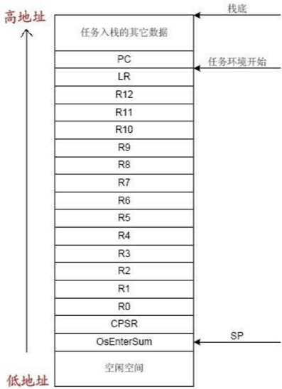

&emsp;&emsp;堆栈严格来说应该叫做栈，栈(`Stack`)是限定仅在一端进行插入或删除操作的线性表。从栈顶的定义来看，栈顶的位置是可变的。空栈时，栈顶和栈底重合；满栈时，栈顶离栈底最远。
&emsp;&emsp;`ARM`为堆栈提供了硬件支持，它使用一个专门的寄存器(堆栈指针)指向堆栈的栈顶，而且`7`种模式都有各自独立的堆栈指针，也就是有各自独立的堆栈空间。但这里的堆栈和`uCOS`操作系统的任务堆栈又有区别，`uCOS`的每个任务都有自己的堆栈，要是把`uCOS`移植到`ARM`上，可以借助`ARM`的堆栈指针来实现。
&emsp;&emsp;存储器堆栈可分为两种：

- 向上生长：向高地址方向生长，称为`递增堆栈`。
- 向下生长：向低地址方向生长，称为`递减堆栈`。

&emsp;&emsp;堆栈指针指向最后压入的堆栈的有效数据项，称为`满堆栈`；堆栈指针指向下一个要放入的空位置，称为`空堆栈`。这样就有`4`种类型的堆栈表示递增和递减的满堆栈和空堆栈的各种组合。

- 满递增：堆栈通过增大存储器的地址向上增长，堆栈指针指向内含有效数据项的最高地址，指令如`LDMFA`、`STMFA`等。
- 空递增：堆栈通过增大存储器的地址向上增长，堆栈指针指向堆栈上的第一个空位置，指令如`LDMEA`、`STMEA`等。
- 满递减：堆栈通过减小存储器的地址向下增长，堆栈指针指向内含有效数据项的最低地址，指令如`LDMFD`、`STMFD`等。
- 空递减：堆栈通过减小存储器的地址向下增长，堆栈指针指向堆栈下的第一个空位置，指令如`LDMED`、`STMED`等。

&emsp;&emsp;为什么说`向上生长`和`向下生长`呢？那是因为一般画堆栈示意图都是把低地址画在下面，高地址画在上面：

&emsp;&emsp;有一点需要注意的是，虽然`ARM`处理器对于两种生长方式的堆栈均支持，但`ADS`的`C`语言编译器仅支持一种方式，即从上往下长，并且必须是满递减堆栈，所以`STMFD`等指令用的最多。