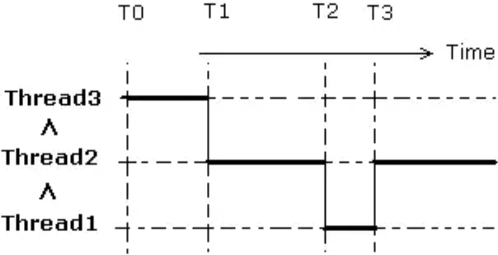
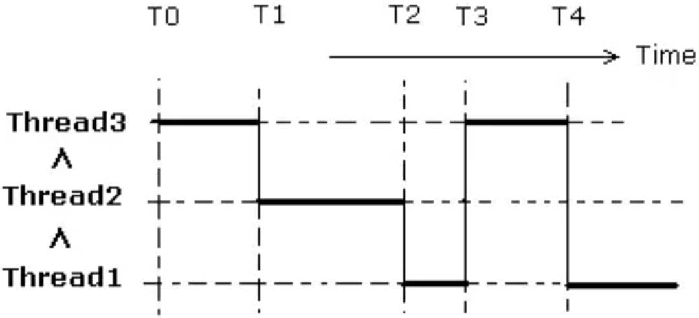

### 优先级反转

&emsp;&emsp;优先级反转是指在使用信号量时，可能会出现的一种不合理现象：<!--more-->

1. 高优先级任务正在等待信号量，而此信号量被一个低优先级任务拥有着。
2. 一个介于两个优先级之间的中优先级任务开始执行。
3. 从现象上来看，好像是中优先级的任务比高优先级任务具有更高的优先权。

### 具体例子

&emsp;&emsp;假定一个进程中有`3`个线程`Thread1`(高优先级)、`Thread2`(中优先级)和`Thread3`(低优先级)：

1. `T0`时刻，`Thread3`运行，并获得同步资源`SYNCH1`。
2. `T1`时刻，`Thread2`开始运行，由于优先级高于`Thread3`，`Thread2`被调度执行。
3. `T2`时刻，`Thread1`抢占`Thread2`。
4. `T3`时刻，`Thread1`需要同步资源`SYNCH1`，但`SYNCH1`被`Thread3`所拥有，因此`Thread1`被挂起。
5. 此时`Thread2`和`Thread3`都处于可运行状态，`Thread2`的优先级大于`Thread3`的优先级，`Thread2`被调度执行。
6. 最终的结果是高优先级的`Thread1`迟迟无法得到调度，而中优先级的`Thread2`却能抢到`CPU`资源。

&emsp;&emsp;`Thread1`要得到调度，不仅需要等`Thread3`释放同步资源，而且还需要等待`Thread2`执行完成，会导致调度的实时性变差了。

### 优先级继承

&emsp;&emsp;优先级继承就是为了解决优先级反转问题，其大致原理如下：

1. 低优先级线程在获得同步资源时，系统检测是否有高优先级线程也需要使用该同步资源。
2. 如果有这样的高优先级线程，则系统临时提升低优先级线程的优先级，以使其能更快地执行并释放同步资源。
3. 释放同步资源后，系统再恢复低优先级线程为原来的优先级。

1. 到了`T3`时刻，`Thread1`需要`Thread3`占用的同步资源`SYNCH1`。
2. 操作系统检测到这种情况后，就把`Thread3`的优先级提高到`Thread1`的优先级。
3. 此时处于可运行状态的线程`Thread2`和`Thread3`中，`Thread3`的优先级大于`Thread2`的优先级，于是`Thread3`被调度执行。
4. `Thread3`执行到`T4`时刻，释放了同步资源`SYNCH1`，操作系统恢复了`Thread3`的优先级。
5. `Thread1`获得了同步资源`SYNCH1`，重新进入可执行状态。
6. 处于可运行状态的线程`Thread1`和`Thread2`中，`Thread1`的优先级大于`Thread2`的优先级，于是`Thread1`被调度执行。